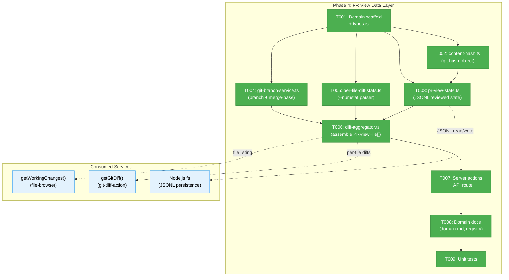
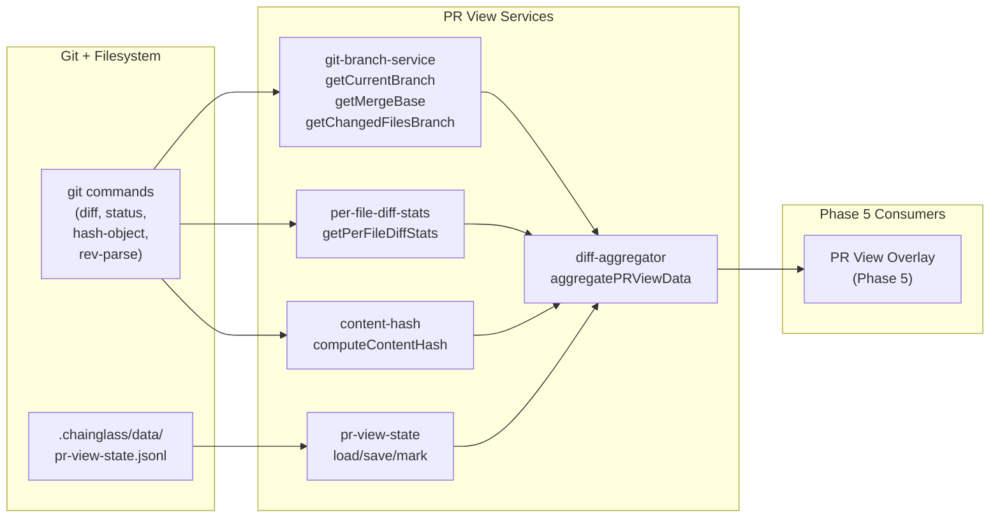
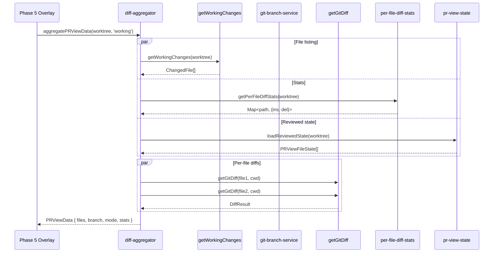

# Phase 4: PR View Data Layer — Tasks

**Plan**: [pr-view-plan.md](../../pr-view-plan.md)
**Phase**: Phase 4: PR View Data Layer
**Domain**: pr-view (NEW)
**Generated**: 2026-03-09
**Status**: Ready

---

## Executive Briefing

**Purpose**: Build the complete data infrastructure for PR View — types, reviewed-file state persistence with content-hash auto-invalidation, git branch service, per-file diff stats, and a diff aggregator that assembles all changed files with their diffs and stats into a single array. This phase creates the `pr-view` domain from scratch and delivers everything Phase 5 (overlay UI) needs to render.

**What We're Building**: A `pr-view` domain with types (`PRViewFile`, `PRViewFileState`, `ComparisonMode`), a JSONL writer/reader for reviewed state with `git hash-object` content hashing, a git branch service (`getCurrentBranch`, `getMergeBase`), a per-file diff stats parser (`git diff --numstat`), a diff aggregator that fetches changed files + individual diffs + stats in parallel, server actions, an API route, and domain documentation. All using proven patterns from the file-notes domain.

**Goals**:
- ✅ PRViewFile, PRViewFileState, and ComparisonMode types with full TypeScript strictness
- ✅ Reviewed state persists in `.chainglass/data/pr-view-state.jsonl` (AC-12)
- ✅ Content hash via `git hash-object` for auto-invalidation when files change (AC-08)
- ✅ Two comparison modes: Working (vs HEAD) and Branch (vs main) (AC-14a)
- ✅ Per-file diff stats via `git diff --numstat` (insertions/deletions per file)
- ✅ Diff aggregator assembles PRViewFile[] with diffs, stats, and reviewed state
- ✅ Server actions + API route with requireAuth()
- ✅ Domain scaffold (domain.md, registry, domain-map)
- ✅ Unit tests with real git repos (no mocks)

**Non-Goals**:
- ❌ No UI/overlay components (Phase 5)
- ❌ No SSE/live update integration (Phase 6)
- ❌ No file tree indicators (Phase 7)
- ❌ No SDK commands or keyboard shortcuts (Phase 5)

---

## Prior Phase Context

### Phase 1: File Notes Data Layer — Completed

**A. Deliverables**: Types in `packages/shared/src/file-notes/types.ts`, INoteService interface, FakeNoteService, JSONL writer/reader (now in shared), API routes, server actions, 38 tests.

**B. Dependencies Exported**: INoteService, Note types, FakeNoteService, NoteResult<T> pattern, NOTES_DIR/NOTES_FILE constants, runtime guards.

**C. Gotchas & Debt**: Types must live in shared for cross-app use. Writer/reader are synchronous but INoteService is async. Atomic rename pattern for edits. Reader silently skips malformed lines.

**D. Incomplete Items**: None.

**E. Patterns to Follow**: `.interface.ts` suffix. `fake-` prefix. NoteResult pattern `{ ok, data/error }`. JSONL format with atomic rename. UUID IDs. Build shared after modifying.

### Phase 2: File Notes Web UI — Completed

**A. Deliverables**: Overlay provider+panel, NoteCard, NoteFileGroup, NoteModal, BulkDeleteDialog, NoteIndicatorDot, useNotes hook, SDK commands, 12 tasks complete.

**B. Dependencies Exported**: useNotes hook, useNotesOverlay provider, NoteIndicatorDot component, overlay pattern.

**C. Gotchas & Debt**: `useRef` strict mode requires initial value. Server-only exports not in barrel. Thread grouping algorithm (roots newest-first, replies chronological).

**D. Incomplete Items**: None.

**E. Patterns to Follow**: Overlay pattern (ResizeObserver on anchor, z-44, Escape close, isOpeningRef guard, hasOpened lazy init). Dynamic import with SSR disabled. Error boundary around overlay. Sidebar button dispatches CustomEvent. SDK in domain-owned `sdk/` folder.

### Phase 3: File Notes CLI — Completed

**A. Deliverables**: Writer/reader/JsonlNoteService moved to shared. CLI commands (list, files, add, complete). DI factory seam. Improved noContextError(). 16 tests.

**B. Dependencies Exported**: registerNotesCommands, JsonlNoteService, NOTE_SERVICE_FACTORY token.

**C. Gotchas & Debt**: JsonlNoteService needs runtime worktreePath — DI uses factory pattern. listFilesWithNotes filters to linkType 'file' only.

**D. Incomplete Items**: None.

**E. Patterns to Follow**: DI factory for services needing runtime context. Commander.js command registration pattern. JSON output wrapper `{ errors: [], data, count }`.

---

## Pre-Implementation Check

| File | Exists? | Domain Check | Notes |
|------|---------|-------------|-------|
| `apps/web/src/features/071-pr-view/types.ts` | ❌ Create | ✅ pr-view | Domain types |
| `apps/web/src/features/071-pr-view/lib/pr-view-state.ts` | ❌ Create | ✅ pr-view | JSONL writer/reader for reviewed state |
| `apps/web/src/features/071-pr-view/lib/git-branch-service.ts` | ❌ Create | ✅ pr-view | getCurrentBranch, getMergeBase |
| `apps/web/src/features/071-pr-view/lib/per-file-diff-stats.ts` | ❌ Create | ✅ pr-view | git diff --numstat parser |
| `apps/web/src/features/071-pr-view/lib/diff-aggregator.ts` | ❌ Create | ✅ pr-view | Assembles PRViewFile[] |
| `apps/web/src/features/071-pr-view/lib/content-hash.ts` | ❌ Create | ✅ pr-view | git hash-object wrapper |
| `apps/web/src/features/071-pr-view/index.ts` | ❌ Create | ✅ pr-view | Feature barrel |
| `apps/web/app/actions/pr-view-actions.ts` | ❌ Create | ✅ pr-view | Server actions |
| `apps/web/app/api/pr-view/route.ts` | ❌ Create | ✅ pr-view | API route |
| `docs/domains/pr-view/domain.md` | ❌ Create | ✅ pr-view | Domain definition |
| `docs/domains/registry.md` | ✅ Modify | ✅ — | Add pr-view row |
| `docs/domains/domain-map.md` | ✅ Modify | ✅ — | Add pr-view node + edges |
| `test/unit/web/features/071-pr-view/` | ❌ Create | ✅ test | Unit tests |

**Concept Duplication Check**: ✅ No existing reviewed-state tracking, content-hash services, or PR view concepts in any domain. `getGitDiff()` exists in `git-diff-action.ts` but only supports working-tree-to-HEAD (no baseBranch). `getDiffStats()` exists but is aggregate-only (no per-file). New services complement, not duplicate.

**Harness**: No agent harness configured.

---

## Architecture Map



---

## Tasks

| Status | ID | Task | Domain | Path(s) | Done When | Notes |
|--------|-----|------|--------|---------|-----------|-------|
| [x] | T001 | Create feature folder `apps/web/src/features/071-pr-view/` with `types.ts` defining `PRViewFile`, `PRViewFileState`, `ComparisonMode`, `PRViewData`, `DiffFileStatus`, and barrel `index.ts` | pr-view | `apps/web/src/features/071-pr-view/types.ts`, `apps/web/src/features/071-pr-view/index.ts` | Types compile. `ComparisonMode = 'working' \| 'branch'`. `DiffFileStatus = 'modified' \| 'added' \| 'deleted' \| 'renamed' \| 'untracked'`. `PRViewFile` has path, status, insertions, deletions, diff, reviewed, reviewedAt, previouslyReviewed, contentHash, dir, name. `PRViewFileState` has filePath, reviewed, reviewedAt, reviewedContentHash. | Per AC-14a. PRViewFile is the in-memory UI model; PRViewFileState is the persisted JSONL model. |
| [x] | T002 | Create `lib/content-hash.ts` — wrap `git hash-object <file>` to compute content hash for reviewed-state invalidation | pr-view | `apps/web/src/features/071-pr-view/lib/content-hash.ts` | `computeContentHash(worktreePath, filePath)` returns string hash. Handles missing files (returns empty string). Uses `execFile` pattern from existing services. | Per AC-08. Used by pr-view-state to detect changes after marking reviewed. |
| [x] | T003 | Create `lib/pr-view-state.ts` — JSONL writer/reader for reviewed state with content hash tracking. Functions: `loadReviewedState(worktreePath)`, `saveReviewedState(worktreePath, states[], activeFiles?)`, `markFileReviewed(worktreePath, filePath, contentHash)`, `clearReviewedState(worktreePath)`. When `activeFiles` is provided to saveReviewedState, prune entries not in the active set (per DYK-P4-05: prevents unbounded growth from stale branch entries). | pr-view | `apps/web/src/features/071-pr-view/lib/pr-view-state.ts` | Reviewed state persists in `.chainglass/data/pr-view-state.jsonl`. Load returns `PRViewFileState[]`. Save uses atomic rename pattern (from file-notes) and prunes stale entries. markFileReviewed updates a single file's state. | Per AC-12, DYK-P4-05. Follow JSONL pattern from shared/file-notes/note-writer. Synchronous fs operations. |
| [x] | T004 | Create `lib/git-branch-service.ts` — `getCurrentBranch(cwd)` via `git rev-parse --abbrev-ref HEAD`, `getDefaultBaseBranch(cwd)` via `git symbolic-ref refs/remotes/origin/HEAD` (fallback: 'main'), `getMergeBase(cwd, baseBranch)` via `git merge-base <base> HEAD`, `getChangedFilesBranch(cwd, baseBranch)` via `git diff <base>...HEAD --name-status` | pr-view | `apps/web/src/features/071-pr-view/lib/git-branch-service.ts` | getCurrentBranch returns branch name (or 'HEAD' if detached). getDefaultBaseBranch auto-detects from origin/HEAD, falls back to 'main'. getMergeBase returns SHA. getChangedFilesBranch returns `{path, status}[]` for Branch mode file listing. All use async `execFile`. | Per finding 04, DYK-P4-04. Fallback: detached HEAD returns 'HEAD'. getMergeBase failure returns null (not throw). |
| [x] | T005 | Create `lib/per-file-diff-stats.ts` — parse `git diff [base...] --numstat` into `Map<string, { insertions: number, deletions: number }>`. Support both Working mode (`git diff HEAD --numstat`) and Branch mode (`git diff <mergeBase>...HEAD --numstat`) | pr-view | `apps/web/src/features/071-pr-view/lib/per-file-diff-stats.ts` | `getPerFileDiffStats(cwd, base?)` returns Map of path→stats. Binary files (- -) handled (mapped to 0,0). Renames handled. Empty diff returns empty Map. | Per finding 05. Replaces aggregate --shortstat with per-file --numstat. |
| [x] | T006 | Create `lib/diff-aggregator.ts` — `aggregatePRViewData(worktreePath, mode)` fetches changed files (Working: getWorkingChanges, Branch: getChangedFilesBranch), all diffs in a single `getAllDiffs(worktreePath, base?)` call (splits `git diff HEAD` or `git diff <base>` output by file header), per-file stats (getPerFileDiffStats), and reviewed state (loadReviewedState) in parallel. Assembles into `PRViewFile[]` with content-hash invalidation. Also create `lib/get-all-diffs.ts` with `getAllDiffs()` that returns `Map<string, string>` (path→diff text) from one git command. | pr-view | `apps/web/src/features/071-pr-view/lib/diff-aggregator.ts`, `apps/web/src/features/071-pr-view/lib/get-all-diffs.ts` | Returns `PRViewData { files: PRViewFile[], branch: string, mode: ComparisonMode, stats: { totalInsertions, totalDeletions, fileCount } }`. **O(1) git diff command** via getAllDiffs, not O(N) per-file. Reviewed files with changed contentHash get `previouslyReviewed: true, reviewed: false`. | Per DYK-P4-03: Single git diff split by `diff --git a/... b/...` header. Heavily tested (multi-file, renames, binary, empty). Does NOT use existing getGitDiff (per DYK-P4-01: that function only does unstaged diffs). |
| [x] | T007 | Create server actions `apps/web/app/actions/pr-view-actions.ts` (fetchPRViewData, markFileReviewed, clearReviewedState) + API route `apps/web/app/api/pr-view/route.ts` (GET aggregated data, POST mark reviewed, DELETE clear) | pr-view | `apps/web/app/actions/pr-view-actions.ts`, `apps/web/app/api/pr-view/route.ts` | Actions use requireAuth(). fetchPRViewData delegates to diff-aggregator. markFileReviewed saves to JSONL. GET/POST/DELETE with worktree scoping + validation. | Follow notes-actions.ts pattern. Dynamic import for lazy loading. |
| [x] | T008 | Create `docs/domains/pr-view/domain.md` with Purpose, Boundary, Contracts, Concepts, Composition, Source Location, Dependencies, History. Update `docs/domains/registry.md` (add row) and `docs/domains/domain-map.md` (add node + edges). Create `docs/c4/components/pr-view.md` L3 diagram. | pr-view | `docs/domains/pr-view/domain.md`, `docs/domains/registry.md`, `docs/domains/domain-map.md`, `docs/c4/components/pr-view.md`, `docs/c4/README.md` | Domain registered in registry. Domain-map shows pr-view node with edges to file-browser (consume), auth (consume). C4 L3 shows internal components. | Follow file-notes/domain.md as template. |
| [x] | T009 | Write unit tests: git-branch-service (getCurrentBranch, getMergeBase), per-file-diff-stats (parse numstat, binary files, renames), pr-view-state (load/save/mark reviewed, content hash invalidation), content-hash (compute, missing file), **get-all-diffs (multi-file split, renames, binary files, empty diff, single file, large output)**. Use real git repos via temp directories. | pr-view | `test/unit/web/features/071-pr-view/git-branch-service.test.ts`, `test/unit/web/features/071-pr-view/per-file-diff-stats.test.ts`, `test/unit/web/features/071-pr-view/pr-view-state.test.ts`, `test/unit/web/features/071-pr-view/content-hash.test.ts`, `test/unit/web/features/071-pr-view/get-all-diffs.test.ts` | All tests pass with `just test-feature 071`. Tests use real git repos (tmpdir + git init + commits). No mocks for git commands. Test Doc comments on every test. **getAllDiffs must be heavily tested** per DYK-P4-03. | Per plan testing convention. Follow note-writer.test.ts tmpdir pattern. |

---

## Context Brief

### Key findings from plan

- **Finding 01 (Critical)**: No anti-reinvention conflicts — green light to create pr-view domain from scratch.
- **Finding 02 (Critical)**: JSONL edit model is simple read-modify-rewrite with atomic rename. PR View state follows same pattern.
- **Finding 04 (High)**: `getGitDiff()` only supports working-tree-to-HEAD. Create git branch service with `getCurrentBranch()` + `getMergeBase()` for Branch mode.
- **Finding 05 (High)**: `getDiffStats()` uses `--shortstat` (aggregate). Create `getPerFileDiffStats()` using `git diff --numstat` for per-file stats.
- **Finding 06 (High)**: Working changes services in file-browser not exported from barrel. PR View imports directly from service paths.

### Domain dependencies

- `file-browser`: `getWorkingChanges()` (`041-file-browser/services/working-changes.ts`) — file listing for Working mode
- `_platform/file-ops`: Concept: JSONL at `.chainglass/data/pr-view-state.jsonl` — direct `fs` usage
- `_platform/auth`: `requireAuth()` — server action auth guard
- `git-diff-action`: `getGitDiff()` (`src/lib/server/git-diff-action.ts`) — per-file diff content

### Domain constraints

- **New domain creation**: pr-view is a NEW business domain — needs full scaffold (domain.md, registry, domain-map, C4)
- **No cross-app boundary**: Unlike file-notes, PR View is web-only — all code stays in `apps/web`
- **Direct service imports**: File-browser services imported via relative path (not barrel-exported)
- **Async git operations**: All git commands use `execFile` (promisified), not `execSync`
- **Path security**: Follow `PathResolverAdapter` validation pattern from `git-diff-action.ts` for path-based operations

### Harness context

No agent harness configured. Agent will use standard testing approach from plan.

### Reusable from prior phases

- JSONL reader/writer pattern (from `packages/shared/src/file-notes/note-writer.ts`)
- Atomic rename pattern (write .tmp → rename)
- `execFile` + `promisify` pattern (from `041-file-browser/services/diff-stats.ts`)
- tmpdir test fixture pattern (from `test/unit/web/features/071-file-notes/note-writer.test.ts`)
- Server action pattern (from `apps/web/app/actions/notes-actions.ts`)
- API route pattern (from `apps/web/app/api/file-notes/route.ts`)
- Domain documentation template (from `docs/domains/file-notes/domain.md`)

### Worktree data flow



### Comparison mode sequence



---

## Discoveries & Learnings

_Populated during implementation by plan-6._

| Date | Task | Type | Discovery | Resolution | References |
|------|------|------|-----------|------------|------------|

---

## Directory Layout

```
docs/plans/071-pr-view/
  ├── pr-view-spec.md
  ├── pr-view-plan.md
  ├── research-dossier.md
  ├── workshops/
  │   └── 001-ui-design-github-inspired.md
  ├── tasks/phase-1-file-notes-data-layer/
  │   ├── tasks.md
  │   ├── tasks.fltplan.md
  │   └── execution.log.md
  ├── tasks/phase-2-file-notes-web-ui/
  │   ├── tasks.md
  │   ├── tasks.fltplan.md
  │   └── execution.log.md
  ├── tasks/phase-3-file-notes-cli/
  │   ├── tasks.md
  │   ├── tasks.fltplan.md
  │   └── execution.log.md
  └── tasks/phase-4-pr-view-data-layer/
      ├── tasks.md                    ← this file
      ├── tasks.fltplan.md            ← flight plan (below)
      └── execution.log.md            # created by plan-6
```

---

## Critical Insights (2026-03-09)

| # | Insight | Decision |
|---|---------|----------|
| 1 | getGitDiff() only does unstaged diffs — can't serve Working (vs HEAD) or Branch (vs merge-base) modes | Create new `getFileDiff(worktreePath, filePath, base?)` in pr-view domain; don't modify existing getGitDiff |
| 2 | Reviewed state could be per-mode (Working vs Branch show different diffs) | Single reviewed state per file, shared across modes — content hash invalidation is the safety net, not mode switching |
| 3 | N+1 git command problem: per-file diffs spawn N child processes for N files | Create `getAllDiffs(worktreePath, base?)` — single `git diff HEAD` split by file header. O(1) not O(N). Heavily tested. |
| 4 | Base branch hardcoded to 'main' but some repos use 'master' or custom | `getDefaultBaseBranch(cwd)` via `git symbolic-ref refs/remotes/origin/HEAD`, fallback to 'main' |
| 5 | pr-view-state.jsonl grows unbounded with stale entries from old branches | `saveReviewedState()` prunes entries not in active changed-files list on every rewrite |

Action items: T004 updated (getDefaultBaseBranch), T006 updated (getAllDiffs replaces N×getFileDiff), T003 updated (prune on save), T009 updated (getAllDiffs heavily tested).
