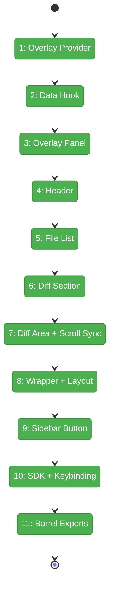
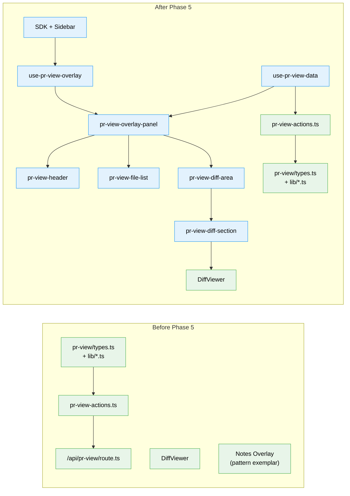

# Flight Plan: Phase 5 — PR View Overlay

**Plan**: [../../pr-view-plan.md](../../pr-view-plan.md)
**Phase**: Phase 5: PR View Overlay
**Generated**: 2026-03-09
**Status**: Landed

---

## Departure → Destination

**Where we are**: Phase 4 delivered a complete PR View data layer — types, diff aggregator, reviewed state JSONL, server actions, and API route — all with 49 passing tests. The data is ready to render. No UI exists yet; the user has never seen the PR View feature.

**Where we're going**: A developer can click "PR View" in the sidebar (or press Ctrl+Shift+R) and see a GitHub-style overlay showing all changed files with collapsible per-file diffs, status badges, insertion/deletion counts, viewed checkboxes, and a progress bar. The overlay opens/closes with mutual exclusion against terminal, activity log, and notes overlays.

---

## Domain Context

### Domains We're Changing

| Domain | What Changes | Key Files |
|--------|-------------|-----------|
| pr-view | Add overlay provider, data hook, 5 UI components, SDK registration, barrel exports | `hooks/use-pr-view-overlay.tsx`, `hooks/use-pr-view-data.ts`, `components/*.tsx`, `sdk/*.ts`, `index.ts` |

### Domains We Depend On (no changes)

| Domain | What We Consume | Contract |
|--------|----------------|----------|
| pr-view (Phase 4) | PRViewData, PRViewFile, ComparisonMode, server actions | `fetchPRViewData`, `markFileAsReviewed`, types |
| _platform/viewer | Diff rendering with syntax highlighting | `DiffViewer` component (DiffViewerProps) |
| _platform/panel-layout | Overlay positioning anchor | `[data-terminal-overlay-anchor]` DOM attribute |
| _platform/sdk | Command + keybinding registration | `IUSDK`, `SDKContribution` |
| _platform/events | Overlay mutual exclusion | `overlay:close-all` CustomEvent |

### Cross-Domain Files Modified

| File | What Changes |
|------|-------------|
| `app/(dashboard)/workspaces/[slug]/layout.tsx` | Mount PRViewOverlayWrapper |
| `src/components/dashboard-sidebar.tsx` | Add PR View sidebar button |
| `src/lib/sdk/sdk-domain-registrations.ts` | Register PR View SDK |

---

## Flight Status

<!-- Updated by /plan-6-v2: pending → active → done. Use blocked for problems/input needed. -->

**Legend**: grey = pending | yellow = active | red = blocked/needs input | green = done

---

## Stages

<!-- Updated by /plan-6-v2 during implementation: [ ] → [~] → [x] -->

- [x] **Stage 1: Overlay Provider** — Context + isOpeningRef + overlay:close-all + pr-view:toggle listener (`use-pr-view-overlay.tsx`)
- [x] **Stage 2: Data Hook** — Fetch PRViewData via server action, 10s cache, mark/unmark, collapsed state (`use-pr-view-data.ts`)
- [x] **Stage 3: Overlay Panel** — Fixed panel at z-44, anchor measurement, two-column layout, hasOpened guard (`pr-view-overlay-panel.tsx` — new file)
- [x] **Stage 4: Header** — Branch name, stats, progress blocks, mode toggle placeholder, expand/collapse buttons (`pr-view-header.tsx` — new file)
- [x] **Stage 5: File List** — Left column with status badges, +/- counts, viewed checkboxes, click-to-scroll (`pr-view-file-list.tsx` — new file)
- [x] **Stage 6: Diff Section** — Collapsible per-file section with DiffViewer, sticky header, previously-viewed banner (`pr-view-diff-section.tsx` — new file)
- [x] **Stage 7: Diff Area + Scroll Sync** — Scrollable container, IntersectionObserver sync, scrollToFile callback (`pr-view-diff-area.tsx` — new file)
- [x] **Stage 8: Wrapper + Layout** — Dynamic import wrapper, mount in layout.tsx between Notes and content (`pr-view-overlay-wrapper.tsx` — new file)
- [x] **Stage 9: Sidebar Button** — GitPullRequest icon, currentWorktree guard, pr-view:toggle event (`dashboard-sidebar.tsx`)
- [x] **Stage 10: SDK + Keybinding** — Toggle command, Ctrl+Shift+R keybinding, domain registration (`sdk/*.ts`, `sdk-domain-registrations.ts`)
- [x] **Stage 11: Barrel Exports** — Update index.ts with hook + component + SDK exports (`index.ts`)

---

## Architecture: Before & After

**Legend**: existing (green, unchanged) | changed (orange, modified) | new (blue, created)

---

## Acceptance Criteria

- [ ] AC-01: PR View button opens overlay
- [ ] AC-02: Opening PR View closes other overlays
- [ ] AC-03: Header shows branch name, mode toggle, stats, progress
- [ ] AC-04: File list shows status badges, +/- counts, viewed checkboxes
- [ ] AC-05: Each file shows collapsible diff section
- [ ] AC-06: Clicking file scrolls to diff
- [ ] AC-07: Checking viewed collapses diff section
- [ ] AC-09: Expand All / Collapse All work
- [ ] AC-11: State persists across overlay close/reopen
- [ ] AC-13: Escape closes overlay
- [ ] AC-14: Only appears when git worktree exists

## Goals & Non-Goals

**Goals**:
- Full PR View overlay with two-column layout
- GitHub-style file list with status badges and stats
- Collapsible per-file diffs via DiffViewer
- Reviewed-file tracking with optimistic UI
- Sidebar button + SDK command + keyboard shortcut

**Non-Goals**:
- Live updates / SSE (Phase 6)
- Working/Branch mode switching (Phase 6)
- File tree note indicators (Phase 7)
- hasNotes population (Phase 7)

---

## Checklist

- [x] T001: Overlay Provider (use-pr-view-overlay.tsx)
- [x] T002: Data Hook (use-pr-view-data.ts)
- [x] T003: Overlay Panel (pr-view-overlay-panel.tsx)
- [x] T004: Header (pr-view-header.tsx)
- [x] T005: File List (pr-view-file-list.tsx)
- [x] T006: Diff Section (pr-view-diff-section.tsx)
- [x] T007: Diff Area + Scroll Sync (pr-view-diff-area.tsx)
- [x] T008: Wrapper + Layout Mount (pr-view-overlay-wrapper.tsx + layout.tsx)
- [x] T009: Sidebar Button (dashboard-sidebar.tsx)
- [x] T010: SDK + Keybinding (sdk/*.ts + sdk-domain-registrations.ts)
- [x] T011: Barrel Exports (index.ts)
