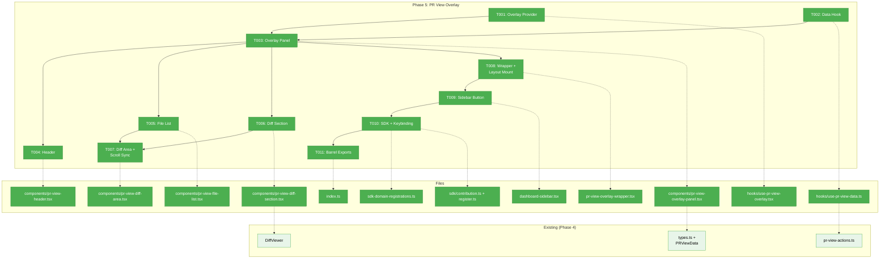
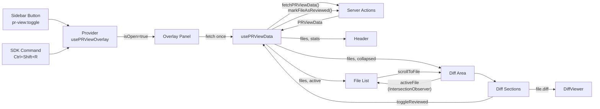
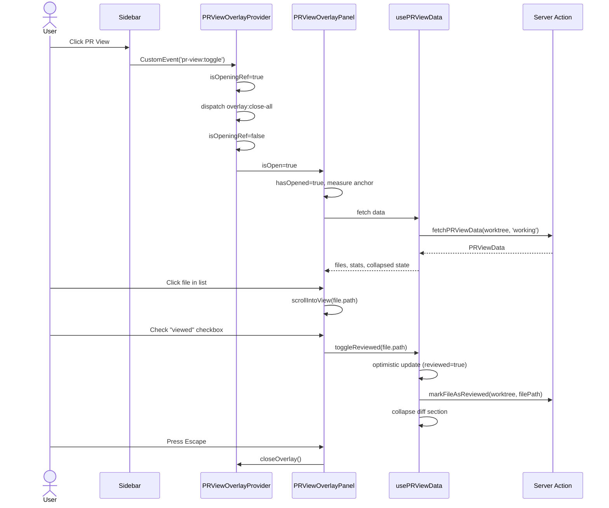

# Phase 5: PR View Overlay — Tasks Dossier

**Plan**: [pr-view-plan.md](../../pr-view-plan.md)
**Phase**: Phase 5: PR View Overlay
**Created**: 2026-03-09
**Status**: Pending
**Workshop**: [001-ui-design-github-inspired.md](../../workshops/001-ui-design-github-inspired.md) — Sections 1-3 (PR View layout, component hierarchy, detailed specs)

---

## Executive Briefing

**Purpose**: Build the visible PR View overlay — the first time the user will see and interact with the PR View feature. This phase takes the Phase 4 data layer (PRViewData, server actions, API route) and renders it as a GitHub-style "Files Changed" overlay with a two-column layout: file list on the left, collapsible per-file diffs on the right.

**What We're Building**: A fixed-position overlay panel (z-index 44, anchored to MainPanel) containing a header with branch name/stats/progress, a 220px file list with status badges and viewed checkboxes, and a scrollable diff area with collapsible per-file sections wrapping the existing DiffViewer component. Plus sidebar button, SDK command with keyboard shortcut, and overlay wrapper in the workspace layout.

**Goals**:
- ✅ PR View button in sidebar opens overlay panel
- ✅ Opening PR View closes other overlays (terminal, activity log, notes)
- ✅ Header shows branch name, file count, +/- stats, viewed progress
- ✅ File list shows status badges (M/A/D/R/?), +/- counts, viewed checkboxes
- ✅ Each file renders a collapsible diff section via DiffViewer
- ✅ Clicking a file in the list scrolls to its diff section
- ✅ Checking "viewed" collapses the diff and persists via server action
- ✅ Expand All / Collapse All controls
- ✅ State persists across overlay close/reopen (10s cache)
- ✅ Escape closes overlay
- ✅ Only appears when git worktree exists
- ✅ SDK command + Ctrl+Shift+P keybinding

**Non-Goals**:
- ❌ Live updates / SSE subscription (Phase 6)
- ❌ Working/Branch mode toggle wiring (Phase 6 — placeholder toggle rendered but not functional)
- ❌ Content hash auto-invalidation on file change (Phase 6)
- ❌ File tree note indicators (Phase 7)
- ❌ hasNotes population from file-notes domain (Phase 7)

---

## Prior Phase Context

### Phase 1: File Notes Data Layer (Complete)

**Deliverables**: Note types, INoteService interface, JSONL writer/reader, FakeNoteService, contract tests, API routes, server actions — all in `packages/shared/src/file-notes/` and `apps/web/src/features/071-file-notes/`.

**Dependencies Exported**: INoteService (8 methods), Note discriminated union, NoteFilter, JSONL persistence pattern with atomic rename.

**Gotchas**: Constructing Note objects requires `as Note` cast. `[...map.keys()]` fails with downlevelIteration — use `Array.from()`.

**Incomplete Items**: None.

**Patterns to Follow**: Interface-first design, JSONL atomic rename, DI factory pattern.

### Phase 2: File Notes Web UI (Complete)

**Deliverables**: Notes overlay (provider + panel), note modal, note cards, bulk delete dialog, note indicator dot, sidebar button, SDK commands.

**Dependencies Exported**: **Critical overlay pattern** that Phase 5 must replicate exactly:
1. **Provider**: `NotesOverlayProvider` — Context + `isOpeningRef` guard + `overlay:close-all` dispatch before opening
2. **Panel**: `NotesOverlayPanel` — ResizeObserver on `[data-terminal-overlay-anchor]`, z-44, Escape key, `hasOpened` lazy guard
3. **Wrapper**: `notes-overlay-wrapper.tsx` — `dynamic()` import with `{ ssr: false }`, error boundary returning null
4. **Sidebar button**: `dashboard-sidebar.tsx` — `currentWorktree` guard, `CustomEvent('notes:toggle')`
5. **SDK**: `contribution.ts` + `register.ts` → `sdk-domain-registrations.ts`

**Gotchas**:
- `isOpeningRef` guard is CRITICAL — without it, opening dispatches `overlay:close-all` which self-closes
- ResizeObserver may not fire immediately — 200ms `setTimeout` fallback required
- `hasOpened` guard prevents DOM render until first open (perf)
- `useRef<() => void>()` without initial value causes TS2554 in strict mode
- Biome forbids `autoFocus` — use useRef + useEffect focus pattern
- Overlay counts (open/complete) must come from UNFILTERED data

**Incomplete Items**: None.

**Patterns to Follow**: Provider → Panel → Wrapper → Sidebar → SDK registration chain.

### Phase 3: File Notes CLI (Complete)

**Deliverables**: `cg notes list/files/add/complete` commands with JSON output, DI factory seam.

**Dependencies Exported**: None consumed by Phase 5.

**Patterns to Follow**: DI factory pattern for testability.

### Phase 4: PR View Data Layer (Complete)

**Deliverables**: Domain types, content hash, reviewed state JSONL, git branch service, per-file diff stats, all-diffs fetcher, diff aggregator, server actions, API route. 49 tests passing.

**Dependencies Exported** (consumed by Phase 5):
- `PRViewData` — aggregated response: `{ files: PRViewFile[], branch: string, mode: ComparisonMode, stats: { totalInsertions, totalDeletions, fileCount, reviewedCount } }`
- `PRViewFile` — per-file model: `{ path, dir, name, status, insertions, deletions, diff, diffError?, reviewed, previouslyReviewed?, contentHash?, hasNotes? }`
- `ComparisonMode` — `'working' | 'branch'`
- `DiffFileStatus` — `'modified' | 'added' | 'deleted' | 'renamed' | 'untracked'`
- Server actions: `fetchPRViewData(worktree, mode)`, `markFileAsReviewed(worktree, filePath)`, `unmarkFileAsReviewed(worktree, filePath)`, `clearAllReviewedState(worktree)`
- API route: `GET/POST/DELETE /api/pr-view`

**Gotchas**:
- Barrel exports are type-only — server utilities imported from `lib/` paths
- Dynamic imports in server actions (re-imports each call)
- Untracked files synthesized by aggregator (may be large/binary)
- `previouslyReviewed` flag set when content hash mismatch (not manually settable)
- `diffError` field on PRViewFile for per-file errors

**Incomplete Items**: None blocking Phase 5.

**Patterns to Follow**: Result wrapper pattern (`{ ok, data } | { ok, error }`), parallel data fetching via `Promise.all`, type-only barrel exports.

---

## Pre-Implementation Check

| File | Exists? | Domain Check | Notes |
|------|---------|-------------|-------|
| `apps/web/src/features/071-pr-view/hooks/use-pr-view-overlay.tsx` | No (create) | pr-view | New overlay provider — replicate notes overlay pattern |
| `apps/web/src/features/071-pr-view/hooks/use-pr-view-data.ts` | No (create) | pr-view | New data hook — fetch + cache PRViewData |
| `apps/web/src/features/071-pr-view/components/pr-view-overlay-panel.tsx` | No (create) | pr-view | New panel — replicate notes panel pattern |
| `apps/web/src/features/071-pr-view/components/pr-view-header.tsx` | No (create) | pr-view | New component |
| `apps/web/src/features/071-pr-view/components/pr-view-file-list.tsx` | No (create) | pr-view | New component |
| `apps/web/src/features/071-pr-view/components/pr-view-diff-section.tsx` | No (create) | pr-view | New component |
| `apps/web/src/features/071-pr-view/components/pr-view-diff-area.tsx` | No (create) | pr-view | New component |
| `apps/web/src/features/071-pr-view/sdk/contribution.ts` | No (create) | pr-view | New SDK manifest |
| `apps/web/src/features/071-pr-view/sdk/register.ts` | No (create) | pr-view | New SDK registration |
| `apps/web/app/(dashboard)/workspaces/[slug]/pr-view-overlay-wrapper.tsx` | No (create) | cross-domain | New wrapper — replicate notes wrapper pattern |
| `apps/web/app/(dashboard)/workspaces/[slug]/layout.tsx` | Yes (modify) | cross-domain | Add PRViewOverlayWrapper import + mount |
| `apps/web/src/components/dashboard-sidebar.tsx` | Yes (modify) | cross-domain | Add PR View sidebar button |
| `apps/web/src/lib/sdk/sdk-domain-registrations.ts` | Yes (modify) | cross-domain | Add `registerPRViewSDK()` call |
| `apps/web/src/features/071-pr-view/index.ts` | Yes (modify) | pr-view | Add hook + component exports |
| `apps/web/src/components/viewers/diff-viewer.tsx` | Yes (consume) | _platform/viewer | Named export `DiffViewer`, props: `{ file, diffData, error, isLoading, viewMode? }` |

---

## Architecture Map



---

## Tasks

| Status | ID | Task | Domain | Path(s) | Done When | Notes |
|--------|-----|------|--------|---------|-----------|-------|
| [x] | T001 | Create `hooks/use-pr-view-overlay.tsx` — overlay provider with Context, `isOpeningRef` guard, `overlay:close-all` mutual exclusion, `pr-view:toggle` event listener, worktree path resolution | pr-view | `apps/web/src/features/071-pr-view/hooks/use-pr-view-overlay.tsx` | Provider opens/closes/toggles overlay, dispatches `overlay:close-all` before opening with isOpeningRef guard, Escape key closes, `pr-view:toggle` custom event works | Replicate Phase 2 `use-notes-overlay.tsx` pattern exactly. Export `PRViewOverlayProvider` + `usePRViewOverlay` hook. |
| [x] | T002 | Create `hooks/use-pr-view-data.ts` — data hook that fetches PRViewData from server action, 10s cache, provides mark/unmark/clear actions, tracks collapsed state, expand/collapse all | pr-view | `apps/web/src/features/071-pr-view/hooks/use-pr-view-data.ts` | Hook fetches on open, caches 10s, mark/unmark toggle reviewed state optimistically, collapsed set managed, expand/collapse all work | Uses `fetchPRViewData` server action. Optimistic UI: toggle reviewed locally then confirm via server action. Default mode `'working'` (Branch mode placeholder for Phase 6). |
| [x] | T003 | Create `components/pr-view-overlay-panel.tsx` — fixed-position panel at z-44, ResizeObserver on `[data-terminal-overlay-anchor]`, two-column flex layout, `hasOpened` lazy guard, Escape key handler | pr-view | `apps/web/src/features/071-pr-view/components/pr-view-overlay-panel.tsx` | Panel renders at anchor position, shows loading/empty/populated states, `hasOpened` prevents pre-render, Escape closes | Replicate Phase 2 `notes-overlay-panel.tsx` anchor measurement + ResizeObserver + 200ms fallback pattern. Two-column: 220px file list + flex-1 diff area. |
| [x] | T004 | Create `components/pr-view-header.tsx` — branch name, Working/Branch toggle (placeholder), file count, +/- stats, viewed progress bar with colored blocks, Expand All/Collapse All buttons, close button | pr-view | `apps/web/src/features/071-pr-view/components/pr-view-header.tsx` | Header renders all stats correctly, progress blocks colored per reviewed state, mode toggle visible but disabled (Phase 6), close button works | Per workshop section 3.2. Mode toggle renders both options but only 'working' is active — 'branch' shows tooltip "Coming in Phase 6". |
| [x] | T005 | Create `components/pr-view-file-list.tsx` — left column (220px, border-r, overflow-y-auto) with flat file list: status badges (M/A/D/R/?), dir/name split, +/- counts, viewed checkboxes, click-to-scroll, active file highlight | pr-view | `apps/web/src/features/071-pr-view/components/pr-view-file-list.tsx` | Files render with correct status badges and colors, click scrolls to diff section, active file highlighted, viewed checkbox toggles state | Per workshop section 3.3. Status colors: M=amber, A=green, D=red, R=blue, ?=muted. Active file tracked via IntersectionObserver callback from diff area. |
| [x] | T006 | Create `components/pr-view-diff-section.tsx` — collapsible per-file section with sticky header (file path, +/- stats, colored blocks, viewed checkbox, collapse chevron), "Previously viewed" banner, DiffViewer wrapper, collapsed indicator | pr-view | `apps/web/src/features/071-pr-view/components/pr-view-diff-section.tsx` | Diff renders via DiffViewer, collapse/expand toggles, viewed checkbox persists, "Previously viewed" banner shows when `previouslyReviewed` flag set, sticky header stays visible during scroll | Per workshop section 3.4. Lazy-mount DiffViewer: only render when expanded AND visible (IntersectionObserver). Props map: `file.diff` → `diffData`, construct ViewerFile from PRViewFile path/name. |
| [x] | T007 | Create `components/pr-view-diff-area.tsx` — scrollable right column container with IntersectionObserver for scroll sync (scrolling highlights active file in file list), renders PRViewDiffSection[] | pr-view | `apps/web/src/features/071-pr-view/components/pr-view-diff-area.tsx` | Scrolling diff area updates active file in file list, clicking file in list scrolls to section via `scrollIntoView` | Per workshop section 3.5. IntersectionObserver with `threshold: 0.1` on each diff section `[data-file-path]` attribute. Expose `scrollToFile(path)` callback to file list. |
| [x] | T008 | Create `pr-view-overlay-wrapper.tsx` in workspace layout + mount in `layout.tsx` — dynamic import with `{ ssr: false }`, error boundary, nest between NotesOverlayWrapper and content | pr-view | `apps/web/app/(dashboard)/workspaces/[slug]/pr-view-overlay-wrapper.tsx`, `apps/web/app/(dashboard)/workspaces/[slug]/layout.tsx` | Wrapper loads, provider wraps children, overlay renders on toggle | Replicate `notes-overlay-wrapper.tsx` pattern exactly. Mount order in layout: Terminal → ActivityLog → Notes → PRView → Content. |
| [x] | T009 | Add "PR View" sidebar button in `dashboard-sidebar.tsx` — GitPullRequest icon, dispatches `pr-view:toggle` CustomEvent, guarded by `currentWorktree` | pr-view | `apps/web/src/components/dashboard-sidebar.tsx` | Button visible only when worktree active, click toggles PR View overlay, icon + label render correctly | Place between Activity Log and Notes buttons in sidebar footer. Use `GitPullRequest` icon from lucide-react. Follow exact Notes button pattern. |
| [x] | T010 | Create `sdk/contribution.ts` + `sdk/register.ts` + register in `sdk-domain-registrations.ts` — toggle command `prView.toggleOverlay`, keybinding Ctrl+Shift+R | pr-view | `apps/web/src/features/071-pr-view/sdk/contribution.ts`, `apps/web/src/features/071-pr-view/sdk/register.ts`, `apps/web/src/lib/sdk/sdk-domain-registrations.ts` | SDK command toggles overlay, keyboard shortcut works, registered in domain registrations | Follow Phase 2 SDK pattern exactly. Import `registerPRViewSDK` in `sdk-domain-registrations.ts`. |
| [x] | T011 | Update `index.ts` barrel to export hooks + components + SDK for cross-domain consumption | pr-view | `apps/web/src/features/071-pr-view/index.ts` | All public hooks, components, and SDK registration exported. Type exports preserved. | Add: `usePRViewOverlay`, `PRViewOverlayProvider`, `usePRViewData`, overlay panel, SDK register fn. Keep type exports from Phase 4. |

---

## Context Brief

### Key Findings from Plan

- **Finding 07**: Multiple DiffViewer instances are safe — Shiki singleton caches after first init. Lazy-mount for performance (only render when expanded + visible).
- **Finding 08**: Overlay mounting pattern is mature — 3 wrappers in layout.tsx, z-index 44 for standard overlays. Add PR View wrapper between Notes and content.
- **PL-08**: `isOpeningRef` guard prevents self-close when dispatching `overlay:close-all`.

### Domain Dependencies (concepts and contracts this phase consumes)

- `pr-view` (Phase 4): `PRViewData`, `PRViewFile`, `ComparisonMode`, `DiffFileStatus` — type imports for rendering
- `pr-view` (Phase 4): `fetchPRViewData`, `markFileAsReviewed`, `unmarkFileAsReviewed` — server actions for data + state
- `_platform/viewer`: `DiffViewer` (`DiffViewerProps: { file, diffData, error, isLoading, viewMode? }`) — diff rendering
- `_platform/panel-layout`: `[data-terminal-overlay-anchor]` DOM attribute — overlay positioning anchor
- `_platform/sdk`: `IUSDK`, `SDKContribution` types — SDK command registration
- `_platform/events`: `overlay:close-all` CustomEvent protocol — mutual exclusion

### Domain Constraints

- PR View hooks/components MUST live under `apps/web/src/features/071-pr-view/`
- Cross-domain wrapper lives in workspace layout directory (not feature directory)
- Import types from `@/features/071-pr-view` barrel; server utilities via `lib/` direct import
- No imports from file-notes domain (Phase 7 will wire note indicators)
- DiffViewer consumed as-is — no modifications to `_platform/viewer`

### Reusable from Prior Phases

- **Overlay provider pattern**: Copy from `use-notes-overlay.tsx` — Context, isOpeningRef, overlay:close-all, toggle event
- **Panel pattern**: Copy from `notes-overlay-panel.tsx` — ResizeObserver, anchorRect, hasOpened, z-44, Escape
- **Wrapper pattern**: Copy from `notes-overlay-wrapper.tsx` — dynamic import, ssr:false, error boundary
- **Sidebar button pattern**: Copy from `dashboard-sidebar.tsx` Notes button — currentWorktree guard, CustomEvent
- **SDK pattern**: Copy from `file-notes/sdk/contribution.ts` + `register.ts` — manifest + handler + registration
- **Status colors**: Workshop section 3.3 defines `STATUS_COLORS` and `STATUS_LETTERS` maps

### Data Flow



### Component Interaction



---

## DYK Insights (Pre-Implementation)

| # | Insight | Decision | Impact |
|---|---------|----------|--------|
| DYK-01 | `PRViewFile.diffError` is `string?` but `DiffViewer` expects `DiffError \| null` (3 literal values) — type mismatch | Own our error display: if `diffError` exists, render a plain error bar ourselves; pass `error={null}` to DiffViewer. No mapping, no coupling. | T006 |
| DYK-02 | Overlay `display: none` keeps all DiffViewers mounted in DOM forever — heavy memory for 30+ file branches | Unmount children when closed: `{isOpen && <PanelContent />}`. Data hook lives in provider (above panel) so 10s cache survives. | T003 |
| DYK-03 | Mark-as-reviewed mutations make 10s cache stale — close+reopen within 10s shows pre-mutation state | Mutate the hook's cached state directly on mark/unmark. One source of truth: hook state IS the cache. Next fresh fetch confirms from server. | T002 |
| DYK-04 | scrollToFile triggers IntersectionObserver → feedback loop with intermediate file highlights during scroll animation | Add `isScrollingToRef` guard (same pattern as `isOpeningRef`). Set before scrollIntoView, clear after rAF. Observer skips while ref is set. | T007 |
| DYK-05 | "Expand All" + scroll triggers thundering herd of Shiki highlight passes as each section enters viewport | Skip debounce for now — measure first, optimize second. Lazy-mount via IntersectionObserver is sufficient. Add debounce only if jank observed. | T006, T007 |

---

## Discoveries & Learnings

_Populated during implementation by plan-6._

| Date | Task | Type | Discovery | Resolution | References |
|------|------|------|-----------|------------|------------|
| 2026-03-10 | T003 | gotcha | Biome `useExhaustiveDependencies` rejects `prViewData.refresh` in useEffect deps because object property access isn't stable | Use `refreshRef` pattern: store in ref, access `.current` in effect | DYK-03 pattern, pr-view-overlay-panel.tsx |
| 2026-03-10 | T007 | gotcha | Biome rejects both `files` (outer scope) and `files.length` (not used in body) as useEffect deps for IntersectionObserver | Use `biome-ignore` with explanation — observer needs to re-initialize when file list changes | pr-view-diff-area.tsx |
| 2026-03-10 | T004-T006 | insight | Biome auto-format reformats JSX conditional rendering — `{x > 0 && (<span>...)}` gets simplified to `{x > 0 && <span>...}` | Run `biome check --fix` after initial creation to normalize formatting | All component files |
|------|------|------|-----------|------------|------------|

---

## Directory Layout

```
docs/plans/071-pr-view/
  ├── pr-view-plan.md
  └── tasks/phase-5-pr-view-overlay/
      ├── tasks.md                    ← this file
      ├── tasks.fltplan.md            ← flight plan (next)
      └── execution.log.md            ← created by plan-6
```
