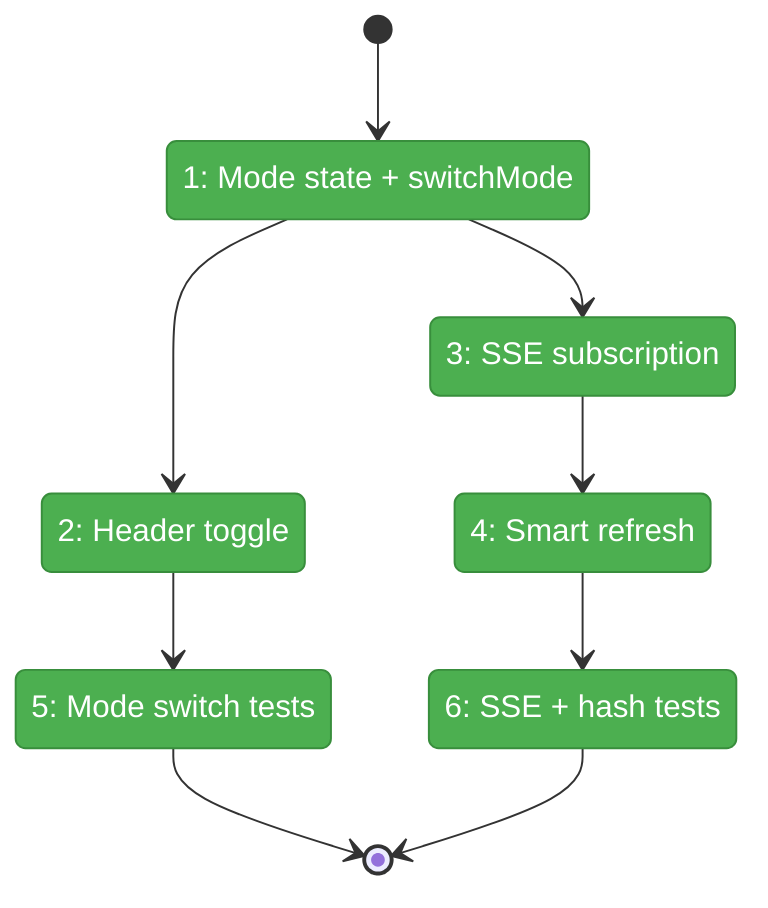
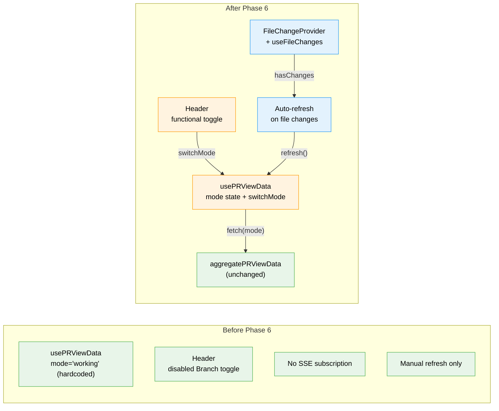

# Flight Plan: Phase 6 — PR View Live Updates + Branch Mode

**Plan**: [../../pr-view-plan.md](../../pr-view-plan.md)
**Phase**: Phase 6: PR View Live Updates + Branch Mode
**Generated**: 2026-03-10
**Status**: Landed

---

## Departure → Destination

**Where we are**: Phase 5 delivered a functional PR View overlay with Working mode diffs, reviewed-file tracking, and a disabled Branch toggle. Data refreshes only on manual button click or overlay reopen. Content hash invalidation logic exists in the aggregator but is only evaluated at fetch time — no automatic trigger when files change.

**Where we're going**: A developer can toggle between Working (uncommitted vs HEAD) and Branch (current branch vs main) comparison modes with a single click. The overlay auto-refreshes when files change on disk, and reviewed files that change show a "Previously viewed" banner without manual intervention.

---

## Domain Context

### Domains We're Changing

| Domain | What Changes | Key Files |
|--------|-------------|-----------|
| pr-view | Mode toggle wiring, SSE subscription, smart refresh | `use-pr-view-data.ts`, `pr-view-header.tsx`, `pr-view-overlay-panel.tsx` |

### Domains We Depend On (no changes)

| Domain | What We Consume | Contract |
|--------|----------------|----------|
| _platform/events | SSE file change subscription | `FileChangeProvider`, `useFileChanges` |
| pr-view (Phase 4) | Diff aggregation for both modes | `aggregatePRViewData(worktree, mode)` |
| pr-view (Phase 4) | Content hash invalidation | `computeContentHash` (via aggregator) |

---

## Flight Status

**Legend**: grey = pending | yellow = active | red = blocked/needs input | green = done

---

## Stages

- [x] **Stage 1: Mode state + switchMode** — Add mode setter to usePRViewData, export switchMode that force-refreshes (`use-pr-view-data.ts`)
- [x] **Stage 2: Header toggle** — Wire Working/Branch buttons, highlight active mode (`pr-view-header.tsx`)
- [x] **Stage 3: SSE subscription** — Add FileChangeProvider + useFileChanges to overlay panel (`pr-view-overlay-panel.tsx`)
- [x] **Stage 4: Smart refresh** — Trigger refresh on file changes when overlay is open (`pr-view-overlay-panel.tsx`)
- [x] **Stage 5: Mode switch tests** — switchMode logic, cache invalidation, header state (`pr-view-mode-switch.test.ts` — new file)
- [x] **Stage 6: SSE + hash tests** — SSE-triggered refresh, previouslyReviewed flag flow (`pr-view-live-updates.test.ts` — new file)

---

## Architecture: Before & After

**Legend**: existing (green, unchanged) | changed (orange, modified) | new (blue, created)

---

## Acceptance Criteria

- [ ] AC-08: Viewed file changes on disk → auto-resets with "Previously viewed"
- [ ] AC-10: PR View updates live when files change
- [ ] AC-14a: Working + Branch modes both functional
- [ ] AC-14b: Toggle switches modes and updates display

## Goals & Non-Goals

**Goals**:
- Functional Working/Branch mode toggle
- SSE-driven auto-refresh
- Content hash invalidation triggered by live updates
- Tests for mode switching and SSE refresh

**Non-Goals**:
- File tree note indicators (Phase 7)
- New SSE infrastructure (already exists)
- UI changes beyond toggle + refresh behavior

---

## Checklist

- [x] T001: Mode state + switchMode (use-pr-view-data.ts)
- [x] T002: Header toggle (pr-view-header.tsx)
- [x] T003: SSE subscription (pr-view-overlay-panel.tsx)
- [x] T004: Smart refresh on file changes
- [x] T005: Mode switching tests
- [x] T006: SSE + hash invalidation tests
