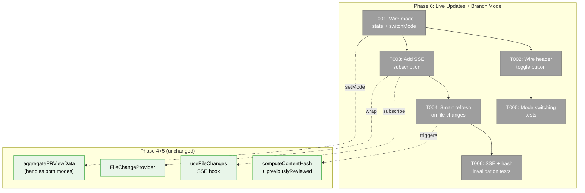
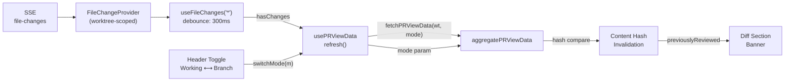
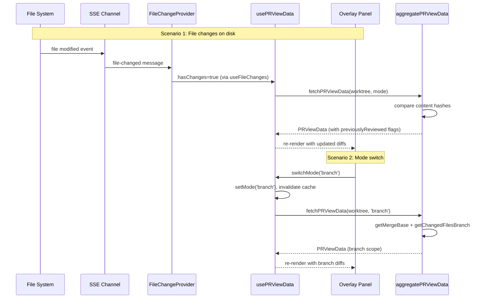

# Phase 6: PR View Live Updates + Branch Mode — Tasks Dossier

**Plan**: [pr-view-plan.md](../../pr-view-plan.md)
**Phase**: Phase 6: PR View Live Updates + Branch Mode
**Created**: 2026-03-10
**Status**: Pending

---

## Executive Briefing

**Purpose**: Wire the PR View overlay to respond to real-time file changes and support both Working and Branch comparison modes. This phase transforms the static Phase 5 overlay into a live, reactive tool.

**What We're Building**: A functional Working/Branch mode toggle in the PR View header that switches comparison scope and force-refreshes data. Plus SSE-driven auto-refresh via `useFileChanges` so the overlay updates when files change on disk. Content hash invalidation and "Previously viewed" banners are already implemented in Phases 4+5 — this phase just needs to wire the live trigger.

**Goals**:
- ✅ Working/Branch mode toggle is functional (switches comparison and refreshes)
- ✅ PR View auto-refreshes when files change on disk (SSE subscription)
- ✅ Content hash invalidation works end-to-end (already in data layer, now triggered by live updates)
- ✅ "Previously viewed" banner displays when reviewed file changes (already rendered, now triggered)
- ✅ Tests for mode switching and SSE-driven refresh

**Non-Goals**:
- ❌ File tree note indicators (Phase 7)
- ❌ hasNotes population (Phase 7)
- ❌ New server-side SSE infrastructure (already exists in `_platform/events`)

**Already Done (from Phases 4+5)**:
- Content hash computation + comparison (Phase 4: `computeContentHash`, aggregator hash invalidation)
- "Previously viewed" banner rendering (Phase 5: `pr-view-diff-section.tsx` renders when `previouslyReviewed && !reviewed`)
- 10s data cache (Phase 5: `usePRViewData` with `CACHE_TTL_MS = 10_000`)
- Branch service (Phase 4: `getMergeBase`, `getDefaultBaseBranch`, `getChangedFilesBranch`)
- Diff aggregator mode support (Phase 4: `aggregatePRViewData(worktree, mode)` handles both modes)

---

## Prior Phase Context

### Phase 4: PR View Data Layer (Complete — 49 tests)

**Deliverables**: Types, content-hash, pr-view-state JSONL, git-branch-service, per-file-diff-stats, get-all-diffs, diff-aggregator, server actions, API route.

**Dependencies Exported**:
- `aggregatePRViewData(worktreePath, mode)` — handles both 'working' and 'branch' mode. Working uses `getWorkingChanges()`, branch uses `getChangedFilesBranch()` with merge-base.
- `computeContentHash(worktreePath, filePath)` — `git hash-object` wrapper, returns SHA-1
- `markFileAsReviewed(worktreePath, filePath)` — computes hash + persists
- Content hash invalidation: aggregator compares stored hash vs current hash, sets `previouslyReviewed=true` + `reviewed=false` on mismatch
- Branch service: `getDefaultBaseBranch()` auto-detects from `git symbolic-ref refs/remotes/origin/HEAD`, `getMergeBase()` returns merge-base SHA

**Gotchas**: Untracked file diffs synthesized (may be large). Empty hash for deleted files triggers previouslyReviewed. Dynamic imports in server actions re-import each call.

**Incomplete Items**: None blocking Phase 6.

**Patterns to Follow**: Result wrapper pattern, parallel data fetching, type-only barrel exports.

### Phase 5: PR View Overlay (Complete — 13 tests)

**Deliverables**: Provider, data hook, panel, header, file list, diff sections, diff area with scroll sync, sidebar button, SDK command, layout wrapper.

**Dependencies Exported**:
- `usePRViewData(worktreePath)` — returns `{ data, loading, error, refresh, markReviewed, unmarkReviewed, toggleReviewed, clearAllReviewed, collapsedFiles, toggleCollapsed, expandAll, collapseAll, mode }`
- Mode is **hardcoded** to `'working'`: `const [mode] = useState<ComparisonMode>('working')` — no setter exported
- Header renders disabled toggle: `<span ... title="Branch mode — coming in Phase 6">Branch</span>`
- 10s cache: `CACHE_TTL_MS = 10_000`, checked in `fetchData()` — skips fetch if recent unless `force=true`
- Optimistic mutations (DYK-03): `updateFileInCache()` patches state directly, fire-and-forget server actions
- Panel unmounts children when closed (DYK-02): `{isOpen && <content>}`
- `refreshRef` pattern satisfies Biome exhaustive-deps for the "fetch on open" effect

**Gotchas**:
- `FileChangeProvider` is only in `browser-client.tsx` (browser page), NOT in layout.tsx. The PR View overlay panel renders in layout → **not inside FileChangeProvider scope**. Phase 6 must add FileChangeProvider to the PR View overlay wrapper or panel.
- Fire-and-forget server actions log errors to console only — no user feedback
- Panel uses `display: isOpen ? 'flex' : 'none'` for the outer div, but unmounts children with `{isOpen && ...}` — so DiffViewers are destroyed on close but the panel shell persists

**Incomplete Items**: Mode toggle disabled (Phase 6). No SSE subscription (Phase 6). No live updates.

**Patterns to Follow**: refreshRef for Biome-safe effects, optimistic mutations with cache update, `{isOpen && ...}` for memory management.

---

## Pre-Implementation Check

| File | Exists? | Domain Check | Notes |
|------|---------|-------------|-------|
| `hooks/use-pr-view-data.ts` | Yes (modify) | pr-view | Add `setMode`, `switchMode`, FileChangeProvider integration |
| `components/pr-view-header.tsx` | Yes (modify) | pr-view | Wire mode toggle onClick |
| `components/pr-view-overlay-panel.tsx` | Yes (modify) | pr-view | Add FileChangeProvider wrapper or SSE subscription |
| `pr-view-overlay-wrapper.tsx` | Yes (modify) | cross-domain | Potentially add FileChangeProvider here |
| `test/unit/web/features/071-pr-view/pr-view-mode-switch.test.ts` | No (create) | pr-view | Mode switching tests |
| `test/unit/web/features/071-pr-view/pr-view-live-updates.test.ts` | No (create) | pr-view | SSE refresh + content hash tests |

---

## Architecture Map



---

## Tasks

| Status | ID | Task | Domain | Path(s) | Done When | Notes |
|--------|-----|------|--------|---------|-----------|-------|
| [x] | T001 | Wire mode state in `usePRViewData` — change `const [mode]` to `const [mode, setMode]`, add `switchMode(newMode)` that sets mode + force-refreshes, export both | pr-view | `apps/web/src/features/071-pr-view/hooks/use-pr-view-data.ts` | `switchMode('branch')` triggers fetch with mode='branch', `switchMode('working')` returns to working mode, cache invalidated on switch | Currently line 49: `const [mode] = useState<ComparisonMode>('working')` |
| [x] | T002 | Wire mode toggle in `pr-view-header.tsx` — make Branch button clickable, accept `onSwitchMode` prop, highlight active mode, remove cursor-not-allowed | pr-view | `apps/web/src/features/071-pr-view/components/pr-view-header.tsx` | Clicking Working/Branch toggles mode, active mode highlighted, inactive dimmed but clickable | Replace disabled placeholder at lines 49-58 |
| [x] | T003 | Lift `FileChangeProvider` to workspace `layout.tsx`, remove from `browser-client.tsx`, add `useFileChanges('*')` subscription in PR View panel with 300ms debounce | pr-view, file-browser | `apps/web/app/(dashboard)/workspaces/[slug]/layout.tsx`, `apps/web/app/(dashboard)/workspaces/[slug]/browser/browser-client.tsx`, `apps/web/src/features/071-pr-view/components/pr-view-overlay-panel.tsx` | One shared SSE connection per workspace. File changes reach PR View panel when overlay is open. Browser-client still works (consumes shared provider). | DYK-04: Lift instead of duplicating. FileChangeProvider needs `worktreePath` — available from layout's `defaultWorktreePath`. |
| [x] | T004 | Smart refresh on file changes — when `hasChanges` fires AND overlay is open, call `refresh()` to re-fetch data (which triggers content hash invalidation in aggregator) | pr-view | `apps/web/src/features/071-pr-view/hooks/use-pr-view-data.ts` or `components/pr-view-overlay-panel.tsx` | File saved on disk → overlay shows updated diff + "Previously viewed" banner if reviewed file changed | Content hash comparison already in aggregator. "Previously viewed" already rendered in diff-section. This task wires the trigger. |
| [x] | T005 | Write tests for mode switching — switchMode sets mode, triggers fetch with correct mode arg, cache invalidated on switch, header toggle reflects active mode | pr-view | `test/unit/web/features/071-pr-view/pr-view-mode-switch.test.ts` | Mode switch logic tested: working→branch changes mode state, forces refresh, cache invalidated | Test the hook logic (not full component render) |
| [x] | T006 | Write tests for SSE-driven refresh + content hash invalidation — mock useFileChanges, verify refresh called when hasChanges, verify previouslyReviewed flag set on stale hash | pr-view | `test/unit/web/features/071-pr-view/pr-view-live-updates.test.ts` | SSE-triggered refresh tested, hash invalidation end-to-end flow verified | Test the integration logic, not SSE infrastructure |

---

## Context Brief

### Key Findings from Plan

- **Finding 07**: Multiple DiffViewer instances safe — Shiki singleton caches. Phase 6 refresh re-renders all visible DiffViewers.
- **PL-09**: 10s cache for diff data — already implemented in Phase 5. Phase 6 adds cache invalidation via SSE events.
- **AC-08**: Content hash invalidation + "Previously viewed" — data layer done (Phase 4), UI rendering done (Phase 5), trigger needed (Phase 6).
- **AC-10**: PR View updates live when files change — SSE subscription via `useFileChanges`.

### Domain Dependencies (consumed, not changed)

- `_platform/events`: File change subscription (`useFileChanges('*')`, `FileChangeProvider`) — live file updates
- `pr-view` (Phase 4): `aggregatePRViewData(worktree, mode)` — handles both modes, computes hash invalidation
- `pr-view` (Phase 4): `computeContentHash` — called by `markFileAsReviewed` server action
- `pr-view` (Phase 5): `usePRViewData` — data hook being extended with mode switching + SSE

### Domain Constraints

- FileChangeProvider requires `worktreePath` prop — available from `usePRViewOverlay` context
- `useFileChanges` must be called inside FileChangeProvider scope
- PR View overlay panel renders in layout.tsx (outside browser-client's FileChangeProvider)
- Use `'*'` pattern for all changes, debounce 300ms to avoid hammering server during rapid saves
- Content hash invalidation already flows through aggregator — just need to trigger re-fetch

### Reusable from Prior Phases

- `usePRViewData.refresh()` — force-refresh bypasses 10s cache
- `refreshRef` pattern for Biome-safe effects
- `aggregatePRViewData` already handles mode='branch' (tested in Phase 4)
- `previouslyReviewed` flag and banner already implemented
- `FileChangeProvider` + `useFileChanges` from Plan 045 (battle-tested)

### Data Flow



### Component Interaction



---

## DYK Insights (Pre-Implementation)

| # | Insight | Decision | Impact |
|---|---------|----------|--------|
| DYK-01 | `fetchData` sets `loading=true` which replaces all diffs with "Loading..." — SSE refresh would flash full-screen loading, destroying user's reading context | Split into `initialLoading` (first fetch, full-screen) and `refreshing` (background update, subtle header spinner, keep existing data visible) | T001, T004 |
| DYK-02 | Mode switch while in-flight fetch creates race condition — stale Working response could overwrite new Branch data | Add fetch generation counter (`fetchGenRef`). Increment on every fetch, discard response if counter has changed. 3 lines of code. | T001 |
| DYK-03 | Branch mode on main diffs `main...main` = empty results. User sees "No changes" which is confusing since Working mode has changes. | Detect current branch === base branch and show info message: "You're on the default branch — Branch mode shows changes between branches." | T002 |
| DYK-04 | FileChangeProvider is only in browser-client.tsx — PR View overlay is in layout.tsx (outside scope). Creating a second instance wastes an SSE connection. | Lift FileChangeProvider to workspace layout.tsx so browser + all overlays share one SSE connection. Remove from browser-client. | T003 |
| DYK-05 | Working and Branch modes show different file sets — collapsed state from one mode is meaningless in the other. | Clear `collapsedFiles` on mode switch (`setCollapsedFiles(new Set())` in `switchMode`). | T001 |

---

## Discoveries & Learnings

_Populated during implementation by plan-6._

| Date | Task | Type | Discovery | Resolution | References |
|------|------|------|-----------|------------|------------|

---

## Directory Layout

```
docs/plans/071-pr-view/
  ├── pr-view-plan.md
  └── tasks/phase-6-pr-view-live-updates/
      ├── tasks.md                    ← this file
      ├── tasks.fltplan.md            ← flight plan (next)
      └── execution.log.md            ← created by plan-6
```
