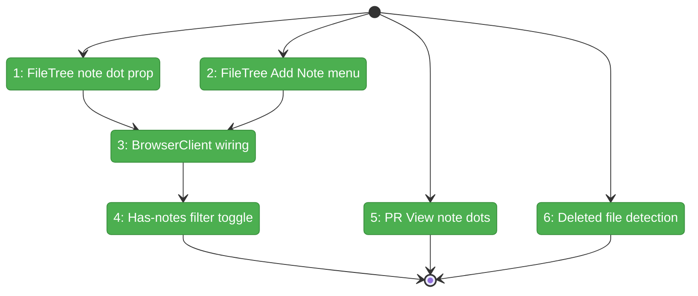
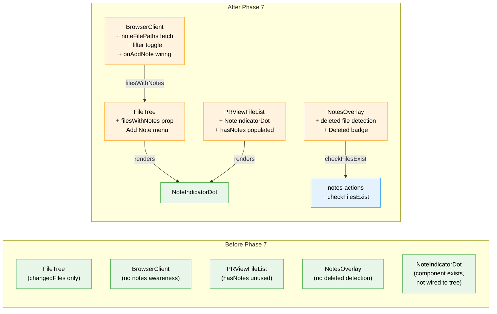

# Flight Plan: Phase 7 — Cross-Domain Integration

**Plan**: [pr-view-plan.md](../../pr-view-plan.md)
**Phase**: Phase 7: Cross-Domain Integration
**Generated**: 2026-03-10
**Status**: Landed

---

## Departure → Destination

**Where we are**: Phases 1-6 are complete. File Notes has a full data layer, web UI, CLI, overlay, and NoteIndicatorDot component — but the dot isn't wired into the FileTree or PR View file list yet. PR View has a full overlay with live updates and mode switching — but `PRViewFile.hasNotes` is always undefined. The two new domains are fully functional in isolation but don't cross-pollinate with file-browser.

**Where we're going**: A developer browsing the file tree sees a blue dot next to any file with open notes and can right-click to add a note. The tree can be filtered to show only files with notes. The PR View file list shows note indicators alongside change status. The notes overlay marks file groups whose underlying files have been deleted. All three domains are wired together.

---

## Domain Context

### Domains We're Changing

| Domain | What Changes | Key Files |
|--------|-------------|-----------|
| file-browser | Add `filesWithNotes` prop to FileTree, "Add Note" context menu, note filter toggle, BrowserClient wiring | `file-tree.tsx`, `browser-client.tsx` |
| pr-view | Populate `hasNotes` on PRViewFile, render NoteIndicatorDot in file list | `pr-view-file-list.tsx`, `pr-view-overlay-panel.tsx` |
| file-notes | Deleted file detection in overlay, batch file-exists server action | `note-file-group.tsx`, `notes-overlay-panel.tsx`, `notes-actions.ts` |

### Domains We Depend On (no changes)

| Domain | What We Consume | Contract |
|--------|----------------|----------|
| file-notes | NoteIndicatorDot component | `{ hasNotes: boolean }` prop |
| file-notes | fetchFilesWithNotes server action | `NoteResult<string[]>` |
| file-notes | useNotesOverlay().openModal | Programmatic note creation |
| _platform/events | useFileChanges SSE | Trigger refresh on file changes |
| _platform/file-ops | IFileSystem.stat | File existence checking |

---

## Flight Status

<!-- Updated by /plan-6-v2: pending → active → done. Use blocked for problems/input needed. -->

**Legend**: grey = pending | yellow = active | red = blocked/needs input | green = done

---

## Stages

<!-- Updated by /plan-6-v2 during implementation: [ ] → [~] → [x] -->

- [x] **Stage 1: FileTree note indicator prop** — Add `filesWithNotes?: Set<string>` prop, render NoteIndicatorDot per file entry (`file-tree.tsx`)
- [x] **Stage 2: FileTree "Add Note" context menu** — Add ContextMenuItem with StickyNote icon, `onAddNote` callback (`file-tree.tsx`)
- [x] **Stage 3: BrowserClient wiring** — Fetch noteFilePaths, pass to FileTree, wire onAddNote to notes overlay (`browser-client.tsx`)
- [x] **Stage 4: Has-notes filter toggle** — Boolean toggle filters tree entries to files with notes + ancestor dirs (`browser-client.tsx`)
- [x] **Stage 5: PR View note indicators** — Fetch noteFilePaths in panel, pass as separate prop to file list (`pr-view-overlay-panel.tsx`, `pr-view-file-list.tsx`)
- [x] **Stage 6: Deleted file detection** — Extended fetchFilesWithNotesDetailed, "Deleted" badge in note file groups (`notes-actions.ts`, `notes-overlay-panel.tsx`, `note-file-group.tsx`)

---

## Architecture: Before & After

**Legend**: existing (green, unchanged) | changed (orange, modified) | new (blue, created)

---

## Acceptance Criteria

- [ ] AC-21: File tree shows indicator dot next to files with open notes
- [ ] AC-22: PR View file list shows indicator dot next to files with notes
- [ ] AC-27: Tree can be filtered to show only files with notes
- [ ] AC-15 (partial): "Add Note" context menu item in FileTree opens note modal with file pre-filled
- [ ] OQ-2 (partial): Notes overlay shows "deleted" indicator for files no longer in worktree

## Goals & Non-Goals

**Goals**:
- Wire NoteIndicatorDot into FileTree (blue dot per file with notes)
- Wire NoteIndicatorDot into PR View file list
- Add "has notes" toggle filter within tree mode
- Add "Add Note" to FileTree context menu
- Detect deleted files in notes overlay
- Cross-domain data flow: BrowserClient fetches note file paths, passes to tree

**Non-Goals**:
- Tree-form file list in PR View (NG-2)
- Inline diff commenting (NG-3)
- Note indicators on directories
- Note search (NG-9)

---

## Checklist

- [x] T001: FileTree `filesWithNotes` prop + NoteIndicatorDot rendering
- [x] T002: FileTree "Add Note" context menu item
- [x] T003: BrowserClient fetch noteFilePaths + pass to FileTree + onAddNote wiring
- [x] T004: "Has notes" toggle filter in tree mode
- [x] T005: PR View file list NoteIndicatorDot + hasNotes population
- [x] T006: Deleted file detection in notes overlay
