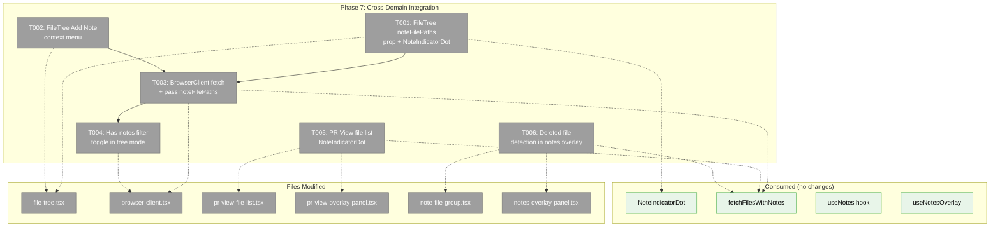
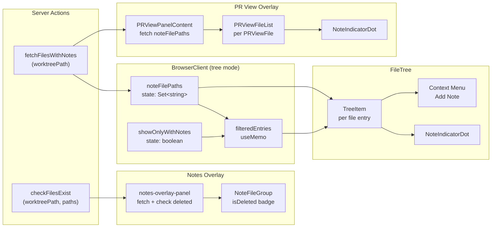
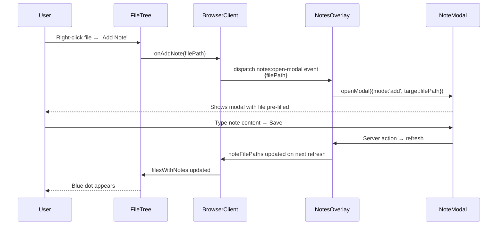

# Phase 7: Cross-Domain Integration — Tasks Dossier

**Plan**: [pr-view-plan.md](../../pr-view-plan.md)
**Phase**: Phase 7: Cross-Domain Integration
**Created**: 2026-03-10
**Status**: Pending

---

## Executive Briefing

- **Purpose**: Wire File Notes indicators into the FileTree and PR View file list, add a tree-level "has notes" toggle filter, and detect deleted files in the notes overlay. This is the phase where the two new domains (file-notes, pr-view) connect to the existing file-browser domain.
- **What We're Building**: NoteIndicatorDot appears in both the FileTree and PR View file list for files with notes. A toggle filter in tree mode shows only files with notes. FileTree gets an "Add Note" context menu item. The notes overlay marks file groups where the underlying file has been deleted.
- **Goals**: ✅ File tree shows blue indicator dot next to files with open notes ✅ PR View file list shows blue indicator dot ✅ Tree can be filtered to show only files with notes ✅ "Add Note" available from file tree context menu ✅ Deleted files' notes show "deleted" indicator in overlay
- **Non-Goals**: ❌ Tree-form file list in PR View (flat list only per NG-2) ❌ Inline diff commenting (NG-3) ❌ Full-text note search (NG-9) ❌ Note indicators on directories (files only)

---

## Prior Phase Context

### Phase 1 (File Notes Data Layer)

**A. Deliverables**: Core types in `packages/shared/src/file-notes/`, INoteService interface, JSONL writer/reader, FakeNoteService, API route (`/api/file-notes`), 6 server actions in `notes-actions.ts`, domain.md.

**B. Dependencies Exported**:
- `fetchFilesWithNotes(worktreePath)` → `NoteResult<string[]>` — returns file paths with open notes
- `fetchNotes(worktreePath, filter?)` → `NoteResult<Note[]>` — full note list
- API `GET /api/file-notes?mode=files` — lightweight file-paths-only endpoint
- `listFilesWithNotes(worktreePath, filter?)` — server-side, defaults to status='open'

**C. Gotchas**: `listFilesWithNotes` defaults to `status: 'open'` only. Silent JSONL malformation skipping. Types MUST live in shared package.

**D. Incomplete Items**: None.

**E. Patterns to Follow**: Result pattern (`{ ok, data | error }`), server action pattern (auth + validation + delegation), JSONL atomic rename.

### Phase 2 (File Notes Web UI)

**A. Deliverables**: `use-notes.ts` hook (data + cache + filters + `noteFilePaths: Set<string>`), `use-notes-overlay.tsx` provider, NoteIndicatorDot (6px blue dot), note-card, note-file-group, notes-overlay-panel, note-modal, bulk-delete-dialog, SDK commands, sidebar button, overlay wrapper.

**B. Dependencies Exported**:
- `NoteIndicatorDot` component — `{ hasNotes: boolean }` prop, exported from feature barrel
- `useNotes(worktreePath)` → `{ noteFilePaths: Set<string>, ... }`
- `useNotesOverlay()` → `{ openModal(target) }` for adding notes from external triggers
- `notes:toggle` CustomEvent for overlay toggle
- Feature barrel: `@/features/071-file-notes/index.ts`

**C. Gotchas**: `useRef<() => void>()` needs initial value in strict mode. No autoFocus (use useRef + useEffect). Overlay openCount/completeCount must come from unfiltered notes.

**D. Incomplete Items**: None.

**E. Patterns to Follow**: Overlay provider with `isOpeningRef` guard, dynamic import `{ ssr: false }`, overlay mutual exclusion via `overlay:close-all`.

### Phase 5 (PR View Overlay)

**A. Deliverables**: PR View overlay (provider, panel, header, file list, diff sections, diff area), SDK commands, overlay wrapper with FileChangeProvider, explorer panel button.

**B. Dependencies Exported**:
- `PRViewFile.hasNotes?: boolean` — field already defined in types.ts but not populated
- `PRViewFileList` accepts `files: PRViewFile[]` prop
- `usePRViewData()` → `{ data: PRViewData | null, ... }`
- PR View overlay wrapper contains FileChangeProvider (shared SSE)

**C. Gotchas**: DiffViewer error display is own (DYK-01). Unmount children when closed. `isScrollingToRef` guard for scroll sync. Import from service paths, NOT barrel (nuqs issue).

**D. Incomplete Items**: None.

**E. Patterns to Follow**: Lazy-mount DiffViewer via IntersectionObserver. Own error display. refreshRef pattern for Biome exhaustive-deps.

### Phase 6 (PR View Live Updates)

**A. Deliverables**: Mode toggle (Working/Branch), split loading, generation counter, SSE subscription, FileChangeProvider consolidated in wrapper.

**B. Dependencies Exported**: `switchMode(newMode)`, `mode: ComparisonMode`, `initialLoading`, `refreshing`.

**C. Gotchas**: FileChangeProvider cannot go in layout.tsx (Server Component). Stale mode fetch needs generation counter. Reset collapsed on mode switch.

**D. Incomplete Items**: None.

**E. Patterns to Follow**: Split loading (initial vs refreshing). Generation counter for race conditions. Custom event dispatch for toggle buttons.

---

## Pre-Implementation Check

| File | Exists? | Domain Check | Notes |
|------|---------|-------------|-------|
| `apps/web/src/features/041-file-browser/components/file-tree.tsx` | ✅ Yes | file-browser ✅ | Add `filesWithNotes` prop + NoteIndicatorDot rendering |
| `apps/web/app/(dashboard)/workspaces/[slug]/browser/browser-client.tsx` | ✅ Yes | file-browser (cross-domain) ✅ | Add note file paths fetch + filter toggle + onAddNote wiring |
| `apps/web/src/features/071-pr-view/components/pr-view-file-list.tsx` | ✅ Yes | pr-view ✅ | Add NoteIndicatorDot rendering |
| `apps/web/src/features/071-pr-view/components/pr-view-overlay-panel.tsx` | ✅ Yes | pr-view ✅ | Fetch noteFilePaths, pass to file list |
| `apps/web/src/features/071-file-notes/components/note-indicator-dot.tsx` | ✅ Yes | file-notes ✅ | Already exists — consumed as cross-domain contract |
| `apps/web/src/features/071-file-notes/hooks/use-notes-overlay.tsx` | ✅ Yes | file-notes ✅ | May need to expose openModal dispatch event |
| `apps/web/src/features/071-file-notes/components/note-file-group.tsx` | ✅ Yes | file-notes ✅ | Add `isDeleted` prop + indicator badge |
| `apps/web/src/features/071-file-notes/components/notes-overlay-panel.tsx` | ✅ Yes | file-notes ✅ | Add deleted file detection logic |
| `apps/web/app/actions/notes-actions.ts` | ✅ Yes | file-notes ✅ | May add `checkFilesExist` batch action |

**Concept search**: NoteIndicatorDot already exists (Phase 2). No duplication risk. `filesWithNotes` / `noteFilePaths` pattern is new cross-domain wiring.

**Harness**: No agent harness configured. Implementation will use standard testing approach (lightweight per deviation ledger).

---

## Architecture Map



---

## Tasks

| Status | ID | Task | Domain | Path(s) | Done When | Notes |
|--------|-----|------|--------|---------|-----------|-------|
| [x] | T001 | Add `filesWithNotes?: Set<string>` prop to FileTree + render NoteIndicatorDot per file entry | file-browser | `/apps/web/src/features/041-file-browser/components/file-tree.tsx` | Blue dot appears next to file icon for files in the set. Dot renders between File icon and filename. Prop threaded through recursive TreeItem. | Per AC-21. Import NoteIndicatorDot from `@/features/071-file-notes`. Follow `changedFiles` prop pattern. |
| [x] | T002 | Add "Add Note" context menu item in FileTree for file entries | file-browser | `/apps/web/src/features/041-file-browser/components/file-tree.tsx` | Context menu shows "Add Note" item for files (not directories). Clicking dispatches `onAddNote(filePath)` callback. | Per AC-15. Add `onAddNote?: (filePath: string) => void` prop. Uses existing ContextMenu pattern with StickyNote icon. |
| [x] | T003 | Wire BrowserClient to fetch noteFilePaths from server action + pass to FileTree + wire onAddNote | file-browser (cross-domain) | `/apps/web/app/(dashboard)/workspaces/[slug]/browser/browser-client.tsx` | Note indicators appear in tree for correct files. Indicators update when notes change (refresh on file changes via SSE + `notes:changed` event). "Add Note" opens note modal with file pre-filled. | Cross-domain: calls `fetchFilesWithNotes` from `notes-actions.ts`. Use `useNotesOverlay().openModal()` directly (DYK-01 — BrowserClient is inside provider context). Listen for `notes:changed` CustomEvent to refresh immediately after CRUD (DYK-02). |
| [x] | T004 | Add "has notes" toggle filter in tree mode | file-browser | `/apps/web/app/(dashboard)/workspaces/[slug]/browser/browser-client.tsx` | Toggle button filters tree entries to show only files (and ancestor directories) with notes. Toggle off restores full tree. | Per AC-27, OQ-5. Boolean state `showOnlyWithNotes`. Build `ancestorPaths: Set<string>` from noteFilePaths by collecting directory prefixes (DYK-03). Filter BOTH rootEntries AND childEntries — show file if in noteFilePaths, show dir if in ancestorPaths. Add StickyNote filter icon button above tree area. |
| [x] | T005 | Add NoteIndicatorDot to PR View file list + pass noteFilePaths as separate prop | pr-view | `/apps/web/src/features/071-pr-view/components/pr-view-file-list.tsx`, `/apps/web/src/features/071-pr-view/components/pr-view-overlay-panel.tsx` | Blue dot appears in PR View file list next to files that have notes. | Per AC-22. Pass `noteFilePaths: Set<string>` as separate prop to PRViewFileList (DYK-04 — don't merge into PRViewFile to avoid cache invalidation + DiffViewer re-renders). Fetch in panel, listen for `notes:changed` event (DYK-02). Render dot after status badge, before file path. |
| [x] | T006 | Deleted file detection — notes overlay shows "deleted" indicator for files no longer in worktree | file-notes | `/apps/web/src/features/071-file-notes/components/note-file-group.tsx`, `/apps/web/src/features/071-file-notes/components/notes-overlay-panel.tsx`, `/apps/web/app/actions/notes-actions.ts` | File groups in notes overlay show red "Deleted" badge when underlying file no longer exists. | Per OQ-2. Extend `fetchFilesWithNotes` with optional `includeExistence?: boolean` param (DYK-05). When true, returns `{ path, exists }[]`. Notes overlay derives `deletedFiles: Set<string>` from enriched response. Pass `isDeleted` prop to NoteFileGroup. Show red badge in file group header. One round-trip, no separate action. |

---

## Context Brief

### Key findings from plan

- **Finding 01**: No anti-reinvention conflicts — NoteIndicatorDot is the established cross-domain contract component
- **Finding 06**: Working changes services not exported from file-browser barrel — PR View imports directly from service paths (nuqs issue). Phase 7 cross-domain imports use feature barrel for file-notes (safe — no nuqs dependency)
- **Finding 08**: Overlay mounting pattern is mature — `overlay:close-all` CustomEvent for mutual exclusion

### Domain dependencies (concepts and contracts this phase consumes)

- `file-notes`: NoteIndicatorDot component (`{ hasNotes: boolean }`) — blue dot indicator for tree and PR View
- `file-notes`: `fetchFilesWithNotes(worktreePath)` server action — returns `NoteResult<string[]>` of file paths with open notes
- `file-notes`: `useNotesOverlay().openModal(target)` — programmatic note creation from context menu
- `file-notes`: `notes-overlay-panel` + `note-file-group` — add deleted file indicator
- `pr-view`: `PRViewFile.hasNotes?: boolean` — already defined but unpopulated
- `pr-view`: `PRViewFileList` — accepts `files: PRViewFile[]`
- `_platform/events`: `useFileChanges` — SSE subscription for triggering noteFilePaths refresh
- `file-browser`: `FileTreeProps` — existing prop interface to extend with `filesWithNotes`
- `file-browser`: `changedFiles` pattern — reference pattern for prop threading and visual indicators

### Domain constraints

- **file-browser → file-notes**: Cross-domain import allowed via file-notes feature barrel (NoteIndicatorDot is declared as a cross-domain contract in domain manifest)
- **pr-view → file-notes**: Cross-domain data fetch via server action (not direct import of notes internals)
- **file-notes → _platform/file-ops**: Can use `fileExists` pattern for deleted file detection
- **Direction**: business → business is ⚠️ contracts only — all cross-domain imports use public barrel exports or server actions

### Harness context

No agent harness configured. Agent will use standard testing approach from plan (lightweight per deviation ledger P3).

### Reusable from prior phases

- `NoteIndicatorDot` component (Phase 2) — ready to import and render
- `fetchFilesWithNotes` server action (Phase 1) — ready to call
- `useNotesOverlay` + `openModal` (Phase 2) — ready for programmatic note creation
- `changedFiles` prop threading pattern (existing) — reference for `filesWithNotes`
- ContextMenu pattern in FileTree (existing) — reference for "Add Note" item
- `PRViewFile.hasNotes` type field (Phase 4) — already defined, just needs population
- Result pattern `{ ok, data | error }` — all server action consumers follow this
- `overlay:close-all` + `CustomEvent` pattern — for note modal dispatch from tree

### Mermaid flow diagram (data flow for note indicators)



### Mermaid sequence diagram (Add Note from tree context menu)



---

## DYK Decisions (Pre-Implementation)

| ID | Insight | Decision | Affects |
|----|---------|----------|---------|
| DYK-01 | BrowserClient renders inside NotesOverlayProvider context — can call useNotesOverlay().openModal() directly | Use direct hook call instead of custom event dispatch for "Add Note" from tree context menu. Cross-domain import allowed (contracts only). | T003 |
| DYK-02 | After note CRUD, BrowserClient's separate noteFilePaths state won't know to refresh — dot won't appear immediately | Dispatch `notes:changed` CustomEvent after note save in useNotes/overlay. BrowserClient + PR View panel listen for it to re-fetch noteFilePaths. Instant feedback. | T003, T005 |
| DYK-03 | Filter toggle must preserve ancestor directories in a lazy-loaded tree — can't just filter rootEntries | Build `ancestorPaths: Set<string>` from noteFilePaths by collecting all directory prefixes. Filter both rootEntries AND childEntries: show file if in noteFilePaths, show dir if in ancestorPaths. | T004 |
| DYK-04 | Merging hasNotes into PRViewFile[] creates new object refs, invalidating data hook cache and causing DiffViewer re-renders | Pass `noteFilePaths: Set<string>` as separate prop to PRViewFileList. Check `noteFilePaths.has(file.path)` inline. PRViewFile data stays untouched in cache. | T005 |
| DYK-05 | Deleted file detection can piggyback on existing fetchFilesWithNotes — no separate batch action needed | Add optional `includeExistence?: boolean` param to fetchFilesWithNotes. When true, return `{ path, exists }[]`. Notes overlay derives deletedFiles from enriched response. One round-trip. | T006 |

---

## Discoveries & Learnings

_Populated during implementation by plan-6._

| Date | Task | Type | Discovery | Resolution | References |
|------|------|------|-----------|------------|------------|

---

## Directory Layout

```
docs/plans/071-pr-view/
  ├── pr-view-plan.md
  └── tasks/phase-7-cross-domain-integration/
      ├── tasks.md               ← this file
      ├── tasks.fltplan.md       ← flight plan (next)
      └── execution.log.md       ← created by plan-6
```
