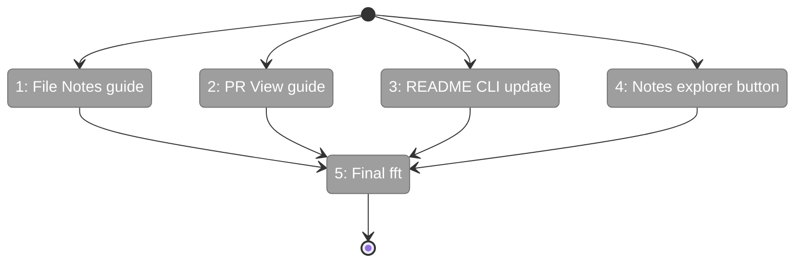
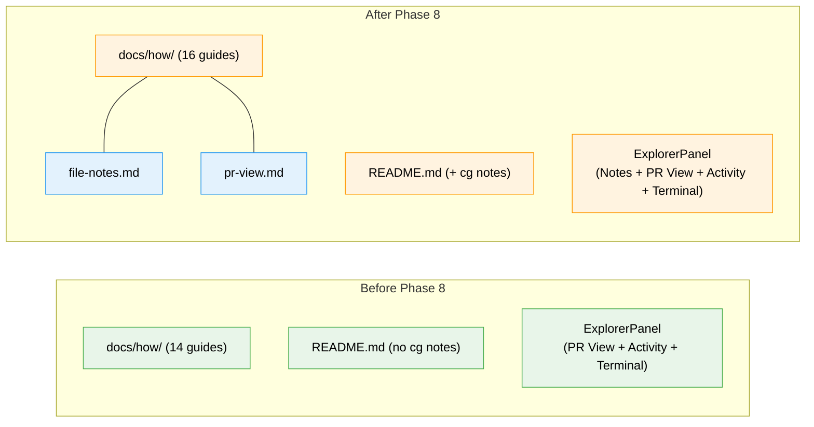

# Flight Plan: Phase 8 — Documentation + Polish

**Plan**: [pr-view-plan.md](../../pr-view-plan.md)
**Phase**: Phase 8: Documentation + Polish
**Generated**: 2026-03-10
**Status**: Landed

---

## Departure → Destination

**Where we are**: All 7 implementation phases are complete. Both domains (file-notes, pr-view) are fully functional with 5167+ tests passing. Domain docs, registry, and domain-map have been maintained throughout. What's missing: two how-to guides, README CLI section for `cg notes`, and a Notes toggle button in the explorer panel.

**Where we're going**: A developer opening the project finds comprehensive documentation for both features — how-to guides explaining every workflow, CLI commands documented in README, and a Notes button in the explorer bar for quick access. The branch is ready to merge.

---

## Domain Context

### Domains We're Changing

| Domain | What Changes | Key Files |
|--------|-------------|-----------|
| _platform/panel-layout | Add Notes toggle button | `explorer-panel.tsx` |
| — (docs only) | Create how-to guides, update README | `docs/how/file-notes.md`, `docs/how/pr-view.md`, `README.md` |

### Domains We Depend On (no changes)

| Domain | What We Consume | Contract |
|--------|----------------|----------|
| file-notes | Feature knowledge for docs | NoteIndicatorDot, useNotes, CLI commands |
| pr-view | Feature knowledge for docs | Comparison modes, reviewed tracking, shortcuts |

---

## Flight Status

**Legend**: grey = pending | yellow = active | red = blocked/needs input | green = done

---

## Stages

- [x] **Stage 1: File Notes how-to guide** — Create `docs/how/file-notes.md` covering web UI, CLI, SDK, link types, threading
- [x] **Stage 2: PR View how-to guide** — Create `docs/how/pr-view.md` covering modes, tracking, live updates, shortcuts
- [x] **Stage 3: README CLI update** — Add `cg notes` commands with examples to README.md
- [x] **Stage 4: Notes explorer button** — Add StickyNote button to `explorer-panel.tsx` next to PR View button
- [x] **Stage 5: Final quality gate** — Run `just fft`, verify all green

---

## Architecture: Before & After

---

## Acceptance Criteria

- [ ] AC: `docs/how/file-notes.md` exists and covers all user workflows
- [ ] AC: `docs/how/pr-view.md` exists and covers both comparison modes
- [ ] AC: README.md documents `cg notes list/files/add/complete` with examples
- [ ] AC: Notes button visible in explorer panel, dispatches `notes:toggle`
- [ ] AC: `just fft` passes (lint, format, typecheck, 5167+ tests)

## Goals & Non-Goals

**Goals**:
- Complete documentation coverage for both new domains
- README CLI section for agent consumption
- Notes button in explorer for discoverability

**Non-Goals**:
- No feature logic changes
- No new tests (documentation phase)
- No domain.md updates (already complete)

---

## Checklist

- [x] T001: Create `docs/how/file-notes.md` how-to guide
- [x] T002: Create `docs/how/pr-view.md` how-to guide
- [x] T003: Update README.md CLI section with `cg notes` commands
- [x] T004: Add Notes toggle button to ExplorerPanel
- [x] T005: Run `just fft` final quality gate
