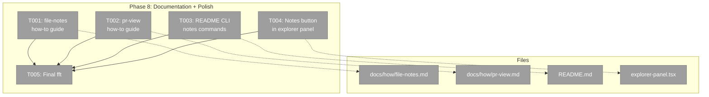
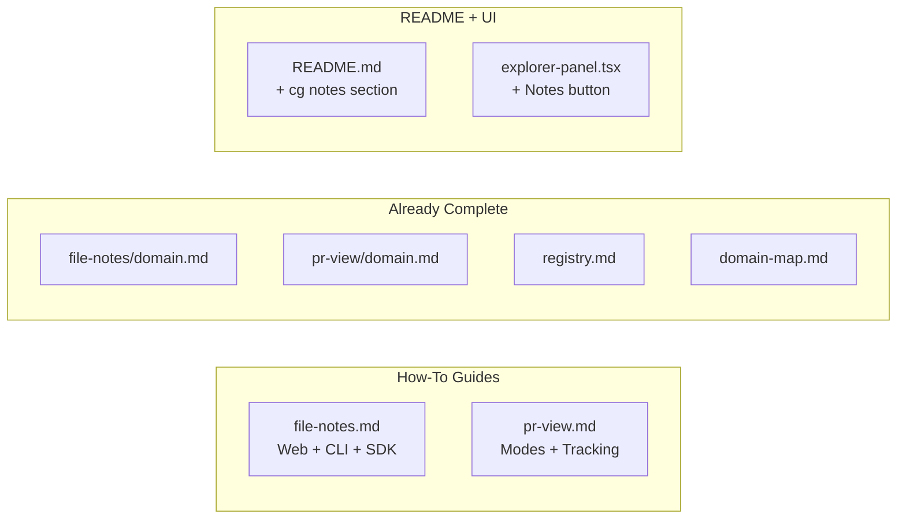

# Phase 8: Documentation + Polish — Tasks Dossier

**Plan**: [pr-view-plan.md](../../pr-view-plan.md)
**Phase**: Phase 8: Documentation + Polish
**Created**: 2026-03-10
**Status**: Pending

---

## Executive Briefing

- **Purpose**: Finalize documentation for both new domains (file-notes, pr-view) with how-to guides, update README CLI section, and add Notes button to the explorer panel. This is the final phase before merge.
- **What We're Building**: Two how-to guides (`docs/how/file-notes.md` and `docs/how/pr-view.md`), README updates with `cg notes` commands, and a Notes toggle button in the ExplorerPanel top bar.
- **Goals**: ✅ How-to guides cover all user scenarios for notes and PR View ✅ README documents CLI notes commands ✅ Notes button visible in explorer panel ✅ `just fft` passes as final quality gate
- **Non-Goals**: ❌ No code changes to feature logic ❌ No new tests (docs phase) ❌ No domain.md/registry/domain-map changes (already complete from Phases 1-7)

---

## Prior Phase Context (Summary)

Phases 1-7 already completed all domain documentation updates incrementally:

- **domain.md files**: Both file-notes and pr-view have full Contracts, Concepts, Composition, Source Location, Dependencies, and History sections
- **registry.md**: Both rows exist (rows 25-26)
- **domain-map.md**: Both nodes + all edges + cross-domain arrows complete
- **Explorer panel**: PR View button exists (GitPullRequest icon), but Notes button is missing
- **How-to guides**: Neither exists yet
- **README CLI section**: `cg notes` commands not listed

**Tasks 8.1-8.4 are ALREADY DONE** — domain docs, registry, and domain-map were maintained throughout implementation. Only 8.5-8.9 remain.

---

## Pre-Implementation Check

| File | Exists? | Domain Check | Notes |
|------|---------|-------------|-------|
| `docs/how/file-notes.md` | ❌ Missing | — | New file — create |
| `docs/how/pr-view.md` | ❌ Missing | — | New file — create |
| `README.md` | ✅ Exists | — | Add `cg notes` section to CLI commands |
| `apps/web/src/features/_platform/panel-layout/components/explorer-panel.tsx` | ✅ Exists | _platform/panel-layout | Add Notes button next to PR View button |

No concept search needed — this is documentation + a single UI button.
No agent harness configured.

---

## Architecture Map



---

## Tasks

| Status | ID | Task | Domain | Path(s) | Done When | Notes |
|--------|-----|------|--------|---------|-----------|-------|
| [x] | T00A | Finalize `docs/domains/file-notes/domain.md` | file-notes | `docs/domains/file-notes/domain.md` | Domain doc matches implementation | **ALREADY DONE** — maintained through Phases 1-7 |
| [x] | T00B | Finalize `docs/domains/pr-view/domain.md` | pr-view | `docs/domains/pr-view/domain.md` | Domain doc matches implementation | **ALREADY DONE** — maintained through Phases 4-7 |
| [x] | T00C | Update `docs/domains/registry.md` | — | `docs/domains/registry.md` | Registry has file-notes + pr-view | **ALREADY DONE** — rows 25-26 exist |
| [x] | T00D | Update `docs/domains/domain-map.md` | — | `docs/domains/domain-map.md` | Domain map has both nodes + edges | **ALREADY DONE** — full nodes, edges, cross-domain arrows |
| [ ] | T001 | Create `docs/how/file-notes.md` how-to guide | file-notes | `docs/how/file-notes.md` | Guide covers: overview, adding notes (UI + CLI + context menu), threading, completion, filtering, bulk delete, link types, JSONL schema, agent integration | Follow pattern of existing `docs/how/*.md` guides. Cover web UI, CLI, SDK. Include CLI examples with output. |
| [ ] | T002 | Create `docs/how/pr-view.md` how-to guide | pr-view | `docs/how/pr-view.md` | Guide covers: overview, opening PR View, comparison modes (Working/Branch), reviewed tracking, live updates, keyboard shortcuts, file list navigation | Follow pattern of existing guides. Cover both modes, explain auto-invalidation. |
| [ ] | T003 | Update README.md CLI section with `cg notes` commands | — | `README.md` | README lists: `cg notes list`, `cg notes files`, `cg notes add`, `cg notes complete` with examples and flags | Add after existing CLI command listings. Include --json flag for agent consumption. |
| [ ] | T004 | Add Notes toggle button to ExplorerPanel top bar | _platform/panel-layout | `apps/web/src/features/_platform/panel-layout/components/explorer-panel.tsx` | StickyNote icon button visible next to PR View button, dispatches `notes:toggle` event | Insert between PR View button and Activity Log button. Follow same pattern (StickyNote icon from lucide-react). |
| [ ] | T005 | Run `just fft` — full quality gate | — | — | lint + format + typecheck + test all pass | Pre-merge gate. Must be green before merging 071-pr-view branch. |

---

## Context Brief

### Key findings from plan

- **Finding 08**: Overlay mounting pattern is mature — 3 wrappers in layout.tsx. Notes overlay already mounted; just needs explorer panel button.
- **Phase 8 is documentation-heavy** — no risky code changes, no new domain contracts.

### Domain dependencies

- None — this phase creates documentation and adds one UI button using existing patterns.

### Domain constraints

- ExplorerPanel button must dispatch `notes:toggle` CustomEvent (same pattern as PR View and Terminal buttons).

### Reusable from prior phases

- Existing `docs/how/*.md` guides for format reference (e.g., `docs/how/file-browser.md`, `docs/how/sse-integration.md`)
- ExplorerPanel button pattern (lines 490-516 — PR View, Activity Log, Terminal buttons)
- CLI notes command implementation at `apps/cli/src/commands/notes.command.ts` for accurate flag documentation

### Mermaid flow diagram (documentation coverage)



---

## Discoveries & Learnings

_Populated during implementation by plan-6._

| Date | Task | Type | Discovery | Resolution | References |
|------|------|------|-----------|------------|------------|

---

## Directory Layout

```
docs/plans/071-pr-view/
  ├── pr-view-plan.md
  └── tasks/phase-8-documentation-polish/
      ├── tasks.md               ← this file
      ├── tasks.fltplan.md       ← flight plan
      └── execution.log.md       ← created by plan-6
```
