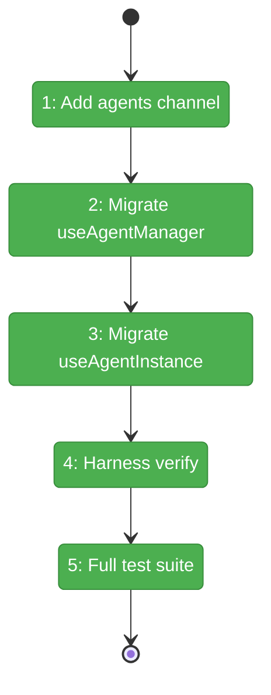
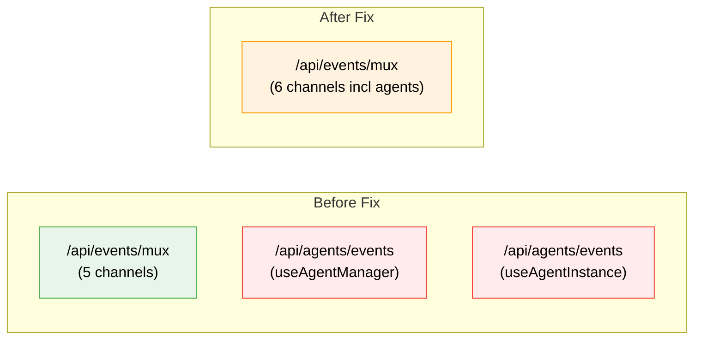

# Flight Plan: Fix FX001 — Migrate Agent Hooks to Multiplexed SSE

**Fix**: [FX001-agent-sse-migration.md](FX001-agent-sse-migration.md)
**Status**: Landed

## What → Why

**Problem**: Agent hooks open direct EventSource connections, exhausting HTTP/1.1 connection limit and causing browser lockups on the agents page.

**Fix**: Route agent SSE events through the existing multiplexed provider — 1 channel addition, 2 hook rewrites, net -139 lines.

## Domain Context

| Domain | Relationship | What Changes |
|--------|-------------|-------------|
| `_platform/events` | Modify | Add `'agents'` to WORKSPACE_SSE_CHANNELS |
| `agents` | Modify | useAgentManager + useAgentInstance → useChannelCallback |

## Flight Status

**Legend**: grey = pending | yellow = active | red = blocked | green = done

## Stages

- [x] **Stage 1: Add channel** — Add `'agents'` to WORKSPACE_SSE_CHANNELS (`layout.tsx`)
- [x] **Stage 2: Migrate useAgentManager** — Replace EventSource with useChannelCallback, map 8 event types (`useAgentManager.ts`)
- [x] **Stage 3: Migrate useAgentInstance** — Replace EventSource with useChannelCallback, preserve agentId filter + agent_event unwrap (`useAgentInstance.ts`)
- [x] **Stage 4: Harness verify** — Screenshot agents page, check console errors
- [x] **Stage 5: Full test suite** — `just fft` green

## Architecture: Before & After

**Legend**: green = unchanged | orange = modified | red = removed

## Acceptance

- [x] Agents page loads without lockup
- [x] Click agent → overlay opens without freeze
- [x] Network tab: 0 connections to `/api/agents/events`
- [x] `just fft` passes
- [x] Harness screenshot succeeds
