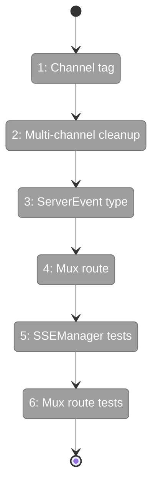
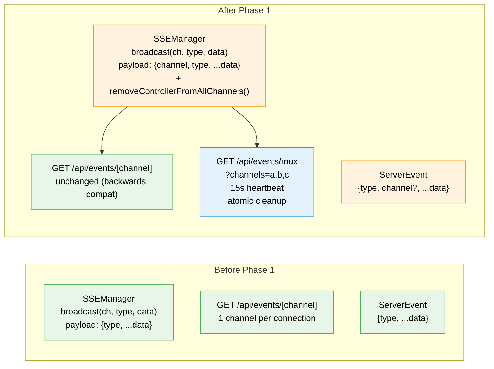

# Flight Plan: Phase 1 — Server Foundation

**Plan**: [sse-multiplexing-plan.md](../../sse-multiplexing-plan.md)
**Phase**: Phase 1: Server Foundation
**Generated**: 2026-03-08
**Status**: Landed

---

## Departure → Destination

**Where we are**: SSEManager broadcasts events per-channel with `{type, ...data}` payload — no `channel` field. Each browser tab opens 2-4 separate EventSource connections (one per channel). The generic `/api/events/[channel]` route exists but there's no multiplexed endpoint. SSEManager has no method to remove a controller from all channels at once.

**Where we're going**: SSEManager broadcasts `{channel, type, ...data}` on every event. A new `/api/events/mux?channels=a,b,c` endpoint registers one controller across multiple channels with 15s heartbeats and atomic cleanup. ServerEvent type includes optional `channel` field. All existing SSE consumers continue working unchanged.

---

## Domain Context

### Domains We're Changing

| Domain | What Changes | Key Files |
|--------|-------------|-----------|
| `_platform/events` | broadcast() adds `channel` to payload; new `removeControllerFromAllChannels()` method; new mux route | `sse-manager.ts`, `app/api/events/mux/route.ts` |
| `_platform/state` | ServerEvent type extended with optional `channel` field | `server-event-router.ts` |

### Domains We Depend On (no changes)

| Domain | What We Consume | Contract |
|--------|----------------|----------|
| `_platform/auth` | Session check for route protection | `auth()` from `@/auth` |
| `_platform/events` | WorkspaceDomain channel name registry | `WorkspaceDomain` const |

---

## Flight Status

<!-- Updated by /plan-6-v2: pending → active → done. Use blocked for problems/input needed. -->

**Legend**: grey = pending | yellow = active | red = blocked/needs input | green = done

---

## Stages

<!-- Updated by /plan-6-v2 during implementation: [ ] → [~] → [x] -->

- [x] **Stage 1: Tag channel in broadcast** — Add `channel: channelId` to SSEManager.broadcast() payload (`sse-manager.ts`)
- [x] **Stage 2: Atomic multi-channel cleanup** — Add `removeControllerFromAllChannels()` method (`sse-manager.ts`)
- [x] **Stage 3: Extend ServerEvent type** — Add optional `channel` field to ServerEvent (`server-event-router.ts`)
- [x] **Stage 4: Create mux route** — New `/api/events/mux` with multi-channel registration, 15s heartbeat, atomic cleanup (`mux/route.ts` — new file)
- [x] **Stage 5: SSEManager tests** — Channel tagging + removeControllerFromAllChannels tests (`sse-manager.test.ts`)
- [x] **Stage 6: Mux route tests** — Validation, auth, registration, cleanup, heartbeat (`events-mux-route.test.ts` — new file)

---

## Architecture: Before & After

**Legend**: existing (green, unchanged) | changed (orange, modified) | new (blue, created)

---

## Acceptance Criteria

- [ ] AC-01: SSEManager.broadcast() includes `channel` field in every SSE payload
- [ ] AC-02: New `/api/events/mux` route accepts `?channels=a,b,c` query parameter
- [ ] AC-03: Mux route registers one controller in SSEManager for each requested channel
- [ ] AC-04: Mux route validates channel names against `^[a-zA-Z0-9_-]+$`, rejects invalid
- [ ] AC-05: Mux route limits to max 20 channels per connection, deduplicates
- [ ] AC-06: Mux route requires authentication (session check)
- [ ] AC-07: Mux route sends heartbeat every 15 seconds (DEV-03)
- [ ] AC-08: On disconnect, controller is removed from ALL registered channels (no leak)
- [ ] AC-09: Existing `/api/events/[channel]` route continues working unchanged
- [ ] AC-10: Existing per-channel payloads now include `channel` field (non-breaking addition)

## Goals & Non-Goals

**Goals**: Channel tagging in broadcast, atomic multi-channel cleanup, mux route, ServerEvent type extension, comprehensive tests

**Non-Goals**: Client-side provider/hooks (Phase 2), consumer migration (Phase 3+), modifying existing [channel] route behavior

---

## Checklist

- [x] T001: Add `channel: channelId` to SSEManager.broadcast() payload
- [x] T002: Add `removeControllerFromAllChannels(controller)` method to SSEManager
- [x] T003: Extend ServerEvent type with optional `channel` field
- [x] T004: Create `/api/events/mux` route
- [x] T005: Extend SSEManager tests for channel tagging + multi-channel cleanup
- [x] T006: Create mux route contract tests
