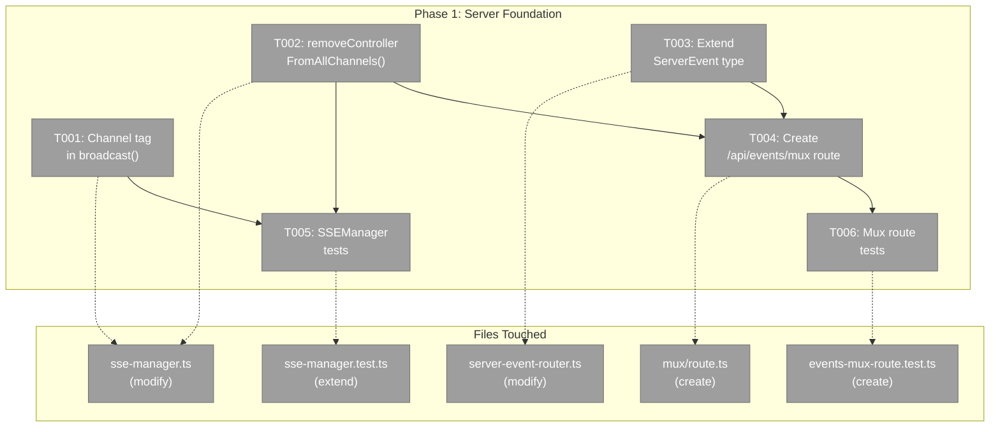
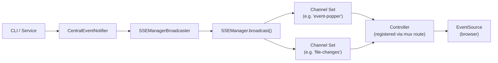
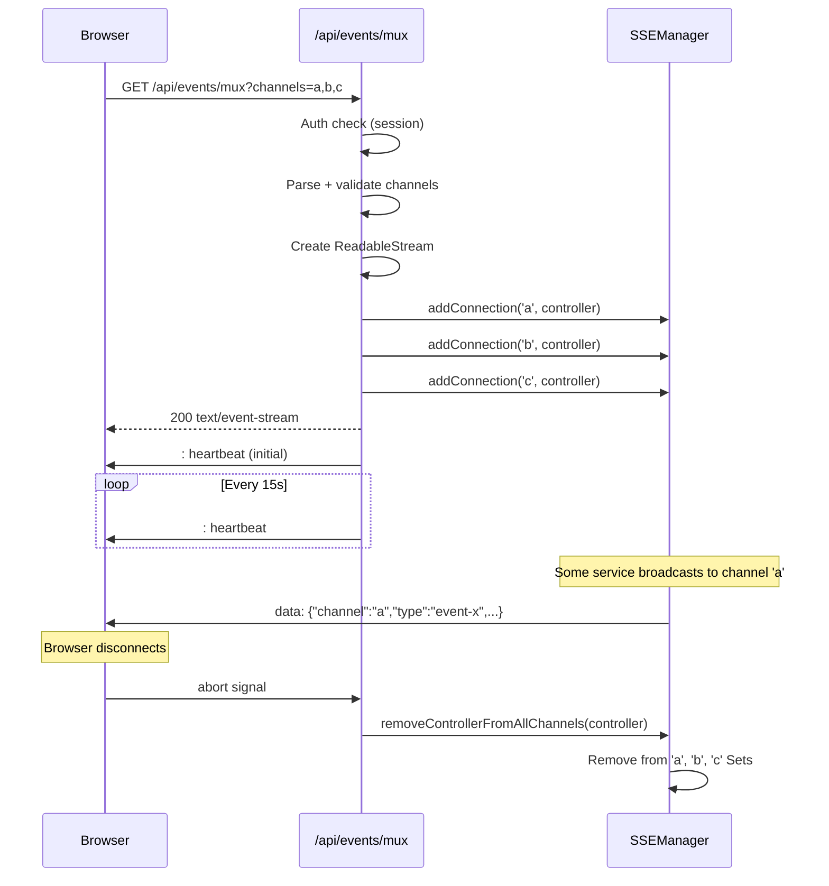

# Phase 1: Server Foundation — Tasks

**Plan**: [sse-multiplexing-plan.md](../../sse-multiplexing-plan.md)
**Phase**: Phase 1: Server Foundation
**Domain**: `_platform/events`
**Generated**: 2026-03-08
**Status**: Complete

---

## Executive Briefing

**Purpose**: Tag all SSE payloads with a `channel` field so clients can demultiplex, and create the new `/api/events/mux` endpoint that registers one controller across multiple channels. This is the server foundation that all subsequent phases depend on.

**What We're Building**: Two changes to SSEManager (channel tagging in broadcast payload + atomic multi-channel cleanup method) and one new API route that accepts a comma-separated channel list, registers a single stream controller on all requested channels, and sends 15-second heartbeats.

**Goals**:
- ✅ Every SSE message includes `channel` field in payload (non-breaking)
- ✅ New `/api/events/mux?channels=a,b,c` endpoint operational
- ✅ Atomic multi-channel controller cleanup (no leaks on disconnect)
- ✅ Existing `/api/events/[channel]` route unchanged (backwards compat)
- ✅ ServerEvent type extended with optional `channel` field
- ✅ All existing tests pass, new tests cover all changes

**Non-Goals**:
- ❌ Client-side provider or hooks (Phase 2)
- ❌ Migrating any consumer (Phase 3+)
- ❌ Changing any existing SSE route behavior
- ❌ Moving sse-manager.ts to a new directory

---

## Pre-Implementation Check

| File | Exists? | Domain Check | Notes |
|------|---------|-------------|-------|
| `apps/web/src/lib/sse-manager.ts` | ✅ Yes (145 lines) | `_platform/events` ✅ | Modify: broadcast() line 74-77, add removeControllerFromAllChannels() |
| `apps/web/src/lib/state/server-event-router.ts` | ✅ Yes (68 lines) | `_platform/state` ✅ | Modify: ServerEvent type lines 20-23 (add optional channel) |
| `apps/web/app/api/events/mux/route.ts` | ❌ New file | `_platform/events` ✅ | Create: follows [channel]/route.ts pattern |
| `apps/web/app/api/events/[channel]/route.ts` | ✅ Yes (103 lines) | `_platform/events` ✅ | Reference only — not modified. Pattern template for mux route. |
| `test/unit/web/services/sse-manager.test.ts` | ✅ Yes (232 lines, 10 tests) | `_platform/events` ✅ | Extend: add channel tagging + removeControllerFromAllChannels tests |
| `test/unit/web/api/events-mux-route.test.ts` | ❌ New file | `_platform/events` ✅ | Create: mux route contract tests |
| `test/fakes/fake-controller.ts` | ✅ Yes | `_platform/events` ✅ | Reference only — used by SSEManager tests |

**Harness**: No agent harness configured. Agent will use standard testing approach from plan.

---

## Architecture Map



---

## Tasks

| Status | ID | Task | Domain | Path(s) | Done When | Notes |
|--------|-----|------|--------|---------|-----------|-------|
| [x] | T001 | Add `channel: channelId` to SSEManager.broadcast() payload | `_platform/events` | `apps/web/src/lib/sse-manager.ts` | Broadcast payload includes `channel` field alongside existing `type`. All existing tests still pass. Non-breaking addition. | Finding 01. One-line change at line 76. Payload becomes `{...data, type: eventType, channel: channelId}`. Also handle primitive data case at line 77. |
| [x] | T002 | Add `removeControllerFromAllChannels(controller)` method to SSEManager | `_platform/events` | `apps/web/src/lib/sse-manager.ts` | New method iterates ALL channels in connections Map, removes controller from each Set, cleans up empty Sets. Returns array of channel names it was removed from. | Finding 02. Critical for mux route cleanup. Must iterate snapshot of channels Map to avoid mutation during iteration. TDD. |
| [x] | T003 | Extend ServerEvent type with optional `channel` field | `_platform/state` | `apps/web/src/lib/state/server-event-router.ts` | `ServerEvent` type includes `channel?: string`. Existing consumers (ServerEventRoute) unaffected — field is optional. | Finding 04. Lines 20-23. Non-breaking. |
| [x] | T004 | Create `/api/events/mux` route | `_platform/events` | `apps/web/app/api/events/mux/route.ts` | Route: (1) requires auth, (2) parses `?channels=a,b,c`, (3) validates each channel name against `^[a-zA-Z0-9_-]+$`, (4) rejects >20 channels, (5) deduplicates, (6) registers ONE controller on ALL channels via sseManager.addConnection(), (7) sends initial heartbeat, (8) heartbeat every 15s, (9) cleanup on abort removes controller from ALL channels via removeControllerFromAllChannels(). `export const dynamic = 'force-dynamic'`. | Findings 02, 03. AC-02 through AC-08. Follow [channel]/route.ts pattern (lines 40-92) for stream creation. Heartbeat 15s per DEV-03. |
| [x] | T005 | Extend SSEManager tests for channel tagging + multi-channel cleanup | `_platform/events` | `test/unit/web/services/sse-manager.test.ts` | New tests: (1) broadcast payload includes `channel` field, (2) removeControllerFromAllChannels removes from all registered channels, (3) removeControllerFromAllChannels cleans up empty Sets, (4) removeControllerFromAllChannels returns removed channel names, (5) same controller in multiple channel Sets receives broadcasts from each channel independently. | TDD. Use existing FakeController from test/fakes/fake-controller.ts. Follow existing test doc pattern (Why/Contract/Usage Notes/Quality Contribution/Worked Example). |
| [x] | T006 | Create mux route contract tests | `_platform/events` | `test/unit/web/api/events-mux-route.test.ts` | Tests: (1) rejects missing channels param (400), (2) rejects invalid channel names (400), (3) rejects >20 channels (400), (4) deduplicates channels, (5) requires auth (401), (6) registers controller on all requested channels, (7) removes controller from all channels on disconnect, (8) sends heartbeat. | TDD. Follow existing [channel] route test pattern if available. May need lightweight route test setup. |

---

## Context Brief

### Key Findings from Plan

- **Finding 01** (Critical): SSEManager already supports multiplexing — same controller can exist in multiple channel Sets. `broadcast()` iterates snapshots. ONE change: add `channel: channelId` to payload at line 76.
- **Finding 02** (Critical): Multi-channel cleanup race — on disconnect, controller must be removed from ALL channels atomically. Add `removeControllerFromAllChannels()` method. Pre-compute channel list before cleanup.
- **Finding 03** (Critical): Proxy/CDN idle timeout risk. Reduce heartbeat from 30s to 15s in mux route.
- **Finding 04** (High): ServerEvent type lacks `channel` field. Extend with optional `channel?: string`.

### Domain Dependencies

- `_platform/events`: SSEManager singleton (`apps/web/src/lib/sse-manager.ts`) — the connection pool we're modifying
- `_platform/events`: SSE API route pattern (`apps/web/app/api/events/[channel]/route.ts`) — template for mux route
- `_platform/events`: WorkspaceDomain const (`packages/shared/src/features/027-central-notify-events/workspace-domain.ts`) — channel name registry
- `_platform/state`: ServerEvent type (`apps/web/src/lib/state/server-event-router.ts`) — extending with channel field
- `_platform/auth`: Auth helper (`apps/web/src/auth.ts`) — session check in mux route

### Domain Constraints

- `_platform/events` is infrastructure — no business domain may depend on it in reverse
- SSEManager is a globalThis singleton — changes must be HMR-safe
- All SSE messages use unnamed events (no `event:` line) — `type` embedded in JSON payload (PL-02)
- Iterator invalidation: always snapshot Sets/Maps before iterating (PL-01)
- Channel names validated against `^[a-zA-Z0-9_-]+$` (existing security boundary)
- `export const dynamic = 'force-dynamic'` required on all streaming routes (DYK-04)

### Reusable from Prior Work

- `FakeController` at `test/fakes/fake-controller.ts` — mock ReadableStreamDefaultController with `.chunks`, `.getAllContent()`, `.getDecodedChunks()`
- Existing SSEManager test file at `test/unit/web/services/sse-manager.test.ts` — 10 tests, established doc pattern
- `[channel]/route.ts` — complete pattern for auth + ReadableStream + heartbeat + abort cleanup

### System Flow: Mux Route



### Sequence: Mux Route Lifecycle



---

## Discoveries & Learnings

_DYK insights captured pre-implementation. Additional discoveries added during plan-6._

| Date | Task | Type | Discovery | Resolution | References |
|------|------|------|-----------|------------|------------|
| 2026-03-08 | T001 | Gotcha | Existing SSEManager test "format SSE message correctly" (line 150-169) asserts exact payload shape — adding `channel` will break it immediately | Accepted: test stays broken briefly during T001, fixed properly in T005 when SSEManager tests are extended. No task reordering needed. | sse-manager.test.ts:150 |
| 2026-03-08 | T002 | Decision | `removeControllerFromAllChannels` has no reverse index — must scan all channels in Map to find which ones contain the controller | Accepted: O(channels) scan is fine for ~6 channels. No reverse index. Document complexity in code comment. Don't over-optimise. | sse-manager.ts connections Map |
| 2026-03-08 | T001 | Gotcha | Broadcast payload `{...data, type, channel}` silently overwrites any caller-provided `channel` field in data | Accepted: SSEManager is authoritative. Add code comment: "channel is authoritative — overwrites any caller-provided value" | sse-manager.ts broadcast() |
| 2026-03-08 | T006 | Insight | No existing route handler test for `[channel]/route.ts` — T006 is first-of-kind for events system | Keep T006 focused on SSEManager contract (validates, registers, cleans up) using real SSEManager + FakeController. Don't test actual streaming. | test/unit/web/api/ |
| 2026-03-08 | T004 | Gotcha | Heartbeat is route-owned (direct controller.enqueue), not channel-owned. If broadcast fails and removes controller from one channel, heartbeat catch must call `removeControllerFromAllChannels()` not individual `removeConnection()` | Implement: mux route heartbeat catch block uses `removeControllerFromAllChannels(controller)` for full cleanup, same as abort handler | [channel]/route.ts heartbeat pattern |
| 2026-03-08 | T004 | Research | Next.js HMR in dev reloads route modules but globalThis singleton (SSEManager) survives. Stale controllers from old module context will throw on enqueue(). Existing SSEManager already handles this — broadcast() catch block removes dead controllers. Mux route must follow same pattern: catch in heartbeat removes stale controller from ALL channels. | No action needed beyond existing pattern. SSEManager's try/catch in broadcast + removeConnection is the cleanup mechanism. Heartbeat catch block must mirror this for mux. | Perplexity research |
| 2026-03-08 | T004 | Research | `request.signal` (AbortSignal) is reliable for client disconnect detection in Next.js App Router production. In dev with HMR, abort may not fire if route module reloads while stream active — but SSEManager heartbeat catch handles this (stale controller enqueue throws → removed). | Two-layer cleanup: (1) abort signal for clean disconnects, (2) heartbeat catch for stale/HMR scenarios. Both call removeControllerFromAllChannels(). | Perplexity research |
| 2026-03-08 | T004 | Decision | SSE named events (`event: channel-name`) vs JSON channel field — named events require `addEventListener()` per event type on client. Our codebase uses `onmessage` (unnamed events) everywhere (PL-02). Stick with JSON `channel` field in unnamed events. | Use `{channel, type, ...data}` in unnamed SSE data frames. Don't use `event:` SSE field. Consistent with all existing consumers. | PL-02, Perplexity research |

---

## Directory Layout

```
docs/plans/072-sse-multiplexing/
  ├── sse-multiplexing-spec.md
  ├── sse-multiplexing-plan.md
  ├── research-dossier.md
  ├── workshops/
  │   └── 001-multiplexer-design.md
  └── tasks/phase-1-server-foundation/
      ├── tasks.md              ← this file
      ├── tasks.fltplan.md      ← flight plan
      └── execution.log.md     # created by plan-6
```
