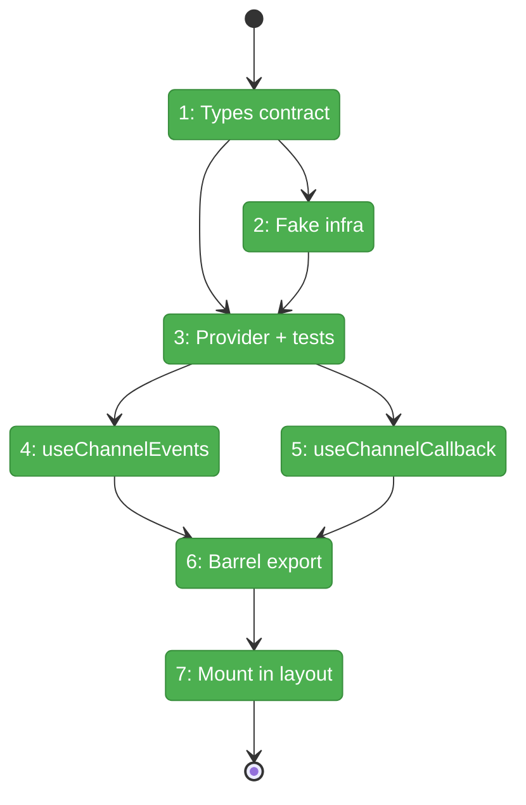
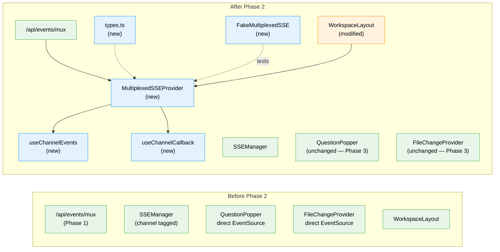

# Flight Plan: Phase 2 — Client Provider + Hooks

**Plan**: [../../sse-multiplexing-plan.md](../../sse-multiplexing-plan.md)
**Phase**: Phase 2: Client Provider + Hooks
**Generated**: 2026-03-08
**Status**: Landed

---

## Departure → Destination

**Where we are**: Phase 1 delivered a working `/api/events/mux` endpoint that accepts multi-channel subscriptions and broadcasts events tagged with `channel` fields. All 29 Phase 1 tests pass. The server is live and waiting for a client consumer. Currently, each tab still opens 2+ individual EventSource connections (no client-side mux yet).

**Where we're going**: A developer can wrap any component tree in `<MultiplexedSSEProvider channels={[...]}>` and use `useChannelEvents('channel')` or `useChannelCallback('channel', cb)` to receive per-channel events from the single mux connection. The workspace layout has the provider mounted, creating exactly ONE EventSource per tab. Phase 3 consumers can migrate by swapping their direct EventSource for a hook call.

---

## Domain Context

### Domains We're Changing

| Domain | What Changes | Key Files |
|--------|-------------|-----------|
| `_platform/events` | New provider, hooks, types, fake, barrel export | `apps/web/src/lib/sse/*`, `test/fakes/fake-multiplexed-sse.ts` |
| cross-domain (layout) | Mount MultiplexedSSEProvider | `apps/web/app/(dashboard)/workspaces/[slug]/layout.tsx` |

### Domains We Depend On (no changes)

| Domain | What We Consume | Contract |
|--------|----------------|----------|
| `_platform/events` | `/api/events/mux` endpoint | Phase 1 route (auth, channels query, SSE stream) |
| `_platform/events` | `ServerEvent` type | `{ type: string; channel?: string; [key: string]: unknown }` |
| `_platform/events` | `FakeEventSource` + factory | `test/fakes/fake-event-source.ts` |
| `_platform/events` | `EventSourceFactory` type | `apps/web/src/hooks/useSSE.ts` |

---

## Flight Status

<!-- Updated by /plan-6-v2: pending → active → done. Use blocked for problems/input needed. -->

**Legend**: grey = pending | yellow = active | red = blocked/needs input | green = done

---

## Stages

<!-- Updated by /plan-6-v2 during implementation: [ ] → [~] → [x] -->

- [x] **Stage 1: Define contracts** — Create `types.ts` with `MultiplexedSSEMessage`, `MultiplexedSSEContextValue`, `EventSourceFactory` (`apps/web/src/lib/sse/types.ts` — new file)
- [x] **Stage 2: Build test fake** — Create `FakeMultiplexedSSE` wrapping `FakeEventSource` with `simulateChannelMessage()` (`test/fakes/fake-multiplexed-sse.ts` — new file)
- [x] **Stage 3: TDD Provider** — Write provider contract tests (RED), then implement `MultiplexedSSEProvider` (GREEN) with subscribe/demux/reconnect/cleanup (`apps/web/src/lib/sse/multiplexed-sse-provider.tsx` — new file)
- [~] **Stage 4: TDD useChannelEvents** — Write hook tests (RED), then implement accumulation hook (GREEN) with independent arrays + maxMessages (`apps/web/src/lib/sse/use-channel-events.ts` — new file)
- [ ] **Stage 5: TDD useChannelCallback** — Write hook tests (RED), then implement callback hook (GREEN) with stable ref pattern (`apps/web/src/lib/sse/use-channel-callback.ts` — new file)
- [x] **Stage 6: Barrel export** — Create `index.ts` re-exporting provider, hooks, types (`apps/web/src/lib/sse/index.ts` — new file)
- [x] **Stage 7: Mount in layout** — Add `MultiplexedSSEProvider` to workspace layout wrapping `ActivityLogOverlayWrapper` and below (`layout.tsx` — modify)

---

## Architecture: Before & After

**Legend**: existing (green, unchanged) | changed (orange, modified) | new (blue, created)

---

## Acceptance Criteria

- [ ] AC-11: MultiplexedSSEProvider creates exactly ONE EventSource connection
- [ ] AC-12: Provider demultiplexes events by `msg.channel` to channel-specific subscribers
- [ ] AC-13: Provider isolates subscriber errors (one throwing doesn't affect others)
- [ ] AC-14: Provider reconnects with exponential backoff (max 15 attempts, 2s–15s)
- [ ] AC-15: Provider cleans up EventSource on unmount
- [ ] AC-16: Provider exposes `isConnected` and `error` state to consumers
- [ ] AC-17: `useChannelEvents(channel)` accumulates messages for subscribed channel only
- [ ] AC-18: `useChannelCallback(channel, callback)` fires callback per event without accumulation
- [ ] AC-19: Both hooks ignore events from other channels
- [ ] AC-20: Provider is testable via injected EventSourceFactory (zero vi.mock)

## Goals & Non-Goals

**Goals**:
- One EventSource per workspace tab
- Per-channel demux to subscriber hooks
- Error isolation + reconnection
- Testable via fakes (zero vi.mock)
- Ready for Phase 3 consumer migration

**Non-Goals**:
- Migrating any consumer (Phase 3-5)
- Dynamic channel subscription
- Visibility-based optimization
- Server-side changes

---

## Checklist

- [x] T001: Define SSE multiplexing contracts in `types.ts`
- [x] T002: Create FakeMultiplexedSSE test utility
- [x] T003: Create MultiplexedSSEProvider + contract tests (TDD)
- [x] T004: Create useChannelEvents hook + tests (TDD)
- [x] T005: Create useChannelCallback hook + tests (TDD)
- [x] T006: Create barrel export `index.ts`
- [x] T007: Mount MultiplexedSSEProvider in workspace layout
