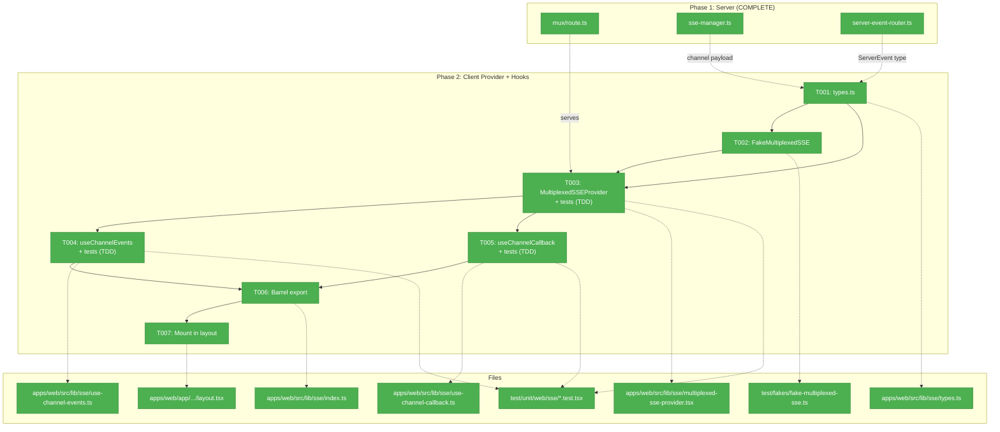
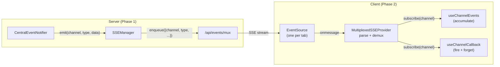
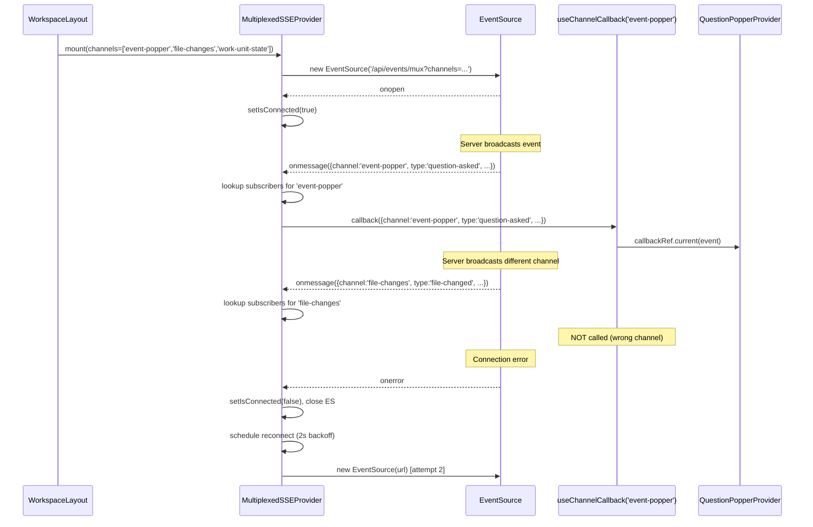

# Phase 2: Client Provider + Hooks — Task Dossier

**Plan**: [sse-multiplexing-plan.md](../../sse-multiplexing-plan.md)
**Phase**: Phase 2: Client Provider + Hooks
**Generated**: 2026-03-08
**Domain**: `_platform/events`

---

## Executive Briefing

**Purpose**: Create the client-side multiplexed SSE infrastructure — a single React context provider that connects to the Phase 1 `/api/events/mux` endpoint and demultiplexes events by channel to per-channel consumer hooks. This is the bridge between the server-side mux route and the consumer migration in Phases 3-5.

**What We're Building**: `MultiplexedSSEProvider` (React context wrapping one `EventSource`), `useChannelEvents` (message accumulation hook), `useChannelCallback` (notification-fetch hook), `FakeMultiplexedSSE` (test infrastructure), and the workspace layout mount point.

**Goals**:
- ✅ One `EventSource` connection per workspace tab via `MultiplexedSSEProvider`
- ✅ Per-channel subscription via `useChannelEvents` (accumulation) and `useChannelCallback` (callback)
- ✅ Error isolation — one subscriber throwing doesn't affect others
- ✅ Reconnection with exponential backoff (15 attempts, 2s–15s)
- ✅ Testable via `FakeMultiplexedSSE` — zero `vi.mock()`
- ✅ Mounted in workspace layout, ready for Phase 3 consumer migration

**Non-Goals**:
- ❌ Migrating any existing consumer (Phase 3-5)
- ❌ Dynamic channel subscription after connection (static channel list)
- ❌ Visibility-based disconnect/reconnect (future optimization)
- ❌ Server-side changes (Phase 1 complete)
- ❌ Modifying useSSE hook or existing EventSource consumers

---

## Prior Phase Context

### Phase 1: Server Foundation (COMPLETE)

**A. Deliverables**:
- `/apps/web/app/api/events/mux/route.ts` — Multiplexed SSE endpoint with auth, validation, multi-channel registration, 15s heartbeat, atomic cleanup
- `/apps/web/src/lib/sse-manager.ts` — Added `channel: channelId` to broadcast() payload; added `removeControllerFromAllChannels()` method
- `/apps/web/src/lib/state/server-event-router.ts` — Extended `ServerEvent` with optional `channel?: string`
- `/test/unit/web/api/events-mux-route.test.ts` — 10 route contract tests
- `/test/unit/web/services/sse-manager.test.ts` — Extended to 19 tests (9 new)

**B. Dependencies Exported**:
- `handleMuxRequest(request, deps?: MuxDeps)` — injectable seam for testing
- `MuxDeps { authFn, manager }` — dependency injection interface
- `HEARTBEAT_INTERVAL = 15_000`, `MAX_CHANNELS = 20`, `CHANNEL_PATTERN = /^[a-zA-Z0-9_-]+$/`
- `SSEManager.removeControllerFromAllChannels(controller): string[]`
- `ServerEvent { type: string; channel?: string; [key: string]: unknown }`
- `sseManager` singleton (globalThis, HMR-safe)

**C. Gotchas & Debt**:
- AbortSignal not testable in jsdom (realm mismatch) — cleanup verified at SSEManager level
- Channel field is authoritative — SSEManager overwrites any caller-provided `channel` in broadcast()
- HMR stale controllers: handled by two-layer cleanup (abort + heartbeat catch)
- No reverse index for removeControllerFromAllChannels (O(channels) scan, ~6 channels, acceptable)

**D. Patterns to Follow**:
- Injectable deps pattern (not vi.mock) — `MuxDeps` for route, `EventSourceFactory` for client
- Snapshot before iterate (`Array.from()` on Sets/Maps)
- Unnamed SSE events with channel in JSON payload (PL-02)
- `FakeController` and `FakeEventSource` patterns from `test/fakes/`
- `createFakeEventSourceFactory()` with `lastInstance` and `instanceCount` tracking
- `export const dynamic = 'force-dynamic'` on streaming routes

**E. Incomplete Items**: None. Phase 1 fully complete with 0 blockers.

---

## Pre-Implementation Check

| File | Exists? | Domain Check | Notes |
|------|---------|-------------|-------|
| `apps/web/src/lib/sse/types.ts` | ❌ Create | `_platform/events` ✅ | New contracts file |
| `apps/web/src/lib/sse/multiplexed-sse-provider.tsx` | ❌ Create | `_platform/events` ✅ | Core provider |
| `apps/web/src/lib/sse/use-channel-events.ts` | ❌ Create | `_platform/events` ✅ | Accumulation hook |
| `apps/web/src/lib/sse/use-channel-callback.ts` | ❌ Create | `_platform/events` ✅ | Callback hook |
| `apps/web/src/lib/sse/index.ts` | ❌ Create | `_platform/events` ✅ | Barrel export |
| `test/fakes/fake-multiplexed-sse.ts` | ❌ Create | `_platform/events` ✅ | Test infrastructure |
| `test/unit/web/sse/multiplexed-sse-provider.test.tsx` | ❌ Create | `_platform/events` ✅ | Provider tests |
| `test/unit/web/sse/use-channel-hooks.test.tsx` | ❌ Create | `_platform/events` ✅ | Hook tests |
| `apps/web/app/(dashboard)/workspaces/[slug]/layout.tsx` | ✅ Modify | cross-domain ✅ | Add provider wrapper |
| `test/fakes/index.ts` | ✅ Modify | N/A | Add barrel export for new fake |

**Directory creation needed**: `apps/web/src/lib/sse/` and `test/unit/web/sse/` do not exist.

**Concept search**: No existing multiplexed SSE provider or channel demux component in codebase. Phase 2 is greenfield. The server half (`/api/events/mux`) from Phase 1 is live and ready.

**Harness**: Not applicable (user override — transport layer change; unit tests sufficient).

---

## Architecture Map



---

## Tasks

| Status | ID | Task | Domain | Path(s) | Done When | Notes |
|--------|-----|------|--------|---------|-----------|-------|
| [x] | T001 | Define SSE multiplexing contracts in `types.ts` | `_platform/events` | `apps/web/src/lib/sse/types.ts` | Exports `MultiplexedSSEMessage` (channel + type + data), `MultiplexedSSEContextValue` (subscribe, isConnected, error), `EventSourceFactory` type. All contracts defined before implementations. | Constitution P2: interface-first. Re-export `EventSourceFactory` from useSSE.ts or redefine (avoid circular). |
| [x] | T002 | Create FakeMultiplexedSSE test utility | `_platform/events` | `test/fakes/fake-multiplexed-sse.ts`, `test/fakes/index.ts` | `createFakeMultiplexedSSEFactory()` returns factory + `simulateChannelMessage(channel, type, data)`, `simulateOpen()`, `simulateError()`. Wraps FakeEventSource. Exported from barrel. | TDD infrastructure first. Follow `createFakeEventSourceFactory()` pattern. |
| [x] | T003 | Create MultiplexedSSEProvider + contract tests (TDD) | `_platform/events` | `apps/web/src/lib/sse/multiplexed-sse-provider.tsx`, `test/unit/web/sse/multiplexed-sse-provider.test.tsx` | Provider creates ONE EventSource to `/api/events/mux?channels=...`. Demuxes by `msg.channel`. Subscribe/unsubscribe per channel. Error isolation per callback (try/catch). Reconnect with exponential backoff (15 attempts, 2s–15s). Cleans up on unmount. Tests: connection URL, channel routing, error isolation, reconnect, unmount cleanup, `isConnected`/`error` state. | AC-11 through AC-16, AC-20. Finding 05 (raise to 15 attempts). Write tests first (RED), then implement (GREEN). |
| [x] | T004 | Create useChannelEvents hook + tests (TDD) | `_platform/events` | `apps/web/src/lib/sse/use-channel-events.ts`, `test/unit/web/sse/use-channel-hooks.test.tsx` | Returns `{ messages: T[], isConnected, clearMessages }`. Own independent message array per subscriber. Respects `maxMessages` (default 1000, 0 = unlimited). Only accumulates events matching subscribed channel. Tests: accumulation, channel filtering, maxMessages pruning, clearMessages, independent arrays. | AC-17, AC-19. Finding 06 (cursor compat — independent arrays). |
| [x] | T005 | Create useChannelCallback hook + tests (TDD) | `_platform/events` | `apps/web/src/lib/sse/use-channel-callback.ts`, `test/unit/web/sse/use-channel-hooks.test.tsx` | Fires callback per event. No accumulation. Stable ref pattern (`callbackRef.current = callback`). Returns `{ isConnected }`. Tests: callback fires, channel filtering, stable ref (no re-subscribe on callback change). | AC-18, AC-19. Notification-fetch pattern for QuestionPopper/FileChange. |
| [x] | T006 | Create barrel export `index.ts` | `_platform/events` | `apps/web/src/lib/sse/index.ts` | Exports: `MultiplexedSSEProvider`, `useChannelEvents`, `useChannelCallback`, all types from `types.ts`. Clean public API. | Simple aggregation. |
| [x] | T007 | Mount MultiplexedSSEProvider in workspace layout | cross-domain | `apps/web/app/(dashboard)/workspaces/[slug]/layout.tsx` | Provider wraps `ActivityLogOverlayWrapper` and all children. Static channels: `['event-popper', 'file-changes', 'work-unit-state']` as const outside component. All existing tests pass. | Layout is Server Component — provider is Client Component (use `'use client'` in provider, import as child). Must be above both Activity and QuestionPopper for Phase 3 migration. |

---

## Context Brief

### Key Findings from Plan

- **Finding 05** (HIGH): FileChangeProvider has 50-attempt reconnection. MultiplexedSSEProvider defaults to 5 in workshop sketch. **Action**: Raise default to 15 attempts with exponential backoff (2s base, 15s cap). Make `maxReconnectAttempts` configurable via prop.
- **Finding 06** (HIGH): ServerEventRoute uses index-based cursor with `maxMessages: 0`. `useChannelEvents` MUST return an independent array per subscriber — not a shared array reference. Each hook invocation gets its own `useState<T[]>([])`. **Action**: Verify independent arrays in TDD test.
- **Finding 07** (HIGH): Dual-route risk during migration. Phase 2 mounts the provider but no consumers migrate yet. Both old EventSource connections and the new mux connection will be active simultaneously. **Action**: This is expected and harmless in Phase 2 — adds 1 connection but doesn't remove any. Phase 3 removes old connections.
- **Finding 08** (HIGH): No `apps/web/src/lib/sse/` directory. **Action**: Create it in T001.

### Domain Dependencies

- `_platform/events`: SSEManager broadcast payload (`{ channel, type, ...data }`) — consumed by provider's `onmessage` parser
- `_platform/events`: `/api/events/mux?channels=...` route (Phase 1) — provider connects here
- `_platform/events`: `ServerEvent { type: string; channel?: string }` — extended type from `server-event-router.ts`
- `_platform/events`: `FakeEventSource` + `createFakeEventSourceFactory()` from `test/fakes/` — wrapped by FakeMultiplexedSSE
- `_platform/events`: `EventSourceFactory` type from `useSSE.ts` — reuse or redefine in `types.ts`
- `_platform/events`: `WorkspaceDomain` const from `packages/shared` — channel name constants (reference only, not imported by provider)

### Domain Constraints

- All new files go in `apps/web/src/lib/sse/` (DEV-01: React hooks are browser-specific, not shared)
- No `vi.mock()` — use injected `EventSourceFactory` (Constitution P4)
- Type names use `type` keyword without `I` prefix (DEV-02: data shapes, not service interfaces)
- Provider is `'use client'` — Server Component layout imports it as a child boundary

### Reusable from Phase 1

- `FakeEventSource` class + `createFakeEventSourceFactory()` — wrap for channel-aware simulation
- `FakeController` from `test/fakes/fake-controller.ts` — not needed client-side but pattern reference
- Injectable deps pattern — `EventSourceFactory` prop on provider
- Test documentation pattern (5-field: Why, Contract, Usage Notes, Quality Contribution, Worked Example)

### WorkspaceDomain Channel Names (canonical)

```typescript
WorkspaceDomain.EventPopper = 'event-popper'
WorkspaceDomain.FileChanges = 'file-changes'
WorkspaceDomain.WorkUnitState = 'work-unit-state'
WorkspaceDomain.Workflows = 'workflows'
WorkspaceDomain.Agents = 'agents'
WorkspaceDomain.UnitCatalog = 'unit-catalog'
```

Static channel list for Phase 2 mount: `['event-popper', 'file-changes', 'work-unit-state']`

### Mermaid Flow Diagram



### Mermaid Sequence Diagram



---

## Discoveries & Learnings

_Populated during implementation by plan-6._

| Date | Task | Type | Discovery | Resolution | References |
|------|------|------|-----------|------------|------------|
| 2026-03-08 | T003 | Gotcha | Workshop onmessage iterates subscriber Set directly — callback could trigger synchronous unmount → unsubscribe → Set mutation during iteration | Snapshot subscribers with `Array.from(channelSubs)` before dispatch loop. Add code comment referencing PL-01 (iterator invalidation, Plan 005). | PL-01, Phase 1 SSEManager pattern |
| 2026-03-08 | T007 | Decision | Phase 2 adds a 3rd EventSource per tab (mux) without removing existing 2 (QuestionPopper, FileChange). Temporarily worsens connection pressure (3/tab vs 2/tab). | Accepted — transient. Phase 3 removes old connections. Phases 2+3 are tightly coupled; ship close together. | Finding 07, HTTP/1.1 6-conn limit |
| 2026-03-08 | T003 | Decision | Workshop backoff formula is linear (`2000 * attempts`), plan says exponential. Existing FileChangeProvider uses true exponential (`2^(attempt-1)`). | Use true exponential with jitter: `Math.min(2000 * 2**(attempt-1), 15000) + Math.random() * 1000`. Prevents thundering herd when multiple tabs reconnect simultaneously. | FileChangeProvider pattern, workshop line ~341 |
| 2026-03-08 | T003 | Gotcha | Workspace layout is Server Component; channels array prop serialized across RSC boundary creates new reference on every render. If provider useMemo uses `[channels]` dep, EventSource reconnects on every navigation. | Memoize URL by content: `channels.join(',')` as memo key, not array reference. Cheap string comparison, bulletproof against RSC serialization. | RSC boundary, useMemo deps |
| 2026-03-08 | T001 | Decision | `EventSourceFactory` type exists in `useSSE.ts` (line 16) but is not imported by any production code outside that file. Importing from useSSE would create dependency from new module on old one being superseded. | Redefine identical one-line type in `types.ts`. Intentional separation — no cross-module coupling. Verified: zero imports of the type in production code. | useSSE.ts line 16, grep verification |

---

## Directory Layout

```
docs/plans/072-sse-multiplexing/
  ├── sse-multiplexing-plan.md
  ├── sse-multiplexing-spec.md
  ├── research-dossier.md
  ├── workshops/
  │   └── 001-multiplexer-design.md
  └── tasks/
      ├── phase-1-server-foundation/
      │   ├── tasks.md
      │   ├── tasks.fltplan.md
      │   ├── execution.log.md
      │   └── reviews/
      └── phase-2-client-provider-hooks/
          ├── tasks.md              ← this file
          ├── tasks.fltplan.md
          └── execution.log.md      # created by plan-6
```
