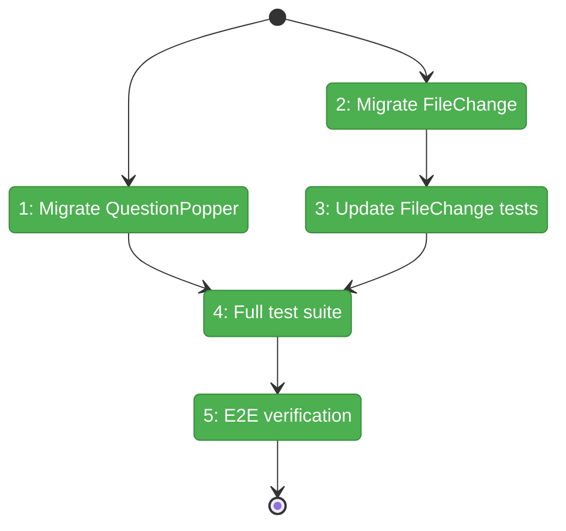
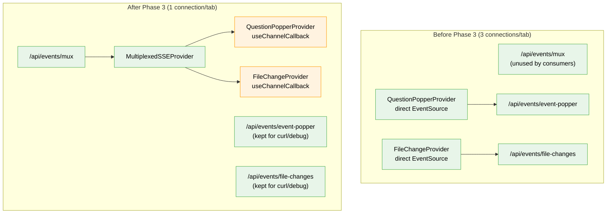

# Flight Plan: Phase 3 — Priority Consumer Migration

**Plan**: [../../sse-multiplexing-plan.md](../../sse-multiplexing-plan.md)
**Phase**: Phase 3: Priority Consumer Migration
**Generated**: 2026-03-08
**Status**: Landed

---

## Departure → Destination

**Where we are**: Phase 1 delivered the `/api/events/mux` server endpoint. Phase 2 delivered `MultiplexedSSEProvider` + consumer hooks, mounted in the workspace layout. But the two main consumers (QuestionPopper, FileChange) still open their own direct EventSource connections, so each tab has 3 SSE connections (worse than before).

**Where we're going**: Both consumers use `useChannelCallback` from the multiplexed provider. ~200 lines of duplicated SSE lifecycle boilerplate removed. Each tab drops from 3 SSE connections to 1. The HTTP/1.1 connection pressure bug is fixed — 6+ tabs can coexist without lockup.

---

## Domain Context

### Domains We're Changing

| Domain | What Changes | Key Files |
|--------|-------------|-----------|
| `question-popper` | Replace direct EventSource with `useChannelCallback('event-popper')` | `apps/web/src/features/067-question-popper/hooks/use-question-popper.tsx` |
| `file-browser` | Replace direct EventSource with `useChannelCallback('file-changes')`, remove `eventSourceFactory` prop | `apps/web/src/features/045-live-file-events/file-change-provider.tsx`, `test/.../use-file-changes.test.tsx`, `test/.../use-tree-directory-changes.test.tsx` |

### Domains We Depend On (no changes)

| Domain | What We Consume | Contract |
|--------|----------------|----------|
| `_platform/events` | `useChannelCallback(channel, cb)` | Returns `{ isConnected }`, fires cb per event |
| `_platform/events` | `MultiplexedSSEProvider` | Already mounted in workspace layout |
| `_platform/events` | `WorkspaceDomain.FileChanges` | Channel name constant |

---

## Flight Status

**Legend**: grey = pending | yellow = active | red = blocked/needs input | green = done

---

## Stages

- [~] **Stage 1: Migrate QuestionPopperProvider** — Replace ~110 lines of EventSource lifecycle with `useChannelCallback('event-popper', ...)` (`use-question-popper.tsx`)
- [~] **Stage 2: Migrate FileChangeProvider** — Replace ~110 lines of EventSource lifecycle with `useChannelCallback('file-changes', ...)`, remove `eventSourceFactory` prop (`file-change-provider.tsx`)
- [ ] **Stage 3: Update FileChange tests** — Wrap in `MultiplexedSSEProvider` with `FakeMultiplexedSSE`, replace `FakeEventSource` simulation (`use-file-changes.test.tsx`, `use-tree-directory-changes.test.tsx`)
- [ ] **Stage 4: Full test suite** — Verify `pnpm test` passes with 0 failures
- [x] **Stage 5: E2E verification** — Question popper round-trip, file change detection, single SSE connection in DevTools

---

## Architecture: Before & After

**Legend**: green = existing/unchanged | orange = modified | red = removed

---

## Acceptance Criteria

- [ ] AC-21: QuestionPopperProvider uses multiplexed channel
- [ ] AC-22: FileChangeProvider uses multiplexed channel
- [ ] AC-23: FileChangeHub + useFileChanges API unchanged
- [ ] AC-27: Workspace tab opens exactly 1 SSE connection
- [ ] AC-29: Question popper end-to-end works
- [ ] AC-30: File changes end-to-end works
- [ ] AC-31: All existing tests pass

## Goals & Non-Goals

**Goals**:
- Both priority consumers use multiplexed SSE
- ~200 lines of SSE boilerplate removed
- Per-tab connections: 3 → 1
- All existing consumer APIs unchanged

**Non-Goals**:
- Migrating ServerEventRoute, workflows, or agents
- Changing consumer business logic
- Adding new features

---

## Checklist

- [x] T001: Migrate QuestionPopperProvider to useChannelCallback
- [x] T002: Migrate FileChangeProvider to useChannelCallback
- [x] T003: Update FileChangeProvider tests for multiplexed SSE
- [x] T004: Verify all existing tests pass
- [x] T005: E2E verification (manual)
