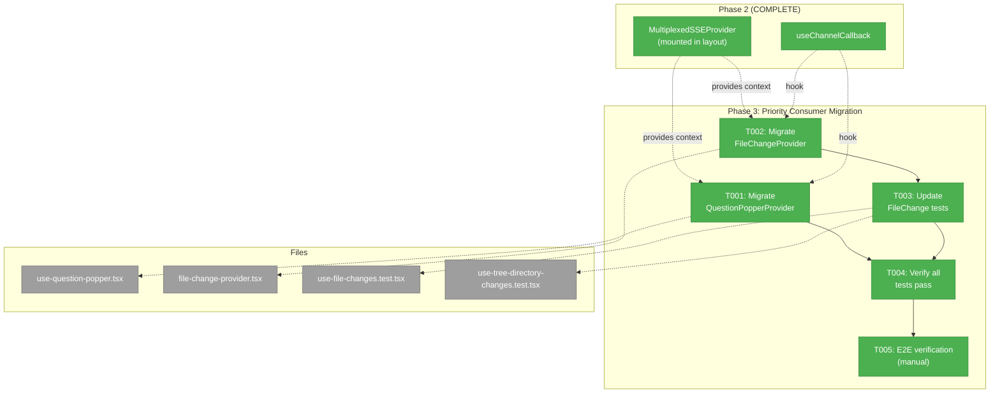
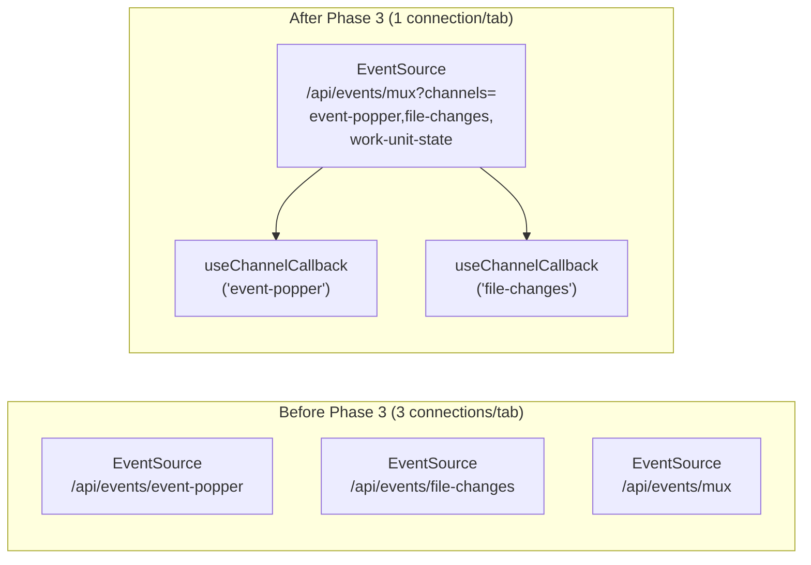
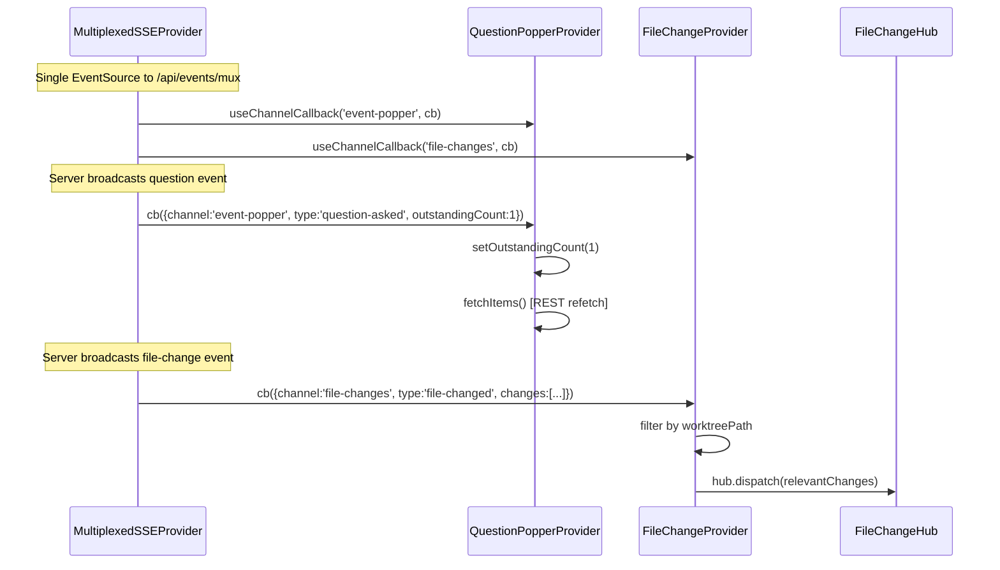

# Phase 3: Priority Consumer Migration — Task Dossier

**Plan**: [sse-multiplexing-plan.md](../../sse-multiplexing-plan.md)
**Phase**: Phase 3: Priority Consumer Migration
**Generated**: 2026-03-08
**Domain**: `question-popper`, `file-browser`

---

## Executive Briefing

**Purpose**: Migrate the two highest-priority SSE consumers — QuestionPopperProvider and FileChangeProvider — from direct EventSource connections to the multiplexed `useChannelCallback` hook. This removes ~200 lines of duplicated SSE lifecycle code and, critically, drops per-tab SSE connections from 3 back to 1. This is the phase that delivers the actual connection-count fix.

**What We're Building**: Replacing the direct EventSource management in both providers with single `useChannelCallback` hook calls. All business logic (notification-fetch, worktreePath filtering, hub dispatch) stays identical. The providers become thin callback wrappers around the multiplexed infrastructure.

**Goals**:
- ✅ QuestionPopperProvider uses `useChannelCallback('event-popper')` instead of direct EventSource
- ✅ FileChangeProvider uses `useChannelCallback('file-changes')` instead of direct EventSource
- ✅ Remove ~200 lines of duplicated SSE lifecycle boilerplate
- ✅ Drop per-tab SSE connections from 3 → 1 (fixes the HTTP/1.1 connection pressure regression)
- ✅ All consumer APIs (`useQuestionPopper`, `useFileChanges`, `useSSEConnectionState`) unchanged
- ✅ All existing tests pass

**Non-Goals**:
- ❌ Changing business logic in either consumer
- ❌ Changing the public hook APIs consumed by other components
- ❌ Migrating ServerEventRoute or GlobalStateConnector (Phase 4)
- ❌ Migrating workflow or agent SSE (Phase 5)
- ❌ Adding new features or changing consumer behavior

---

## Prior Phase Context

### Phase 1: Server Foundation (COMPLETE)

**Deliverables**: `/api/events/mux` route, `channel` field in SSEManager.broadcast(), `removeControllerFromAllChannels()`, extended `ServerEvent` type.

**Dependencies Exported**: `handleMuxRequest(request, deps?)`, `MuxDeps`, `HEARTBEAT_INTERVAL=15000`, `MAX_CHANNELS=20`, `CHANNEL_PATTERN`.

**Patterns**: Injectable deps (MuxDeps), snapshot-before-iterate (PL-01), unnamed SSE events with channel in JSON (PL-02), two-layer cleanup.

### Phase 2: Client Provider + Hooks (COMPLETE)

**Deliverables**: `MultiplexedSSEProvider`, `useChannelEvents`, `useChannelCallback`, `FakeMultiplexedSSE`, barrel export, mounted in workspace layout.

**Dependencies Exported**:
- `useChannelCallback(channel, callback) → { isConnected }` — what Phase 3 consumers will use
- `useChannelEvents(channel, options?) → { messages, isConnected, clearMessages }` — for Phase 4
- `MultiplexedSSEProvider` already mounted in layout above both consumers
- `createFakeMultiplexedSSEFactory()` — for test updates

**Gotchas**:
- Phase 2 added a 3rd EventSource per tab (mux) without removing old ones — Phase 3 fixes this
- `useChannelCallback` returns `{ isConnected: boolean }` — FileChangeProvider needs to map this to `SSEConnectionState` ('connected' | 'disconnected')
- `useChannelCallback` uses stable ref pattern — callback can change without re-subscription
- Provider must be above consumer in component tree (already confirmed in layout)

**Patterns**: `FakeMultiplexedSSE.simulateChannelMessage()` for test simulation, `act()` wrapping required.

---

## Pre-Implementation Check

| File | Exists? | Domain Check | Notes |
|------|---------|-------------|-------|
| `apps/web/src/features/067-question-popper/hooks/use-question-popper.tsx` | ✅ Modify | `question-popper` ✅ | Remove ~110 lines EventSource lifecycle, add useChannelCallback |
| `apps/web/src/features/045-live-file-events/file-change-provider.tsx` | ✅ Modify | `file-browser` ✅ | Remove ~110 lines EventSource lifecycle, remove eventSourceFactory prop, add useChannelCallback |
| `test/unit/web/features/045-live-file-events/use-file-changes.test.tsx` | ✅ Modify | `file-browser` ✅ | Wrap in MultiplexedSSEProvider, replace FakeEventSource with FakeMultiplexedSSE |
| `test/unit/web/features/045-live-file-events/use-tree-directory-changes.test.tsx` | ✅ Modify | `file-browser` ✅ | Same treatment as use-file-changes.test.tsx |

**Concept search**: Not needed — no new concepts being created. This is a mechanical transport swap.

**Harness**: Not applicable (user override).

---

## Architecture Map



---

## Tasks

| Status | ID | Task | Domain | Path(s) | Done When | Notes |
|--------|-----|------|--------|---------|-----------|-------|
| [x] | T001 | Migrate QuestionPopperProvider to useChannelCallback | `question-popper` | `apps/web/src/features/067-question-popper/hooks/use-question-popper.tsx` | Replace direct EventSource (~110 lines) with `useChannelCallback('event-popper', ...)`. notification-fetch pattern preserved. `outstandingCount` + `fetchItems()` logic unchanged. `isConnected` state derived from hook return. All existing tests pass. | AC-21. Lightweight — mechanical transport swap. Remove: eventSourceRef, reconnectTimeoutRef, reconnectAttemptsRef, connectSSE, disconnectSSE, SSE lifecycle useEffect. Keep: mountedRef for action methods, fetchItems, all overlay/action logic. |
| [x] | T002 | Migrate FileChangeProvider to useChannelCallback | `file-browser` | `apps/web/src/features/045-live-file-events/file-change-provider.tsx` | Replace direct EventSource (~110 lines) with `useChannelCallback(WorkspaceDomain.FileChanges, ...)`. worktreePath filtering + hub.dispatch preserved. `connectionState` derived from `isConnected` boolean. Remove `eventSourceFactory` prop. Remove reconnect constants. All existing tests pass. | AC-22, AC-23. Remove: connect callback, eventSourceRef, reconnectAttemptsRef, reconnectTimerRef, MAX_RECONNECT_ATTEMPTS, RECONNECT_BASE_DELAY, RECONNECT_MAX_DELAY, SSE lifecycle useEffect. Remove eventSourceFactory from props. Keep: hub creation, worktreePath filtering, hub.dispatch, connectionState context. |
| [x] | T003 | Update FileChangeProvider tests for multiplexed SSE | `file-browser` | `test/unit/web/features/045-live-file-events/use-file-changes.test.tsx`, `test/unit/web/features/045-live-file-events/use-tree-directory-changes.test.tsx` | Both test files wrap consumers in `MultiplexedSSEProvider` with `FakeMultiplexedSSE` instead of passing `eventSourceFactory` to `FileChangeProvider`. Use `fake.simulateChannelMessage('file-changes', ...)` instead of direct `fakeES.simulateMessage(...)`. All existing test assertions unchanged. | FileChangeProvider no longer accepts eventSourceFactory prop. Tests must provide multiplexed context via wrapper. ~30 lines changed per test file. |
| [x] | T004 | Verify all existing tests pass | cross-domain | N/A | `pnpm test` — full suite passes. No regressions in question-popper tests (ui-components, api-routes, chain-resolver, cli-commands), file-change tests (hub, use-file-changes, use-tree-directory-changes), or any other tests. | AC-31. Run targeted first (`just test-feature 067 && just test-feature 045`), then full suite. |
| [x] | T005 | E2E verification (manual) | cross-domain | N/A | (1) Question popper: `cg question ask --text "test" --type confirm` → UI notification appears → answer → CLI receives. (2) File changes: edit a file externally → browser tree/activity log shows update. (3) DevTools Network: exactly 1 SSE connection (mux), zero legacy event-popper/file-changes connections. | AC-27, AC-29, AC-30. Manual DevTools verification. |

---

## Context Brief

### Key Findings from Plan

- **Finding 05** (HIGH): FileChangeProvider had 50-attempt reconnection (2s-30s backoff). This resilience is now centralized in MultiplexedSSEProvider (15 attempts, exponential+jitter). The per-consumer reconnection code is removed entirely. **Action**: Delete reconnection constants and logic from FileChangeProvider.
- **Finding 07** (HIGH): Dual-route risk during migration — must remove old EventSource when adding new hook. Never have both active for same channel in same component. **Action**: T001 and T002 each fully remove old EventSource before adding useChannelCallback. No intermediate state where both are active.

### Domain Dependencies

- `_platform/events`: `useChannelCallback(channel, callback)` — subscribe to channel events without accumulation
- `_platform/events`: `MultiplexedSSEProvider` — already mounted in workspace layout, provides context
- `_platform/events`: `MultiplexedSSEMessage` type — `{ channel, type, [key]: unknown }`
- `_platform/events`: `createFakeMultiplexedSSEFactory()` — for test updates
- `_platform/events`: `WorkspaceDomain.FileChanges` — canonical channel name constant

### Domain Constraints

- `question-popper` domain imports from `_platform/events` via `@/lib/sse` barrel — allowed (business → infrastructure ✅)
- `file-browser` domain imports from `_platform/events` via `@/lib/sse` barrel — allowed (business → infrastructure ✅)
- Neither consumer's public API changes — `useQuestionPopper`, `useFileChanges`, `useSSEConnectionState` all return same shapes

### Reusable from Prior Phases

- `createFakeMultiplexedSSEFactory()` from `test/fakes/` — channel-aware simulation
- `FakeEventSource` pattern (still used by other tests, not removed)
- `act()` wrapping pattern for simulated events
- Test Doc 5-field format from Phase 1/2 tests

### Mermaid Flow Diagram



### Mermaid Sequence Diagram



---

## Discoveries & Learnings

_Populated during implementation by plan-6._

| Date | Task | Type | Discovery | Resolution | References |
|------|------|------|-----------|------------|------------|
| 2026-03-08 | T001 | Gotcha | SSE lifecycle useEffect (lines 208-215) also calls fetchItems() on mount. Removing it for useChannelCallback migration also removes initial data load. | Keep a separate `useEffect(() => { fetchItems(); }, [fetchItems])` for initial load. Cleaner separation of concerns — initial fetch vs ongoing subscription. | use-question-popper.tsx lines 208-215 |
| 2026-03-08 | T001/T002 | Decision | `MultiplexedSSEMessage` has `[key: string]: unknown` — domain fields like `outstandingCount` and `changes` typed as `unknown`. | Cast inside callback: `const data = msg as unknown as EventPopperSSEMessage`. Matches existing pattern (both consumers already used `as` casts on JSON.parse). | MultiplexedSSEMessage type, types.ts |
| 2026-03-08 | T002 | Decision | `useSSEConnectionState()` exports 4-state string but has ZERO production consumers. `useChannelCallback` returns boolean `isConnected`. Lossy mapping. | Simplify to `isConnected ? 'connected' : 'disconnected'`. No over-engineering for unobserved granularity. Verified: zero imports outside own module. | file-change-provider.tsx line 175, grep verification |
| 2026-03-08 | T003 | Decision | FileChange tests need two-layer wrapper after migration (`MultiplexedSSEProvider` + `FileChangeProvider`). Affects use-file-changes.test.tsx and use-tree-directory-changes.test.tsx. | Extract reusable `createFileChangeTestWrapper(fake, worktreePath)` helper. Keeps tests DRY. Co-locate in test file or shared helper. | use-file-changes.test.tsx, use-tree-directory-changes.test.tsx |
| 2026-03-08 | T001 | Gotcha | `mountedRef` used 8 times in QuestionPopperProvider — only 3 in SSE code being removed, other 5 guard async REST calls in fetchItems/action methods. | Keep `mountedRef` + its mount/unmount effect. Only remove SSE-specific refs and callbacks. Not SSE boilerplate — it's async safety. | use-question-popper.tsx lines 117, 129, 136, 139 |

---

## Directory Layout

```
docs/plans/072-sse-multiplexing/
  ├── sse-multiplexing-plan.md
  └── tasks/
      ├── phase-1-server-foundation/   (COMPLETE)
      ├── phase-2-client-provider-hooks/ (COMPLETE)
      └── phase-3-priority-consumer-migration/
          ├── tasks.md              ← this file
          ├── tasks.fltplan.md
          └── execution.log.md      # created by plan-6
```
