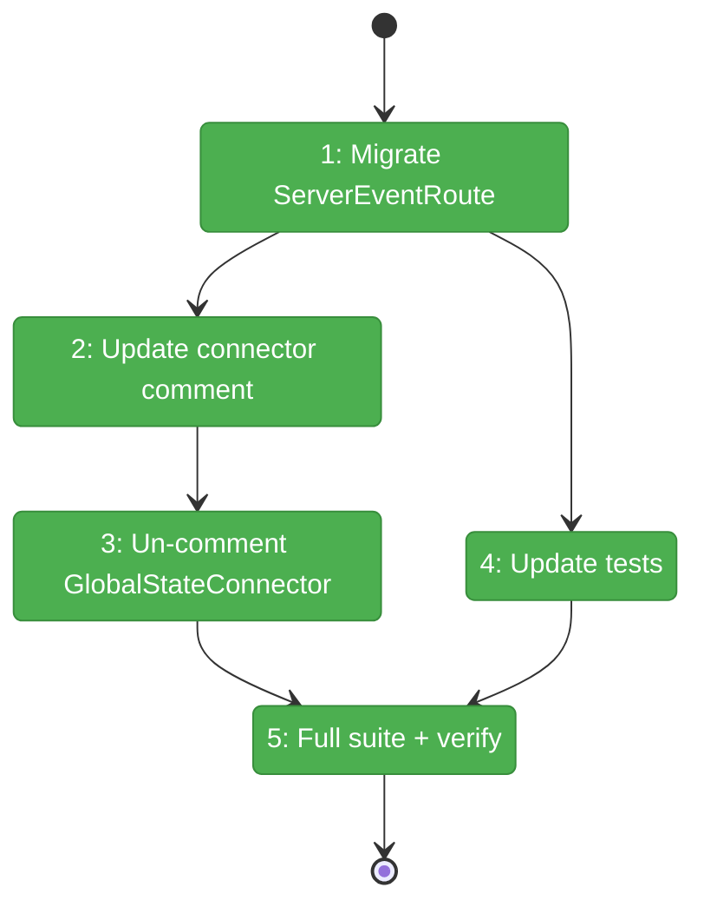
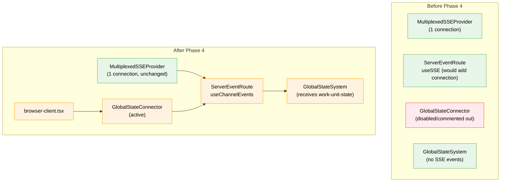

# Flight Plan: Phase 4 — GlobalState Re-enablement

**Plan**: [../../sse-multiplexing-plan.md](../../sse-multiplexing-plan.md)
**Phase**: Phase 4: GlobalState Re-enablement
**Generated**: 2026-03-08
**Status**: Landed

---

## Departure → Destination

**Where we are**: Phases 1-3 delivered the full multiplexed SSE stack — server endpoint, client provider, consumer hooks — and migrated QuestionPopper + FileChange. Per-tab connections are down to 1. But GlobalStateConnector is still disabled (Plan 053 DYK #4) and ServerEventRoute still uses `useSSE` (which would open a 2nd EventSource if mounted).

**Where we're going**: GlobalStateConnector is active. ServerEventRoute consumes from the multiplexed `useChannelEvents('work-unit-state')` — zero additional connections. Work-unit-state events (agent status, workflow pod state) flow through SSE → GlobalStateSystem → `useGlobalState` consumers. The original Plan 053/059 vision is complete.

---

## Domain Context

### Domains We're Changing

| Domain | What Changes | Key Files |
|--------|-------------|-----------|
| `_platform/state` | ServerEventRoute: `useSSE` → `useChannelEvents`. State-connector comment updated. GlobalStateConnector un-commented. | `server-event-route.tsx`, `state-connector.tsx`, `browser-client.tsx` |

### Domains We Depend On (no changes)

| Domain | What We Consume | Contract |
|--------|----------------|----------|
| `_platform/events` | `useChannelEvents(channel, options)` | Returns `{ messages, isConnected, clearMessages }` |
| `_platform/events` | `MultiplexedSSEProvider` | Already mounted, `work-unit-state` already in channel list |

---

## Flight Status

**Legend**: grey = pending | yellow = active | red = blocked/needs input | green = done

---

## Stages

- [x] **Stage 1: Migrate ServerEventRoute** — Replace `useSSE` with `useChannelEvents`, keep index cursor unchanged (`server-event-route.tsx`)
- [x] **Stage 2: Update connector comment** — Replace "future fix" comment with "now active" note (`state-connector.tsx`)
- [x] **Stage 3: Un-comment GlobalStateConnector** — Remove disabled comment, render component (`browser-client.tsx`)
- [x] **Stage 4: Update tests** — Tests are pure logic (DYK #1), no changes needed — verified 11/11 pass (`server-event-route.test.ts`)
- [x] **Stage 5: Full suite + verify** — 5173 passed, 0 failures

---

## Architecture: Before & After

**Legend**: green = existing/unchanged | orange = modified | red = disabled/removed

---

## Acceptance Criteria

- [x] AC-24: GlobalStateConnector re-enabled
- [x] AC-25: ServerEventRoute consumes from multiplexed provider
- [x] AC-26: Work-unit-state events flow through SSE → GlobalStateSystem
- [x] AC-28: 3+ tabs open simultaneously without lockup
- [x] AC-31: All existing tests pass

## Goals & Non-Goals

**Goals**:
- ServerEventRoute on multiplexed hook
- GlobalStateConnector active
- Work-unit-state events in GlobalStateSystem
- Still 1 SSE connection per tab

**Non-Goals**:
- New state routes
- Workflow/agent migration
- GlobalStateSystem changes

---

## Checklist

- [x] T001: Migrate ServerEventRoute to useChannelEvents
- [x] T002: Update state-connector.tsx connection limit comment
- [x] T003: Re-enable GlobalStateConnector in browser-client.tsx
- [x] T004: Update ServerEventRoute tests (no changes needed — DYK #1)
- [x] T005: Verify full test suite + manual smoke test
