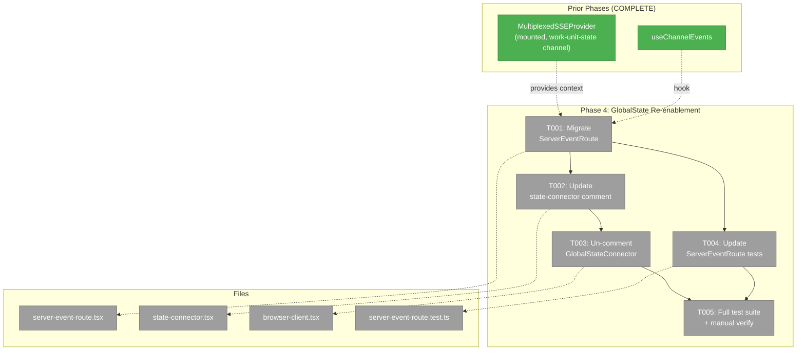
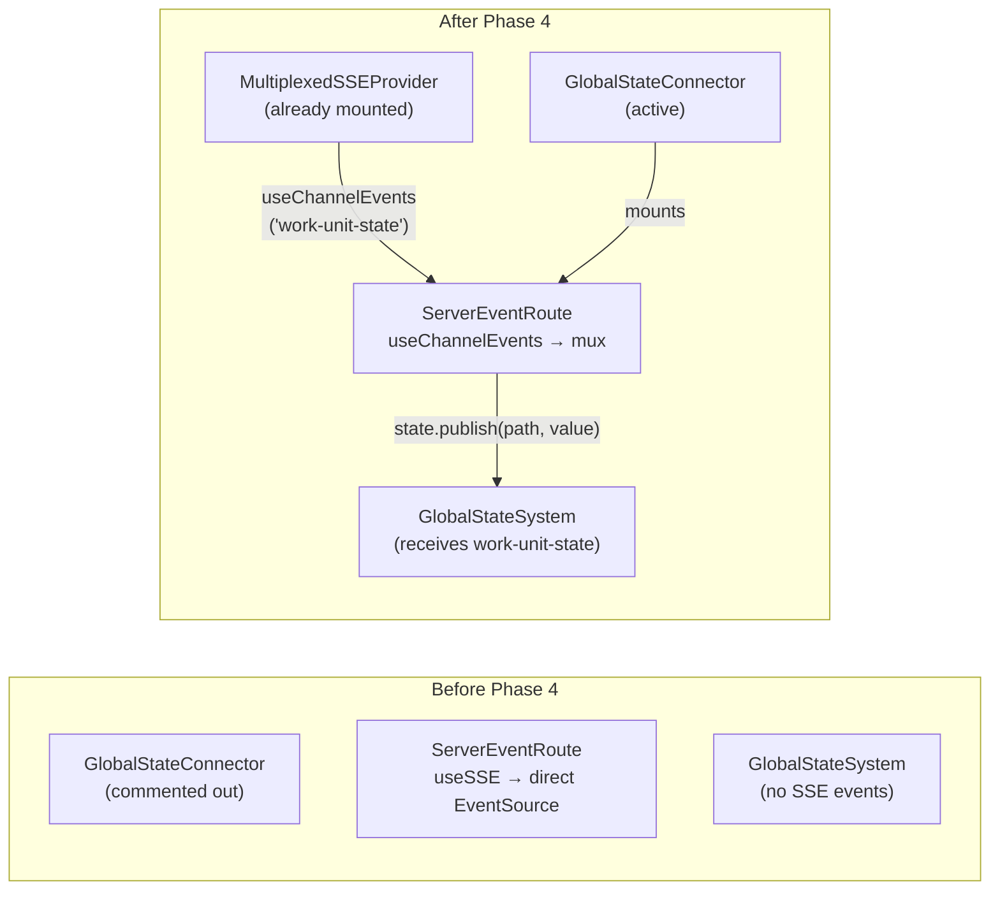
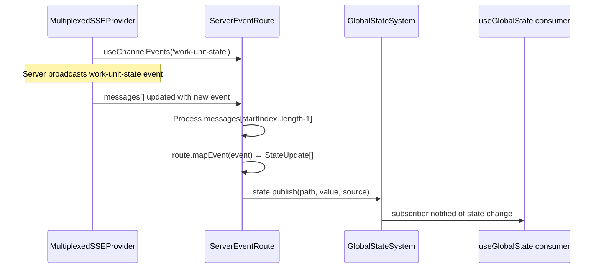

# Phase 4: GlobalState Re-enablement — Task Dossier

**Plan**: [sse-multiplexing-plan.md](../../sse-multiplexing-plan.md)
**Phase**: Phase 4: GlobalState Re-enablement
**Generated**: 2026-03-08
**Domain**: `_platform/state`

---

## Executive Briefing

**Purpose**: Re-enable the GlobalStateConnector that was disabled in Plan 053 due to SSE connection pressure. With the multiplexed SSE infrastructure now in place (Phases 1-3), ServerEventRoute can consume from `useChannelEvents` instead of opening its own EventSource, and GlobalStateConnector can be safely un-commented in browser-client.tsx. This delivers the original Plan 053/059 vision: work-unit-state events flowing through SSE → GlobalStateSystem.

**What We're Building**: Migrating ServerEventRoute from `useSSE` (direct EventSource) to `useChannelEvents` (multiplexed channel), then un-commenting GlobalStateConnector in browser-client.tsx so it actually mounts and bridges SSE events to the state system.

**Goals**:
- ✅ ServerEventRoute consumes from multiplexed `useChannelEvents` instead of per-route `useSSE`
- ✅ GlobalStateConnector re-enabled in browser-client.tsx
- ✅ Work-unit-state events flow through SSE → GlobalStateSystem
- ✅ Zero additional SSE connections (all channels already on the mux stream)
- ✅ Connection limit comment in state-connector.tsx updated — "future fix" is now reality

**Non-Goals**:
- ❌ Adding new state routes (e.g., agentStateRoute) — future work
- ❌ Changing GlobalStateSystem internals
- ❌ Migrating workflow or agent SSE consumers (Phase 5)
- ❌ Adding new state domains

---

## Prior Phase Context

### Phase 1: Server Foundation (COMPLETE)
- **Deliverables**: `/api/events/mux` route, channel tagging in SSEManager, `removeControllerFromAllChannels()`
- **Dependencies Exported**: `ServerEvent { type, channel?, [key] }` — what ServerEventRoute consumes
- **Patterns**: Injectable deps, snapshot-before-iterate

### Phase 2: Client Provider + Hooks (COMPLETE)
- **Deliverables**: `MultiplexedSSEProvider`, `useChannelEvents`, `useChannelCallback`, mounted in workspace layout
- **Dependencies Exported**: `useChannelEvents(channel, { maxMessages? }) → { messages, isConnected, clearMessages }` — direct replacement for `useSSE`
- **Key**: `work-unit-state` already in `WORKSPACE_SSE_CHANNELS` array (layout.tsx), so no channel list change needed
- **Gotcha**: Each `useChannelEvents` invocation gets its own independent array — critical for index cursor compatibility (Finding 06, verified in Phase 2 test)

### Phase 3: Priority Consumer Migration (COMPLETE)
- **Deliverables**: QuestionPopper + FileChange migrated to `useChannelCallback`
- **Key result**: Per-tab connections dropped from 3 → 1. Multiplexed SSE is proven working end-to-end.
- **Patterns**: Cast `MultiplexedSSEMessage` to domain type inside callback, separate initial fetch effect from SSE subscription

---

## Pre-Implementation Check

| File | Exists? | Domain Check | Notes |
|------|---------|-------------|-------|
| `apps/web/src/lib/state/server-event-route.tsx` | ✅ Modify | `_platform/state` ✅ | Replace `useSSE` with `useChannelEvents`. Index cursor logic unchanged. |
| `apps/web/src/lib/state/state-connector.tsx` | ✅ Modify | `_platform/state` ✅ | Update connection limit comment — "future fix" is now implemented. |
| `apps/web/app/(dashboard)/workspaces/[slug]/browser/browser-client.tsx` | ✅ Modify | cross-domain ✅ | Un-comment GlobalStateConnector JSX (import already present, line 42). |
| `test/unit/web/state/server-event-route.test.ts` | ✅ Modify | `_platform/state` ✅ | Update to use `useChannelEvents` instead of `useSSE`. |

**Concept search**: Not needed — no new concepts. Migrating existing ServerEventRoute to existing hook.

**Harness**: Not applicable (user override).

---

## Architecture Map



---

## Tasks

| Status | ID | Task | Domain | Path(s) | Done When | Notes |
|--------|-----|------|--------|---------|-----------|-------|
| [x] | T001 | Migrate ServerEventRoute to useChannelEvents | `_platform/state` | `apps/web/src/lib/state/server-event-route.tsx` | Replace `useSSE('/api/events/${route.channel}', undefined, { maxMessages: 0 })` with `useChannelEvents(route.channel, { maxMessages: 0 })`. Index cursor pattern (`lastProcessedIndexRef`) unchanged. `messages` array is independent per subscriber (Phase 2 Finding 06 — verified). Remove `useSSE` import, add `useChannelEvents` import from `@/lib/sse`. | AC-25. DYK #4: no cast needed — ServerEvent satisfies MultiplexedSSEMessage. |
| [x] | T002 | Update state-connector.tsx connection limit comment | `_platform/state` | `apps/web/src/lib/state/state-connector.tsx` | Replace the "CONNECTION LIMIT NOTE" and "Future fix" comment block (lines 18-32) noting that multiplexed SSE is now active (Plan 072). ServerEventRoute no longer opens its own connection — all channels flow through the single mux EventSource. | Documentation only. The comment was the original breadcrumb for this entire plan. |
| [x] | T003 | Re-enable GlobalStateConnector in browser-client.tsx | cross-domain | `apps/web/app/(dashboard)/workspaces/[slug]/browser/browser-client.tsx` | Add `<GlobalStateConnector>` JSX. Import already present (line 42). Remove the "disabled" comment explaining why it was off. | AC-24, AC-26. DYK #5: was "add JSX" not "un-comment". |
| [x] | T004 | Verify ServerEventRoute tests | `_platform/state` | `test/unit/web/state/server-event-route.test.ts` | DYK #1: Tests are pure logic (processMessages function), don't import useSSE or React. No changes needed. 11/11 pass. | No test migration required. |
| [x] | T005 | Verify full test suite + manual smoke test | cross-domain | N/A | `pnpm test` — 5173 passed, 80 skipped, 0 failures. | AC-28, AC-31. |

---

## Context Brief

### Key Findings from Plan

- **Finding 06** (HIGH): ServerEventRoute uses index-based cursor with `maxMessages: 0`. `useChannelEvents` returns an independent array per subscriber — verified in Phase 2 tests. The cursor pattern works identically because the array is subscriber-local, not shared. **Action**: Swap hook, verify index cursor still processes all messages.
- **Finding 07** (HIGH): Dual-route risk during migration. ServerEventRoute currently uses `useSSE` which opens a direct EventSource to `/api/events/work-unit-state`. After swap to `useChannelEvents`, it consumes from the mux stream. The old route stays available for curl/debug. **Action**: Atomic swap — remove `useSSE` import, add `useChannelEvents` import, change one line.

### Domain Dependencies

- `_platform/events`: `useChannelEvents(channel, options)` — accumulation hook from multiplexed provider
- `_platform/events`: `MultiplexedSSEProvider` — already mounted in layout, `work-unit-state` already in channel list
- `_platform/events`: `MultiplexedSSEMessage` type — what `useChannelEvents` returns (includes `channel`, `type`)
- `_platform/state`: `ServerEventRouteDescriptor` — route descriptor interface (unchanged)
- `_platform/state`: `GlobalStateSystem` — state publishing target (unchanged)
- `_platform/state`: `workUnitStateRoute` — route descriptor for work-unit-state events (unchanged)

### Domain Constraints

- `_platform/state` imports from `_platform/events` via `@/lib/sse` barrel — allowed (infrastructure → infrastructure ✅)
- ServerEventRoute's public contract (props, render behavior) is unchanged
- GlobalStateConnector's public contract (props) is unchanged — just un-commenting the usage

### Reusable from Prior Phases

- `createFakeMultiplexedSSEFactory()` — for test migration
- Two-layer test wrapper pattern from Phase 3 (`MultiplexedSSEProvider` + domain provider)
- `act(() => fakeMux.simulateChannelMessage(...))` simulation pattern

### Pre-done from Phase 2

- `work-unit-state` is already in `WORKSPACE_SSE_CHANNELS` array (layout.tsx line ~26). Plan task 4.2 ("Add 'work-unit-state' to mux channel list") is already complete. No layout changes needed.

### Mermaid Flow Diagram



### Mermaid Sequence Diagram



---

## Discoveries & Learnings

_Populated during implementation by plan-6._

| Date | Task | Type | Discovery | Resolution | References |
|------|------|------|-----------|------------|------------|
| 2026-03-08 | T004 | insight | Tests don't import useSSE or React — pure logic tests via processMessages(). Two-layer wrapper migration not needed. | Reduce T004 to "verify existing tests pass" — no test changes required. | DYK #1 |
| 2026-03-08 | T003 | insight | No useGlobalState('work-unit:...') subscribers exist. Re-enablement publishes events nobody consumes yet. | Accept — infrastructure preparation. Future consumers will subscribe to work-unit paths. | DYK #2 |
| 2026-03-08 | T001 | insight | Three useSSE consumers remain post-Phase 4 (workflow-sse, kanban-content, workunit-catalog-changes). useSSE is not dead code. | No action for Phase 4. Phase 5 assesses migration vs removal. | DYK #3 |
| 2026-03-08 | T001 | insight | ServerEvent structurally satisfies MultiplexedSSEMessage — no double-cast needed. Clean generic: useChannelEvents\<ServerEvent\>(). | Use generic parameter directly. No casting. | DYK #4 |
| 2026-03-08 | T003 | insight | Dossier says "un-comment JSX" but lines 78-81 are a prose comment, not commented-out JSX. Must ADD the element. | Implementation adds GlobalStateConnector JSX and removes explanatory comment. | DYK #5 |

---

## Directory Layout

```
docs/plans/072-sse-multiplexing/
  ├── sse-multiplexing-plan.md
  └── tasks/
      ├── phase-1-server-foundation/       (COMPLETE)
      ├── phase-2-client-provider-hooks/   (COMPLETE)
      ├── phase-3-priority-consumer-migration/ (COMPLETE)
      └── phase-4-globalstate-re-enablement/
          ├── tasks.md              ← this file
          ├── tasks.fltplan.md
          └── execution.log.md      # created by plan-6
```
