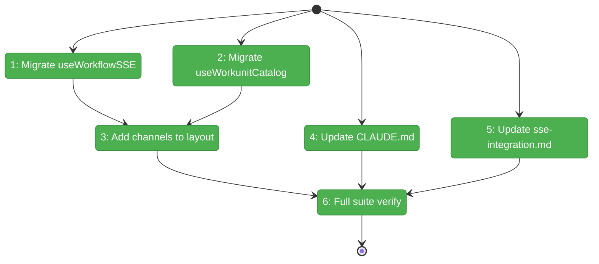
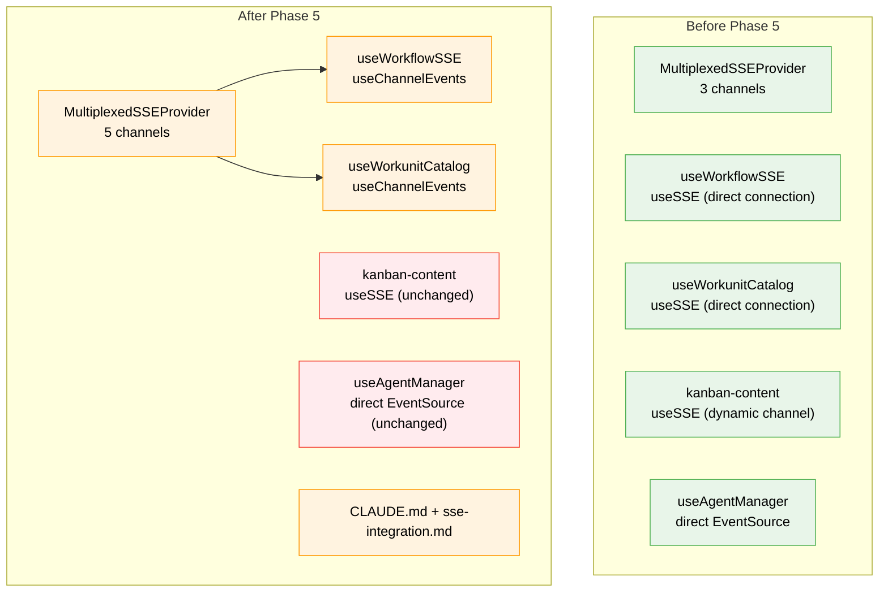

# Flight Plan: Phase 5 — Remaining Migrations + Documentation

**Plan**: [../../sse-multiplexing-plan.md](../../sse-multiplexing-plan.md)
**Phase**: Phase 5: Remaining Migrations + Documentation
**Generated**: 2026-03-08
**Status**: Landed

---

## Departure → Destination

**Where we are**: Phases 1-4 delivered the multiplexed SSE stack end-to-end — server endpoint, client provider + hooks, QuestionPopper/FileChange/GlobalState migrations. Per-tab connections dropped from 3 → 1. But `useWorkflowSSE` and `useWorkunitCatalogChanges` still use the legacy `useSSE` hook (opening direct EventSource connections), and there's no developer documentation for the new multiplexed pattern.

**Where we're going**: All practical SSE consumers use the multiplexed provider. Developers can read CLAUDE.md and `docs/how/sse-integration.md` to understand how to add a new SSE channel consumer in under 5 minutes. Two deferred consumers (kanban dynamic channels, agent direct EventSource) are documented as future work.

---

## Domain Context

### Domains We're Changing

| Domain | What Changes | Key Files |
|--------|-------------|-----------|
| `workflow-ui` | `useWorkflowSSE`: `useSSE` → `useChannelEvents('workflows')` | `use-workflow-sse.ts` |
| `058-workunit-editor` | `useWorkunitCatalogChanges`: `useSSE` → `useChannelEvents('unit-catalog')` | `use-workunit-catalog-changes.ts` |
| cross-domain | Add 2 channels to mux list; update CLAUDE.md + SSE docs | `layout.tsx`, `CLAUDE.md`, `sse-integration.md` |

### Domains We Depend On (no changes)

| Domain | What We Consume | Contract |
|--------|----------------|----------|
| `_platform/events` | `useChannelEvents(channel, options)` | Returns `{ messages, isConnected, clearMessages }` |
| `_platform/events` | `MultiplexedSSEProvider` | Already mounted; channel list to be extended |

---

## Flight Status

<!-- Updated by /plan-6-v2: pending → active → done. Use blocked for problems/input needed. -->

**Legend**: grey = pending | yellow = active | red = blocked/needs input | green = done

---

## Stages

<!-- Updated by /plan-6-v2 during implementation: [ ] → [~] → [x] -->

- [x] **Stage 1: Migrate useWorkflowSSE** — Replace `useSSE` with `useChannelEvents`, keep debounce/mutation logic (`use-workflow-sse.ts`)
- [x] **Stage 2: Migrate useWorkunitCatalogChanges** — Replace `useSSE` with `useChannelEvents`, keep change tracking (`use-workunit-catalog-changes.ts`)
- [x] **Stage 3: Add channels to layout** — Extend `WORKSPACE_SSE_CHANNELS` with `'workflows'` and `'unit-catalog'` (`layout.tsx`)
- [x] **Stage 4: Update CLAUDE.md** — Add multiplexed SSE to Quick Reference section (`CLAUDE.md`)
- [x] **Stage 5: Update SSE docs** — Full rewrite of `sse-integration.md` with multiplexed pattern as primary
- [x] **Stage 6: Full suite verify** — 5152 passed, 0 failures (361 test files)

---

## Architecture: Before & After

**Legend**: green = existing/unchanged | orange = modified | red = deferred/not migrated

---

## Acceptance Criteria

- [ ] AC-28: 3+ tabs open simultaneously without lockup
- [ ] AC-31: All existing tests pass
- [ ] CLAUDE.md reflects new multiplexed SSE contracts
- [ ] SSE documentation updated with multiplexed pattern

## Goals & Non-Goals

**Goals**:
- Workflow SSE on multiplexed hook
- Workunit catalog SSE on multiplexed hook
- 5 channels on single mux connection
- Developer docs updated

**Non-Goals**:
- Agent manager migration (future)
- Kanban dynamic channel support (future)
- Remove useSSE hook

---

## Checklist

- [ ] T001: Migrate useWorkflowSSE to useChannelEvents
- [ ] T002: Migrate useWorkunitCatalogChanges to useChannelEvents
- [ ] T003: Add 'workflows' and 'unit-catalog' to WORKSPACE_SSE_CHANNELS
- [ ] T004: Update CLAUDE.md with SSE multiplexing reference
- [ ] T005: Update docs/how/sse-integration.md with multiplexed pattern
- [ ] T006: Verify full test suite
