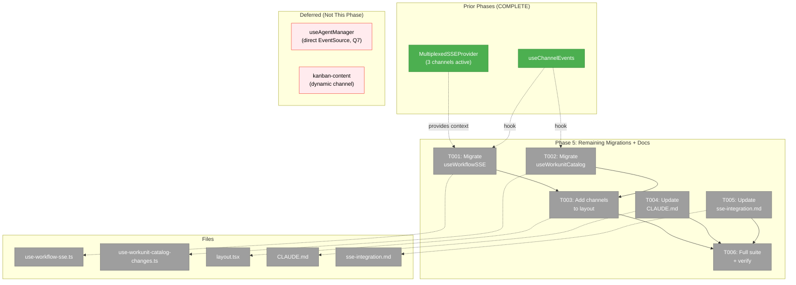
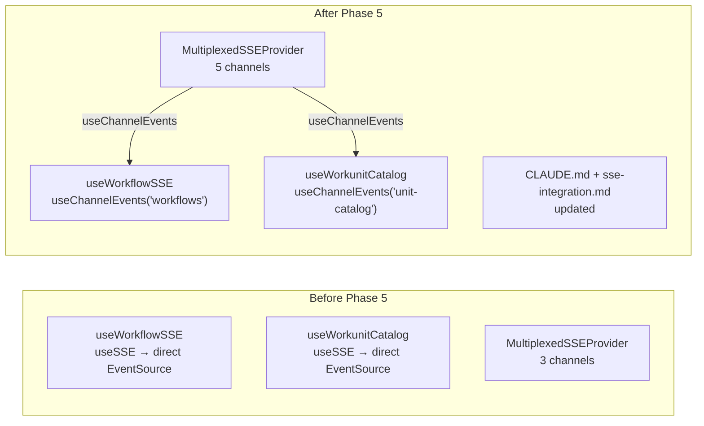
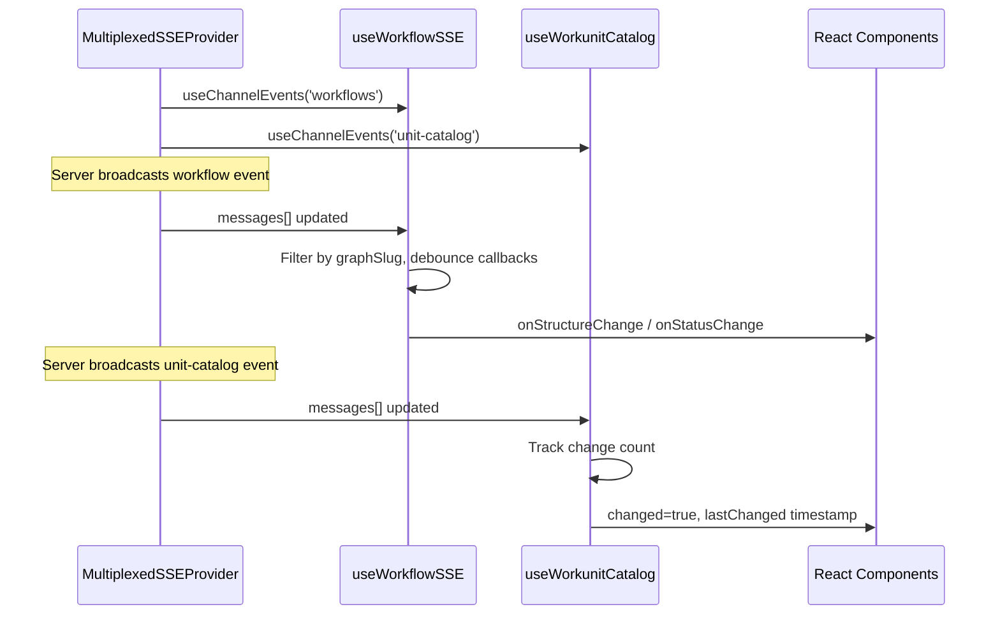

# Phase 5: Remaining Migrations + Documentation — Task Dossier

**Plan**: [../../sse-multiplexing-plan.md](../../sse-multiplexing-plan.md)
**Phase**: Phase 5: Remaining Migrations + Documentation
**Generated**: 2026-03-08
**Domain**: `workflow-ui`, `_platform/events`, cross-domain

---

## Executive Briefing

**Purpose**: Migrate the remaining `useSSE` consumers to the multiplexed provider and update documentation so future developers know how to add new SSE channels. With Phases 1-4 complete, the infrastructure is proven — this phase is mechanical migration + documentation.

**What We're Building**: Migrating `useWorkflowSSE` and `useWorkunitCatalogChanges` from direct `useSSE` to multiplexed hooks, adding their channels to the mux channel list, updating CLAUDE.md with multiplexed SSE references, and consolidating the SSE documentation into `docs/how/sse-integration.md`.

**Goals**:
- ✅ `useWorkflowSSE` migrated to `useChannelEvents('workflows')`
- ✅ `useWorkunitCatalogChanges` migrated to `useChannelEvents('unit-catalog')`
- ✅ `WORKSPACE_SSE_CHANNELS` expanded with `workflows` and `unit-catalog`
- ✅ CLAUDE.md references multiplexed SSE contracts
- ✅ `docs/how/sse-integration.md` updated with multiplexed pattern + migration guide
- ✅ All tests pass

**Non-Goals**:
- ❌ Migrate `useAgentManager` (direct EventSource, optional per Q7 — lowest priority, separate plan)
- ❌ Migrate `kanban-content.tsx` ~~(dynamic channel from props — requires architecture change)~~ Removed — dead demo code per user confirmation during DYK #3

**Scope Expansion** (approved during DYK session):
- ✅ Remove dead `KanbanContent` component (user confirmed: "old demo code, completely not needed")
- ✅ Delete `useSSE` hook (zero consumers after kanban removal + migrations)
- ✅ Delete associated test files

---

## Prior Phase Context

### Phase 1: Server Foundation (COMPLETE)
- **Deliverables**: `/api/events/mux` route, channel tagging in SSEManager, `removeControllerFromAllChannels()`
- **Dependencies Exported**: Channel-tagged broadcast payload, multi-channel registration
- **Patterns**: Injectable deps (`MuxDeps`), snapshot-before-iterate

### Phase 2: Client Provider + Hooks (COMPLETE)
- **Deliverables**: `MultiplexedSSEProvider`, `useChannelEvents`, `useChannelCallback`, barrel export, test fake
- **Dependencies Exported**: `useChannelEvents(channel, { maxMessages? })`, `useChannelCallback(channel, callback)`, `WORKSPACE_SSE_CHANNELS` in layout.tsx
- **Key**: Provider mounted in workspace layout with static channel list. Each `useChannelEvents` gets independent array (Finding 06).

### Phase 3: Priority Consumer Migration (COMPLETE)
- **Deliverables**: QuestionPopper + FileChange migrated. Per-tab connections: 3 → 1.
- **Patterns**: `useChannelCallback` for notification-fetch; separate initial fetch `useEffect`; cast `MultiplexedSSEMessage` to domain type in callback
- **Gotcha**: Two-layer test wrapper needed (MultiplexedSSEProvider + domain provider)

### Phase 4: GlobalState Re-enablement (COMPLETE)
- **Deliverables**: ServerEventRoute migrated to `useChannelEvents`. GlobalStateConnector re-enabled.
- **Key**: `ServerEvent` satisfies `MultiplexedSSEMessage` structurally — no cast needed (DYK #4). Tests were pure logic — no changes needed.
- **Debt**: No `useGlobalState('work-unit:...')` subscribers yet (DYK #2 — infrastructure prep)

---

## Pre-Implementation Check

| File | Exists? | Domain Check | Notes |
|------|---------|-------------|-------|
| `apps/web/src/features/050-workflow-page/hooks/use-workflow-sse.ts` | ✅ Modify | `workflow-ui` ✅ | Replace `useSSE` with `useChannelEvents`. Has debounced callbacks + mutation lock — keep those. |
| `apps/web/src/features/058-workunit-editor/hooks/use-workunit-catalog-changes.ts` | ✅ Modify | `058-workunit-editor` ✅ | Replace `useSSE` with `useChannelEvents`. Simple — tracks change count. |
| `apps/web/app/(dashboard)/workspaces/[slug]/layout.tsx` | ✅ Modify | cross-domain ✅ | Add `'workflows'` and `'unit-catalog'` to `WORKSPACE_SSE_CHANNELS`. |
| `CLAUDE.md` | ✅ Modify | cross-domain ✅ | No existing SSE references. Add to Quick Reference. |
| `docs/how/sse-integration.md` | ✅ Modify | cross-domain ✅ | Currently documents old `useSSE` pattern. Needs multiplexed pattern added. |

**Concept search**: Not needed — no new concepts. Migrating existing consumers to existing hooks.

**Harness**: Not applicable (user override).

---

## Architecture Map



---

## Tasks

| Status | ID | Task | Domain | Path(s) | Done When | Notes |
|--------|-----|------|--------|---------|-----------|-------|
| [ ] | T001 | Migrate useWorkflowSSE to useChannelEvents | `workflow-ui` | `apps/web/src/features/050-workflow-page/hooks/use-workflow-sse.ts` | Replace `useSSE<WorkflowSSEMessage>('/api/events/workflows', undefined, { autoConnect: enabled, maxMessages: 50 })` with `useChannelEvents<WorkflowSSEMessage>('workflows', { maxMessages: 50 })`. Keep debounced callbacks, mutation lock, graphSlug filtering unchanged. Remove `useSSE` import. | Plan task 5.1. Uses `useChannelEvents` (accumulation pattern) because it processes messages array with index tracking. The `autoConnect: enabled` logic needs equivalent — when `!enabled`, don't subscribe. |
| [ ] | T002 | Migrate useWorkunitCatalogChanges to useChannelEvents | `058-workunit-editor` | `apps/web/src/features/058-workunit-editor/hooks/use-workunit-catalog-changes.ts` | Replace `useSSE<UnitCatalogSSEMessage>('/api/events/unit-catalog', undefined, { autoConnect: true, maxMessages: 10 })` with `useChannelEvents<UnitCatalogSSEMessage>('unit-catalog', { maxMessages: 10 })`. Change tracking logic unchanged. Remove `useSSE` import. | Not in original plan but discovered consumer. Simple migration — tracks change count + dismiss. |
| [ ] | T003 | Add 'workflows' and 'unit-catalog' to WORKSPACE_SSE_CHANNELS | cross-domain | `apps/web/app/(dashboard)/workspaces/[slug]/layout.tsx` | `WORKSPACE_SSE_CHANNELS` array includes all 5 channels: `['event-popper', 'file-changes', 'work-unit-state', 'workflows', 'unit-catalog']`. | Must be done after T001/T002 so consumers are ready. |
| [ ] | T004 | Update CLAUDE.md with SSE multiplexing reference | cross-domain | `CLAUDE.md` | Add multiplexed SSE usage to Quick Reference section: `useChannelEvents` for accumulation, `useChannelCallback` for notification-fetch, `WORKSPACE_SSE_CHANNELS` for adding channels. | Plan task 5.3. |
| [ ] | T005 | Update docs/how/sse-integration.md with multiplexed pattern | cross-domain | `docs/how/sse-integration.md` | Add "Multiplexed SSE (Plan 072)" section documenting: `/api/events/mux` endpoint, `MultiplexedSSEProvider`, `useChannelEvents` + `useChannelCallback` with examples, "How to add a new channel" guide, migration checklist from `useSSE`. | Plan task 5.4. Consolidate into existing doc rather than creating separate file. |
| [ ] | T006 | Verify full test suite | cross-domain | N/A | `pnpm test` — all tests pass. | AC-31. |

---

## Context Brief

### Key Findings from Plan

- **Finding 05** (HIGH): FileChangeProvider had 50-attempt reconnection. MultiplexedSSEProvider uses 15 attempts with 2s-15s exponential backoff + jitter. Already implemented in Phase 2. No action for Phase 5.
- **Finding 07** (HIGH): Dual-route risk during migration. Migrate atomically per-consumer. Never have both useSSE and useChannelEvents active for same channel in same component. **Action**: Remove useSSE call when adding useChannelEvents — no transitional dual-connection state.

### Domain Dependencies

- `_platform/events`: `useChannelEvents(channel, options)` — accumulation hook (for workflow-sse's message processing pattern)
- `_platform/events`: `MultiplexedSSEProvider` — already mounted in layout, needs 2 more channels added
- `_platform/events`: `WORKSPACE_SSE_CHANNELS` — static channel list in layout.tsx

### Domain Constraints

- `workflow-ui` imports from `_platform/events` via `@/lib/sse` barrel — allowed (business → infrastructure ✅)
- `058-workunit-editor` imports from `_platform/events` via `@/lib/sse` barrel — allowed (business → infrastructure ✅)
- `useSSE` hook stays alive — `kanban-content.tsx` and `useAgentManager` still need it

### Reusable from Prior Phases

- Phase 3 migration pattern: swap import, change hook call, keep domain logic unchanged
- Phase 4 insight: if return type structurally matches, no cast needed
- Test fakes: `createFakeMultiplexedSSEFactory()` if tests need updating

### Notes on Deferred Consumers

- **`kanban-content.tsx`**: Uses dynamic `sseChannel` prop — the channel isn't known at provider mount time. Would require dynamic subscription support in `MultiplexedSSEProvider`. Defer to future enhancement.
- **`useAgentManager`**: Uses direct `EventSource` (not `useSSE`) with manual reconnection. Optional per plan clarification Q7. Significant refactoring needed. Defer.

### Mermaid Flow Diagram



### Mermaid Sequence Diagram



---

## Discoveries & Learnings

_Populated during implementation by plan-6._

| Date | Task | Type | Discovery | Resolution | References |
|------|------|------|-----------|------------|------------|

---

## Directory Layout

```
docs/plans/072-sse-multiplexing/
  ├── sse-multiplexing-plan.md
  └── tasks/
      ├── phase-1-server-foundation/       (COMPLETE)
      ├── phase-2-client-provider-hooks/   (COMPLETE)
      ├── phase-3-priority-consumer-migration/ (COMPLETE)
      ├── phase-4-globalstate-re-enablement/ (COMPLETE)
      └── phase-5-remaining-migrations-docs/
          ├── tasks.md              ← this file
          ├── tasks.fltplan.md
          └── execution.log.md      # created by plan-6
```
