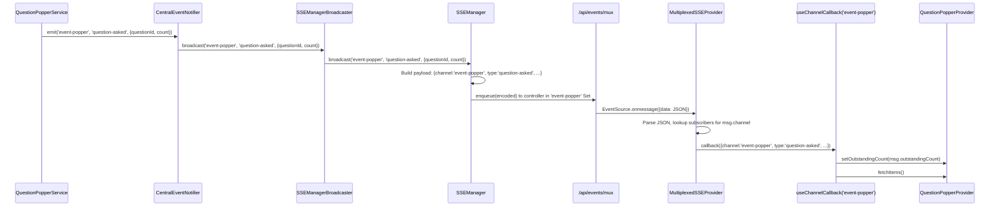

# Workshop: SSE Multiplexer Design

**Type**: Integration Pattern
**Plan**: 072-sse-multiplexing
**Spec**: (pre-spec — research dossier at `research-dossier.md`)
**Created**: 2026-03-08
**Status**: Draft

**Related Documents**:
- [Research Dossier](../research-dossier.md)
- [Workshop 002: HTTP/2 Feasibility](../../067-question-popper/workshops/002-http2-sse-feasibility.md)
- [SSE Problem Dossier](../../067-question-popper/research/sse-problem.md)
- [ADR-0007: SSE Single-Channel Routing](../../../adr/adr-0007-sse-single-channel-routing.md)

**Domain Context**:
- **Primary Domain**: `_platform/events` — owns SSE infrastructure
- **Related Domains**: `question-popper`, `045-live-file-events`, `_platform/state`, `agents`

---

## Purpose

Design the concrete server and client components for a multiplexed SSE transport that carries all event channels over a single `EventSource` per browser tab. This workshop produces implementation-ready specifications: API contract, TypeScript interfaces, React component tree, migration strategy, and test plan.

## Key Questions Addressed

- Q1: What does the multiplexed SSE endpoint look like? (route, query params, wire format)
- Q2: How does the client demultiplexer work? (provider, hook, subscription API)
- Q3: How does SSEManager change to tag events with channel? (server-side)
- Q4: How do existing consumers migrate? (step-by-step per consumer)
- Q5: How do we test this? (fakes, contract tests, integration)
- Q6: What about cleanup, reconnection, and error isolation?

---

## Overview

```
Today (N connections per tab):                After (1 connection per tab):

Tab opens:                                    Tab opens:
  EventSource(/api/events/file-changes)         EventSource(/api/events/mux?ch=...)
  EventSource(/api/events/event-popper)           ↓ demux by msg.channel
  EventSource(/api/events/work-unit-state)        ├─ file-changes → FileChangeProvider
  EventSource(/api/events/agents)                 ├─ event-popper → QuestionPopper
  ...                                             ├─ work-unit-state → GlobalState
  = 4+ HTTP connections                           └─ agents → AgentManager
                                                = 1 HTTP connection
```

---

## Q1: Server — Multiplexed SSE Endpoint

### Route: `/api/events/mux`

**Why `mux`?** Short, unambiguous, doesn't collide with any channel name (channels are `[a-zA-Z0-9_-]+` with at least one letter). Alternatives considered: `multiplexed` (too long for URL), `all` (could be a channel name), `stream` (vague).

```
GET /api/events/mux?channels=file-changes,event-popper,work-unit-state
```

### Request

| Param | Type | Required | Validation | Example |
|-------|------|----------|------------|---------|
| `channels` | Query string | Yes | Comma-separated, each `^[a-zA-Z0-9_-]+$`, max 20, min 1, no duplicates | `file-changes,event-popper` |

### Response

```
HTTP/1.1 200 OK
Content-Type: text/event-stream
Cache-Control: no-cache
Connection: keep-alive

: heartbeat

data: {"channel":"event-popper","type":"question-asked","questionId":"q_abc","outstandingCount":1}

data: {"channel":"file-changes","type":"file-changed","changes":[{"path":"README.md","eventType":"update"}]}

: heartbeat

```

### Wire Format

Every SSE message is an unnamed event (no `event:` line) with JSON payload:

```typescript
interface MultiplexedSSEMessage {
  channel: string;    // WorkspaceDomain value, e.g. 'file-changes'
  type: string;       // Event type within channel, e.g. 'file-changed'
  [key: string]: unknown; // Domain-specific data
}
```

**Why unnamed events?** Named SSE events (`event: foo`) require `addEventListener('foo', ...)` — the existing `useSSE` hook and all consumers use `onmessage` which only receives unnamed events. This is a prior learning (PL-02) from Plan 027.

### Route Implementation

```typescript
// apps/web/app/api/events/mux/route.ts

import { auth } from '@/auth';
import type { NextRequest } from 'next/server';
import { NextResponse } from 'next/server';
import { sseManager } from '@/lib/sse-manager';

export const dynamic = 'force-dynamic';

const HEARTBEAT_INTERVAL = 30_000;
const MAX_CHANNELS = 20;
const CHANNEL_PATTERN = /^[a-zA-Z0-9_-]+$/;

export async function GET(request: NextRequest): Promise<Response> {
  const session = await auth();
  if (!session) {
    return NextResponse.json({ error: 'Unauthorized' }, { status: 401 });
  }

  const channelsParam = request.nextUrl.searchParams.get('channels');
  if (!channelsParam) {
    return new Response('Missing channels parameter', { status: 400 });
  }

  // Parse + validate + dedupe
  const channels = [...new Set(channelsParam.split(','))];

  if (channels.length === 0 || channels.length > MAX_CHANNELS) {
    return new Response(
      `Channel count must be 1-${MAX_CHANNELS}, got ${channels.length}`,
      { status: 400 }
    );
  }

  for (const ch of channels) {
    if (!CHANNEL_PATTERN.test(ch)) {
      return new Response(`Invalid channel name: ${ch}`, { status: 400 });
    }
  }

  const stream = new ReadableStream({
    start(controller) {
      // Register ONE controller on ALL requested channels
      for (const ch of channels) {
        sseManager.addConnection(ch, controller);
      }

      const encoder = new TextEncoder();
      controller.enqueue(encoder.encode(': heartbeat\n\n'));

      const heartbeatInterval = setInterval(() => {
        try {
          controller.enqueue(encoder.encode(': heartbeat\n\n'));
        } catch {
          clearInterval(heartbeatInterval);
          for (const ch of channels) {
            sseManager.removeConnection(ch, controller);
          }
        }
      }, HEARTBEAT_INTERVAL);

      const cleanup = () => {
        clearInterval(heartbeatInterval);
        for (const ch of channels) {
          sseManager.removeConnection(ch, controller);
        }
        try { controller.close(); } catch { /* already closed */ }
      };

      if (request.signal.aborted) {
        cleanup();
        return;
      }
      request.signal.addEventListener('abort', cleanup);
    },
  });

  return new Response(stream, {
    status: 200,
    headers: {
      'Content-Type': 'text/event-stream',
      'Cache-Control': 'no-cache',
      Connection: 'keep-alive',
    },
  });
}
```

**Key design decision**: The controller is added to SSEManager's channel Sets for each requested channel. When ANY channel broadcasts, the controller receives it. No new data structures needed — `SSEManager.connections` already uses `Set<StreamController>`, and a controller can exist in multiple Sets simultaneously.

### Q1 — Open Questions

#### Q1a: Should the existing `/api/events/[channel]` route remain?

**RESOLVED: Yes, keep it.** Non-breaking migration. Consumers migrate to `mux` gradually. Old route is simple and useful for debugging (connect to one channel with `curl`). Deprecate with JSDoc after all consumers migrate.

#### Q1b: Should channels be static or dynamic after connection?

**RESOLVED: Static.** Channels are set at connection time via query param. To change channels, close and reconnect. This keeps the server stateless — no per-connection subscription state to manage. EventSource reconnects automatically (browser built-in), so the URL with channels is preserved.

---

## Q3: Server — SSEManager Channel Tagging

### Current Payload (no channel)

```typescript
// sse-manager.ts broadcast(), line 74-77
const payload =
  typeof data === 'object' && data !== null
    ? { ...(data as Record<string, unknown>), type: eventType }
    : { type: eventType, data };
```

### New Payload (with channel)

```typescript
const payload =
  typeof data === 'object' && data !== null
    ? { ...(data as Record<string, unknown>), type: eventType, channel: channelId }
    : { type: eventType, data, channel: channelId };
```

**One-line change. Non-breaking.** Existing consumers ignore unknown fields. The `channel` field is always present in all SSE messages (both `mux` and legacy `[channel]` routes). This is the correct place to add it because SSEManager already knows `channelId` as the first parameter.

### Updated TypeScript Types

```typescript
// packages/shared/src/features/027-central-notify-events/server-event.ts (new file or extend existing)

/** Base shape of every SSE message after channel tagging */
export interface ServerEvent {
  /** Event type within the channel, e.g. 'question-asked', 'file-changed' */
  type: string;
  /** SSE channel this event was broadcast on, e.g. 'event-popper', 'file-changes' */
  channel: string;
  /** Domain-specific data */
  [key: string]: unknown;
}
```

---

## Q2: Client — MultiplexedSSEProvider

### Architecture

```
<MultiplexedSSEProvider channels={['file-changes','event-popper','work-unit-state']}>
  ↓ React context
  ├─ useChannelEvents('event-popper')     → QuestionPopperProvider
  ├─ useChannelEvents('file-changes')     → FileChangeProvider
  └─ useChannelEvents('work-unit-state')  → ServerEventRoute (GlobalState)
```

### Provider Interface

```typescript
// apps/web/src/lib/sse/multiplexed-sse-provider.tsx

interface MultiplexedSSEContextValue {
  /** Subscribe to events on a specific channel. Returns unsubscribe function. */
  subscribe(channel: string, callback: (event: ServerEvent) => void): () => void;
  /** Current connection state */
  isConnected: boolean;
  /** Current error, if any */
  error: Error | null;
}

interface MultiplexedSSEProviderProps {
  /** Channels to subscribe to */
  channels: string[];
  /** Override EventSource constructor for testing */
  eventSourceFactory?: EventSourceFactory;
  children: React.ReactNode;
}
```

### Provider Implementation (Sketch)

```typescript
'use client';

export function MultiplexedSSEProvider({
  channels,
  eventSourceFactory = defaultEventSourceFactory,
  children,
}: MultiplexedSSEProviderProps) {
  const [isConnected, setIsConnected] = useState(false);
  const [error, setError] = useState<Error | null>(null);

  // Subscriber registry: channel → Set<callback>
  const subscribersRef = useRef(new Map<string, Set<(e: ServerEvent) => void>>());

  const eventSourceRef = useRef<EventSource | null>(null);
  const reconnectAttemptsRef = useRef(0);
  const mountedRef = useRef(true);

  // Build URL from channels
  const url = useMemo(
    () => `/api/events/mux?channels=${channels.join(',')}`,
    [channels]  // stable if channels array is memoized by parent
  );

  const connect = useCallback(() => {
    if (eventSourceRef.current) eventSourceRef.current.close();

    const es = eventSourceFactory(url);
    eventSourceRef.current = es;

    es.onopen = () => {
      if (!mountedRef.current) return;
      setIsConnected(true);
      setError(null);
      reconnectAttemptsRef.current = 0;
    };

    es.onmessage = (event) => {
      if (!mountedRef.current) return;
      try {
        const msg: ServerEvent = JSON.parse(event.data);
        const channelSubs = subscribersRef.current.get(msg.channel);
        if (channelSubs) {
          for (const cb of channelSubs) {
            try { cb(msg); } catch (err) {
              console.warn('[MultiplexedSSE] Subscriber error:', err);
            }
          }
        }
      } catch { /* ignore malformed */ }
    };

    es.onerror = () => {
      if (!mountedRef.current) return;
      setIsConnected(false);
      es.close();
      if (reconnectAttemptsRef.current < 5) {
        reconnectAttemptsRef.current++;
        const delay = Math.min(2000 * reconnectAttemptsRef.current, 15000);
        setTimeout(() => { if (mountedRef.current) connect(); }, delay);
      } else {
        setError(new Error('SSE connection failed after max attempts'));
      }
    };
  }, [url, eventSourceFactory]);

  // Subscribe function (stable via ref)
  const subscribe = useCallback(
    (channel: string, callback: (e: ServerEvent) => void): (() => void) => {
      let subs = subscribersRef.current.get(channel);
      if (!subs) {
        subs = new Set();
        subscribersRef.current.set(channel, subs);
      }
      subs.add(callback);
      return () => { subs!.delete(callback); };
    },
    []
  );

  useEffect(() => {
    mountedRef.current = true;
    connect();
    return () => {
      mountedRef.current = false;
      eventSourceRef.current?.close();
    };
  }, [connect]);

  const value = useMemo(
    () => ({ subscribe, isConnected, error }),
    [subscribe, isConnected, error]
  );

  return (
    <MultiplexedSSEContext.Provider value={value}>
      {children}
    </MultiplexedSSEContext.Provider>
  );
}
```

### Consumer Hook: `useChannelEvents`

```typescript
// apps/web/src/lib/sse/use-channel-events.ts

/**
 * Subscribe to events on a specific channel from the multiplexed SSE provider.
 * Returns accumulated messages for that channel.
 */
export function useChannelEvents<T extends ServerEvent = ServerEvent>(
  channel: string,
  options?: { maxMessages?: number }
): { messages: T[]; isConnected: boolean; clearMessages: () => void } {
  const { subscribe, isConnected } = useMultiplexedSSE();
  const [messages, setMessages] = useState<T[]>([]);
  const maxMessages = options?.maxMessages ?? 1000;

  useEffect(() => {
    const unsubscribe = subscribe(channel, (event) => {
      setMessages((prev) => {
        const next = [...prev, event as T];
        return maxMessages > 0 && next.length > maxMessages
          ? next.slice(-maxMessages)
          : next;
      });
    });
    return unsubscribe;
  }, [channel, subscribe, maxMessages]);

  const clearMessages = useCallback(() => setMessages([]), []);

  return { messages: messages as T[], isConnected, clearMessages };
}
```

### Callback-Style Hook: `useChannelCallback`

Some consumers (QuestionPopperProvider, FileChangeProvider) don't accumulate messages — they trigger a refetch on each event. For them:

```typescript
/**
 * Subscribe to events on a channel with a callback.
 * Fires callback for each event — no message accumulation.
 */
export function useChannelCallback(
  channel: string,
  callback: (event: ServerEvent) => void
): { isConnected: boolean } {
  const { subscribe, isConnected } = useMultiplexedSSE();
  const callbackRef = useRef(callback);
  callbackRef.current = callback;

  useEffect(() => {
    return subscribe(channel, (event) => callbackRef.current(event));
  }, [channel, subscribe]);

  return { isConnected };
}
```

### Mount Point

```tsx
// apps/web/app/(dashboard)/workspaces/[slug]/layout.tsx

import { MultiplexedSSEProvider } from '@/lib/sse/multiplexed-sse-provider';

// Memoized channel list — prevents provider re-render on every layout render
const WORKSPACE_SSE_CHANNELS = ['event-popper', 'file-changes', 'work-unit-state'];

export default async function WorkspaceLayout({ children, params }: LayoutProps) {
  // ... existing code ...

  return (
    <WorkspaceProvider ...>
      <SDKWorkspaceConnector ...>
        <WorkspaceAttentionWrapper>
          <TerminalOverlayWrapper ...>
            <ActivityLogOverlayWrapper ...>
              <MultiplexedSSEProvider channels={WORKSPACE_SSE_CHANNELS}>
                <QuestionPopperOverlayWrapper>
                  <WorkspaceAgentChrome ...>
                    {children}
                  </WorkspaceAgentChrome>
                </QuestionPopperOverlayWrapper>
              </MultiplexedSSEProvider>
            </ActivityLogOverlayWrapper>
          </TerminalOverlayWrapper>
        </WorkspaceAttentionWrapper>
      </SDKWorkspaceConnector>
    </WorkspaceProvider>
  );
}
```

**Why between ActivityLogOverlayWrapper and QuestionPopperOverlayWrapper?** Must be above QuestionPopperOverlayWrapper (first SSE consumer). Could go higher, but keeping it inside the overlay wrappers means it unmounts cleanly on workspace change without affecting non-SSE overlays.

---

## Q4: Consumer Migration Patterns

### Pattern A: Notification-Fetch Consumers (QuestionPopper, Agents)

These consumers use SSE as a hint, then refetch full data via REST.

**Before** (QuestionPopperProvider):
```typescript
const es = new EventSource('/api/events/event-popper');
es.onmessage = (event) => {
  const msg = JSON.parse(event.data);
  setOutstandingCount(msg.outstandingCount);
  fetchItems(); // refetch full list
};
```

**After**:
```typescript
useChannelCallback('event-popper', (event) => {
  if (typeof event.outstandingCount === 'number') {
    setOutstandingCount(event.outstandingCount);
  }
  fetchItems(); // refetch full list — unchanged
});
```

**Migration**: Replace ~70 lines of EventSource lifecycle (connect, reconnect, disconnect, refs) with one `useChannelCallback` call. All processing logic stays identical.

### Pattern B: Message-Accumulation Consumers (ServerEventRoute)

These consumers accumulate messages and process them in batches.

**Before** (ServerEventRoute):
```typescript
const { messages } = useSSE<ServerEvent>(
  `/api/events/${route.channel}`,
  undefined,
  { maxMessages: 0 }
);
// Process messages with index cursor...
```

**After**:
```typescript
const { messages } = useChannelEvents<ServerEvent>(route.channel, {
  maxMessages: 0,
});
// Process messages with index cursor — UNCHANGED
```

**Migration**: Replace `useSSE(url)` with `useChannelEvents(channel)`. Index cursor logic is unchanged.

### Pattern C: Hub Consumers (FileChangeProvider)

FileChangeProvider has its own reconnection logic and filters messages by `worktreePath`.

**Before**:
```typescript
const eventSource = factory(`/api/events/${WorkspaceDomain.FileChanges}`);
eventSource.onmessage = (event) => {
  const msg = JSON.parse(event.data);
  if (msg.changes) {
    const filtered = msg.changes.filter(c => c.worktreePath === worktreePath);
    hub.dispatch(filtered);
  }
};
```

**After**:
```typescript
useChannelCallback(WorkspaceDomain.FileChanges, (event) => {
  if (event.changes) {
    const filtered = event.changes.filter(c => c.worktreePath === worktreePath);
    hub.dispatch(filtered);
  }
});
```

**Migration**: Remove EventSource lifecycle code (~80 lines). Keep `FileChangeHub` and filtering logic intact. The reconnection is now handled by `MultiplexedSSEProvider` centrally.

### Migration Table

| Consumer | Pattern | Lines Removed | Lines Added | Complexity |
|----------|---------|---------------|-------------|------------|
| QuestionPopperProvider | A (callback) | ~70 | ~5 | Low |
| useWorkflowSSE | B (accumulate) | ~30 | ~5 | Low |
| useWorkunitCatalogChanges | B (accumulate) | ~20 | ~5 | Low |
| KanbanContent | B (accumulate) | ~20 | ~5 | Low |
| useAgentManager | A (callback) | ~60 | ~10 | Medium — 8 event types |
| useAgentInstance | A (callback) | ~40 | ~10 | Medium — agentId filter |
| FileChangeProvider | C (hub) | ~80 | ~10 | Medium — hub + worktreePath filter |
| useServerSession | A (callback) | ~30 | ~5 | Medium — workspace-scoped |
| ServerEventRoute | B (accumulate) | ~5 | ~5 | Low — just swap hook |
| GlobalStateConnector | (meta) | ~0 | ~0 | Low — re-enable, no code change |

---

## Q5: Testing

### Fake Infrastructure

```typescript
// test/fakes/fake-multiplexed-sse.ts

/**
 * Fake for testing MultiplexedSSEProvider consumers.
 * Wraps FakeEventSource with channel-aware message simulation.
 */
export function createFakeMultiplexedSSEFactory() {
  let instance: FakeEventSource | null = null;

  const factory: EventSourceFactory = (url) => {
    instance = new FakeEventSource(url);
    return instance as unknown as EventSource;
  };

  return {
    factory,
    get instance() { return instance!; },

    /** Simulate a channel-specific event */
    simulateChannelMessage(channel: string, type: string, data: Record<string, unknown> = {}) {
      if (!instance) throw new Error('No EventSource created yet');
      instance.simulateMessage(JSON.stringify({ channel, type, ...data }));
    },

    /** Simulate connection open */
    simulateOpen() {
      instance?.simulateOpen();
    },

    /** Simulate error (all channels affected) */
    simulateError() {
      instance?.simulateError();
    },
  };
}
```

### Contract Tests for MultiplexedSSEProvider

```typescript
describe('MultiplexedSSEProvider', () => {
  it('connects to mux endpoint with requested channels', () => {
    const fake = createFakeMultiplexedSSEFactory();
    render(
      <MultiplexedSSEProvider
        channels={['file-changes', 'event-popper']}
        eventSourceFactory={fake.factory}
      >
        <TestConsumer />
      </MultiplexedSSEProvider>
    );
    expect(fake.instance.url).toBe('/api/events/mux?channels=file-changes,event-popper');
  });

  it('routes channel events to correct subscriber', () => {
    // Subscribe to 'event-popper', send event on 'file-changes' — should NOT fire
    // Subscribe to 'event-popper', send event on 'event-popper' — SHOULD fire
  });

  it('isolates subscriber errors per-callback', () => {
    // One subscriber throws, other subscriber still receives events
  });

  it('reconnects with exponential backoff', () => {
    // Simulate error, verify reconnect delay pattern
  });

  it('cleans up on unmount', () => {
    // Unmount provider, verify EventSource.close() called
  });
});
```

### Contract Tests for useChannelEvents

```typescript
describe('useChannelEvents', () => {
  it('accumulates messages for subscribed channel only', () => { /* ... */ });
  it('respects maxMessages pruning', () => { /* ... */ });
  it('clearMessages resets to empty', () => { /* ... */ });
  it('ignores events from other channels', () => { /* ... */ });
});
```

### Server-Side Tests

```typescript
describe('/api/events/mux route', () => {
  it('rejects missing channels param', () => { /* 400 */ });
  it('rejects empty channels', () => { /* 400 */ });
  it('rejects invalid channel names', () => { /* 400 */ });
  it('rejects more than 20 channels', () => { /* 400 */ });
  it('deduplicates channels', () => { /* channels=a,a,b → registers a,b */ });
  it('registers controller on all requested channels', () => { /* SSEManager mock */ });
  it('removes controller from all channels on disconnect', () => { /* cleanup */ });
  it('sends heartbeat on 30s interval', () => { /* timer mock */ });
  it('requires auth', () => { /* 401 without session */ });
});

describe('SSEManager.broadcast with channel tagging', () => {
  it('includes channel field in payload', () => {
    // broadcast('file-changes', 'file-changed', { changes: [] })
    // → payload includes { channel: 'file-changes', type: 'file-changed', changes: [] }
  });
  it('is non-breaking for existing consumers', () => {
    // Existing consumers that ignore unknown fields still work
  });
});
```

---

## Q6: Cleanup, Reconnection, Error Isolation

### Connection Lifecycle

```
┌─────────────────────────────────────────────────────────┐
│ MultiplexedSSEProvider mounts                            │
│                                                          │
│  1. Build URL: /api/events/mux?channels=a,b,c           │
│  2. new EventSource(url)                                 │
│  3. onopen → isConnected=true, resetAttempts             │
│                                                          │
│  STEADY STATE:                                           │
│    onmessage → parse JSON → route by msg.channel         │
│                → dispatch to channel subscribers          │
│    heartbeat every 30s keeps connection alive             │
│                                                          │
│  ON ERROR:                                               │
│    onerror → isConnected=false, close EventSource        │
│    reconnect with backoff: 2s, 4s, 6s, 8s, 10s (cap)    │
│    max 5 attempts, then setError                         │
│                                                          │
│  ON UNMOUNT:                                             │
│    close EventSource, clear timeout, mountedRef=false     │
│                                                          │
│  ON WORKSPACE CHANGE:                                    │
│    Layout remounts → provider unmounts → clean disconnect │
│    New provider mounts → fresh connection                 │
└─────────────────────────────────────────────────────────┘
```

### Error Isolation

| Error Type | Scope | Handling |
|------------|-------|----------|
| Network error (onerror) | All channels | Reconnect with backoff. All subscribers see `isConnected=false`. |
| Malformed JSON | Per-message | Silently ignored. Other messages unaffected. |
| Subscriber callback throws | Per-subscriber | try/catch per callback. Other subscribers still receive event. Log warning. |
| Server-side channel broadcast error | Per-channel | SSEManager removes dead controller from that channel. Other channels unaffected. |

### Cleanup Matrix

| Event | Action |
|-------|--------|
| Provider unmounts | Close EventSource, clear reconnect timeout |
| Consumer hook unmounts | Unsubscribe callback (returned from `subscribe()`) |
| Browser tab closes | Browser closes EventSource, server abort listener fires cleanup |
| Server restart | EventSource onerror fires, client reconnects automatically |
| Channel removed from channels prop | Provider re-renders with new URL, reconnects with updated channels |

### Visibility Optimization (Complementary)

```typescript
// Optional: disconnect when tab backgrounds, reconnect on foreground
useEffect(() => {
  const handler = () => {
    if (document.hidden) {
      eventSourceRef.current?.close();
      setIsConnected(false);
    } else {
      connect();
    }
  };
  document.addEventListener('visibilitychange', handler);
  return () => document.removeEventListener('visibilitychange', handler);
}, [connect]);
```

**Recommended as Phase 2 optimization**, not required for initial implementation.

---

## File Structure

```
apps/web/
├── app/api/events/
│   ├── [channel]/route.ts        # Existing — keep for backwards compat
│   └── mux/route.ts              # NEW — multiplexed endpoint
├── src/lib/sse/
│   ├── multiplexed-sse-provider.tsx  # NEW — React provider
│   ├── use-channel-events.ts         # NEW — accumulation hook
│   ├── use-channel-callback.ts       # NEW — callback hook
│   └── index.ts                      # NEW — barrel export
├── src/lib/sse-manager.ts         # MODIFIED — add channel to payload
└── src/hooks/useSSE.ts            # UNCHANGED — kept for backwards compat

test/
├── fakes/
│   └── fake-multiplexed-sse.ts    # NEW — test utility
└── unit/
    └── web/
        ├── sse/
        │   ├── multiplexed-sse-provider.test.tsx  # NEW
        │   └── use-channel-events.test.tsx         # NEW
        └── api/
            └── events-mux-route.test.ts            # NEW
```

---

## Sequence Diagram: Event Flow



---

## Backwards Compatibility

| Component | Breaking Change? | Notes |
|-----------|-----------------|-------|
| SSEManager.broadcast() | No | Adding `channel` field to payload is additive |
| `/api/events/[channel]` | No | Kept as-is. Gets `channel` field in payload too (free). |
| useSSE hook | No | Unchanged. Consumers that still use it work fine. |
| Existing EventSource consumers | No | They ignore the new `channel` field. |
| `/api/events/mux` | N/A | New endpoint. Nothing depends on it yet. |

**Migration is fully backwards-compatible and incremental.** Each consumer migrates independently. No big-bang switchover required.

---

## Open Questions

### Q7: Should agent events use the multiplexed endpoint?

**OPEN**: Agent events currently use a dedicated `/api/agents/events` route (separate from the generic `[channel]` route). This route uses the same SSEManager but is a separate file. Options:
- **Option A**: Add `agents` to the mux channels list. Agent events get `channel: 'agents'` tag. useAgentManager subscribes via `useChannelCallback('agents')`.
- **Option B**: Keep agents separate. They have high-frequency text delta events (future) that could saturate the mux stream.
- **Recommendation**: Option A for now. Text deltas aren't implemented yet, and when they are, server-side batching/throttling is the correct mitigation regardless.

### Q8: Should the channel list be configurable per page?

**RESOLVED**: Start static (all channels always subscribed). Dynamic subscription is a future optimization if bandwidth becomes an issue. Static is simpler and means the multiplexed connection doesn't need to reconnect on page navigation within a workspace.

### Q9: How should the provider handle the `channels` prop changing?

**RESOLVED**: If the channels array reference changes (different set of channels), the provider should close and reconnect with the new URL. Use `useMemo` in the parent to keep the channels array stable when the set hasn't actually changed. The `WORKSPACE_SSE_CHANNELS` const outside the component handles this naturally.

---

## Quick Reference

```bash
# Server: One-line change to tag events with channel
# sse-manager.ts broadcast() — add: channel: channelId to payload

# Client: Mount provider in workspace layout
<MultiplexedSSEProvider channels={['event-popper','file-changes','work-unit-state']}>

# Consumer: Replace direct EventSource with hook
# Before: new EventSource('/api/events/event-popper')
# After:  useChannelCallback('event-popper', (event) => { ... })

# Test: Channel-aware fake
fake.simulateChannelMessage('event-popper', 'question-asked', { questionId: 'q1' });
```
