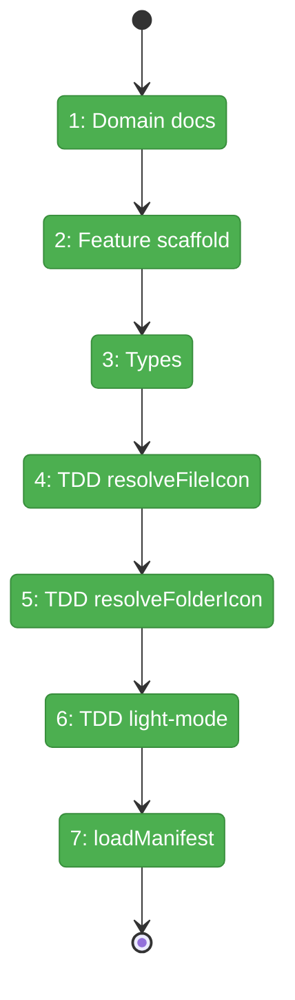

# Flight Plan: Phase 1 — Domain Setup & Icon Resolver

**Plan**: [file-icons-plan.md](../../file-icons-plan.md)
**Phase**: Phase 1: Domain Setup & Icon Resolver
**Generated**: 2026-03-09
**Status**: Landed

---

## Departure → Destination

**Where we are**: No icon theming infrastructure exists. The app has no `_platform/themes` domain. File icons are hardcoded Lucide `<File>` components everywhere. There is no filename → icon mapping logic.

**Where we're going**: A developer can call `resolveFileIcon('app.tsx', manifest)` and get back `{iconName: 'react_ts', source: 'fileExtension'}`. A new `_platform/themes` infrastructure domain exists with domain definition, registry entry, and domain-map node. Nine TDD-tested resolver scenarios cover filenames, extensions, languageIds fallback, folder icons, and light-mode overrides.

---

## Domain Context

### Domains We're Changing

| Domain | What Changes | Key Files |
|--------|-------------|-----------|
| `_platform/themes` (NEW) | Create entire domain: definition, types, resolver, manifest loader | `docs/domains/_platform/themes/domain.md`, `apps/web/src/features/_platform/themes/**` |
| cross-domain | Registry + domain map entries for new domain | `docs/domains/registry.md`, `docs/domains/domain-map.md` |

### Domains We Depend On (no changes)

| Domain | What We Consume | Contract |
|--------|----------------|----------|
| None | Phase 1 has no domain dependencies | — |

---

## Flight Status

**Legend**: grey = pending | yellow = active | red = blocked/needs input | green = done

---

## Stages

- [x] **Stage 1: Create domain artifacts** — domain.md + registry row + domain-map node (`domain.md`, `registry.md`, `domain-map.md`)
- [x] **Stage 2: Scaffold feature folder** — directory structure + barrel + constants (`_platform/themes/` — new directory)
- [x] **Stage 3: Define type system** — IconThemeManifest, IconResolution, IconThemeId (`types.ts` — new file)
- [x] **Stage 4: TDD file icon resolver** — RED→GREEN→REFACTOR with 8 test scenarios (`icon-resolver.ts`, `icon-resolver.test.ts` — new files)
- [x] **Stage 5: TDD folder icon resolver** — expanded/collapsed variants, named folders (`icon-resolver.ts` — extend)
- [x] **Stage 6: TDD light-mode overrides** — manifest.light.* sources checked first in light theme (`icon-resolver.ts` — extend)
- [x] **Stage 7: Manifest loader** — load + normalize manifest data (`manifest-loader.ts` — new file)

---

## Architecture: Before & After

```mermaid
flowchart LR
    classDef existing fill:#E8F5E9,stroke:#4CAF50,color:#000
    classDef new fill:#E3F2FD,stroke:#2196F3,color:#000

    subgraph Before["Before Phase 1"]
        B1["_platform/viewer<br/>detectLanguage()<br/>detectContentType()"]:::existing
        B2["file-browser<br/>FileTree uses<br/>generic File icon"]:::existing
        B1 --> B2
    end

    subgraph After["After Phase 1"]
        A1["_platform/viewer<br/>detectLanguage()<br/>detectContentType()"]:::existing
        A2["_platform/themes (NEW)<br/>resolveFileIcon()<br/>resolveFolderIcon()<br/>loadManifest()"]:::new
        A3["file-browser<br/>(unchanged — Phase 4)"]:::existing
        A1 --> A3
        A2 -.->|"Phase 4 wires"| A3
    end
```

**Legend**: existing (green, unchanged) | new (blue, created)

---

## Acceptance Criteria

- [ ] `resolveFileIcon('package.json', manifest)` returns `{iconName: 'nodejs', source: 'fileName'}`
- [ ] `resolveFileIcon('app.ts', manifest)` returns `{iconName: 'typescript', source: 'languageId'}` (NOT fileExtension!)
- [ ] `resolveFileIcon('app.py', manifest)` returns `{iconName: 'python', source: 'fileExtension'}`
- [ ] `resolveFileIcon('unknown.xyz', manifest)` returns `{iconName: 'file', source: 'default'}`
- [ ] `resolveFolderIcon('src', false, manifest)` returns `{iconName: 'folder-src'}`
- [ ] `resolveFolderIcon('src', true, manifest)` returns `{iconName: 'folder-src-open'}`
- [ ] Light-mode override works when `manifest.light.fileExtensions` has entry
- [ ] All tests pass via `pnpm test`
- [ ] Domain registered in `docs/domains/registry.md`
- [ ] Domain visible in `docs/domains/domain-map.md` Mermaid

## Goals & Non-Goals

**Goals**: Domain definition, type system, TDD resolver, manifest loader
**Non-Goals**: React components, SVG assets, UI wiring, SDK setting

---

## Checklist

- [x] T001: Create domain.md
- [x] T002: Update registry.md
- [x] T003: Update domain-map.md
- [x] T004: Create feature folder scaffold
- [x] T005: Define types
- [x] T006: TDD resolveFileIcon
- [x] T007: TDD resolveFolderIcon
- [x] T008: TDD light-mode overrides
- [x] T009: Implement loadManifest
