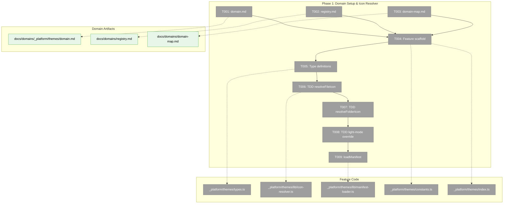
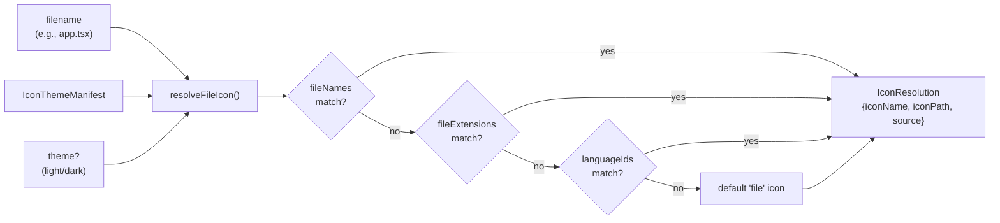
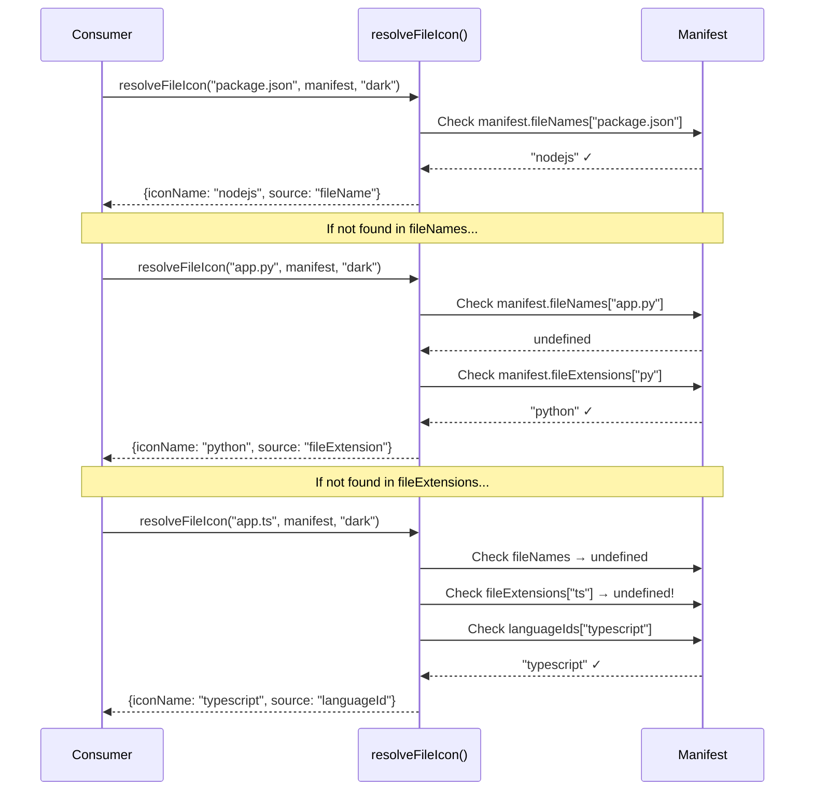

# Phase 1: Domain Setup & Icon Resolver — Tasks

## Executive Briefing

**Purpose**: Create the `_platform/themes` infrastructure domain and build a manifest-driven icon resolver that maps filenames to icon paths using the VSCode icon theme manifest format. This is the foundation that all subsequent phases build on.

**What We're Building**: A pure-function resolver that takes a filename (e.g., `app.tsx`, `package.json`, `Dockerfile`) and a theme manifest, then returns the correct icon path by checking `fileNames` → `fileExtensions` → `languageIds` → default. The resolver also handles folder icons (with expanded/collapsed variants) and light-mode overrides. All logic is TDD with real `material-icon-theme` manifest data.

**Goals**:
- ✅ New `_platform/themes` domain with domain.md, registry entry, domain-map node
- ✅ Feature folder scaffold at `apps/web/src/features/_platform/themes/`
- ✅ Type definitions: `IconThemeManifest`, `IconResolution`, `IconThemeId`
- ✅ `resolveFileIcon()` — TDD, handles `.ts` via `languageIds`, special filenames, fallbacks
- ✅ `resolveFolderIcon()` — TDD, handles named folders, expanded/collapsed variants
- ✅ Light-mode override support via `manifest.light.*`
- ✅ `loadManifest()` — loads and normalizes theme manifests

**Non-Goals**:
- ❌ No React components yet (Phase 3)
- ❌ No SVG asset files yet (Phase 2)
- ❌ No UI wiring yet (Phase 4)
- ❌ No SDK setting yet (Phase 3)

## Prior Phase Context

Phase 1 — no prior phases.

## Pre-Implementation Check

| File | Exists? | Domain Check | Notes |
|------|---------|-------------|-------|
| `docs/domains/_platform/themes/domain.md` | ❌ No | New domain | Create in T001 |
| `docs/domains/registry.md` | ✅ Yes | cross-domain | Modify in T002 |
| `docs/domains/domain-map.md` | ✅ Yes | cross-domain | Modify in T003 |
| `apps/web/src/features/_platform/themes/` | ❌ No | New feature | Create in T004 |
| `apps/web/src/features/_platform/themes/types.ts` | ❌ No | New file | Create in T005 |
| `apps/web/src/features/_platform/themes/lib/icon-resolver.ts` | ❌ No | New file | Create in T006-T008 |
| `apps/web/src/features/_platform/themes/lib/manifest-loader.ts` | ❌ No | New file | Create in T009 |
| `test/unit/web/features/_platform/themes/icon-resolver.test.ts` | ❌ No | New test | Create in T006-T008 |

**Concept search**: No existing "icon resolver", "theme resolver", or "file icon" concepts found in codebase. Clean creation.
**Harness**: Available at L3 but not needed for Phase 1 (pure function TDD).

## Architecture Map



## Tasks

| Status | ID | Task | Domain | Path(s) | Done When | Notes |
|--------|-----|------|--------|---------|-----------|-------|
| [x] | T001 | Create `_platform/themes` domain definition with Purpose, Boundary (Owns/Does NOT Own), Contracts, Composition, Source Location, Dependencies, History sections. Clarify: "Does NOT own: Syntax highlighting themes (Shiki, CodeMirror)" | `_platform/themes` | `docs/domains/_platform/themes/domain.md` | Domain file exists with complete boundary, 4 contracts listed (resolveFileIcon, resolveFolderIcon, FileIcon, FolderIcon), non-ownership of syntax themes documented | Per plan Finding 08 |
| [x] | T002 | Add `_platform/themes` row to domain registry: `Themes \| _platform/themes \| infrastructure \| _platform \| Plan 073 \| active` | cross-domain | `docs/domains/registry.md` | Row visible in registry table between existing _platform entries | |
| [x] | T003 | Add `_platform/themes` node to domain-map Mermaid diagram with contracts `resolveFileIcon<br/>resolveFolderIcon<br/>FileIcon · FolderIcon`, add edges: `fileBrowser -->themes`, `panels -->themes` (future), `themes -->sdk` | cross-domain | `docs/domains/domain-map.md` | Mermaid renders correctly with themes node + edges. Use `<br/>` for newlines (not `\n`) | Use infra classDef |
| [x] | T004 | Create feature folder scaffold: `apps/web/src/features/_platform/themes/{index.ts, types.ts, constants.ts, lib/, components/, sdk/}`. Barrel `index.ts` exports nothing yet (placeholder). `constants.ts` defines `DEFAULT_ICON_THEME = 'material-icon-theme'` and `ICON_BASE_PATH = '/icons'` | `_platform/themes` | `apps/web/src/features/_platform/themes/index.ts`, `constants.ts` | Directory structure exists, `index.ts` compiles with `tsc --noEmit` | Follow panel-layout pattern |
| [x] | T005 | Define types in `types.ts`: `IconThemeManifest` (normalized shape with `fileNames`, `fileExtensions`, `languageIds`, `folderNames`, `folderNamesExpanded`, `iconDefinitions`, `light`, `file`, `folder`, `folderExpanded`), `IconResolution` (`{ iconName: string; iconPath: string; source: 'fileName' \| 'fileExtension' \| 'languageId' \| 'default' }`), `IconThemeId` (string type). Export from barrel | `_platform/themes` | `apps/web/src/features/_platform/themes/types.ts` | Types compile, exported from barrel, `IconThemeManifest` matches verified API shape from Finding 01 | `fileExtensions` has 1,164 entries, `fileNames` has 2,050, `languageIds` has 198, `folderNames` 4,518 |
| [x] | T006 | TDD (RED→GREEN→REFACTOR): Write failing tests for `resolveFileIcon(filename, manifest, theme?)` FIRST in test file. Then implement resolver that checks `fileNames` → `fileExtensions` → `languageIds` → default. Use real `material-icon-theme` manifest data via `generateManifest()` in tests | `_platform/themes` | `apps/web/src/features/_platform/themes/lib/icon-resolver.ts`, `test/unit/web/features/_platform/themes/icon-resolver.test.ts` | Tests pass for: `package.json`→nodejs (via fileNames), `.py`→python (via fileExtensions), `.ts`→typescript (via languageIds — NOT in fileExtensions!), `Dockerfile`→docker (via fileNames, case-insensitive), `.xyz`→file (fallback), `.gitignore`→git (via fileNames), no-extension files→file (fallback), `.JSON`→json (case-insensitive extensions) | **Critical**: `.ts` only in `languageIds`, not `fileExtensions` (Finding 01). Resolver must lowercase filename for `fileNames` lookup and extension for `fileExtensions` lookup |
| [x] | T007 | TDD (RED→GREEN→REFACTOR): Write failing tests for `resolveFolderIcon(folderName, expanded, manifest, theme?)` FIRST. Then implement resolver checking `folderNames`/`folderNamesExpanded` → default `folder`/`folder-open` | `_platform/themes` | `apps/web/src/features/_platform/themes/lib/icon-resolver.ts`, `test/unit/web/features/_platform/themes/icon-resolver.test.ts` | Tests pass for: `src`→folder-src, `src` expanded→folder-src-open, `node_modules`→folder-node, `test`→folder-test, `.git`→folder-git, unknown folder→folder (default), unknown expanded→folder-open (default) | Manifest has 4,518 folderNames entries |
| [x] | T008 | TDD (RED→GREEN→REFACTOR): Write failing tests for light-mode override FIRST. Then implement: when `theme='light'`, resolver checks `manifest.light.fileNames` → `manifest.light.fileExtensions` → `manifest.light.languageIds` first, falls back to base manifest if no light override | `_platform/themes` | `apps/web/src/features/_platform/themes/lib/icon-resolver.ts`, `test/unit/web/features/_platform/themes/icon-resolver.test.ts` | Tests pass for: light override returns different icon when `manifest.light.fileExtensions` has entry; light override falls back to base when no light entry; dark/undefined theme uses base manifest only | Finding 02: manifest.light has 31 fileExtension overrides |
| [x] | T009 | Implement `loadManifest(themeId)`: imports the static manifest JSON (generated in Phase 2), validates shape against `IconThemeManifest` type, returns normalized manifest. For now, hardcode a minimal test manifest inline (Phase 2 generates the real one) | `_platform/themes` | `apps/web/src/features/_platform/themes/lib/manifest-loader.ts` | Function compiles, returns `IconThemeManifest` shape, exported from barrel. Test verifies shape validation | Hardcoded minimal manifest for Phase 1; replaced with real manifest in Phase 2 |

## Context Brief

### Key Findings from Plan

- **Finding 01 (Critical)**: `.ts` is NOT in `fileExtensions` — only in `languageIds`. Resolver MUST check three sources: `fileNames` → `fileExtensions` → `languageIds` → default. Verified against real API.
- **Finding 02 (Critical)**: Manifest includes `light` theme overrides (31 file extensions). Resolver must check `manifest.light.*` when theme is `'light'`.
- **Finding 03 (High)**: `iconDefinitions` paths use `"./../icons/typescript.svg"` format. Icon name = definition key (e.g., `typescript`). Build script (Phase 2) extracts names.
- **Finding 07 (High)**: SDK setting template: use `editor.wordWrap` pattern from file-browser SDK contribution (select UI + string schema). Deferred to Phase 3.
- **Finding 08 (Medium)**: `_platform/viewer` owns "dual themes" for Shiki but that's syntax highlighting only. New `_platform/themes` domain must clarify non-ownership.

### Domain Dependencies

- **None consumed in Phase 1** — this phase creates the new domain and pure functions with no external domain dependencies
- `material-icon-theme` npm package: `generateManifest()` returns manifest data used in tests (devDependency)

### Domain Constraints

- `_platform/themes` is infrastructure, NOT business domain
- Resolver functions are **pure** (no side effects, no React, no state) — per Deviation Ledger
- Follow panel-layout folder convention: `components/`, `lib/`, root `types.ts`, `index.ts`
- Use `<br/>` not `\n` in Mermaid labels
- Test files use real manifest data, no mocks (per spec Testing Strategy)

### Reusable from Prior Phases

- No prior phases — clean start
- Reference patterns: `detectLanguage()` in `apps/web/src/lib/language-detection.ts` (extension mapping), `detectContentType()` in `apps/web/src/lib/content-type-detection.ts` (content categorization)

### Data Flow



### Resolution Priority Sequence



## Discoveries & Learnings

_Populated during implementation by plan-6._

| Date | Task | Type | Discovery | Resolution | References |
|------|------|------|-----------|------------|------------|

---

## Directory Layout

```
docs/plans/073-file-icons/
  ├── file-icons-spec.md
  ├── file-icons-plan.md
  ├── research-dossier.md
  ├── deep-research-bundle-optimization.md
  ├── deep-research-theme-adaptation.md
  └── tasks/phase-1-domain-setup-icon-resolver/
      ├── tasks.md                    ← this file
      ├── tasks.fltplan.md            ← flight plan (below)
      └── execution.log.md           ← created by plan-6
```
