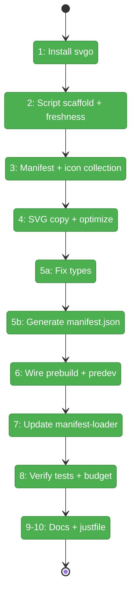
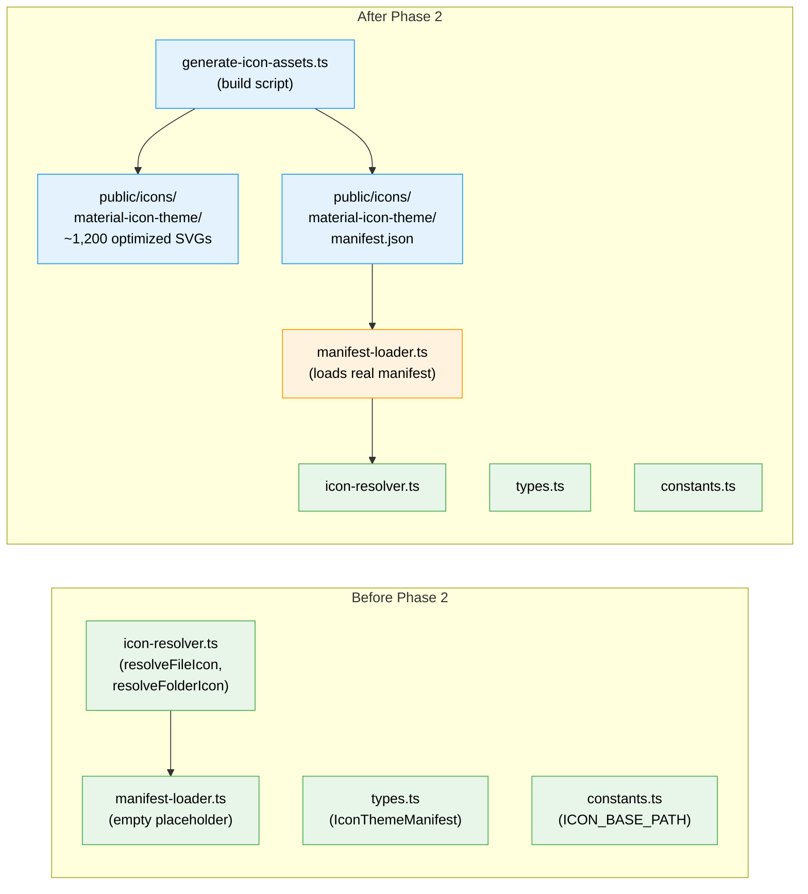

# Flight Plan: Phase 2 — Icon Asset Pipeline

**Plan**: [file-icons-plan.md](../../file-icons-plan.md)
**Phase**: Phase 2: Icon Asset Pipeline
**Generated**: 2026-03-10
**Status**: Landed

---

## Departure → Destination

**Where we are**: Phase 1 created a manifest-driven icon resolver with 35 passing tests, but the resolver operates on an empty placeholder manifest. There are no SVG icon files in `public/`, no build pipeline, and `loadManifest()` returns hardcoded empty data. The resolver engine exists but has no fuel.

**Where we're going**: A developer runs `pnpm build` and the `prebuild` step automatically extracts ~1,145 optimized SVG icons from `material-icon-theme`, generates a `manifest.json`, and deploys them to `apps/web/public/icons/material-icon-theme/`. The manifest-loader fetches this real manifest at runtime, and all 35+ resolver tests pass against real data. Total asset size stays under 500KB gzipped.

---

## Domain Context

### Domains We're Changing

| Domain | What Changes | Key Files |
|--------|-------------|-----------|
| `_platform/themes` | Add build script, replace manifest-loader placeholder, add generated assets | `scripts/generate-icon-assets.ts`, `manifest-loader.ts`, `public/icons/` |
| cross-domain | Install svgo, wire prebuild, update script index | `package.json`, `apps/web/package.json`, `scripts/scripts.md` |

### Domains We Depend On (no changes)

| Domain | What We Consume | Contract |
|--------|----------------|----------|
| `_platform/themes` (Phase 1) | `IconThemeManifest` type, `ICON_BASE_PATH` constant | types.ts, constants.ts |
| `material-icon-theme` (npm) | `generateManifest()` API, `icons/*.svg` files | Build-time only |

---

## Flight Status

<!-- Updated by /plan-6-v2: pending → active → done. Use blocked for problems/input needed. -->

**Legend**: grey = pending | yellow = active | red = blocked/needs input | green = done

---

## Stages

<!-- Updated by /plan-6-v2 during implementation: [ ] → [~] → [x] -->

- [x] **Stage 1: Install svgo** — Add svgo as root devDependency (`package.json`)
- [x] **Stage 2: Script scaffold + freshness** — Create `scripts/generate-icon-assets.ts` with CLI entry, logging, output dir helper, version-based freshness check with `--force` override (`generate-icon-assets.ts` — new file)
- [x] **Stage 3: Manifest + icon collection** — Read `generateManifest()`, collect all 1,145 unique icon names from all sections (`generate-icon-assets.ts`)
- [x] **Stage 4: SVG copy + optimize** — Copy SVGs from `node_modules/material-icon-theme/icons/`, SVGO optimize, include `_light` variants (`generate-icon-assets.ts`)
- [x] **Stage 5: Generate manifest.json** — Fix `IconThemeManifest` type (add `rootFolder`/`rootFolderExpanded`), write normalized manifest matching type (`types.ts`, `manifest.json` — new generated file)
- [~] **Stage 6: Wire prebuild + predev** — Add `prebuild` AND `predev` scripts to `apps/web/package.json` (`package.json`)
- [ ] **Stage 7: Update manifest-loader** — Replace placeholder with real manifest loading, throw actionable error on missing manifest (`manifest-loader.ts`)
- [ ] **Stage 8: Verify tests + budget** — Run script, verify 500KB budget, run test suite (`evidence`)
- [ ] **Stage 9: Update scripts.md + justfile** — Add script index entry, add `rm -rf apps/web/public/icons` to `kill-cache` and `clean` recipes (`scripts/scripts.md`, `justfile`)

---

## Architecture: Before & After

**Legend**: existing (green, unchanged) | changed (orange, modified) | new (blue, created)

---

## Acceptance Criteria

- [ ] AC-13: All SVGs in `public/icons/` under 500KB when gzipped
- [ ] AC-14: Manifest-driven resolver uses real generated manifest (not placeholder)
- [ ] AC-12: All existing resolver tests pass with real manifest data
- [ ] `prebuild` runs icon generation before `next build`
- [ ] `scripts/scripts.md` updated with new entry

## Goals & Non-Goals

**Goals**:
- ✅ Build-time asset pipeline from `material-icon-theme` to `public/icons/`
- ✅ SVGO-optimized SVGs (~40-65% size reduction)
- ✅ Real `manifest.json` matching `IconThemeManifest` type
- ✅ `manifest-loader.ts` loads real manifest (replacing Phase 1 placeholder)
- ✅ Build integration via `prebuild` script

**Non-Goals**:
- ❌ React components (`<FileIcon>`, `<FolderIcon>`) — Phase 3
- ❌ UI wiring in tree view / surfaces — Phase 4
- ❌ Cache headers, standalone build — Phase 5
- ❌ Selective curation — include all referenced icons

---

## Checklist

- [x] T001: Install `svgo` as root devDependency
- [x] T002: Create `scripts/generate-icon-assets.ts` scaffold
- [x] T003: Add manifest reading + icon name collection
- [x] T004: Add SVG copy + SVGO optimization
- [x] T005: Generate `manifest.json`
- [x] T006: Wire `prebuild` into `apps/web/package.json`
- [x] T007: Update `manifest-loader.ts` with real manifest loading
- [x] T008: Verify tests pass + asset budget
- [x] T009: Update `scripts/scripts.md`
- [x] T010: Update `justfile` — add icon cleanup to `kill-cache` and `clean`
