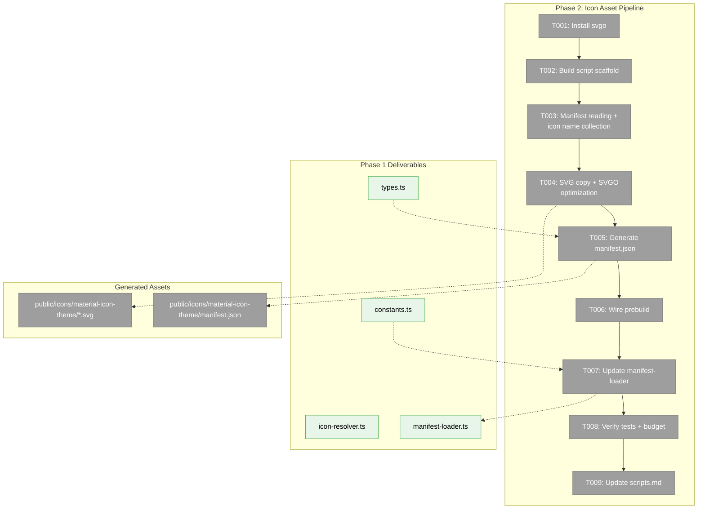
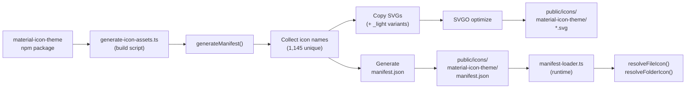
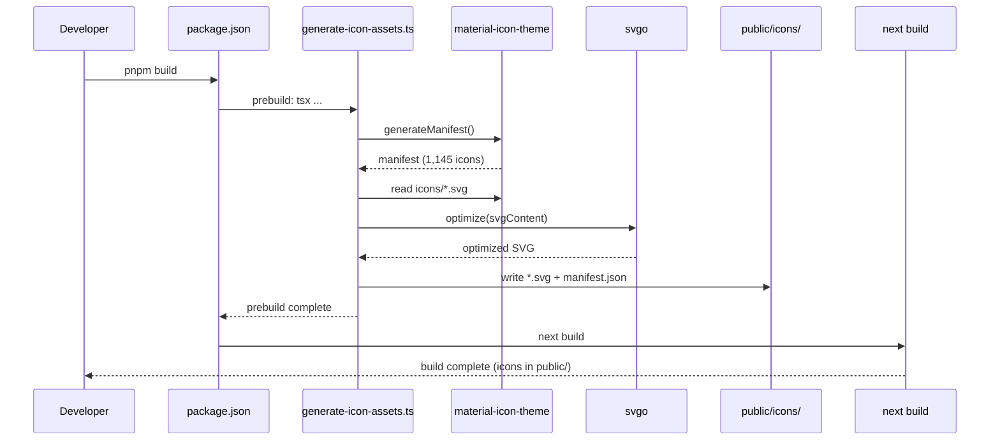

# Phase 2: Icon Asset Pipeline — Tasks

## Executive Briefing

**Purpose**: Build a script that extracts, optimizes, and deploys SVG icon assets from the `material-icon-theme` npm package into `apps/web/public/icons/`, generates a static manifest JSON for the resolver, and wires the pipeline into the build system. This phase turns the Phase 1 resolver from a working-but-empty engine into a fully loaded icon system with real assets.

**What We're Building**: A TypeScript build script (`scripts/generate-icon-assets.ts`) that calls `material-icon-theme`'s `generateManifest()`, identifies all referenced icon names across the manifest, copies the corresponding SVG files, optimizes them with SVGO, generates a normalized `manifest.json`, and outputs everything to `apps/web/public/icons/material-icon-theme/`. The script runs as a `prebuild` step so icons are always fresh before `next build`. We also update `manifest-loader.ts` to load the real generated manifest instead of the Phase 1 placeholder.

**Goals**:
- ✅ Build-time script that generates icon assets from `material-icon-theme`
- ✅ Optimized SVGs in `apps/web/public/icons/material-icon-theme/`
- ✅ Static `manifest.json` for the resolver to consume at runtime
- ✅ Updated `manifest-loader.ts` loading real manifest (replacing placeholder)
- ✅ Build pipeline integration (`prebuild` in `apps/web/package.json`)
- ✅ Total assets under 500KB gzipped
- ✅ Updated `scripts/scripts.md` index

**Non-Goals**:
- ❌ No React components (Phase 3)
- ❌ No SDK settings (Phase 3)
- ❌ No UI wiring (Phase 4)
- ❌ No cache headers or standalone build (Phase 5)
- ❌ No selective curation heuristics — include ALL manifest-referenced icons (see Discovery D001)

## Prior Phase Context

### Phase 1: Domain Setup & Icon Resolver

**A. Deliverables**:
- `apps/web/src/features/_platform/themes/lib/icon-resolver.ts` — `resolveFileIcon()`, `resolveFolderIcon()` with manifest-driven resolution (fileNames → fileExtensions → languageIds → default), light-mode support
- `apps/web/src/features/_platform/themes/lib/manifest-loader.ts` — `loadManifest()` placeholder returning empty manifest, `clearManifestCache()`
- `apps/web/src/features/_platform/themes/types.ts` — `IconThemeManifest`, `IconResolution`, `IconThemeId`
- `apps/web/src/features/_platform/themes/constants.ts` — `DEFAULT_ICON_THEME = 'material-icon-theme'`, `ICON_BASE_PATH = '/icons'`
- `apps/web/src/features/_platform/themes/index.ts` — barrel exports
- `test/unit/web/features/_platform/themes/icon-resolver.test.ts` — 35 tests (all passing)
- Domain artifacts: `domain.md`, registry row, domain-map node, C4 L3 diagram

**B. Dependencies Exported**:
- `resolveFileIcon(filename, manifest, theme?) → IconResolution` — pure function, expects manifest parameter
- `resolveFolderIcon(folderName, expanded, manifest, theme?) → IconResolution`
- `loadManifest(themeId: string) → Promise<IconThemeManifest>` — caches result, returns placeholder
- `clearManifestCache()` — clears the cached manifest
- `IconThemeManifest` type — `{ fileNames, fileExtensions, languageIds, folderNames, folderNamesExpanded, iconDefinitions, light, file, folder, folderExpanded }`
- `IconResolution` type — `{ iconName: string; iconPath: string; source: 'fileName' | 'fileExtension' | 'languageId' | 'default' }`
- `ICON_BASE_PATH = '/icons'` — base path for constructing icon URLs

**C. Gotchas & Debt**:
- `loadManifest()` returns hardcoded empty manifest — **Phase 2 replaces this** with real manifest loading
- `.ts` not in `fileExtensions`, only in `languageIds` via `detectLanguage()` bridge — the generated manifest must preserve this structure
- `iconDefinitions` paths use `"./../icons/typescript.svg"` relative format — icon name is the definition key, NOT parsed from the path
- Tests use real `material-icon-theme` manifest via `generateManifest()` directly — NOT via `loadManifest()`
- `SHIKI_TO_VSCODE_LANGUAGE_ID` map bridges Shiki → VSCode language IDs; manifest must include `languageIds` section

**D. Incomplete Items**:
- FT-003 through FT-006 (medium-severity review fixes) — docs/tests housekeeping, not blocking Phase 2
- Empty `components/` and `sdk/` directories — Phase 3 populates these

**E. Patterns to Follow**:
- Pure function resolvers — manifest is always a parameter, never baked in
- Feature folder layout: `_platform/themes/{lib/, components/, sdk/, types.ts, constants.ts, index.ts}`
- Tests use real data, no mocks
- `tsx` for script execution: `npx tsx scripts/{name}.ts`
- `<br/>` for Mermaid newlines (not `\n`)

## Pre-Implementation Check

| File | Exists? | Domain Check | Notes |
|------|---------|-------------|-------|
| `scripts/generate-icon-assets.ts` | ❌ No | `_platform/themes` | Create — main build script |
| `apps/web/public/icons/material-icon-theme/` | ❌ No | `_platform/themes` | Created by script output |
| `apps/web/src/features/_platform/themes/lib/manifest-loader.ts` | ✅ Yes | `_platform/themes` | Modify — replace placeholder with real manifest loading |
| `apps/web/package.json` | ✅ Yes | cross-domain | Modify — add `prebuild` script |
| `scripts/scripts.md` | ✅ Yes | cross-domain | Modify — add script entry |
| `package.json` (root) | ✅ Yes | cross-domain | Modify — add `svgo` devDependency |
| `test/unit/web/features/_platform/themes/icon-resolver.test.ts` | ✅ Yes | `_platform/themes` | Modify — verify tests pass with real manifest |

**Concept search**: No existing SVG pipeline, asset generation, or SVGO usage found in codebase. Clean creation.
**Harness**: Available at L3. Not required for Phase 2 (build script + manifest loader — no UI).

## Architecture Map



## Tasks

| Status | ID | Task | Domain | Path(s) | Done When | Notes |
|--------|-----|------|--------|---------|-----------|-------|
| [x] | T001 | Install `svgo` as root devDependency. Run `pnpm add -wD svgo` | cross-domain | `package.json`, `pnpm-lock.yaml` | `svgo` appears in root `devDependencies`, lockfile updated | SVGO v3.x for modern config format |
| [x] | T002 | Create `scripts/generate-icon-assets.ts` scaffold: imports (`material-icon-theme`, `svgo`, `fs`, `path`), CLI entry point with logging, `OUTPUT_DIR` constant pointing to `apps/web/public/icons/material-icon-theme/`, `ensureCleanDir()` helper that removes and recreates the output dir. **Add freshness check**: read `material-icon-theme` package version from `node_modules/material-icon-theme/package.json`, compare with sentinel file `OUTPUT_DIR/.version`. If match AND `manifest.json` exists → log "Icons up to date" and exit early. Write version to sentinel after successful generation. Support `--force` flag to skip freshness check. | `_platform/themes` | `scripts/generate-icon-assets.ts` | Script runs with `npx tsx scripts/generate-icon-assets.ts`, skips if fresh, regenerates if stale. `--force` always regenerates. | DYK-5: freshness check prevents 12-60s SVGO on every dev/build. Sentinel = `.version` file. |
| [x] | T003 | Add manifest reading + icon name collection: call `generateManifest()`, collect ALL unique icon names from `fileNames`, `fileExtensions`, `languageIds`, `folderNames`, `folderNamesExpanded`, `light.*` overrides, plus defaults (`file`, `folder`, `folderExpanded`, `rootFolder`, `rootFolderExpanded`). Deduplicate into a `Set<string>`. Log count. | `_platform/themes` | `scripts/generate-icon-assets.ts` | Script logs ~1,145 unique icon names collected. All manifest sections scanned. | Discovery: 582 file + 506 folder + 52 light = 1,145 unique (all have matching SVGs) |
| [x] | T004 | Add SVG copy + SVGO optimization: for each icon name in the collected Set, read `node_modules/material-icon-theme/icons/{name}.svg`, optimize with SVGO (preset-default), write to `OUTPUT_DIR/{name}.svg`. Log count + size savings. Handle missing SVGs gracefully (warn, skip). Light variants (e.g., `scons_light.svg`) are already in the Set from T003's `light.*` collection — no separate filesystem scan needed. | `_platform/themes` | `scripts/generate-icon-assets.ts` | All referenced SVGs copied + optimized. Script logs raw vs optimized size. Missing SVGs logged as warnings (expect 0). | DYK-4: light icon names flow through manifest.light.* → iconDefinitions → Set. 52 _light SVGs included automatically. |
| [x] | T005a | Add `rootFolder?: string` and `rootFolderExpanded?: string` to `IconThemeManifest` in `types.ts`. These fields are present in the real manifest (`"folder-root"`, `"folder-root-open"`) but were missing from the Phase 1 type. | `_platform/themes` | `apps/web/src/features/_platform/themes/types.ts` | Type compiles with new optional fields. Existing tests still pass (fields are optional). | DYK-3: type was incomplete vs real manifest output |
| [x] | T005b | Generate `manifest.json`: write a normalized manifest to `OUTPUT_DIR/manifest.json` containing `{ fileNames, fileExtensions, languageIds, folderNames, folderNamesExpanded, iconDefinitions, light, file, folder, folderExpanded, rootFolder, rootFolderExpanded }`. `iconDefinitions` should map icon name → `{ iconPath: "{name}.svg" }` (relative to manifest dir). Include only icons that were actually copied. | `_platform/themes` | `apps/web/public/icons/material-icon-theme/manifest.json` (generated) | JSON file is valid, matches `IconThemeManifest` shape from `types.ts` (including rootFolder fields), `iconDefinitions` paths are relative | Normalize paths: strip `"./../icons/"` prefix from original `iconPath` |
| [x] | T006 | Wire into build pipeline: add `"prebuild": "tsx ../../scripts/generate-icon-assets.ts"` AND `"predev": "tsx ../../scripts/generate-icon-assets.ts"` to `apps/web/package.json` scripts. Verify both `pnpm build` and `pnpm dev` trigger icon generation first. | cross-domain | `apps/web/package.json` | Running `cd apps/web && pnpm build` AND `cd apps/web && pnpm dev` both run icon generation first. Script output appears in build/dev log. | Finding 05 + DYK-1: prebuild alone skips `pnpm dev`, leaving devs with no icons on fresh clone. |
| [x] | T007 | Update `manifest-loader.ts`: replace the hardcoded placeholder manifest with a real loader that imports/fetches `manifest.json` from `/icons/material-icon-theme/manifest.json`. Keep caching behavior. On 404/missing file, throw a clear error: `"Icon assets not generated. Run: npx tsx scripts/generate-icon-assets.ts"`. Update tests to verify both success and error paths. | `_platform/themes` | `apps/web/src/features/_platform/themes/lib/manifest-loader.ts`, `test/unit/web/features/_platform/themes/icon-resolver.test.ts` | `loadManifest('material-icon-theme')` returns real manifest with 1,145+ icons. Missing manifest throws actionable error. Existing 35 resolver tests still pass. Manifest-loader tests updated. | DYK-1: hard error on missing manifest prevents silent degradation. Keep `clearManifestCache()`. Cache after first load. |
| [x] | T008 | Verify: run `npx tsx scripts/generate-icon-assets.ts`, confirm assets generated. Check total size: `du -sh apps/web/public/icons/` + gzip estimate. Run `pnpm test` to verify all 35+ tests pass with real manifest. | cross-domain | `apps/web/public/icons/material-icon-theme/` | All SVGs generated, total gzipped under 500KB, all tests pass | AC-13: asset size budget. Run after T007 to verify end-to-end. |
| [x] | T009 | Update `scripts/scripts.md`: add entry for `generate-icon-assets.ts` with description and usage. | cross-domain | `scripts/scripts.md` | Entry visible in scripts index matching existing format | |
| [x] | T010 | Update `justfile`: add `rm -rf apps/web/public/icons` to both `kill-cache` and `clean` recipes so generated icons are cleared alongside other build artifacts. This ensures `just kill-cache` forces a full icon regeneration on next dev/build. | cross-domain | `justfile` | `just kill-cache` removes `apps/web/public/icons/`, `just clean` removes it too. Next `pnpm dev` regenerates icons fresh. | DYK-5: user requested kill-cache integration to avoid half-built state |

## Context Brief

### Key Findings from Plan

- **Finding 01 (Critical)**: `.ts` is NOT in `fileExtensions` — only in `languageIds`. The generated `manifest.json` MUST preserve this structure faithfully from `generateManifest()`. Do not "fix" or "flatten" the manifest sections.
- **Finding 02 (Critical)**: Manifest includes `light` overrides (31 fileExtensions, 173 fileNames, 25 folderNames, 3 languageIds). The script must include ALL `_light.svg` variants (52 total).
- **Finding 03 (High)**: `iconDefinitions` paths use `"./../icons/typescript.svg"` format. Icon name = definition key. The SVG file is at `node_modules/material-icon-theme/icons/{name}.svg`. The generated manifest should normalize paths to `"{name}.svg"` (relative to manifest directory).
- **Finding 05 (High)**: No `prebuild` hook exists in turbo or package.json. Add `prebuild` to `apps/web/package.json`.
- **Finding 06 (High)**: `output: 'standalone'` excludes `public/`. Icons in `public/icons/` will need a separate copy step for production CLI builds. This is Phase 5 scope, but keep in mind during design.

### Domain Dependencies

- `_platform/themes`: `IconThemeManifest` type (types.ts) — manifest.json must match this shape
- `_platform/themes`: `ICON_BASE_PATH = '/icons'` (constants.ts) — output directory must align
- `_platform/themes`: `loadManifest()` (manifest-loader.ts) — Phase 2 replaces placeholder
- `material-icon-theme` (npm): `generateManifest()` — build-time manifest extraction source
- `svgo` (npm, new): SVG optimization at build time

### Domain Constraints

- `_platform/themes` is infrastructure — no business domain can depend on build scripts directly
- Generated assets go in `apps/web/public/` (Next.js static serving), not in `packages/shared/`
- `manifest.json` is a build artifact — do NOT check it into git (add to `.gitignore`)
- SVG assets are also build artifacts — add `apps/web/public/icons/` to `.gitignore`
- `scripts/` directory uses `npx tsx scripts/{name}.ts` convention for execution

### Harness Context

No agent harness needed. Phase 2 is build tooling with no UI surface. Standard testing approach.

### Reusable from Prior Phases

- `IconThemeManifest` type from `types.ts` — manifest.json schema must match
- `ICON_BASE_PATH` constant — output paths must align
- `clearManifestCache()` — used in tests when verifying real manifest loading
- Resolver test patterns — tests use `generateManifest()` directly; this continues to work

### Data Flow



### Build Pipeline Sequence



## Discoveries & Learnings

_Populated during implementation by plan-6._

| Date | Task | Type | Discovery | Resolution | References |
|------|------|------|-----------|------------|------------|
| 2026-03-10 | Pre-impl | insight | All 1,145 referenced icons have matching SVGs (0 missing). Full set is 4.8MB raw, 392KB gzipped (tarball). Under 500KB budget even without curation. | Include ALL referenced icons instead of curating ~360. Simpler, no "missing icon" edge cases. | D001 |
| 2026-03-10 | Pre-impl | insight | Light overrides: 173 fileNames + 31 fileExtensions + 25 folderNames + 25 folderNamesExpanded + 3 languageIds. 52 `_light.svg` files exist in icons dir. | Must scan for `{name}_light.svg` variants alongside regular icons. | D002 |
| 2026-03-10 | T003-T004 | gotcha | 28 icons referenced in manifest have NO matching SVG files (angular-*, svelte_*, latex-*, advpl-*, etc). These are from optional icon packs not included in base install. | Script warns and skips gracefully. Manifest only includes icons with actual SVGs (1,117 not 1,145). | D003 |
| 2026-03-10 | T004 | insight | SVGO optimization saves only 0.1% — material-icon-theme SVGs are already well-optimized. | Keep SVGO for safety (future themes may not be pre-optimized) but note minimal impact. | D004 |
| 2026-03-10 | T007 | decision | `loadManifest()` uses `node:fs` (server-only). Client components cannot import it directly. | Phase 3 will provide manifest to client components via React context or server component props. | D005 |

---

## Directory Layout

```
docs/plans/073-file-icons/
  ├── file-icons-spec.md
  ├── file-icons-plan.md
  ├── research-dossier.md
  ├── deep-research-bundle-optimization.md
  ├── deep-research-theme-adaptation.md
  ├── tasks/
  │   ├── phase-1-domain-setup-icon-resolver/
  │   │   ├── tasks.md
  │   │   ├── tasks.fltplan.md
  │   │   ├── execution.log.md
  │   │   └── reviews/
  │   └── phase-2-icon-asset-pipeline/
  │       ├── tasks.md                    ← this file
  │       ├── tasks.fltplan.md            ← flight plan (below)
  │       └── execution.log.md           ← created by plan-6
```
