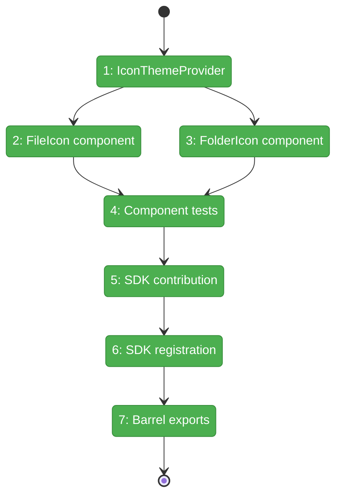
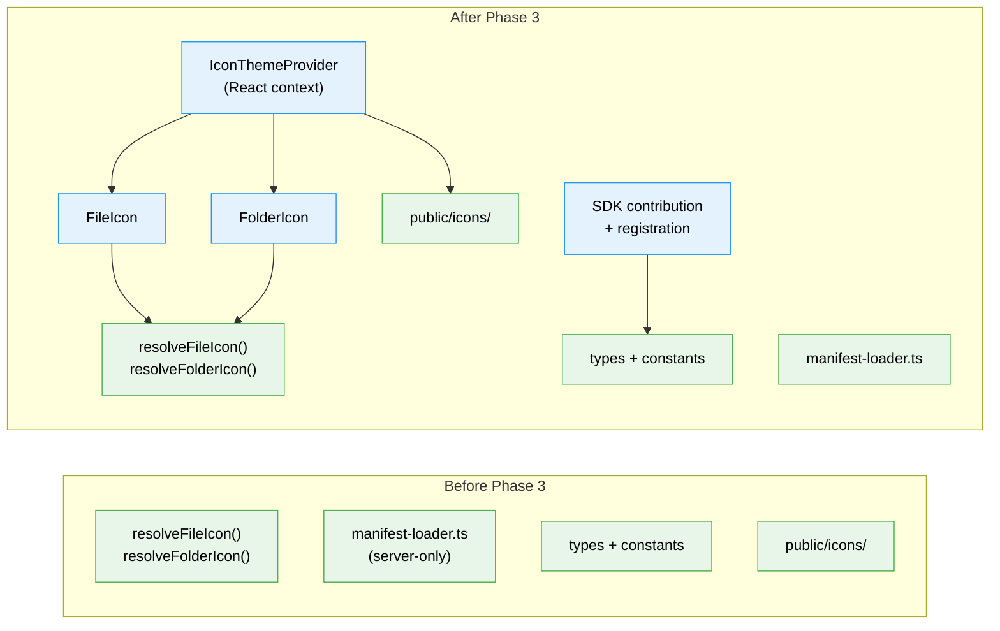

# Flight Plan: Phase 3 — FileIcon Components & SDK Setting

**Plan**: [file-icons-plan.md](../../file-icons-plan.md)
**Phase**: Phase 3: FileIcon Components & SDK Setting
**Generated**: 2026-03-10
**Status**: Landed

---

## Departure → Destination

**Where we are**: Phases 1-2 built a manifest-driven icon resolver (35 tests) and an asset pipeline that generates 1,117 optimized SVGs + a manifest.json. The resolver is a pure function that maps filenames to icon paths. But there are no React components — no way to render an icon in the UI.

**Where we're going**: A developer imports `<FileIcon filename="app.tsx" />` from `@/features/_platform/themes` and gets a themed TypeScript icon rendered as an ``. An `<IconThemeProvider>` context loads the manifest once and distributes it. A `themes.iconTheme` SDK setting is registered for future theme switching. Phase 4 consumers (FileTree, ChangesView, etc.) can now drop in `<FileIcon>` and `<FolderIcon>` anywhere.

---

## Domain Context

### Domains We're Changing

| Domain | What Changes | Key Files |
|--------|-------------|-----------|
| `_platform/themes` | Add FileIcon, FolderIcon, IconThemeProvider components + SDK contribution/registration | `components/*.tsx`, `sdk/*.ts`, `index.ts` |
| `_platform/sdk` | Wire themes registration into `registerAllDomains()` | `sdk-domain-registrations.ts` |

### Domains We Depend On (no changes)

| Domain | What We Consume | Contract |
|--------|----------------|----------|
| `_platform/themes` (Phase 1) | `resolveFileIcon()`, `resolveFolderIcon()`, types, constants | icon-resolver.ts, types.ts, constants.ts |
| `_platform/themes` (Phase 2) | Generated manifest at `/icons/material-icon-theme/manifest.json` | public/icons/ |
| `_platform/sdk` | `IUSDK`, `SDKContribution`, `sdk.settings.contribute()` | SDK infrastructure |
| `next-themes` (npm) | `useTheme()` → `resolvedTheme` | Light/dark detection |

---

## Flight Status

**Legend**: grey = pending | yellow = active | red = blocked/needs input | green = done

---

## Stages

- [~] **Stage 1: IconThemeProvider** — Create manifest context + `useIconManifest()` hook (`icon-theme-provider.tsx` — new file)
- [ ] **Stage 2: FileIcon** — Create `<FileIcon filename={...} className={...} />` client component (`file-icon.tsx` — new file)
- [ ] **Stage 3: FolderIcon** — Create `<FolderIcon name={...} expanded={...} className={...} />` client component (`folder-icon.tsx` — new file)
- [ ] **Stage 4: Tests** — Component tests for FileIcon, FolderIcon, IconThemeProvider (`icon-components.test.tsx` — new file)
- [ ] **Stage 5: SDK contribution** — `themes.iconTheme` select setting definition (`contribution.ts` — new file)
- [ ] **Stage 6: SDK registration** — Wire `registerThemesSDK()` into app bootstrap (`register.ts` — new, `sdk-domain-registrations.ts` — modify)
- [ ] **Stage 7: Barrel exports + mount provider** — Export all new public contracts from `index.ts`, mount `<IconThemeProvider>` in `providers.tsx` (`index.ts`, `providers.tsx` — modify)

---

## Architecture: Before & After

**Legend**: existing (green, unchanged) | changed (orange, modified) | new (blue, created)

---

## Acceptance Criteria

- [ ] `<FileIcon filename="app.tsx" />` renders themed TypeScript icon
- [ ] `<FileIcon filename="unknown.xyz" />` renders generic file fallback
- [ ] `<FolderIcon name="src" expanded={false} />` renders folder-src icon
- [ ] `<FolderIcon name="unknown" expanded={true} />` renders folder-open default
- [ ] `themes.iconTheme` setting appears in SDK settings panel
- [ ] All existing 37 tests still pass
- [ ] New component tests pass

## Goals & Non-Goals

**Goals**:
- ✅ Reusable `<FileIcon>` and `<FolderIcon>` components
- ✅ React context for manifest distribution
- ✅ Light/dark theme support via `useTheme()`
- ✅ SDK setting for icon theme selection
- ✅ Clean barrel exports for Phase 4 consumers

**Non-Goals**:
- ❌ Wiring into tree view or other surfaces (Phase 4)
- ❌ Contrast testing or CSS filters (Phase 5)
- ❌ Multiple theme support beyond architecture (only material-icon-theme for now)

---

## Checklist

- [x] T001: Create `IconThemeProvider` + `useIconManifest()` hook
- [x] T002: Create `<FileIcon>` component
- [x] T003: Create `<FolderIcon>` component
- [x] T004: Write component tests
- [x] T005: Create SDK contribution (`themes.iconTheme`)
- [x] T006: Create SDK registration + wire into app
- [x] T007: Update barrel exports
- [x] T008: Mount `<IconThemeProvider>` in `providers.tsx`
