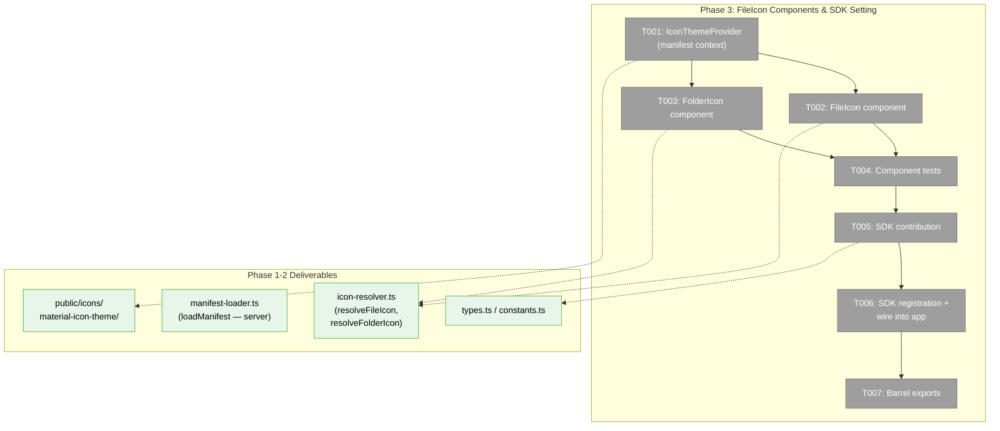
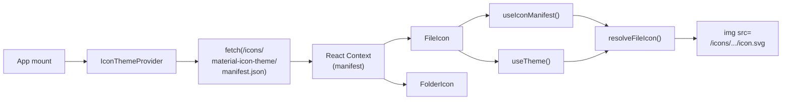
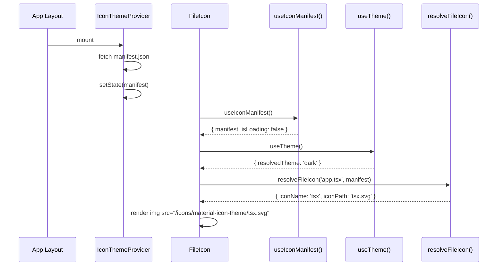

# Phase 3: FileIcon Components & SDK Setting — Tasks

## Executive Briefing

**Purpose**: Create `<FileIcon>` and `<FolderIcon>` React components that consume the Phase 1 resolver + Phase 2 manifest to render themed SVG icons, and register a `themes.iconTheme` SDK setting for future theme switching. This phase bridges the pure-function resolver layer with the React UI — after this phase, consumer components can import `<FileIcon filename="app.tsx" />` and get a themed icon.

**What We're Building**: Two client components (`<FileIcon>`, `<FolderIcon>`) that internally load the manifest, call the resolver, detect light/dark theme via `useTheme()`, and render `` tags pointing to the correct SVG in `public/icons/`. An `<IconThemeProvider>` context makes the manifest available to all icon components without prop drilling. An SDK contribution registers `themes.iconTheme` as a select setting.

**Goals**:
- ✅ `<FileIcon filename={...} className={...} />` component renders correct themed icon
- ✅ `<FolderIcon name={...} expanded={...} className={...} />` component renders folder icons
- ✅ `<IconThemeProvider>` context provides manifest to icon components
- ✅ `themes.iconTheme` SDK setting (select dropdown, default: `material-icon-theme`)
- ✅ SDK registration wired into `registerAllDomains()`
- ✅ All exports from barrel `index.ts`

**Non-Goals**:
- ❌ No UI wiring into tree view or surfaces (Phase 4)
- ❌ No light-mode contrast testing or CSS filters (Phase 5)
- ❌ No cache headers or standalone build fixes (Phase 5)
- ❌ No multiple theme support beyond manifest-driven architecture

## Prior Phase Context

### Phase 1: Domain Setup & Icon Resolver

**A. Deliverables**:
- `apps/web/src/features/_platform/themes/lib/icon-resolver.ts` — `resolveFileIcon()`, `resolveFolderIcon()` with manifest-driven resolution
- `apps/web/src/features/_platform/themes/types.ts` — `IconThemeManifest`, `IconResolution`, `IconThemeId`
- `apps/web/src/features/_platform/themes/constants.ts` — `DEFAULT_ICON_THEME`, `ICON_BASE_PATH`
- `apps/web/src/features/_platform/themes/index.ts` — barrel exports
- 35 passing tests

**B. Dependencies Exported**:
- `resolveFileIcon(filename, manifest, theme?) → IconResolution` — Phase 3 components call this
- `resolveFolderIcon(folderName, expanded, manifest, theme?) → IconResolution` — Phase 3 components call this
- `ICON_BASE_PATH = '/icons'` — used to construct `` URLs
- `DEFAULT_ICON_THEME = 'material-icon-theme'` — used as SDK setting default

**C. Gotchas**: `.ts` not in `fileExtensions`, only in `languageIds` via detectLanguage bridge. Resolver handles this transparently.

**E. Patterns**: Pure function resolvers — manifest is always a parameter, never baked in.

### Phase 2: Icon Asset Pipeline

**A. Deliverables**:
- `scripts/generate-icon-assets.ts` — build-time icon pipeline with freshness check
- `apps/web/public/icons/material-icon-theme/*.svg` — 1,117 optimized SVGs
- `apps/web/public/icons/material-icon-theme/manifest.json` — runtime manifest (424KB)
- Updated `manifest-loader.ts` — real fs-based loader (server-only, `node:fs`)

**B. Dependencies Exported**:
- `loadManifest(themeId) → Promise<IconThemeManifest>` — **server-only** (uses `node:fs`). Phase 3 must NOT call this from client components.
- Generated `manifest.json` at `/icons/material-icon-theme/manifest.json` — accessible via browser `fetch()`

**C. Gotchas**:
- `loadManifest()` is server-only — client components must use `fetch()` or receive manifest via context/props
- 28 icons referenced in manifest have no SVGs — manifest filtered to 1,117 actual icons
- SVGO saves only 0.1% — material-icon-theme SVGs already optimized

**E. Patterns**: Actionable error on missing assets. Freshness check prevents rebuilds. Two-path candidate resolution (monorepo root + apps/web root).

## Pre-Implementation Check

| File | Exists? | Domain Check | Notes |
|------|---------|-------------|-------|
| `apps/web/src/features/_platform/themes/components/file-icon.tsx` | ❌ No | `_platform/themes` | Create — main FileIcon component |
| `apps/web/src/features/_platform/themes/components/folder-icon.tsx` | ❌ No | `_platform/themes` | Create — FolderIcon component |
| `apps/web/src/features/_platform/themes/components/icon-theme-provider.tsx` | ❌ No | `_platform/themes` | Create — manifest context provider |
| `apps/web/src/features/_platform/themes/sdk/contribution.ts` | ❌ No | `_platform/themes` | Create — SDK setting definition |
| `apps/web/src/features/_platform/themes/sdk/register.ts` | ❌ No | `_platform/themes` | Create — SDK registration |
| `apps/web/src/lib/sdk/sdk-domain-registrations.ts` | ✅ Yes | `_platform/sdk` | Modify — add themes registration |
| `apps/web/src/features/_platform/themes/index.ts` | ✅ Yes | `_platform/themes` | Modify — add component + SDK exports |
| `test/unit/web/features/_platform/themes/` | ✅ Yes | `_platform/themes` | Add component tests |

**Concept search**: No existing `<FileIcon>`, `<FolderIcon>`, or icon theme provider found. Clean creation.
**Harness**: Available at L3. Not required for Phase 3 (component unit tests sufficient).

## Architecture Map



## Tasks

| Status | ID | Task | Domain | Path(s) | Done When | Notes |
|--------|-----|------|--------|---------|-----------|-------|
| [x] | T001 | Create `<IconThemeProvider>`: client component that fetches `/icons/{themeId}/manifest.json` on mount, caches in state, provides via React context. Export `useIconManifest()` hook. Show nothing (or children with fallback) while loading. Accept optional `themeId` prop defaulting to `DEFAULT_ICON_THEME` (allows future wiring to SDK setting). | `_platform/themes` | `apps/web/src/features/_platform/themes/components/icon-theme-provider.tsx` | Context provides `IconThemeManifest` to children. `useIconManifest()` returns `{ manifest, isLoading }`. `themeId` prop overrides default. | DYK-3: SDK setting disconnected for now — prop enables future wiring without provider rewrite. |
| [x] | T002 | Create `<FileIcon filename={...} className={...} />`: client component that uses `useIconManifest()` for manifest, `useTheme()` for light/dark, calls `resolveFileIcon()`, renders ``. Return `null` while manifest is loading (no flash). Size via className. | `_platform/themes` | `apps/web/src/features/_platform/themes/components/file-icon.tsx` | `<FileIcon filename="app.tsx" />` renders typescript icon. `<FileIcon filename="unknown.xyz" />` renders generic file icon. Returns null while loading. Respects light/dark theme. | DYK-4: render nothing while loading — brief empty space is less jarring than icon flash. |
| [x] | T003 | Create `<FolderIcon name={...} expanded={...} className={...} />`: client component using same pattern as FileIcon. Calls `resolveFolderIcon()`. Renders folder-specific or default folder/folder-open icon. | `_platform/themes` | `apps/web/src/features/_platform/themes/components/folder-icon.tsx` | `<FolderIcon name="src" expanded={false} />` renders folder-src icon. `<FolderIcon name="unknown" expanded={true} />` renders folder-open default. | |
| [x] | T004 | Write component tests: test FileIcon renders correct `` src for known filenames (.ts, .py, package.json), fallback for unknown, and alt attribute. Test FolderIcon for named folders and defaults. Test IconThemeProvider provides manifest. Use `@testing-library/react` for rendering. | `_platform/themes` | `test/unit/web/features/_platform/themes/icon-components.test.tsx` | Tests pass for: FileIcon with known/unknown extensions, FolderIcon with named/default folders, provider loading state. | Tests may need manifest fixture or mock fetch. Generated assets must exist (use `it.skipIf` pattern from Phase 2 if needed). |
| [x] | T005 | Create SDK contribution: `themes.iconTheme` setting with `ui: 'select'`, `z.string().default('material-icon-theme')`, options `[{ label: 'Material Icon Theme', value: 'material-icon-theme' }]`, section `'Appearance'`. Follow `file-browser/sdk/contribution.ts` pattern exactly. | `_platform/themes` | `apps/web/src/features/_platform/themes/sdk/contribution.ts` | Contribution object compiles. Setting has key, label, description, schema, ui, options, section. | Per Finding 07: use editor.wordWrap as template. Options array enables future theme additions. |
| [x] | T006 | Create SDK registration entry point: `registerThemesSDK(sdk: IUSDK)` that calls `sdk.settings.contribute()` for each setting. Wire into `registerAllDomains()` in `sdk-domain-registrations.ts`. | `_platform/themes` | `apps/web/src/features/_platform/themes/sdk/register.ts`, `apps/web/src/lib/sdk/sdk-domain-registrations.ts` | `registerThemesSDK` called during app bootstrap. Setting appears in SDK settings panel. | Import and call in registerAllDomains() after existing registrations. |
| [x] | T007 | Update barrel `index.ts`: export `FileIcon`, `FolderIcon`, `IconThemeProvider`, `useIconManifest`, and SDK registration. Verify imports work from consumer code. | `_platform/themes` | `apps/web/src/features/_platform/themes/index.ts` | All public contracts importable from barrel. `import { FileIcon, FolderIcon } from '@/features/_platform/themes'` works. | |
| [x] | T008 | Mount `<IconThemeProvider>` in `apps/web/src/components/providers.tsx`: wrap children inside the existing provider stack (after `SDKProvider`, so the provider can read SDK settings). This ensures all consumers in the app tree have manifest access. | cross-domain | `apps/web/src/components/providers.tsx` | `<IconThemeProvider>` wraps children inside `<SDKProvider>`. FileIcon/FolderIcon work anywhere below Providers. | DYK-1: Phase 4 consumers need the provider mounted. Must be inside SDKProvider (for setting) and inside ThemeProvider (for useTheme). |

## Context Brief

### Key Findings from Plan

- **Finding 07 (High)**: SDK setting template: use `editor.wordWrap` pattern from file-browser SDK contribution (select UI + string schema). Location: `apps/web/src/features/041-file-browser/sdk/contribution.ts`.
- **Finding 02 (Critical)**: Light-mode overrides exist (31 fileExtensions, 173 fileNames). Components must pass `theme` to resolver when `resolvedTheme === 'light'`.
- **Finding 03 (High)**: `iconDefinitions` map icon name → `{ iconPath: "{name}.svg" }`. URL construction: `${ICON_BASE_PATH}/${themeId}/${iconName}.svg`.
- **D005 from Phase 2**: `loadManifest()` is server-only. Client components must fetch manifest via browser `fetch()` or receive via context.

### Domain Dependencies

- `_platform/themes` (Phase 1): `resolveFileIcon()`, `resolveFolderIcon()` — core resolution logic consumed by components
- `_platform/themes` (Phase 1): `IconThemeManifest`, `IconResolution` types — used by context and components
- `_platform/themes` (Phase 1): `DEFAULT_ICON_THEME`, `ICON_BASE_PATH` constants — URL construction
- `_platform/sdk`: `IUSDK`, `SDKContribution`, `sdk.settings.contribute()` — SDK registration infrastructure
- `next-themes` (npm): `useTheme()` → `resolvedTheme` for light/dark detection
- `zod` (npm): `z.string().default()` for SDK setting schema

### Domain Constraints

- `_platform/themes` is infrastructure — components go in `components/`, SDK in `sdk/`
- `FileIcon` and `FolderIcon` are **client components** (need `useTheme()`, `useContext()`)
- Do NOT import `loadManifest` in client components (uses `node:fs`)
- SDK registration wires into `_platform/sdk` domain's `registerAllDomains()` — follow existing pattern exactly
- Dependency direction: `file-browser` → `_platform/themes` ✅ (business → infrastructure)

### SDK Contribution Pattern

```typescript
// contribution.ts — define setting
export const themesContribution: SDKContribution = {
  domain: 'themes',
  domainLabel: 'Themes',
  commands: [],
  settings: [{
    key: 'themes.iconTheme',
    domain: 'themes',
    label: 'File Icon Theme',
    description: 'Icon theme for file and folder icons',
    schema: z.string().default('material-icon-theme'),
    ui: 'select',
    options: [{ label: 'Material Icon Theme', value: 'material-icon-theme' }],
    section: 'Appearance',
  }],
  keybindings: [],
};

// register.ts — register with SDK
export function registerThemesSDK(sdk: IUSDK): void {
  for (const setting of themesContribution.settings) {
    sdk.settings.contribute(setting);
  }
}

// sdk-domain-registrations.ts — wire into app
import { registerThemesSDK } from '@/features/_platform/themes/sdk/register';
// inside registerAllDomains():
registerThemesSDK(sdk);
```

### Reusable from Prior Phases

- `resolveFileIcon()` / `resolveFolderIcon()` — pure functions, call directly in components
- `ICON_BASE_PATH` / `DEFAULT_ICON_THEME` — URL construction constants
- `IconThemeManifest` type — context value type
- `it.skipIf(!GENERATED_MANIFEST_EXISTS)` — test pattern for asset-dependent tests
- `useTheme()` pattern from `terminal-inner.tsx`, `diff-viewer.tsx` — `resolvedTheme` detection

### Data Flow



### Component Rendering Sequence



## Discoveries & Learnings

_Populated during implementation by plan-6._

| Date | Task | Type | Discovery | Resolution | References |
|------|------|------|-----------|------------|------------|

---

## Directory Layout

```
docs/plans/073-file-icons/
  ├── file-icons-spec.md
  ├── file-icons-plan.md
  ├── tasks/
  │   ├── phase-1-domain-setup-icon-resolver/
  │   ├── phase-2-icon-asset-pipeline/
  │   └── phase-3-fileicon-components-sdk-setting/
  │       ├── tasks.md                    ← this file
  │       ├── tasks.fltplan.md            ← flight plan
  │       └── execution.log.md           ← created by plan-6
```
