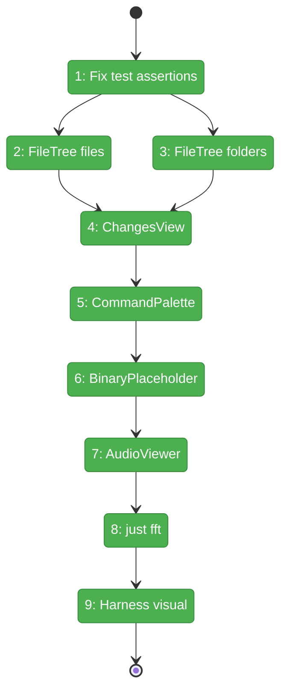
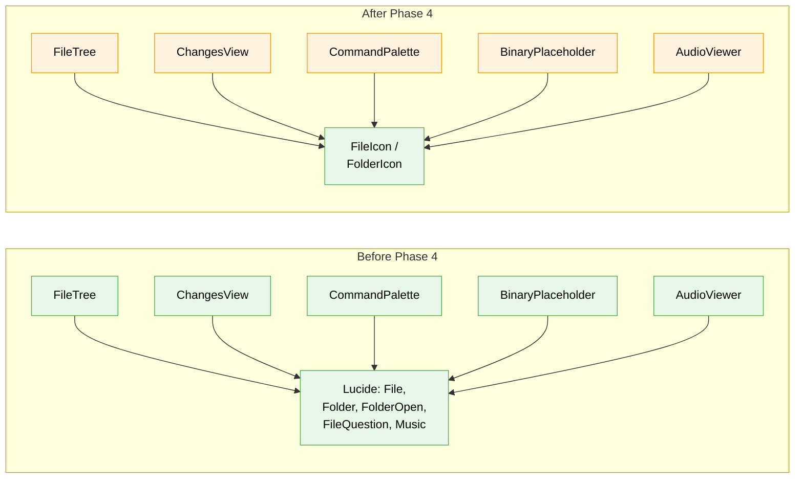

# Flight Plan: Phase 4 — Tree & Surface Integration

**Plan**: [file-icons-plan.md](../../file-icons-plan.md)
**Phase**: Phase 4: Tree & Surface Integration
**Generated**: 2026-03-10
**Status**: Landed

---

## Departure → Destination

**Where we are**: Phases 1-3 built a complete icon infrastructure: resolver (35 tests), asset pipeline (1,117 SVGs), React components (`<FileIcon>`, `<FolderIcon>`), and an `<IconThemeProvider>` mounted in the app. But every file-presenting surface still renders generic grey Lucide icons. The themed icons exist but nobody uses them yet.

**Where we're going**: A developer opens the file browser and sees distinct TypeScript, Python, JSON, Dockerfile icons for files, and themed src/test/node_modules icons for folders. The same themed icons appear in the changes view, command palette search results, binary placeholder, and audio viewer. All existing tests pass with updated assertions.

---

## Domain Context

### Domains We're Changing

| Domain | What Changes | Key Files |
|--------|-------------|-----------|
| `file-browser` | Replace Lucide icons with FileIcon/FolderIcon in FileTree, ChangesView, BinaryPlaceholder, AudioViewer | `file-tree.tsx`, `changes-view.tsx`, `binary-placeholder.tsx`, `audio-viewer.tsx`, `file-tree.test.tsx` |
| `_platform/panel-layout` | Replace Lucide File icon in CommandPaletteDropdown search results | `command-palette-dropdown.tsx` |

### Domains We Depend On (no changes)

| Domain | What We Consume | Contract |
|--------|----------------|----------|
| `_platform/themes` (Phase 3) | `FileIcon`, `FolderIcon` components | `@/features/_platform/themes` barrel |

---

## Flight Status

**Legend**: grey = pending | yellow = active | red = blocked/needs input | green = done

---

## Stages

- [x] **Stage 1: Fix test assertions** — Update `file-tree.test.tsx` SVG count checks to accept `img` tags (`file-tree.test.tsx` — modify)
- [x] **Stage 2: FileTree files** — Replace `<File>` with `<FileIcon>` for file entries (`file-tree.tsx` — modify)
- [x] **Stage 3: FileTree folders** — Replace `<Folder>`/`<FolderOpen>` with `<FolderIcon>` (`file-tree.tsx` — modify)
- [x] **Stage 4: ChangesView** — Replace `<File>` with `<FileIcon>` (`changes-view.tsx` — modify)
- [x] **Stage 5: CommandPalette** — Replace `<File>` with `<FileIcon>` in search results (`command-palette-dropdown.tsx` — modify)
- [x] **Stage 6: BinaryPlaceholder** — Replace `<FileQuestion>` with `<FileIcon>` (`binary-placeholder.tsx` — modify)
- [x] **Stage 7: AudioViewer** — Replace `<Music>` with `<FileIcon>` (`audio-viewer.tsx` — modify)
- [x] **Stage 8: just fft** — Full quality gate (`evidence`)
- [x] **Stage 9: Harness visual** — Screenshot verification of icons in running app (`evidence`)

---

## Architecture: Before & After

**Legend**: existing (green, unchanged) | changed (orange, modified)

---

## Acceptance Criteria

- [ ] AC-1: File type icons render in tree view (`.ts`, `.py`, `.json`, `.md`, `.html`, `.css`, `.go`, `.rs`, `.java` all distinct)
- [ ] AC-2: Folder-specific icons render (`src`, `test`, `node_modules`, `.git`, `docs`, `public`)
- [ ] AC-3: Unknown extensions fall back gracefully (`.xyz` → generic file icon)
- [ ] AC-4: Special filenames recognized (`Dockerfile`, `package.json`, `.gitignore`)
- [ ] AC-8: ChangesView shows file icons
- [ ] AC-9: Command palette search shows file icons
- [ ] AC-10: Binary file viewers show file icons
- [ ] AC-11: Existing tests pass (updated assertions)

## Goals & Non-Goals

**Goals**:
- ✅ Themed icons in all 5 file-presenting surfaces
- ✅ Existing tests green with updated assertions
- ✅ Visual verification via harness

**Non-Goals**:
- ❌ PdfViewer (no file icon to replace)
- ❌ Light-mode contrast testing (Phase 5)
- ❌ Cache headers or standalone build (Phase 5)

---

## Checklist

- [x] T001: Fix `file-tree.test.tsx` SVG count assertions
- [x] T002: FileTree — replace file icons with `<FileIcon>`
- [x] T003: FileTree — replace folder icons with `<FolderIcon>`
- [x] T004: ChangesView — replace `<File>` with `<FileIcon>`
- [x] T005: CommandPaletteDropdown — replace `<File>` with `<FileIcon>`
- [x] T006: BinaryPlaceholder — replace `<FileQuestion>` with `<FileIcon>`
- [x] T007: AudioViewer — replace `<Music>` with `<FileIcon>`
- [x] T008: Run `just fft`
- [x] T009: Harness visual verification
