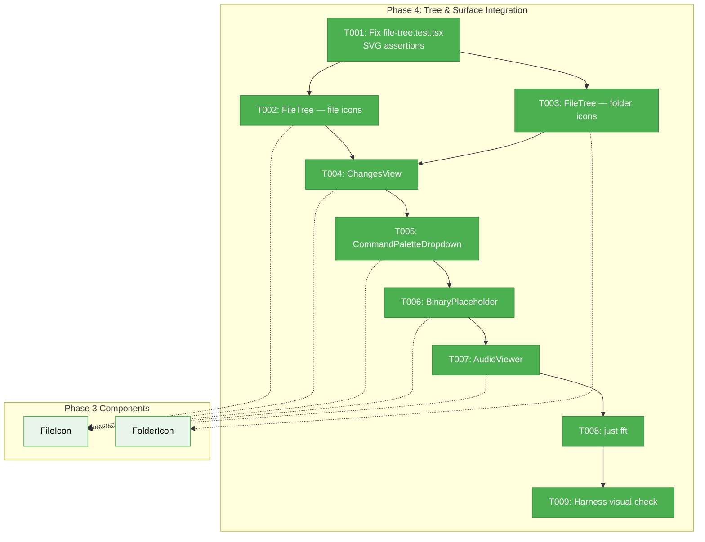
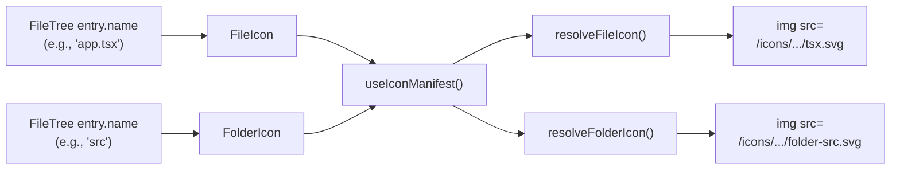
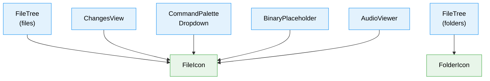

# Phase 4: Tree & Surface Integration — Tasks

## Executive Briefing

**Purpose**: Wire `<FileIcon>` and `<FolderIcon>` components from Phase 3 into all file-presenting surfaces across the app. This is the phase where users actually see themed icons — the resolver, assets, and components built in Phases 1-3 become visible. The primary risk is breaking existing test assertions that count inline SVG elements, since `<FileIcon>` renders `` tags instead.

**What We're Building**: Replace generic Lucide icons (`<File>`, `<Folder>`, `<FolderOpen>`, `<FileQuestion>`, `<Music>`) with themed `<FileIcon>` and `<FolderIcon>` in 5 surfaces: FileTree, ChangesView, CommandPaletteDropdown, BinaryPlaceholder, and AudioViewer. Fix test assertions FIRST to avoid false failures.

**Goals**:
- ✅ File-type icons in FileTree (files AND folders)
- ✅ File-type icons in ChangesView
- ✅ File-type icons in CommandPaletteDropdown search results
- ✅ File-type icon in BinaryPlaceholder
- ✅ File-type icon in AudioViewer
- ✅ Existing tests updated and passing
- ✅ `just fft` green

**Non-Goals**:
- ❌ PdfViewer — only has a UI chrome `<ExternalLink>` icon, not a file identification icon. No change needed.
- ❌ Light-mode contrast testing or CSS filters (Phase 5)
- ❌ Cache headers or standalone build (Phase 5)

## Prior Phase Context

### Phase 1: Domain Setup & Icon Resolver
- **Deliverables**: `resolveFileIcon()`, `resolveFolderIcon()` pure functions, `IconThemeManifest` type, 35 tests
- **Exported**: `resolveFileIcon(filename, manifest, theme?) → IconResolution`, `resolveFolderIcon(name, expanded, manifest, theme?) → IconResolution`
- **Gotchas**: `.ts` not in `fileExtensions`, only in `languageIds` via bridge — resolver handles this transparently
- **Patterns**: Pure function resolvers, manifest always a parameter

### Phase 2: Icon Asset Pipeline
- **Deliverables**: `scripts/generate-icon-assets.ts`, 1,117 optimized SVGs in `public/icons/material-icon-theme/`, `manifest.json`
- **Exported**: Generated assets at `/icons/material-icon-theme/{iconName}.svg`
- **Gotchas**: 28 icons have no SVGs (optional packs) — manifest filtered to 1,117. SVGO barely helps (0.1%).
- **Patterns**: Freshness check, `predev`/`prebuild` hooks, `just kill-cache` clears icons

### Phase 3: FileIcon Components & SDK Setting
- **Deliverables**: `<FileIcon>`, `<FolderIcon>`, `<IconThemeProvider>`, `useIconManifest()`, SDK setting, 11 tests
- **Exported**: `import { FileIcon, FolderIcon } from '@/features/_platform/themes'`
- **Gotchas**: Components return `null` while manifest loads. `loadManifest()` is server-only (separate `server.ts` entrypoint). Provider mounted in `providers.tsx`.
- **Patterns**: `<FileIcon filename={entry.name} className="h-4 w-4" />` — just pass filename and className

## Pre-Implementation Check

| File | Exists? | Domain Check | Notes |
|------|---------|-------------|-------|
| `apps/web/src/features/041-file-browser/components/file-tree.tsx` | ✅ Yes | `file-browser` | Modify — replace File/Folder/FolderOpen icons |
| `apps/web/src/features/041-file-browser/components/changes-view.tsx` | ✅ Yes | `file-browser` | Modify — replace File icon |
| `apps/web/src/features/_platform/panel-layout/components/command-palette-dropdown.tsx` | ✅ Yes | `_platform/panel-layout` | Modify — replace File icon in search results |
| `apps/web/src/features/041-file-browser/components/binary-placeholder.tsx` | ✅ Yes | `file-browser` | Modify — replace FileQuestion icon |
| `apps/web/src/features/041-file-browser/components/audio-viewer.tsx` | ✅ Yes | `file-browser` | Modify — replace Music icon |
| `test/unit/web/features/041-file-browser/file-tree.test.tsx` | ✅ Yes | `file-browser` | Modify — fix SVG count assertions FIRST |

**Concept search**: No existing themed icon wiring found. Clean integration.
**Harness**: Running and healthy. Will use for visual verification after wiring.

## Architecture Map



## Tasks

| Status | ID | Task | Domain | Path(s) | Done When | Notes |
|--------|-----|------|--------|---------|-----------|-------|
| [x] | T001 | Fix `file-tree.test.tsx` SVG count assertions: change `querySelectorAll('svg').length` checks to accept both `svg` and `img` elements (e.g., `querySelectorAll('svg, img[src*=".svg"]').length`). Must pass BEFORE any icon changes. | `file-browser` | `test/unit/web/features/041-file-browser/file-tree.test.tsx` | All existing file-tree tests pass with updated assertions. No false failures when icons switch from Lucide SVG to img. | Finding 04: fix BEFORE wiring. Lines ~119-129 have SVG counts. |
| [x] | T002 | FileTree file icons: replace ALL `<File className="..." />` instances used for file identification with `<FileIcon filename={entry.name} className="h-4 w-4 shrink-0" />`. Search for every `<File ` JSX usage in the file (~8 spots including edit mode, normal mode, root entries). Strip `text-muted-foreground` color class (img tags ignore it). Import `FileIcon` from `@/features/_platform/themes`. | `file-browser` | `apps/web/src/features/041-file-browser/components/file-tree.tsx` | All file entries show type-specific icons. No remaining `<File ` from lucide for file identification. | DYK-1: strip color classes. DYK-2: ~8 sites not 2. |
| [x] | T003 | FileTree folder icons: replace ALL `<Folder className="..." />` and `<FolderOpen className="..." />` instances with `<FolderIcon name={entry.name} expanded={isExpanded} className="h-4 w-4 shrink-0" />`. Search for every `<Folder ` and `<FolderOpen ` in the file (~8 spots including nested, root, create-new-folder UI). Strip `text-blue-*` color classes. For "create new folder" UI spots where no folder name exists yet, pass empty string (default folder icon). Remove unused Folder/FolderOpen/File imports from lucide-react. | `file-browser` | `apps/web/src/features/041-file-browser/components/file-tree.tsx` | All folder entries show themed icons. No remaining `<Folder ` or `<FolderOpen ` for folder identification. Unused lucide imports removed. | DYK-2: ~8 folder sites. DYK-3: create-new-folder gets default icon. |
| [x] | T004 | ChangesView: replace `<File className="h-3.5 w-3.5 shrink-0 text-muted-foreground" />` with `<FileIcon filename={name} className="h-3.5 w-3.5 shrink-0" />`. Strip color class. Import `FileIcon`. | `file-browser` | `apps/web/src/features/041-file-browser/components/changes-view.tsx` | Changed files show type-specific icons. | `name` already extracted in scope. |
| [x] | T005 | CommandPaletteDropdown: replace `<File className="h-3.5 w-3.5 shrink-0 text-muted-foreground" />` with `<FileIcon filename={...} className="h-3.5 w-3.5 shrink-0" />`. Extract filename from `entry.path`. Strip color class. Import from `@/features/_platform/themes`. Preserve badge-vs-icon ternary. | `_platform/panel-layout` | `apps/web/src/features/_platform/panel-layout/components/command-palette-dropdown.tsx` | File search results show type-specific icons. Status badges still override. | `entry.path` is full path. Extract filename. |
| [x] | T006 | BinaryPlaceholder: replace `<FileQuestion className="h-16 w-16 ..." />` with `<FileIcon filename={filename} className="h-16 w-16" />`. Strip color classes. Import from themes. | `file-browser` | `apps/web/src/features/041-file-browser/components/binary-placeholder.tsx` | Binary files show type-specific icon. | DYK-5: large icon — verify visually in T009. |
| [x] | T007 | AudioViewer: replace `<Music className="h-12 w-12 text-muted-foreground" />` with `<FileIcon filename={filename} className="h-12 w-12" />`. Strip color class. | `file-browser` | `apps/web/src/features/041-file-browser/components/audio-viewer.tsx` | Audio files show audio-type icon. | DYK-5: large icon — verify visually in T009. |
| [x] | T008 | Run `just fft` — lint, format, typecheck, all tests pass. | cross-domain | — | Zero failures in full test suite. | Must pass before harness check. |
| [x] | T009 | Harness visual verification: navigate to file browser in harness, expand a directory with mixed file types, verify icons render. Screenshot evidence. | cross-domain | — | Icons visible in running app. Screenshot captured. | Use `just harness screenshot` or browser automation. |

## Context Brief

### Key Findings from Plan

- **Finding 04 (High)**: `file-tree.test.tsx` has 6 assertions checking `querySelectorAll('svg').length === 1`. Switching from Lucide `<File>` (inline SVG) to `` will break these — `` doesn't have SVG DOM nodes. **Fix FIRST** in T001.
- **Finding 01 (Critical)**: `.ts` is NOT in `fileExtensions` — only in `languageIds`. Phase 4 just passes filenames to `<FileIcon>` — the resolver handles this internally.

### Domain Dependencies

- `_platform/themes` (Phase 3): `FileIcon`, `FolderIcon` components — drop-in replacements for Lucide file icons
- `_platform/themes` (Phase 3): `useIconManifest()` — not needed directly (components use it internally)
- `file-browser`: `entry.name`, `entry.path`, `isExpanded` — existing data available at every icon site
- `_platform/panel-layout`: `entry.path` in `FileSearchEntry` — path to extract filename from

### Domain Constraints

- `file-browser` → `_platform/themes` ✅ (business → infrastructure)
- `_platform/panel-layout` → `_platform/themes` ✅ (infrastructure → infrastructure, peer)
- Phase 4 does NOT modify any `_platform/themes` code — pure consumer integration
- Lucide imports (`File`, `Folder`, `FolderOpen`, etc.) should be removed if no longer used in the file

### Reusable from Prior Phases

- Component API: `<FileIcon filename={name} className="h-4 w-4 shrink-0" />` — direct replacement
- Component API: `<FolderIcon name={name} expanded={isOpen} className="h-4 w-4 shrink-0" />` — direct replacement
- Test pattern: `it.skipIf(!GENERATED_MANIFEST_EXISTS)` if needed
- `IconThemeProvider` already mounted in `providers.tsx` — no provider setup needed

### Data Flow



### Surface Wiring Map



## Discoveries & Learnings

_Populated during implementation by plan-6._

| Date | Task | Type | Discovery | Resolution | References |
|------|------|------|-----------|------------|------------|
| 2026-03-10 | Pre-impl | insight | PdfViewer has no file identification icon — only `<ExternalLink>` UI chrome. Removed from scope. | 5 surfaces instead of 6. Plan task 4.8 skipped. | D001 |
| 2026-03-10 | T008 | discovery | 4 additional test files (changes-view, file-viewer-panel, command-palette-dropdown, inline-edit-input) need themes mock | Added `vi.mock('@/features/_platform/themes')` to all 4 | D002 |
| 2026-03-10 | Review | fix | F001: Badge ternary in ChangesView/CommandPalette replaced icon entirely for working changes | Changed to show badge AND FileIcon together (VSCode pattern) | D003 |

---

## Directory Layout

```
docs/plans/073-file-icons/
  ├── file-icons-spec.md
  ├── file-icons-plan.md
  ├── tasks/
  │   ├── phase-1-domain-setup-icon-resolver/
  │   ├── phase-2-icon-asset-pipeline/
  │   ├── phase-3-fileicon-components-sdk-setting/
  │   └── phase-4-tree-surface-integration/
  │       ├── tasks.md                    ← this file
  │       ├── tasks.fltplan.md            ← flight plan
  │       └── execution.log.md           ← created by plan-6
```
