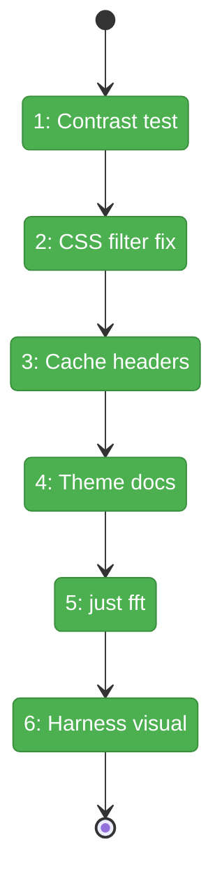
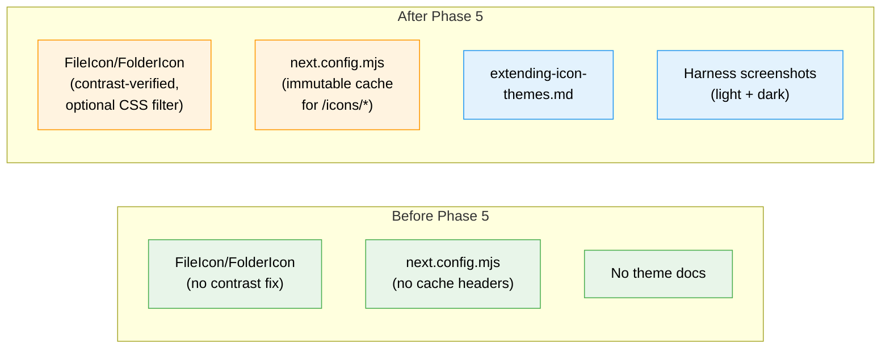

# Flight Plan: Phase 5 — Theme Adaptation & Polish

**Plan**: [file-icons-plan.md](../../file-icons-plan.md)
**Phase**: Phase 5: Theme Adaptation & Polish
**Generated**: 2026-03-10
**Status**: Landed

---

## Departure → Destination

**Where we are**: Phases 1-4 built a complete icon pipeline: resolver (37 tests), 1,117 SVGs, React components, and all 5 file-presenting surfaces wired with themed icons. 5,327 tests pass. But we haven't verified contrast in light mode, icons have no cache headers, there's no documentation for adding future themes, and we have no screenshot evidence of the integration working.

**Where we're going**: A developer opens the file browser in both light and dark mode and sees distinct, contrast-tested icons. Icon requests are served with immutable cache headers (1-year). A how-to guide explains how to add a new icon theme. Harness screenshots provide visual evidence of the full integration.

---

## Domain Context

### Domains We're Changing

| Domain | What Changes | Key Files |
|--------|-------------|-----------|
| `_platform/themes` | Possible CSS filter for light-mode contrast; new documentation | `file-icon.tsx`, `folder-icon.tsx`, `extending-icon-themes.md` |
| cross-domain | Cache headers in next.config.mjs | `next.config.mjs` |

### Domains We Depend On (no changes)

| Domain | What We Consume | Contract |
|--------|----------------|----------|
| `_platform/themes` (Phase 3) | `FileIcon`, `FolderIcon`, `useTheme()` light/dark detection | `@/features/_platform/themes` barrel |
| `next-themes` | `resolvedTheme` for light/dark detection | `useTheme()` hook |

---

## Flight Status

**Legend**: grey = pending | yellow = active | red = blocked/needs input | green = done

---

## Stages

- [x] **Stage 1: Contrast test** — Inspect 20 common icons in light + dark mode via harness (`visual inspection`)
- [x] **Stage 2: CSS filter fix** — N/A: no contrast problems found
- [x] **Stage 3: Cache headers** — Add immutable cache headers for `/icons/*` (`next.config.mjs` — modify)
- [x] **Stage 4: Theme docs** — Write extending-icon-themes guide (`extending-icon-themes.md` — new file)
- [x] **Stage 5: just fft** — Final quality gate (`evidence`)
- [x] **Stage 6: Harness visual** — Screenshot verification in both themes (`evidence`)

---

## Architecture: Before & After

**Legend**: existing (green, unchanged) | changed (orange, modified) | new (blue, created)

---

## Acceptance Criteria

- [ ] AC-1: File type icons render in tree view (`.ts`, `.py`, `.json`, `.md`, `.html`, `.css`, `.go`, `.rs`, `.java` all distinct)
- [ ] AC-2: Folder-specific icons render (`src`, `test`, `node_modules`, `.git`, `docs`, `public`)
- [ ] AC-3: Unknown extensions fall back gracefully (`.xyz` → generic file icon)
- [ ] AC-4: Special filenames recognized (`Dockerfile`, `package.json`, `.gitignore`)
- [ ] AC-5: Icons visible in light and dark mode with adequate contrast
- [ ] AC-6: `/icons/*` served with immutable cache headers
- [ ] AC-7: How-to guide for extending icon themes exists
- [ ] AC-8: Harness screenshots captured for both themes

## Goals & Non-Goals

**Goals**:
- ✅ Contrast-verified icons in both themes
- ✅ Production cache headers
- ✅ Theme extension documentation
- ✅ Visual evidence via harness

**Non-Goals**:
- ❌ Multi-theme UI switching
- ❌ CLI standalone build (packages/cli/ doesn't exist)
- ❌ New icon surfaces or components

---

## Checklist

- [x] T001: Contrast test 20 common icons in light + dark
- [x] T002: CSS filter fix (N/A — no issues found)
- [x] T003: Cache headers in next.config.mjs
- [x] T004: Write extending-icon-themes.md
- [x] T005: Run `just fft`
- [x] T006: Harness visual verification (light + dark screenshots)
