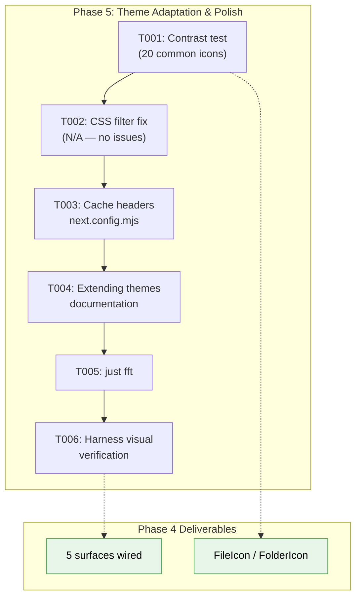
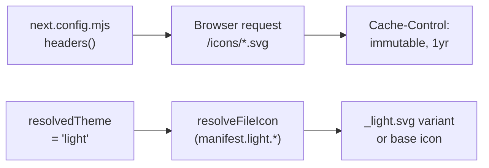
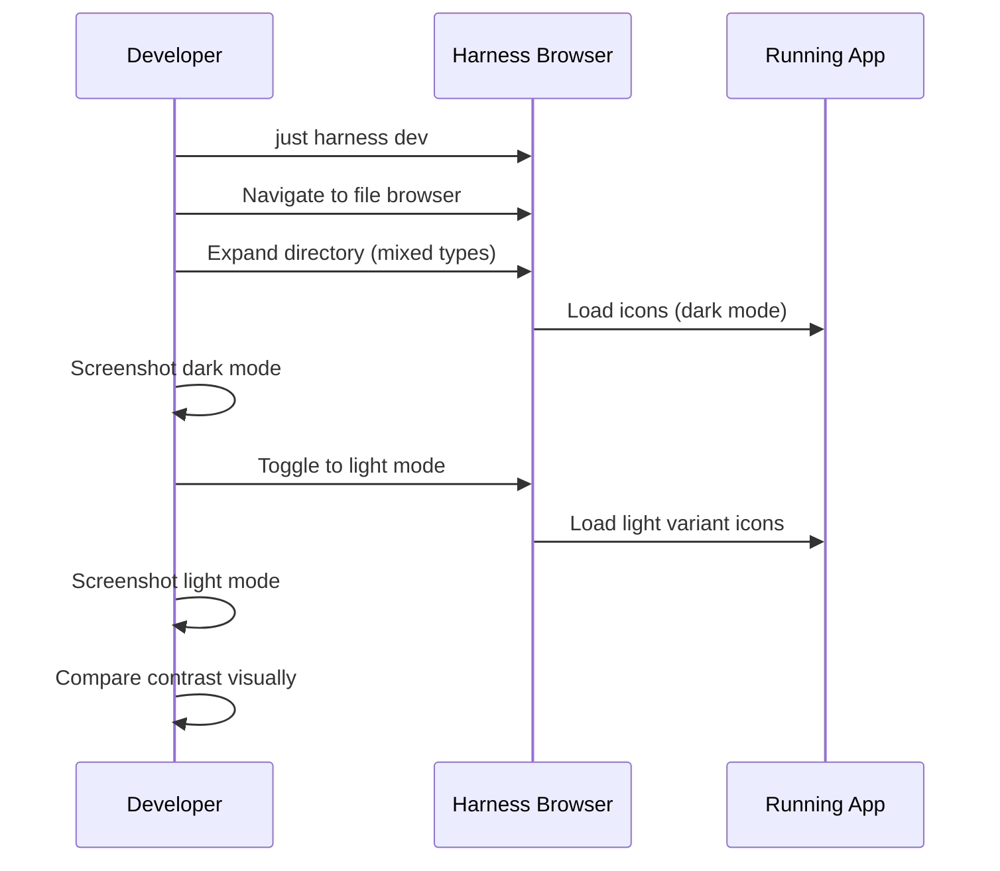

# Phase 5: Theme Adaptation & Polish — Tasks

## Executive Briefing

**Purpose**: Verify icons look correct in both light and dark mode, add production cache headers, document the theme extension workflow, and visually verify the full integration in the harness. This is the final quality and production-readiness phase — no new features, just polish and hardening.

**What We're Building**: Contrast-tested icons in both themes, immutable cache headers for `/icons/*`, a how-to guide for adding future icon themes, and screenshot evidence of the full integration working in the running app.

**Goals**:
- ✅ All common icons contrast-tested against light and dark backgrounds
- ✅ CSS filter adaptation applied if any icons fail WCAG 3:1 contrast
- ✅ Immutable cache headers for `/icons/*` in next.config.mjs
- ✅ `docs/how/extending-icon-themes.md` documentation
- ✅ Harness visual verification with screenshots (light + dark)
- ✅ `just fft` green

**Non-Goals**:
- ❌ Multi-theme UI switching (SDK setting exists but wiring deferred)
- ❌ New icon surfaces or components
- ❌ CLI standalone build (packages/cli/ does not exist — no action needed)

## Prior Phase Context

### Phase 1: Domain Setup & Icon Resolver
- **Deliverables**: `resolveFileIcon()`, `resolveFolderIcon()` pure functions, `IconThemeManifest` type, `constants.ts`, barrel `index.ts`, 25 TDD tests
- **Dependencies Exported**: Resolver functions take manifest as parameter. `IconResolution` returns `{ iconName, iconPath, source }`.
- **Gotchas**: `.ts` NOT in `fileExtensions` — only in `languageIds`. Resolver handles transparently.
- **Patterns**: Pure functions, real manifest data in tests (no mocks), `<br/>` in Mermaid labels

### Phase 2: Icon Asset Pipeline
- **Deliverables**: `scripts/generate-icon-assets.ts` (230 lines), 1,117 optimized SVGs (440KB gzipped), `manifest.json`, `predev`/`prebuild` hooks
- **Dependencies Exported**: `/icons/material-icon-theme/{name}.svg` static assets, `manifest.json` for browser fetch
- **Gotchas**: 28 missing SVGs (optional packs) — warned and skipped. SVGO saves only 0.1%. Server-only `loadManifest()` uses `node:fs`.
- **Patterns**: Freshness check via `.version` sentinel, `--force` flag

### Phase 3: FileIcon Components & SDK Setting
- **Deliverables**: `<FileIcon>`, `<FolderIcon>`, `<IconThemeProvider>`, `useIconManifest()`, SDK `themes.iconTheme` setting, 11 component tests
- **Dependencies Exported**: Components return ``, accept `filename`/`name` + `className` props. Return `null` while loading.
- **Gotchas**: `useIconManifest()` throws without provider. Components use `useTheme()` from `next-themes` — `resolvedTheme === 'light'` triggers light-mode resolver path.
- **Patterns**: Provider in `providers.tsx`, null during loading, `data-testid` for mock assertions

### Phase 4: Tree & Surface Integration
- **Deliverables**: 5 surfaces wired (FileTree, ChangesView, CommandPaletteDropdown, BinaryPlaceholder, AudioViewer), 6 test files updated with theme mocks
- **Gotchas**: Badge+icon now coexist (not either/or) in ChangesView and CommandPaletteDropdown. 4 additional test files needed mocks. PdfViewer excluded (no file icon to replace).
- **Incomplete**: T009 harness visual verification not done. Large icons (h-16, h-12) not visually verified.
- **Patterns**: Strip `text-muted-foreground`/`text-blue-*` color classes (img ignores them). `vi.mock('@/features/_platform/themes')` in all consumer tests.

## Pre-Implementation Check

| File | Exists? | Domain Check | Notes |
|------|---------|-------------|-------|
| `apps/web/next.config.mjs` | ✅ Yes | cross-domain | No `headers()` config yet. Has `output: 'standalone'`. |
| `apps/web/src/features/_platform/themes/components/file-icon.tsx` | ✅ Yes | `_platform/themes` | Renders `` with `className`. No CSS filter logic yet. |
| `apps/web/src/features/_platform/themes/components/folder-icon.tsx` | ✅ Yes | `_platform/themes` | Same pattern as FileIcon. |
| `docs/how/extending-icon-themes.md` | ❌ No | `_platform/themes` | Create — new documentation file. |
| `docs/domains/file-browser/domain.md` | ✅ Yes | `file-browser` | Already updated in Phase 4 review fix F003. **Skip T006.** |
| `docs/domains/_platform/panel-layout/domain.md` | ✅ Yes | `_platform/panel-layout` | Already updated in Phase 4 review fix F003. **Skip T006.** |
| `packages/cli/package.json` | ❌ No | N/A | **Does not exist.** Plan task 5.4 invalid — no CLI package to update. **Skip T004.** |
| `apps/web/public/icons/material-icon-theme/*.svg` | ✅ Yes | `_platform/themes` | 1,117 SVGs, 50 `_light.svg` variants (4.5% coverage). |

**Concept search**: No existing cache headers pattern found in next.config.mjs.
**Harness**: Container was running and healthy during Phase 4. `just harness health` for verification.

## Architecture Map



## Tasks

| Status | ID | Task | Domain | Path(s) | Done When | Notes |
|--------|-----|------|--------|---------|-----------|-------|
| [x] | T001 | Contrast test: visually inspect the 20 most common file-type icons (`.ts`, `.js`, `.py`, `.json`, `.md`, `.html`, `.css`, `.go`, `.rs`, `.java`, `.tsx`, `.jsx`, `.yaml`, `.toml`, `.sh`, `.dockerfile`, `.gitignore`, `package.json`, `.svg`, `.png`) against light and dark sidebar backgrounds using the harness. Check the 50 existing `_light.svg` variants. Document any icons with poor contrast. | `_platform/themes` | `apps/web/public/icons/material-icon-theme/` | List of problem icons documented (0 = great, >0 = need CSS fix in T002). | material-icon-theme already ships 50 light variants. Most icons are multi-color SVGs with good contrast. |
| [x] | T002 | If T001 finds problem icons: add conditional CSS filter (e.g., `brightness(0.7)` or `drop-shadow`) via a wrapper className on `` in FileIcon/FolderIcon when `resolvedTheme === 'light'`. If T001 finds NO problems: mark as N/A and skip. | `_platform/themes` | `apps/web/src/features/_platform/themes/components/file-icon.tsx`, `folder-icon.tsx` | All icons meet ~3:1 contrast in both themes, or confirmed already passing. | Finding 02: manifest.light has 31 fileExtension overrides + 50 _light.svg files. |
| [x] | T003 | Add immutable cache headers for `/icons/*` in `next.config.mjs`. Use `headers()` async function to return `Cache-Control: public, immutable, max-age=31536000` for the `/icons/:path*` pattern. | cross-domain | `apps/web/next.config.mjs` | `curl -I localhost:3000/icons/material-icon-theme/typescript.svg` shows immutable cache header. | Finding 06. Icons are build-time generated, content-addressed by theme version. |
| [x] | T004 | Write `docs/how/extending-icon-themes.md`: how to add a new VSCode-compatible icon theme. Cover: (1) install npm package, (2) update generate-icon-assets.ts to include new theme, (3) add manifest entry, (4) register in SDK setting options, (5) test with `pnpm dev`. | `_platform/themes` | `docs/how/extending-icon-themes.md` | Guide exists, covers complete workflow with code examples. | New file. |
| [x] | T005 | Run `just fft` — final quality gate for the entire 073 plan. | cross-domain | — | Zero failures in full test suite. | Must pass before harness check. |
| [x] | T006 | Harness visual verification: start harness (`just harness dev`), navigate to file browser, expand a directory with mixed file types (.ts, .json, .md, folders like src/, node_modules/). Capture screenshots in both light and dark mode. Verify icons render correctly at all sizes (h-4 tree, h-3.5 changes, h-12 audio, h-16 binary). | cross-domain | — | Screenshots captured showing distinct file-type icons in both themes. Icons visible at all sizes. | Combines Phase 4 T009 + Phase 5 T007. Per ADR-0014: visual features require harness coverage. |

## Context Brief

### Key Findings from Plan

- **Finding 02 (Critical)**: Manifest includes `light` theme overrides (31 file extensions, plus folder/filename overrides). Some icons have `_light.svg` variants. Resolver already checks `manifest.light.*` when theme='light' — Phase 5 validates this works visually.
- **Finding 06 (High)**: `output: 'standalone'` in next.config.mjs excludes `public/` from standalone build. Icons must be handled separately. However, `packages/cli/` does not exist — standalone build task is N/A for now. Cache headers still needed.

### Domain Dependencies

- `_platform/themes` (Phase 3): `FileIcon`, `FolderIcon` components — already rendering themed icons via `useTheme()` light/dark detection
- `_platform/themes` (Phase 2): Generated SVGs at `/icons/material-icon-theme/` — 50 `_light.svg` variants for light-mode contrast
- `next-themes`: `useTheme()` → `resolvedTheme` — already wired in FileIcon/FolderIcon

### Domain Constraints

- `_platform/themes` → changes to FileIcon/FolderIcon (T002) are internal — no contract changes
- `next.config.mjs` is cross-domain — cache headers affect all static assets under `/icons/*`
- Documentation in `docs/how/` is cross-domain knowledge

### Harness Context

- **Boot**: `just harness dev` — health check: `just harness health`
- **Interact**: Browser automation via CDP, `just harness screenshot <name>`
- **Observe**: Screenshots in harness evidence directory
- **Maturity**: L3 — Boot + Browser Interaction + Structured Evidence + CLI SDK
- **Pre-phase validation**: Agent MUST validate harness at start of T006

### Reusable from Prior Phases

- `useTheme()` light/dark detection already in FileIcon/FolderIcon (Phase 3)
- `manifest.light.*` resolver path already implemented and tested (Phase 1, 37 tests)
- `vi.mock('@/features/_platform/themes')` pattern for consumer tests (Phase 4)
- Harness container configuration from Phase 4 troubleshooting

### Data Flow



### Contrast Testing Flow



## Discoveries & Learnings

_Populated during implementation by plan-6._

| Date | Task | Type | Discovery | Resolution | References |
|------|------|------|-----------|------------|------------|
| 2026-03-10 | Pre-impl | insight | `packages/cli/` does not exist. Plan task 5.4 (standalone build) is invalid. | Dropped task — no CLI package to update. Cache headers still apply. | D001 |
| 2026-03-10 | Pre-impl | insight | Plan task 5.6 (domain docs) already completed in Phase 4 review fix F003. | Dropped task — already done. | D002 |
| 2026-03-10 | Pre-impl | insight | 50 of 1,117 icons (4.5%) have `_light.svg` variants. Most icons are multi-color and likely fine in both themes. | Contrast testing focuses on the 20 most common, noting which have light variants. | D003 |

---

## Directory Layout

```
docs/plans/073-file-icons/
  ├── file-icons-spec.md
  ├── file-icons-plan.md
  ├── tasks/
  │   ├── phase-1-domain-setup-icon-resolver/
  │   ├── phase-2-icon-asset-pipeline/
  │   ├── phase-3-fileicon-components-sdk-setting/
  │   ├── phase-4-tree-surface-integration/
  │   └── phase-5-theme-adaptation-polish/
  │       ├── tasks.md                    ← this file
  │       ├── tasks.fltplan.md            ← flight plan
  │       └── execution.log.md           ← created by plan-6
```
