# Research Report: Workflow Execution from UI

**Generated**: 2026-03-13T22:23:00Z
**Research Query**: "test-pipeline command runs a real pipeline — rig into UI for run/stop/restart with live updates via events+state system"
**Mode**: Pre-Plan
**Location**: `docs/plans/074-workflow-execution/research-dossier.md`
**FlowSpace**: Available
**Findings**: 73 across 8 subagents

## Executive Summary

### What It Does
The codebase has a complete orchestration engine (`OrchestrationService` → `GraphOrchestration.drive()`) that runs positional-graph workflows through a Settle → Decide → Act loop with real agent pods. Today this engine is only wired in the CLI (`cg wf run <slug>`) and test scripts (`just test-pipeline`). The web UI can edit workflows and observe file-change SSE events but cannot start, stop, or restart execution.

### Business Purpose
Enable users to run workflows directly from the browser, see live progress as nodes execute, immediately kill a running workflow, and restart from scratch — transforming the UI from a passive editor into an active execution control surface.

### Key Insights
1. **No execution surface in web today**: OrchestrationService is not registered in the web DI container, and there are zero server actions for run/stop/restart.
2. **No stop/abort mechanism exists**: `drive()` runs until complete/failed/max-iterations with no cancellation token, abort signal, or stop method.
3. **SSE→State routing for workflows is not wired**: `GlobalStateConnector` only routes `work-unit-state`; workflow SSE goes directly to `useWorkflowSSE` hook, bypassing the global state system entirely.
4. **Domain boundaries are clear**: Execution control should extend `_platform/positional-graph`, not live in `workflow-ui` (leaf consumer) or `workflow-events` (node Q&A only).

### Quick Stats
- **Components**: ~50 files across orchestration, workflow-ui, events, state domains
- **Dependencies**: OrchestrationService needs 6 collaborators (graphService, ONBAS, ODS, eventHandlerService, podManager, agentManager) — 2 are missing from web DI
- **Test Coverage**: Strong unit coverage for orchestration engine; zero coverage for UI-driven execution
- **Complexity**: High — requires DI wiring, new contracts, new server actions, new SSE channels, AbortController integration, state routing, and UI components
- **Prior Learnings**: 15 relevant discoveries from previous implementations
- **Domains**: 7 relevant domains identified

---

## How It Currently Works

### Entry Points

| Entry Point | Type | Location | Purpose |
|------------|------|----------|---------|
| `just test-pipeline` | Script | `scripts/test-advanced-pipeline.ts` | 6-node E2E with real Copilot agents |
| `cg wf run <slug>` | CLI command | `apps/cli/src/commands/positional-graph.command.ts:1900` | Drive graph to completion (polling loop) |
| `scripts/drive-demo.ts` | Script | `scripts/drive-demo.ts:27-75` | Simple graph drive demo |
| `scripts/test-copilot-serial.ts` | Script | `scripts/test-copilot-serial.ts:316-339` | Serial pipeline test |
| No web entry point | — | — | **Gap: no server action or API route exists** |

### Core Execution Flow

1. **Build Stack** (manual in scripts, DI in CLI):
   - `FakeNodeEventRegistry` + `registerCoreEventTypes`
   - `createEventHandlerRegistry()` + `NodeEventService` + `EventHandlerService`
   - `PodManager`, `AgentContextService`, `ScriptRunner`
   - `ODS(graphService, podManager, contextService, agentManager, scriptRunner, workUnitService)`
   - `ONBAS()`
   - `OrchestrationService(graphService, onbas, ods, eventHandlerService, podManager)`

2. **Get Handle**: `orchestrationService.get(ctx, graphSlug)` → cached `IGraphOrchestration`

3. **Drive**: `handle.drive({ maxIterations, actionDelayMs, idleDelayMs, onEvent })` → polling loop:
   - Load pod sessions
   - Loop: `run()` → emit status → persist sessions → check terminal → delay → repeat
   - `run()` internally: settle events → build reality → ONBAS decide → ODS execute → record

4. **ODS Dispatch** (fire-and-forget):
   - `graphService.startNode()` → reserves node
   - `podManager.createPod()` → AgentPod or CodePod
   - `pod.execute()` → starts agent/script without awaiting

5. **Result**: `DriveResult { exitReason: 'complete' | 'failed' | 'max-iterations', iterations, totalActions }`

### Data Flow

```mermaid
graph LR
    A[User clicks Run] --> B[Server Action]
    B --> C[OrchestrationService.get]
    C --> D[handle.drive]
    D --> E[run loop]
    E --> F[ONBAS decide]
    F --> G[ODS execute]
    G --> H[Pod dispatch]
    H --> I[Agent/Script runs]
    I --> J[Filesystem changes]
    J --> K[CentralWatcherService]
    K --> L[SSE broadcast]
    L --> M[UI updates]
```


### State Management
- **Graph state**: Filesystem-backed YAML/JSON under `.chainglass/data/workflows/`
- **Pod sessions**: `pod-sessions.json` per graph, loaded/persisted each iteration
- **Node status**: Tracked in graph state (ready, starting, agent-accepted, complete, error, etc.)
- **UI state**: `useState` in workflow-editor, refreshed via SSE → server action refetch

---

## Architecture & Design

### Component Map

#### Orchestration Stack (`_platform/positional-graph`)
- **OrchestrationService**: Singleton factory, caches one `GraphOrchestration` per graphSlug
- **GraphOrchestration**: Per-graph handle implementing Settle → Decide → Act loop
- **ONBAS**: Pure synchronous rules engine — walks lines/nodes, returns next action
- **ODS**: Async execution dispatcher — reserves nodes, creates pods, fires execution
- **PodManager**: Creates/caches AgentPod/CodePod, manages session IDs
- **ScriptRunner**: Spawns bash subprocesses with timeout/kill support
- **AgentContextService**: Resolves context inheritance (noContext, contextFrom, left-neighbor)

#### Events Pipeline (`_platform/events`)
- **CentralWatcherService**: Filesystem watcher, routes to adapters
- **WorkflowWatcherAdapter**: Detects graph changes, emits watcher events
- **WorkflowDomainEventAdapter**: Maps watcher events to SSE: `{ graphSlug, changeType }`
- **CentralEventNotifierService**: Routes domain events to SSE broadcaster
- **SSEManager**: Server-side connection manager, broadcasts to channels
- **MultiplexedSSEProvider**: Client-side single EventSource, demuxes by channel

#### State System (`_platform/state`)
- **GlobalStateSystem**: In-memory pub/sub with path-based addressing
- **GlobalStateConnector**: Invisible component wiring SSE → state routes
- **ServerEventRoute**: Bridge: SSE channel events → state paths via descriptor
- **useGlobalState/useGlobalStateList**: React hooks for reactive subscriptions

### Design Patterns Identified
1. **Settle → Decide → Act loop** (orchestration core)
2. **SSE = invalidation signal, server action = source of truth refresh** (workflow UI)
3. **Single physical SSE connection, multiple logical channels** (mux architecture)
4. **Fakes over mocks with canned FIFO queues** (testing)
5. **Callback-stream DriveEvent pattern** (real-time status)
6. **Server Component loads → Client Component owns interactive state** (data flow)

### System Boundaries
- **Orchestration is agent-agnostic** (ADR-0012): drive() knows nothing about agents, pods, or events
- **Events on disk are the sole interface** between engine and outside world
- **File-change SSE** currently the only mechanism for execution status reaching the UI

---

## Dependencies & Integration

### What Needs Wiring for Web Execution

| Dependency | Status in Web DI | Required By | Fix |
|-----------|-----------------|-------------|-----|
| `IPositionalGraphService` | ✅ Registered | OrchestrationService | Already available |
| `IOrchestrationService` | ❌ Not registered | Server actions | Call `registerOrchestrationServices()` |
| `EventHandlerService` | ❌ Not registered | OrchestrationService | Wire in `di-container.ts` |
| `ScriptRunner` | ❌ Not registered | ODS | Wire in `di-container.ts` |
| `IAgentManagerService` | ⚠️ Wrong version | ODS | Plan 034 interface needed, Plan 019 registered |
| `PodManager` | ❌ Not registered | OrchestrationService | Wire in `di-container.ts` |
| `AgentContextService` | ❌ Not registered | ODS | Wire in `di-container.ts` |
| `IWorkUnitService` | ✅ Registered | ODS | Already available |

### Critical Interface Mismatch (DC-07)
- ODS expects `IAgentManagerService` from Plan 034 with `getNew()` and `getWithSessionId()`
- Web DI registers Plan 019 `AgentManagerService` with `createAgent()` instead
- **Must resolve before orchestration works in web**

### What Depends on Workflow Execution (proposed consumers)
- **workflow-ui** — Run/Stop/Restart buttons, live status display, node locking
- **workflow-events** — Q&A during execution (existing)
- **work-unit-state** — Per-node status aggregation (existing)

### SSE Channel Architecture

| Channel | Current Purpose | Execution Need |
|---------|----------------|----------------|
| `workflows` | File-change notifications | Could extend with execution events |
| `work-unit-state` | Per-node status updates | Already routes to GlobalState |
| `agents` | Agent lifecycle | Pod status during execution |
| **`workflow-execution`** | **Does not exist** | **New: run started/stopped/completed/failed** |

---

## Quality & Testing

### Current Coverage
- **Orchestration engine**: Strong unit coverage (drive, run, ONBAS, ODS, pods, fakes)
- **Workflow UI**: Editor display tests only (canvas, cards, modals, toolbox) — no execution tests
- **SSE infrastructure**: Good coverage (mux, channels, watcher routing)
- **E2E pipeline**: `test-advanced-pipeline.ts` + integration tests (opt-in/manual)

### Test Gaps for UI-Driven Execution
1. No tests for start/run/resume/cancel from web
2. No tests for SSE delivery of orchestration events to UI
3. `useWorkflowSSE` hook has no direct test
4. `workflow-editor.tsx` has no direct test
5. No tests for live progress display during execution
6. No end-to-end browser flow tests for execution

### Fake Orchestration Capabilities
- `FakeOrchestrationService` / `FakeGraphOrchestration` can simulate:
  - Queued `run()` results (FIFO)
  - Queued `drive()` results with configurable events
  - Reality snapshots
  - Call history inspection
- Limitations: Cannot simulate filesystem changes, SSE delivery, or real agent behavior

---

## Modification Considerations

### ✅ Safe to Modify
1. **`workflow-actions.ts`**: Add new server actions following established pattern (auth → ctx → service → call → return)
2. **`WorkspaceDomain` channels**: Add new channel name — pure additive
3. **`GlobalStateConnector`**: Add new `ServerEventRoute` — follows existing pattern
4. **`workflow-temp-bar.tsx`**: Already has disabled placeholder Run button

### ⚠️ Modify with Caution
1. **`di-container.ts`**: Adding orchestration registration — must resolve AgentManager interface mismatch
2. **`IOrchestrationService` / `IGraphOrchestration`**: Adding stop/cancel — affects CLI consumer too
3. **`graph-orchestration.ts`**: Adding AbortController — must not break existing drive() semantics
4. **`orchestration-service.types.ts`**: Extending types — consumed by CLI, tests, fakes

### 🚫 Danger Zones
1. **`ODS.execute()` fire-and-forget pattern**: Changing to awaited would alter orchestration timing
2. **Existing SSE channel behavior**: Must not break file-change → UI refresh flow
3. **Pod session persistence**: Used for context inheritance — changes affect agent continuity

### Extension Points
1. **DriveOptions.onEvent callback**: Natural place to bridge drive events to SSE
2. **WorkspaceDomain const**: Designed for adding new channel names
3. **GlobalStateConnector SERVER_EVENT_ROUTES array**: Designed for adding new route descriptors
4. **`workflow-actions.ts`**: Follows consistent pattern for adding new actions

---

## Prior Learnings (From Previous Implementations)

### 📚 Critical Learnings

| ID | Type | Source Plan | Key Insight | Action |
|----|------|-------------|-------------|--------|
| PL-01 | gotcha | 030 | Must settle events before deciding next action | Every run iteration needs settle → inspect → act |
| PL-02 | unexpected | 032 | startNode/answerQuestion → `starting`, not `agent-accepted` | UI must model two-phase handshake, not assume "answered=resumed" |
| PL-03 | gotcha | 032 | One processGraph pass may not be quiescent | Keep settling until zero events remain |
| PL-04 | gotcha | 061 | answerQuestion is not atomic (answer + restart are separate) | Surface partial-failure states to UI |
| PL-05 | gotcha | 033 | AgentPod historically dropped agent events | Verify pod→adapter→event forwarding end-to-end |
| PL-06 | unexpected | 033 | resume-node handlers were dead code | UI "Answer" must resume live pod/session |
| PL-07 | decision | 030/033 | Adapters should be cached/shared per session ID | Enforce "no session, no resume" |
| PL-08 | decision | 027 | Long-lived watchers must be singleton, not request-scoped | Don't start execution from server actions; bootstrap once |
| PL-09 | gotcha | 072 | Multiple EventSources per tab exhausted connections | Use one EventSource per workspace tab (mux) |
| PL-10 | gotcha | 072 | Reconnect storms from RSC prop identity changes | Memoize by `channels.join(',')` |
| PL-11 | gotcha | 053 | Inline defaults caused infinite rerender loops | Pin defaults with useRef, stable useCallback |
| PL-12 | decision | 053 | Global state is denormalized, not transactional | Model around readable current state + change notifications |
| PL-13 | gotcha | 050 | SSE dropped structure events; mutation lock stuck | Process full batch with structure-priority; use finally |
| PL-14 | gotcha | 072 | Hook migration missed channel field + enabled gating | Fix type contract and subscription gating |
| PL-15 | gotcha | 072 | Permanent SSE breaks networkidle waits | Use DOM assertions, not networkidle |

### ⚠️ PL-08 Is Architecturally Critical
**Server actions cannot be long-running.** Next.js server actions are request-scoped. `drive()` runs for minutes. The institutional pattern is: **bootstrap long-running orchestration once as a singleton, push status via SSE**. Server actions should only *start/stop/query* the running process, not *be* the running process.

---

## Domain Context

### Existing Domains Relevant to This Research

| Domain | Relationship | Relevant Contracts | Key Components |
|--------|-------------|-------------------|----------------|
| `_platform/positional-graph` | **Core engine** | IOrchestrationService, IGraphOrchestration, IONBAS, IODS, IPodManager | OrchestrationService, GraphOrchestration, ODS, ONBAS, PodManager |
| `workflow-ui` | **UI consumer** | None (leaf) | WorkflowEditor, WorkflowCanvas, WorkflowTempBar |
| `workflow-events` | **Node Q&A** | IWorkflowEvents | WorkflowEventsService, answerQuestion |
| `_platform/events` | **SSE transport** | ICentralEventNotifier, ISSEBroadcaster, WorkspaceDomain, useChannelEvents | SSEManager, MultiplexedSSEProvider, CentralWatcherService |
| `_platform/state` | **Runtime state** | IStateService, useGlobalState, ServerEventRouteDescriptor | GlobalStateSystem, GlobalStateConnector, ServerEventRoute |
| `work-unit-state` | **Node status** | WorkUnitStateService | workUnitStateRoute (already in GlobalStateConnector) |
| `agents` | **Agent management** | IAgentManagerService | AgentManagerService (Plan 019 vs Plan 034 mismatch) |

### Domain Map Position
```
workflow-ui (leaf consumer)
  └── consumes → _platform/positional-graph (execution engine)
  └── consumes → workflow-events (node Q&A)
  └── consumes → _platform/events (SSE channels)
  └── consumes → _platform/state (runtime state)
  └── consumes → work-unit-state (node status)
```

### Potential Domain Actions
- **Extend `_platform/positional-graph`**: Add `IWorkflowExecutionControl` with start/stop/restart/status
- **Add `WorkspaceDomain.WorkflowExecution`**: New SSE channel for execution lifecycle events
- **Add `workflowExecutionRoute`**: New ServerEventRoute in GlobalStateConnector
- **Do NOT create new domain**: Keep execution in positional-graph; add thin server-action contract for web

---

## Critical Discoveries

### 🚨 Critical Finding 01: No Stop/Abort Mechanism
**Impact**: Critical
**Source**: IA-04, IC-02, IC-06, DB-06
**What**: `drive()` has no cancellation token, abort signal, or stop method. The `OrchestrationRequest` union has no stop/cancel variant. Killing a workflow requires killing the process.
**Why It Matters**: "Immediately stop a workflow" is a core requirement — this must be built from scratch.
**Required Action**: Add AbortController/signal support to `drive()`, extend `IGraphOrchestration` with stop(), add corresponding server action.

### 🚨 Critical Finding 02: OrchestrationService Not in Web DI
**Impact**: Critical
**Source**: IA-05, DC-05, DC-06
**What**: Web DI container calls `registerPositionalGraphServices()` but NOT `registerOrchestrationServices()`. Missing: ScriptRunner, EventHandlerService registrations. AgentManager interface mismatch.
**Why It Matters**: Cannot run any orchestration from web without DI wiring.
**Required Action**: Wire orchestration services in web DI, resolve Plan 019 vs 034 AgentManager.

### 🚨 Critical Finding 03: Server Actions Can't Be Long-Running
**Impact**: Critical
**Source**: PL-08, PS-10
**What**: Next.js server actions are request-scoped. `drive()` runs for minutes. Prior learning explicitly warns: don't start long-running systems from server actions.
**Why It Matters**: Architecture must use singleton background execution with server action triggers, not server action execution.
**Required Action**: Bootstrap orchestration as singleton; server actions only trigger start/stop/query.

### 🚨 Critical Finding 04: Workflow SSE Not in Global State
**Impact**: High
**Source**: DC-09, PS-05, IC-08
**What**: `GlobalStateConnector` only mounts `workUnitStateRoute`. Workflow SSE bypasses global state entirely — goes directly from `useWorkflowSSE` to refetch.
**Why It Matters**: Live execution status should flow through the state system for consistent cross-component reactivity.
**Required Action**: Add workflow execution ServerEventRoute descriptor, wire into GlobalStateConnector.

---

## Recommendations

### If Building Workflow Execution from UI
1. **Architecture**: Singleton execution manager bootstrapped at startup, not per-request server actions
2. **Stop mechanism**: AbortController in drive() — set flag, check each iteration, kill pods
3. **Resume**: drive() already resumes from disk state — just call drive() again
4. **Restart**: Clear graph state, reset all nodes, then start fresh drive()
5. **Live updates**: Bridge DriveEvent callback → SSE broadcast → GlobalState → UI hooks
6. **Node locking**: Running/completed nodes locked; future nodes remain editable (check line ordering)

### Implementation Priority
1. Wire orchestration in web DI (prerequisite for everything)
2. Add stop/abort to drive() (core contract change)
3. Create execution manager singleton with start/stop/restart
4. Add server actions as thin control surface
5. Add SSE channel + GlobalState route for execution events
6. Build UI: Run/Stop/Restart buttons, live status, node locking

---

## External Research Opportunities

### Research Opportunity 1: Next.js Long-Running Background Tasks Pattern

**Why Needed**: Need to run minutes-long orchestration from web app; server actions timeout
**Impact on Plan**: Architecture-defining — determines how execution is hosted
**Source Findings**: PL-08, PS-10

**Ready-to-use prompt:**
```
/deepresearch "Next.js 16 App Router: best practices for long-running background tasks triggered by user action. Context: We need to run a workflow orchestration loop (5-10 minutes) from a Next.js web app. Server actions are request-scoped. We need: (1) singleton process that survives request lifecycle, (2) SSE for live progress, (3) clean shutdown on stop. Stack: Next.js 16, React 19, Node.js 20. Consider: instrumentation.ts bootstrap, global singletons, API route streaming, separate worker process."
```

### Research Opportunity 2: AbortController Patterns for Multi-Stage Pipelines

**Why Needed**: Need to immediately stop a running pipeline that has multiple concurrent agent pods
**Impact on Plan**: Affects drive() contract extension and pod cleanup
**Source Findings**: IC-02, IC-04, PS-10

**Ready-to-use prompt:**
```
/deepresearch "AbortController patterns for cancelling multi-stage async pipelines in Node.js/TypeScript. Context: Pipeline has a polling loop calling run() repeatedly, each run() may dispatch fire-and-forget pod.execute() calls. Need to: (1) stop the loop immediately, (2) kill all running pods/subprocesses, (3) leave graph state in a resumable condition. Consider: cooperative cancellation, signal propagation to child processes, cleanup guarantees, partial-completion state."
```

---

## Appendix: File Inventory

### Core Orchestration Files
| File | Purpose | Lines |
|------|---------|-------|
| `packages/positional-graph/src/features/030-orchestration/orchestration-service.ts` | Singleton handle factory | 62 |
| `.../graph-orchestration.ts` | Per-graph drive/run loop | 229 |
| `.../orchestration-service.types.ts` | All public types/interfaces | 165 |
| `.../onbas.ts` | Decision engine | 160 |
| `.../ods.ts` | Execution dispatcher | 225 |
| `.../pod-manager.ts` | Pod lifecycle + sessions | 93 |
| `.../script-runner.ts` | Bash subprocess runner | 78 |

### Web Workflow Files
| File | Purpose | Lines |
|------|---------|-------|
| `apps/web/app/actions/workflow-actions.ts` | Server actions (no run/stop) | 665 |
| `apps/web/src/features/050-workflow-page/components/workflow-editor.tsx` | Main editor component | 513 |
| `apps/web/src/features/050-workflow-page/components/workflow-temp-bar.tsx` | Toolbar with disabled Run button | 100 |
| `apps/web/src/features/050-workflow-page/hooks/use-workflow-sse.ts` | SSE subscription hook | 100 |
| `apps/web/src/lib/di-container.ts` | DI container (no orchestration) | ~500 |

### Events & State Files
| File | Purpose | Lines |
|------|---------|-------|
| `apps/web/src/lib/state/state-connector.tsx` | GlobalStateConnector | 77 |
| `apps/web/src/lib/state/server-event-route.tsx` | SSE→state bridge | 77 |
| `apps/web/src/lib/state/work-unit-state-route.ts` | Only current state route | 56 |
| `packages/shared/src/features/027-central-notify-events/workspace-domain.ts` | Channel name registry | 36 |

---

## Next Steps

**External research COMPLETED** — both opportunities researched. See appendix below.

Proceed to specification:
- Run `/plan-1b-specify` to create the feature specification
- Or `/plan-2c-workshop` to deep-dive on execution architecture first

---

## Appendix: Deep Research Results

### Research 1: Next.js Long-Running Background Tasks

**Full report**: `docs/plans/074-workflow-execution/deep-research-nextjs-long-running.md` (47K chars, 31 citations)

**Architecture Decision**: Use `globalThis`-based singleton `WorkflowExecutionManager` bootstrapped in `instrumentation.ts`.

**Key findings**:
1. **`instrumentation.ts` + `globalThis` singleton** is the recommended pattern. `register()` runs once per server lifecycle, before route handlers. Survives HMR in development.
2. **Server actions are triggers, not hosts** — `startExecution()` returns immediately with a `runId`; the actual `drive()` loop runs in the singleton background.
3. **SSE bridge for progress** — `DriveEvent` callback → `SSEManager.broadcast()` → multiplexed channel → `useChannelEvents` hook → UI.
4. **Worker threads are optional** — for in-process execution, the singleton's event loop handles it. Worker threads add isolation but complexity.
5. **Graceful shutdown** — register SIGTERM handler on the manager; abort all running executions; wait up to 5 seconds for cleanup.
6. **HMR guard pattern**: `if (!globalThis.workflowExecutionManager) { ... }` — defensive check prevents re-initialization on code reload.
7. **Filesystem checkpointing** — persist execution state to `.chainglass/` after each iteration for crash recovery.
8. **Concurrency locking** — one execution per graphSlug at a time, mutex pattern to prevent double-start.
9. **API route alternative** — `/api/workflow/[graphSlug]/run` POST → start, DELETE → stop. Lightweight alternative to server actions.
10. **Production deployment** — standalone output preserves `instrumentation.ts`; verify with `.nft.json` trace files.

**Recommended singleton pattern**:
```typescript
// instrumentation-node.ts
declare global { var workflowExecutionManager: WorkflowExecutionManager | undefined }
if (!globalThis.workflowExecutionManager) {
  globalThis.workflowExecutionManager = new WorkflowExecutionManager()
}
export const getExecutionManager = () => globalThis.workflowExecutionManager!
```

### Research 2: AbortController for Multi-Stage Pipeline Cancellation

**Full report**: `docs/plans/074-workflow-execution/deep-research-abort-controller.md` (61K chars, 30 citations)

**Architecture Decision**: Cooperative cancellation via `AbortSignal` passed through `DriveOptions`, with abortable sleep and pod propagation.

**Key findings**:
1. **Abortable sleep is the choke point** — use `node:timers/promises` `setTimeout` with native signal support. Loop spends most time sleeping; making sleep abortable gives responsive stop (<100ms).
2. **Check signal at iteration boundary** — before `run()`, not during. Let current iteration complete cleanly.
3. **Add `signal?: AbortSignal` to `DriveOptions`** — backward compatible; existing callers without signal work unchanged.
4. **New exit reason `'stopped'`** — extend `DriveExitReason` union: `'complete' | 'failed' | 'max-iterations' | 'stopped'`.
5. **PodManager owns abort propagation** — `stopAll()` method iterates pods, calls `pod.terminate()` with timeout, falls back to force-kill.
6. **Distinguish 'interrupted' from 'failed'** — running nodes get `status: 'interrupted'`, not `status: 'error'`. Enables resume.
7. **`AbortSignal.any()`** — combine multiple signals (user stop, timeout, process shutdown) into one derived signal.
8. **Cleanup sequence**: signal abort → loop exits → kill all pods → persist graph state → return `DriveResult`.
9. **Race condition: abort after resolve** — use `signal.throwIfAborted()` after async operations to catch late aborts.
10. **Memory leak prevention** — use `{ once: true }` for abort listeners; prefer short-lived derived signals over long-lived listeners.

**Recommended drive() stop pattern**:
```typescript
async drive(options?: DriveOptions): Promise<DriveResult> {
  const signal = options?.signal;
  for (let i = 0; i < maxIterations; i++) {
    if (signal?.aborted) return { exitReason: 'stopped', ... };
    const result = await this.run();
    // ... check terminal conditions ...
    try {
      await abortableSleep(delayMs, { signal });
    } catch (err) {
      if (err instanceof DOMException && err.name === 'AbortError')
        return { exitReason: 'stopped', ... };
      throw err;
    }
  }
}
```

**Recommended graph state for interrupted nodes**:
```typescript
type NodeStatus = 'pending' | 'ready' | 'starting' | 'running' | 'interrupted' | 'complete' | 'error';
// On abort: running → interrupted (resumable); complete stays complete; pending stays pending
```

---

**Research Complete**: 2026-03-13T22:45:00Z
**Report Location**: `docs/plans/074-workflow-execution/research-dossier.md`
