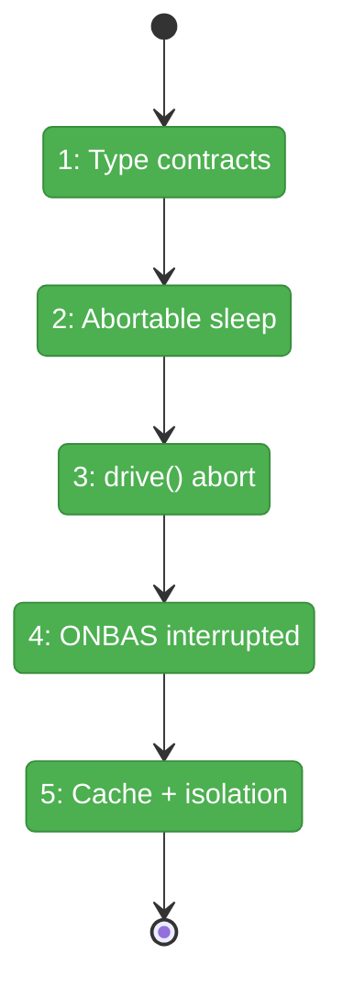
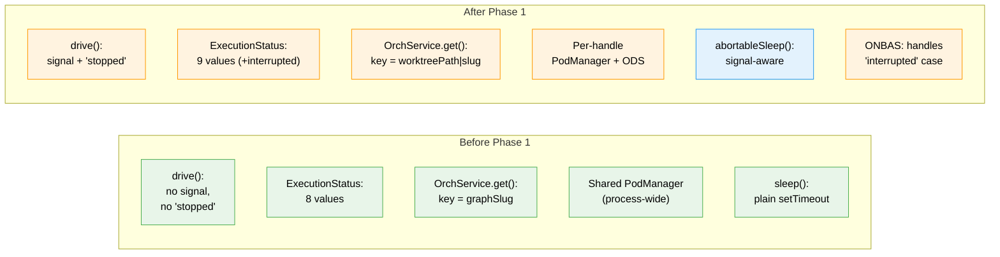

# Flight Plan: Phase 1 — Orchestration Contracts

**Plan**: [074 Workflow Execution](../../workflow-execution-plan.md)
**Phase**: Phase 1: Orchestration Contracts
**Generated**: 2026-03-15
**Status**: Landed

---

## Departure → Destination

**Where we are**: The orchestration engine (`drive()`, ONBAS, ODS, PodManager) is fully built and tested. It runs workflows to completion via the CLI. But it has no cancellation mechanism, no concept of user-initiated stop, no multi-worktree isolation, and shares a single PodManager across all concurrent workflows.

**Where we're going**: After this phase, `drive()` accepts an `AbortSignal` and returns `'stopped'` when aborted. A new `'interrupted'` node status lets the system track which nodes were active when execution halted. Each workflow handle gets its own PodManager and ODS — concurrent workflows in different worktrees are fully isolated. All via TDD with existing fakes.

---

## Domain Context

### Domains We're Changing

| Domain | What Changes | Key Files |
|--------|-------------|-----------|
| `_platform/positional-graph` | Add 'stopped' exit reason, 'interrupted' status, AbortSignal in drive(), compound cache key, per-handle PodManager/ODS | `orchestration-service.types.ts`, `reality.types.ts`, `graph-orchestration.ts`, `orchestration-service.ts`, `onbas.ts` |

### Domains We Depend On (no changes)

| Domain | What We Consume | Contract |
|--------|----------------|----------|
| None | Phase 1 is self-contained within positional-graph | — |

---

## Flight Status

<!-- Updated by /plan-6-v2: pending → active → done. Use blocked for problems/input needed. -->

**Legend**: grey = pending | yellow = active | red = blocked/needs input | green = done

---

## Stages

<!-- Updated by /plan-6-v2 during implementation: [ ] → [~] → [x] -->

- [x] **Stage 1: Type contracts** — Add 'stopped' to DriveExitReason, signal to DriveOptions, 'interrupted' to ExecutionStatus (`orchestration-service.types.ts`, `reality.types.ts`). Also updated `reality.schema.ts`, `state.schema.ts`, `reality.format.ts`.
- [x] **Stage 2: Abortable sleep** — Create abortable sleep utility with TDD (`abortable-sleep.ts` — new file). 5/5 tests pass.
- [x] **Stage 3: drive() abort** — Wire AbortSignal check + abortable sleep into drive() loop (`graph-orchestration.ts`). 25/25 tests pass (20 existing + 5 new).
- [x] **Stage 4: ONBAS interrupted** — Add 'interrupted' case to visitNode() and diagnoseStuckLine() (`onbas.ts`). 45/45 tests pass (41 existing + 4 new). Edge case found: interrupted+blocked-error correctly returns 'all-waiting' (not 'graph-failed').
- [x] **Stage 5: Cache + isolation** — Compound cache key + per-handle PodManager/ODS creation (`orchestration-service.ts`, `container.ts`). Used factory pattern for clean DI. 8/8 service tests pass + 320/320 total orchestration tests pass.

---

## Architecture: Before & After

**Legend**: existing (green, unchanged) | changed (orange, modified) | new (blue, created)

---

## Acceptance Criteria

- [ ] `drive({signal})` returns `{exitReason:'stopped'}` when signal aborts
- [ ] Abort during sleep returns within <100ms (not waiting for full delay)
- [ ] Already-aborted signal returns 'stopped' without starting loop
- [ ] ONBAS skips 'interrupted' nodes (returns null from visitNode)
- [ ] diagnoseStuckLine treats 'interrupted' as recoverable (blocks line like 'starting')
- [ ] Two different worktreePaths with same graphSlug get different handles
- [ ] Two concurrent handles have isolated pods and sessions maps
- [ ] All existing orchestration tests pass unchanged
- [ ] No signal passed = existing behavior unchanged (backwards compatible)

## Goals & Non-Goals

**Goals**: AbortSignal in drive(), 'stopped' exit reason, 'interrupted' status, multi-worktree isolation, per-handle PodManager/ODS

**Non-Goals**: No web app changes, no UI, no SSE, no server actions, no harness

---

## Checklist

- [x] T001: Add 'stopped' to DriveExitReason
- [x] T002: Add signal to DriveOptions
- [x] T003: Create abortable sleep utility + tests
- [x] T004: Wire AbortSignal into drive() loop
- [x] T005: Add 'interrupted' to ExecutionStatus
- [x] T006: ONBAS handles 'interrupted' in visitNode + diagnoseStuckLine
- [x] T007: Compound cache key in OrchestrationService.get()
- [x] T008: Per-handle PodManager + ODS creation
