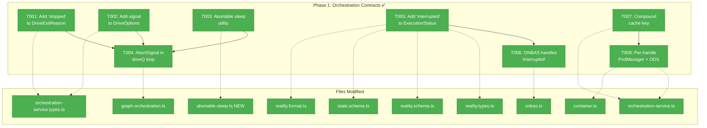
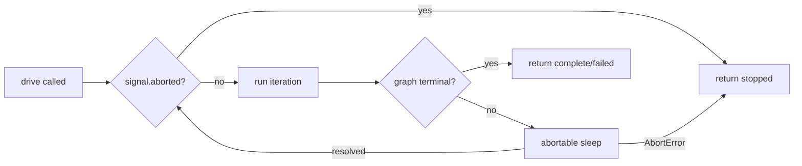
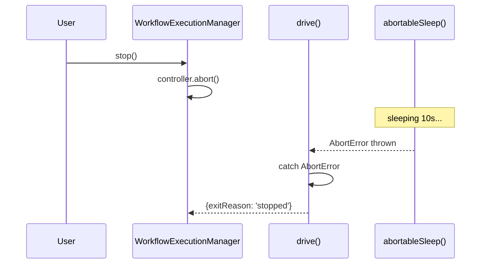

# Phase 1: Orchestration Contracts — Task Dossier

**Plan**: [074 Workflow Execution](../../workflow-execution-plan.md)
**Phase**: Phase 1: Orchestration Contracts
**Generated**: 2026-03-15
**Status**: Ready for implementation

---

## Executive Briefing

**Purpose**: Extend the orchestration engine's type contracts and runtime behavior to support cooperative cancellation (AbortSignal), user-initiated stop ('stopped' exit reason), interrupted node tracking ('interrupted' status), and multi-worktree isolation (compound cache key + per-handle PodManager). All changes are TDD — tests first, then implementation.

**What We're Building**: Contract-level extensions to `drive()`, `OrchestrationService`, `ExecutionStatus`, and `ONBAS` that enable the web execution features in later phases. No web code touched — purely the `packages/positional-graph` orchestration engine.

**Goals**:
- ✅ `drive()` accepts an `AbortSignal` and returns `'stopped'` when aborted
- ✅ Sleep is abortable — responds to signal within ~10ms, not after full delay
- ✅ `'interrupted'` status exists in `ExecutionStatus` and ONBAS handles it correctly
- ✅ Multi-worktree isolation via compound cache key and per-handle PodManager/ODS

**Non-Goals**:
- ❌ No web app changes (that's Phase 2+)
- ❌ No UI changes (that's Phase 4)
- ❌ No harness changes (that's Phase 6)
- ❌ No changes to ONBAS decision algorithm, ODS dispatch, or EHS settlement

---

## Pre-Implementation Check

| File | Exists? | Domain Check | Notes |
|------|---------|-------------|-------|
| `packages/positional-graph/src/features/030-orchestration/orchestration-service.types.ts` | ✅ | ✅ positional-graph | DriveExitReason at L129, DriveOptions at L156-165 |
| `packages/positional-graph/src/features/030-orchestration/reality.types.ts` | ✅ | ✅ positional-graph | ExecutionStatus at L16-24 — 8 values, NO 'interrupted' |
| `packages/positional-graph/src/features/030-orchestration/graph-orchestration.ts` | ✅ | ✅ positional-graph | drive() at L143-204, inline sleep at L58 |
| `packages/positional-graph/src/features/030-orchestration/orchestration-service.ts` | ✅ | ✅ positional-graph | get() at L47-62, cache key = graphSlug only |
| `packages/positional-graph/src/features/030-orchestration/onbas.ts` | ✅ | ✅ positional-graph | visitNode() at L73-111, diagnoseStuckLine() at L115-150 |
| Abortable sleep utility | ❌ new | — | No existing abortable sleep in codebase |
| 'interrupted' status | ❌ new | — | Not in ExecutionStatus, not handled anywhere |
| 'stopped' exit reason | ❌ new | — | Not in DriveExitReason |
| Compound key pattern | ✅ exists | — | `${worktreePath}|${slug}` in Fake*Adapters — reuse pattern |
| Test files | ⚠️ no dir | — | Fakes exist (FakeONBAS, FakeGraphOrchestration, FakeOrchestrationService). Tests inline in test/unit/ — create orchestration-specific test files |

**Concept duplication check**: All 5 new concepts verified — none already exist in codebase. Compound key pattern exists in fakes (pipe-delimited) — reuse.

**Harness context**: L3 maturity. Not needed for Phase 1 (pure package-level TDD). Harness used from Phase 4+.

---

## Architecture Map



---

## Tasks

| Status | ID | Task | Domain | Path(s) | Done When | Notes |
|--------|-----|------|--------|---------|-----------|-------|
| [x] | T001 | Add `'stopped'` to `DriveExitReason` union type | positional-graph | `packages/positional-graph/src/features/030-orchestration/orchestration-service.types.ts` | Type = `'complete' \| 'failed' \| 'max-iterations' \| 'stopped'`. Compiles. Existing tests pass. | Finding 02. Line 129. Contract change. |
| [x] | T002 | Add `signal?: AbortSignal` to `DriveOptions` interface | positional-graph | `packages/positional-graph/src/features/030-orchestration/orchestration-service.types.ts` | New optional field on DriveOptions. Compiles. Existing tests pass (signal not passed = unchanged behavior). | Lines 156-165. Contract change. |
| [x] | T003 | Create abortable sleep utility + tests | positional-graph | `packages/positional-graph/src/features/030-orchestration/abortable-sleep.ts` (new) | TDD: (1) sleep(1000) resolves after ~1000ms. (2) sleep(10000, {signal}) rejects immediately when signal fires. (3) Already-aborted signal rejects without waiting. (4) No signal = normal setTimeout behavior. Use `node:timers/promises` setTimeout with native signal support. | Finding 04. New file. First use of `node:timers/promises` in codebase. |
| [x] | T004 | Add abort check + abortable sleep to `drive()` implementation | positional-graph | `packages/positional-graph/src/features/030-orchestration/graph-orchestration.ts` | TDD: (1) drive({signal}) with abort mid-loop returns `{exitReason:'stopped'}`. (2) Abort during sleep returns within <100ms. (3) Already-aborted signal returns `{exitReason:'stopped'}` without starting loop. (4) No signal = existing behavior unchanged. (5) onEvent callback receives 'status' event with 'stopped' message. | Lines 143-204. Replace inline sleep (L58) with abortable sleep. Check `signal?.aborted` at iteration boundary (before run()). Wrap sleep in try/catch for AbortError. |
| [x] | T005 | Add `'interrupted'` to `ExecutionStatus` union type | positional-graph | `packages/positional-graph/src/features/030-orchestration/reality.types.ts` | Type includes 'interrupted'. Compiles. Existing tests pass. | Finding 01. Line 16-24. Contract change. Also update any Zod schema in state.schema.ts if ExecutionStatus is validated there. |
| [x] | T006 | Add `'interrupted'` case to ONBAS `visitNode()` and `diagnoseStuckLine()` | positional-graph | `packages/positional-graph/src/features/030-orchestration/onbas.ts` | TDD: (1) visitNode with status='interrupted' returns null (skipped). (2) diagnoseStuckLine with interrupted node treats it as recoverable — blocks line progression like 'starting' (hasRunning=true). (3) Existing test cases unchanged. | Finding 01. visitNode L73-111, diagnoseStuckLine L115-150. DYK #1: interrupted nodes are skipped during execution, but resume path (Phase 2) resets them to 'ready'. |
| [x] | T007 | Change `OrchestrationService.get()` to compound cache key | positional-graph | `packages/positional-graph/src/features/030-orchestration/orchestration-service.ts` | TDD: (1) Same ctx + same slug → same handle (unchanged). (2) Different worktreePath + same slug → different handles. (3) Existing test (same-slug-same-handle) passes. | Finding 03. L35, L47-62. Use pipe delimiter: `${ctx.worktreePath}\|${graphSlug}` (matches existing Fake*Adapter pattern). |
| [x] | T008 | Create PodManager + ODS per-handle in `OrchestrationService.get()` | positional-graph | `packages/positional-graph/src/features/030-orchestration/orchestration-service.ts`, `packages/positional-graph/src/container.ts` | TDD: (1) Two concurrent handles have isolated pods and sessions maps. (2) destroyPod on handle A does not affect handle B. (3) Pass IFileSystem through deps instead of shared PodManager. Update registerOrchestrationServices() factory — remove PodManager/ODS creation, pass deps for per-handle creation. | DYK #2. Move `new PodManager(fs)` and `new ODS({...})` from factory into get(). OrchestrationServiceDeps gains `fs`, `contextService`, `agentManager`, `scriptRunner`, `workUnitService` instead of `ods` and `podManager`. |

---

## Context Brief

**Key findings from plan**:
- Finding 01: ExecutionStatus missing 'interrupted' → add to union, handle in ONBAS
- Finding 02: DriveExitReason missing 'stopped' → add to union, return from drive() on abort
- Finding 03: Cache key is graphSlug-only → compound key for multi-worktree isolation
- Finding 04: Sleep not abortable → use `node:timers/promises` with AbortSignal
- DYK #1: ONBAS skips 'interrupted' nodes, so resume must reset them (Phase 2 concern, but ONBAS behavior set here)
- DYK #2: PodManager/ODS must be per-handle, not shared (concurrent corruption risk)

**Domain dependencies** (concepts and contracts this phase consumes):
- `_platform/positional-graph`: `IGraphOrchestration.drive()` (extending), `IOrchestrationService.get()` (modifying), `IONBAS.getNextAction()` (extending), `ExecutionStatus` (extending)
- No cross-domain dependencies — Phase 1 is entirely within positional-graph

**Domain constraints**:
- All changes within `packages/positional-graph/src/features/030-orchestration/`
- Contract changes (T001, T002, T005) must be backwards-compatible — new fields are optional, new union members don't break existing consumers
- ADR-0012: Events on disk remain the sole pod↔engine interface — not affected by these changes
- Existing tests must pass unchanged (no behavioral changes to existing flows)

**Reusable from prior phases**:
- FakeONBAS: `setNextAction()`, `setActions()`, `getHistory()`, `reset()` — use for T006 tests
- FakeGraphOrchestration: `setDriveResult()`, `setDriveEvents()`, `getDriveHistory()` — use for T004 tests
- FakeOrchestrationService: `configureGraph()`, `get()`, `getGetHistory()` — use for T007/T008 tests
- buildFakeReality(): Builders for testing ONBAS with custom node statuses — use for T006

**Compound key pattern** (from Fake*Adapters):
```typescript
// Existing pattern to follow:
private getKey(ctx: WorkspaceContext, slug: string): string {
  return `${ctx.worktreePath}|${slug}`;
}
```

**Flow diagram** — drive() with AbortSignal:


**Sequence diagram** — abort during idle sleep:


---

## Discoveries & Learnings

_Populated during implementation by plan-6._

| Date | Task | Type | Discovery | Resolution | References |
|------|------|------|-----------|------------|------------|
| 2026-03-15 | T005 | gotcha | `reality.schema.ts` HAS a Zod `ExecutionStatusSchema` that needed updating (explore agent missed it). Also `state.schema.ts` has `NodeExecutionStatusSchema` needing 'interrupted'. | Updated all 3 schemas: `reality.types.ts`, `reality.schema.ts`, `state.schema.ts`. Also added glyph in `reality.format.ts` (⏹️). | reality.schema.ts, state.schema.ts, reality.format.ts |
| 2026-03-15 | T006 | insight | Without explicit `'interrupted'` case in `diagnoseStuckLine`, an interrupted+blocked-error combo returns 'graph-failed' (wrong). With explicit handling, interrupted sets hasRunning=true, taking priority over hasBlocked. | Added explicit case for 'interrupted' in both visitNode (return null) and diagnoseStuckLine (hasRunning=true). TDD caught the edge case. | onbas.ts L124-126 |
| 2026-03-15 | T008 | decision | Used factory pattern (`createPerHandleDeps`) instead of raw deps in OrchestrationServiceDeps. Keeps OrchestrationService loosely coupled — imports only interfaces, not concrete PodManager/ODS classes. Container.ts wires the factory closure. | Factory returns `{podManager, ods}`. Tests can capture instances via the factory for inspection. More aligned with existing DI patterns. | orchestration-service.ts, container.ts |

---

## Directory Layout

```
docs/plans/074-workflow-execution/
  ├── workflow-execution-plan.md
  ├── workflow-execution-spec.md
  ├── research-dossier.md
  ├── deep-research-abort-controller.md
  ├── deep-research-nextjs-long-running.md
  ├── workshops/
  │   ├── 001-execution-wiring-architecture.md
  │   ├── 002-central-orchestration-host.md
  │   ├── 003-harness-test-data-cli.md
  │   └── 004-cg-unit-update-cli.md
  └── tasks/phase-1-orchestration-contracts/
      ├── tasks.md                  ← this file
      ├── tasks.fltplan.md          ← flight plan (below)
      └── execution.log.md         ← created by plan-6
```
