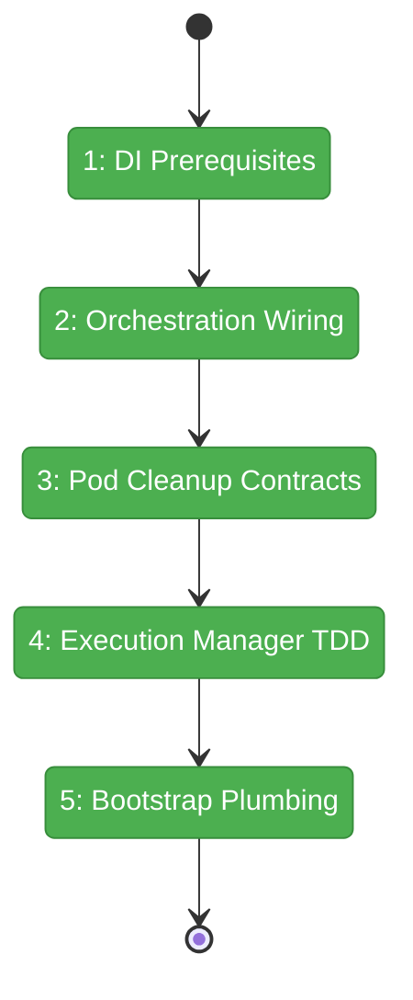
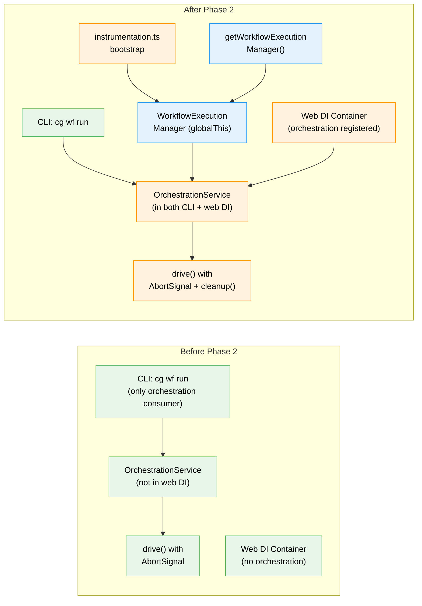

# Flight Plan: Phase 2 — Web DI + Execution Manager

**Plan**: [workflow-execution-plan.md](../../workflow-execution-plan.md)
**Phase**: Phase 2: Web DI + Execution Manager
**Generated**: 2026-03-15
**Status**: Landed

---

## Departure → Destination

**Where we are**: The orchestration engine has AbortSignal support, `'stopped'` exit reason, `'interrupted'` node status, compound cache keys, and per-handle PodManager/ODS isolation (Phase 1 complete). But the web app has zero access to these capabilities — `OrchestrationService` is not registered in web DI, no execution manager exists, and there's no way to start/stop workflows from the web.

**Where we're going**: A developer can import `getWorkflowExecutionManager()` in any server-side web code and call `manager.start(ctx, slug)` to begin a workflow, `manager.stop(wt, slug)` to halt it, or `manager.restart(ctx, slug)` to reset and rerun it. The manager tracks all running workflows, handles concurrent isolation, and integrates with the existing DI container. After this phase, the web app has the same orchestration capabilities as the CLI.

---

## Domain Context

### Domains We're Changing

| Domain | What Changes | Key Files |
|--------|-------------|-----------|
| `shared` | De-alias `ORCHESTRATION_DI_TOKENS.AGENT_MANAGER` to own string | `packages/shared/src/di-tokens.ts` |
| `_platform/positional-graph` | Add `destroyAllPods()` to IPodManager, `cleanup()` to IGraphOrchestration | `pod-manager.types.ts`, `pod-manager.ts`, `orchestration-service.types.ts`, `graph-orchestration.ts` |
| web app (feature) | New `WorkflowExecutionManager` class + DI registrations + bootstrap | `di-container.ts`, `instrumentation.ts`, `apps/web/src/features/074-workflow-execution/*` |
| CLI | Update AgentManager token registration | `apps/cli/src/lib/container.ts` |

### Domains We Depend On (no changes)

| Domain | What We Consume | Contract |
|--------|----------------|----------|
| `_platform/positional-graph` | OrchestrationService.get(), drive(), loadGraphState/persistGraphState | `IOrchestrationService`, `IGraphOrchestration`, `IPositionalGraphService` |
| `_platform/events` | SSEManager.broadcast() | Module singleton (Phase 3 wires, Phase 2 stubs) |
| `_platform/state` | IStateService.publish() | `STATE_DI_TOKENS.STATE_SERVICE` (Phase 3 wires, Phase 2 stubs) |
| workspace | WorkspaceService for context resolution | `WORKSPACE_DI_TOKENS.WORKSPACE_SERVICE` |

---

## Flight Status

<!-- Updated by /plan-6-v2: pending → active → done. Use blocked for problems/input needed. -->

**Legend**: grey = pending | yellow = active | red = blocked/needs input | green = done

---

## Stages

<!-- Updated by /plan-6-v2 during implementation: [ ] → [~] → [x] -->

- [~] **Stage 1: DI Prerequisites** — De-alias orchestration agent token, register Plan 034 AgentManager + ScriptRunner + EventHandlerService in web DI (`di-tokens.ts`, `di-container.ts`, `cli/container.ts`). DYK #4: verify adapter factory web compatibility.
- [ ] **Stage 2: Orchestration Wiring** — Call `registerOrchestrationServices()` in web DI, verify full resolution chain (`di-container.ts`)
- [ ] **Stage 3: Lifecycle Contracts** — Add `abort()` to IPod + `destroyAllPods()` to IPodManager (real pod kill, DYK #2), `cleanup()` + `evict()` to graph handle/service (DYK #1), `resetGraph()` + `markNodesInterrupted()` to IPositionalGraphService (DYK #5). TDD.
- [ ] **Stage 4: Execution Manager TDD** — Create `WorkflowExecutionManager` class with full start/stop/restart/resume lifecycle, TDD (~200 lines, `workflow-execution-manager.ts` — new file). DYK #3: .catch() on drivePromise.
- [ ] **Stage 5: Bootstrap Plumbing** — Create getter, factory, and instrumentation.ts bootstrap (`get-manager.ts`, `create-execution-manager.ts`, `instrumentation.ts`)

---

## Architecture: Before & After

**Legend**: existing (green, unchanged) | changed (orange, modified) | new (blue, created)

---

## Acceptance Criteria

- [ ] `getWorkflowExecutionManager()` returns valid manager after server start
- [ ] `manager.start(ctx, slug)` creates execution handle and begins drive() loop
- [ ] `manager.stop(worktreePath, slug)` aborts drive(), destroys pods, marks interrupted
- [ ] `manager.restart(ctx, slug)` clears graph state and starts fresh
- [ ] Calling start() twice for same workflow returns idempotent result
- [ ] Resume: start() on stopped workflow resets interrupted → ready

## Goals & Non-Goals

**Goals**:
- ✅ Web DI resolves full orchestration stack
- ✅ WorkflowExecutionManager with complete lifecycle
- ✅ globalThis singleton survives HMR
- ✅ Pod cleanup on stop/restart

**Non-Goals**:
- ❌ No SSE broadcasting (Phase 3)
- ❌ No GlobalState publishing (Phase 3)
- ❌ No UI controls (Phase 4)
- ❌ No execution registry persistence (Phase 5)

---

## Checklist

- [x] T001: De-alias ORCHESTRATION_DI_TOKENS.AGENT_MANAGER + register Plan 034
- [x] T002: Register ScriptRunner + EventHandlerService in web DI
- [x] T003: Call registerOrchestrationServices() in web DI
- [x] T004: Add abort() to IPod + destroyAllPods() to IPodManager (real kill)
- [x] T005: Add cleanup() + evict() to IGraphOrchestration/IOrchestrationService
- [x] T005b: Add resetGraph() + markNodesInterrupted() to IPositionalGraphService
- [x] T006: Create WorkflowExecutionManager class (TDD)
- [x] T007: Create get-manager.ts globalThis getter
- [x] T008: Create create-execution-manager.ts factory
- [x] T009: Bootstrap manager in instrumentation.ts
