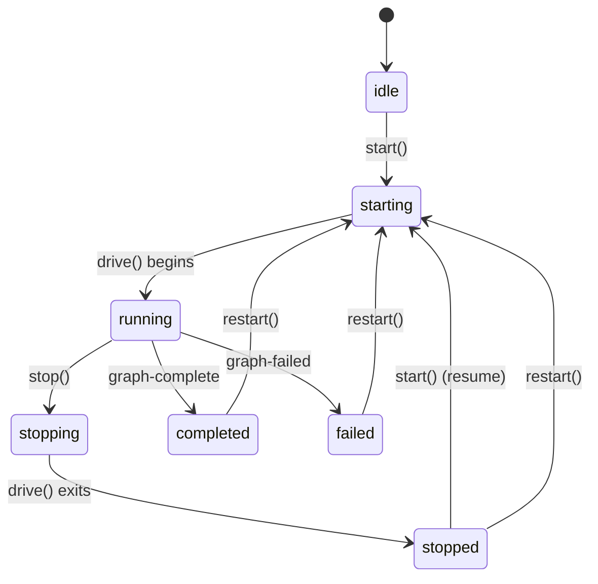
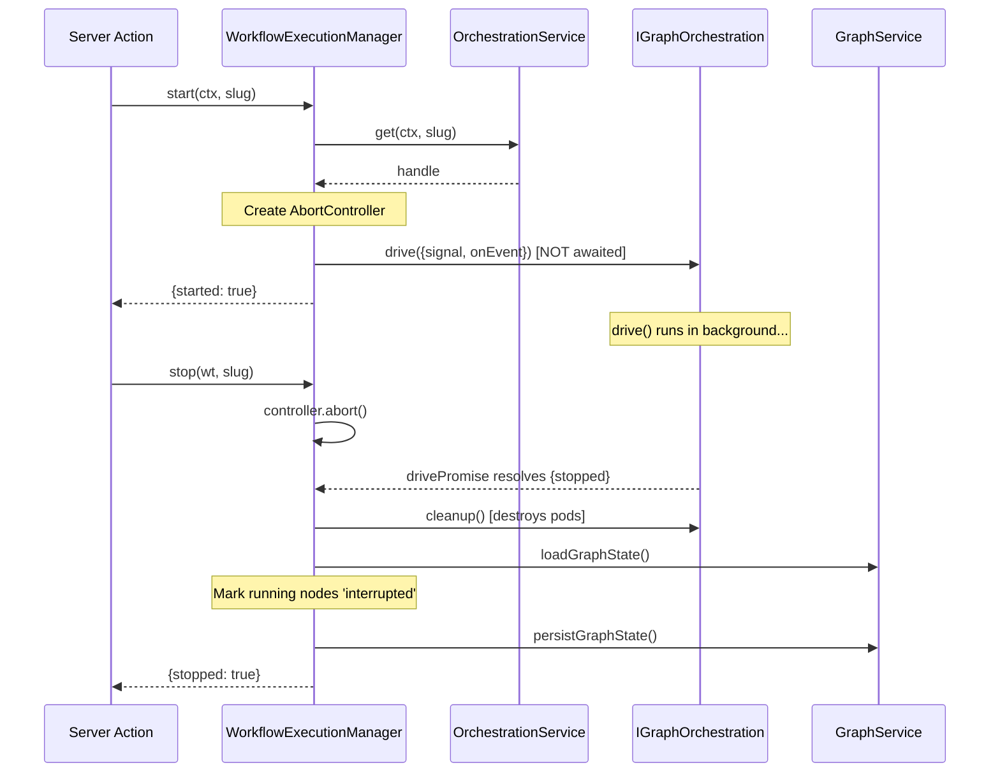
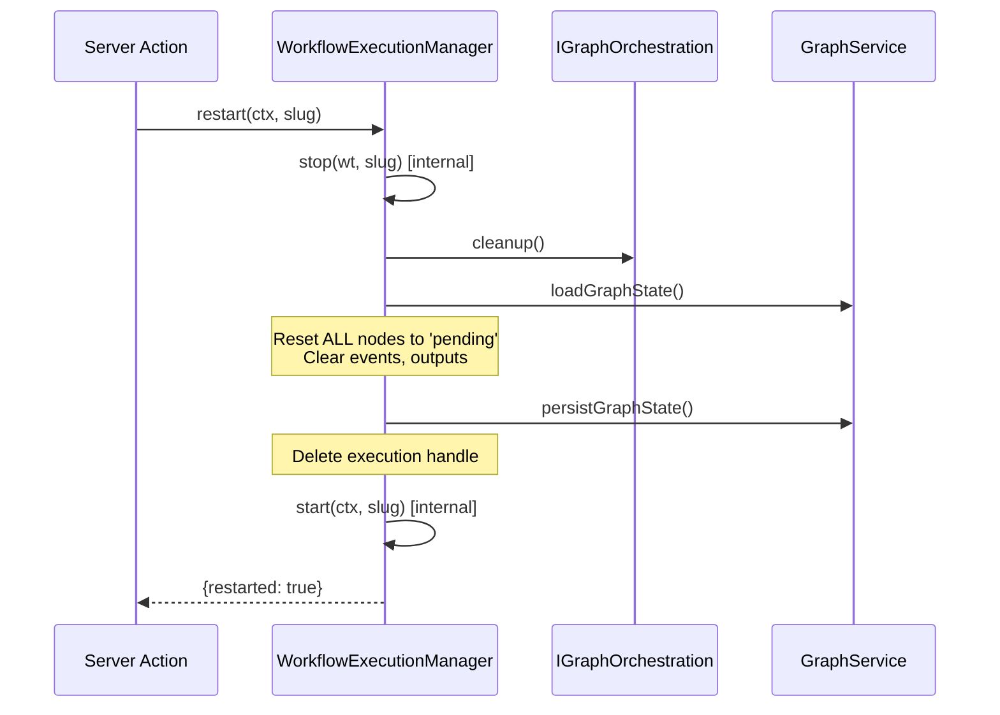

# Phase 2: Web DI + Execution Manager — Task Dossier

**Plan**: [074 Workflow Execution](../../workflow-execution-plan.md)
**Phase**: Phase 2: Web DI + Execution Manager
**Generated**: 2026-03-15
**Status**: Ready

---

## Executive Briefing

**Purpose**: Wire the orchestration engine into the web app's DI container and create the central `WorkflowExecutionManager` singleton that owns the lifecycle of all running workflows. This is the keystone phase — everything after it (SSE, UI, recovery) depends on having a manager that can start, stop, and restart workflows.

**What We're Building**: (1) DI registrations so the web app can resolve the full orchestration stack (OrchestrationService, EventHandlerService, ScriptRunner, Plan 034 AgentManager). (2) A `WorkflowExecutionManager` class with start/stop/restart/getStatus/listRunning. (3) A `globalThis` singleton bootstrapped in `instrumentation.ts` that survives HMR. (4) Pod cleanup methods so stop/restart can destroy running pods.

**Goals**:
- ✅ Web DI resolves `OrchestrationService` and all its transitive dependencies
- ✅ `WorkflowExecutionManager` handles start/stop/restart with correct lifecycle semantics
- ✅ Stop aborts `drive()`, destroys all pods, marks running nodes as `'interrupted'`
- ✅ Resume (start on stopped workflow) resets `'interrupted'` nodes → `'ready'`
- ✅ Restart = stop + nuke all state + start fresh
- ✅ Manager accessible via `getWorkflowExecutionManager()` after server start
- ✅ HMR-safe: singleton survives Next.js hot module replacement

**Non-Goals**:
- ❌ No SSE broadcasting (Phase 3 — handleEvent will have no-op stubs here)
- ❌ No GlobalState publishing (Phase 3)
- ❌ No UI controls (Phase 4)
- ❌ No execution registry persistence / server restart recovery (Phase 5)
- ❌ No harness test-data CLI (Phase 6)

---

## Prior Phase Context

### Phase 1: Orchestration Contracts ✅

**A. Deliverables**:
- `abortable-sleep.ts` — NEW: signal-aware sleep using `node:timers/promises`
- `orchestration-service.types.ts` — `'stopped'` in DriveExitReason, `signal?: AbortSignal` in DriveOptions
- `reality.types.ts` + `reality.schema.ts` + `state.schema.ts` — `'interrupted'` in ExecutionStatus + Zod schemas
- `reality.format.ts` — ⏹️ glyph for interrupted
- `graph-orchestration.ts` — AbortSignal in drive() with pre-loop check, iteration boundary check, AbortError catch
- `onbas.ts` — `case 'interrupted'` in visitNode (return null) and diagnoseStuckLine (hasRunning=true)
- `orchestration-service.ts` — Compound key `${worktreePath}|${graphSlug}`, `createPerHandleDeps` factory, `PerHandleDeps` interface
- `container.ts` — Per-handle PodManager+ODS factory closure in registerOrchestrationServices()

**B. Dependencies Exported**:
- `DriveExitReason` — now includes `'stopped'` (signals user-initiated halt)
- `DriveOptions.signal?: AbortSignal` — cooperative cancellation for drive()
- `ExecutionStatus` — now includes `'interrupted'` (9 values total)
- `PerHandleDeps` — `{ podManager: IPodManager; ods: IODS }` exported from package barrel
- `OrchestrationServiceDeps.createPerHandleDeps: () => PerHandleDeps` — factory pattern

**C. Gotchas & Debt**:
- `reality.schema.ts` EXISTS with Zod `ExecutionStatusSchema` — initial explore missed it. Always check both `reality.schema.ts` AND `state.schema.ts` when adding statuses.
- `vi.useFakeTimers()` does NOT intercept `node:timers/promises` — it only patches global setTimeout. Use pre-aborted signals for deterministic abort tests.
- Integration tests (`orchestration-wiring-real`, `real-agent-orchestration`, e2e) are all `describe.skip` except fixture validation.
- `restart-pending` is in ExecutionStatus but NOT handled in ONBAS switch cases (pre-existing, falls through to default).

**D. Incomplete Items**: None — all 8/8 tasks complete, code review findings addressed.

**E. Patterns to Follow**:
- TDD RED/GREEN cycle with explicit evidence in execution log
- Per-handle isolation: each graph handle gets own PodManager+ODS via factory
- Compound key pattern: `${worktreePath}|${graphSlug}` (pipe delimiter)
- Test files live in `test/unit/positional-graph/features/030-orchestration/`

---

## Pre-Implementation Check

| File | Exists? | Domain Check | Notes |
|------|---------|-------------|-------|
| `packages/shared/src/di-tokens.ts` | ✅ | ✅ shared | ORCHESTRATION_DI_TOKENS.AGENT_MANAGER aliases SHARED — must de-alias. L146-157. |
| `apps/web/src/lib/di-container.ts` | ✅ | ✅ web | 869 lines. No orchestration registered. Plan 019 AgentManager at L437-485. registerPositionalGraphServices at L489. |
| `apps/cli/src/lib/container.ts` | ✅ | ✅ cli | Orchestration prereqs at L268-302. Pattern to follow for EHS/ScriptRunner. |
| `apps/web/instrumentation.ts` | ✅ | ✅ web | startCentralNotificationSystem + server.json. globalThis pattern established. Extend with manager bootstrap. |
| `apps/web/src/features/074-workflow-execution/` | ❌ new dir | — | Create directory with 4 new files. |
| `packages/positional-graph/src/features/030-orchestration/pod-manager.types.ts` | ✅ | ✅ positional-graph | IPodManager has destroyPod(nodeId) only. Need destroyAllPods(). |
| `packages/positional-graph/src/features/030-orchestration/pod-manager.ts` | ✅ | ✅ positional-graph | `private readonly pods = new Map<string, IWorkUnitPod>()`. destroyPod deletes from map. |
| `packages/positional-graph/src/features/030-orchestration/orchestration-service.types.ts` | ✅ | ✅ positional-graph | IGraphOrchestration: run(), drive(), getReality(). Need cleanup() method. |
| `packages/positional-graph/src/features/030-orchestration/graph-orchestration.ts` | ✅ | ✅ positional-graph | Has `this.podManager` — can implement cleanup(). |
| `packages/shared/src/features/034-agentic-cli/agent-manager-service.ts` | ✅ | ✅ shared | Plan 034 AgentManagerService. Constructor takes only AdapterFactory. getNew(), getWithSessionId(). |

**Concept duplication check**: `WorkflowExecutionManager` — no existing execution manager, workflow runner, or orchestration host in the codebase. Clean concept.

**Harness context**: L3 maturity. Harness operational but Phase 2 is DI + class implementation — harness test-data not available yet (Phase 6). Standard TDD testing with vitest.

**Critical finding: Token collision**: `ORCHESTRATION_DI_TOKENS.AGENT_MANAGER === SHARED_DI_TOKENS.AGENT_MANAGER_SERVICE === 'IAgentManagerService'`. Web registers Plan 019 under this token. ODS needs Plan 034's `getNew()`/`getWithSessionId()`. Must de-alias to separate orchestration from web agent UI.

**Critical finding: No destroyAllPods()**: IPodManager only has `destroyPod(nodeId)`. Manager needs to destroy ALL pods on stop/restart. PodManager.pods is a private Map — no way to iterate from outside. Must add `destroyAllPods()`.

**Critical finding: No cleanup() on IGraphOrchestration**: Manager interacts via IGraphOrchestration handle but can't reach the internal PodManager to destroy pods. Need a `cleanup()` method on the handle.

**Critical finding: No resetGraphState()**: For restart(), manager needs to reset all node statuses, clear events/outputs. No service method exists. Manual state manipulation via loadGraphState/persistGraphState — set all node statuses to 'pending', clear events arrays, clear outputs.

---

## Architecture Map

```mermaid
flowchart TD
    classDef pending fill:#9E9E9E,stroke:#757575,color:#fff
    classDef inprogress fill:#FFC107,stroke:#FFA000,color:#000
    classDef completed fill:#4CAF50,stroke:#388E3C,color:#fff

    subgraph Phase2["Phase 2: Web DI + Execution Manager"]
        T001["T001: De-alias token<br/>+ Plan 034 AgentMgr"]:::completed
        T002["T002: ScriptRunner<br/>+ EHS in web DI"]:::completed
        T003["T003: Call register<br/>OrchestrationServices"]:::completed
        T004["T004: Pod abort()<br/>+ destroyAllPods"]:::inprogress
        T005["T005: cleanup() + evict()<br/>on handle/service"]:::pending
        T005b["T005b: resetGraph +<br/>markNodesInterrupted"]:::pending
        T006["T006: Workflow<br/>ExecutionManager"]:::pending
        T007["T007: get-manager.ts<br/>globalThis getter"]:::pending
        T008["T008: create-execution<br/>-manager factory"]:::pending
        T009["T009: Bootstrap in<br/>instrumentation.ts"]:::pending

        T001 --> T003
        T002 --> T003
        T004 --> T005
        T005 --> T006
        T005b --> T006
        T003 --> T008
        T006 --> T008
        T007 --> T009
        T008 --> T009
    end

    subgraph Phase1["Phase 1 (Complete) ✅"]
        P1["AbortSignal + interrupted<br/>+ compound key"]:::completed
    end

    subgraph Files["Files"]
        F1["di-tokens.ts"]:::pending
        F2["di-container.ts"]:::pending
        F3["cli/container.ts"]:::pending
        F4["pod-manager.types.ts"]:::pending
        F5["pod-manager.ts + pod.agent.ts + pod.code.ts"]:::pending
        F6["orchestration-service.types.ts"]:::pending
        F7["graph-orchestration.ts + orchestration-service.ts"]:::pending
        F8["workflow-execution-manager.ts NEW"]:::pending
        F9["workflow-execution-manager.types.ts NEW"]:::pending
        F10["get-manager.ts NEW"]:::pending
        F11["create-execution-manager.ts NEW"]:::pending
        F12["instrumentation.ts"]:::pending
        F13["positional-graph-service.interface.ts"]:::pending
    end

    P1 -.-> T003
    T001 -.-> F1
    T001 -.-> F2
    T001 -.-> F3
    T002 -.-> F2
    T003 -.-> F2
    T004 -.-> F4
    T004 -.-> F5
    T005 -.-> F6
    T005 -.-> F7
    T006 -.-> F8
    T006 -.-> F9
    T005b -.-> F13
    T007 -.-> F10
    T008 -.-> F11
    T009 -.-> F12
```



---

## Tasks

| Status | ID | Task | Domain | Path(s) | Done When | Notes |
|--------|-----|------|--------|---------|-----------|-------|
| [x] | T001 | De-alias `ORCHESTRATION_DI_TOKENS.AGENT_MANAGER` to unique token string + register Plan 034 `AgentManagerService` for orchestration in web DI | shared, web, cli | `packages/shared/src/di-tokens.ts`, `apps/web/src/lib/di-container.ts`, `apps/cli/src/lib/container.ts` | `ORCHESTRATION_DI_TOKENS.AGENT_MANAGER` has its own string value (not aliasing `SHARED_DI_TOKENS`). Web DI resolves Plan 034 `AgentManagerService` under the new token. Plan 019 unchanged under `SHARED_DI_TOKENS.AGENT_MANAGER_SERVICE`. CLI updated to register under new token. All existing tests pass. | Finding 06. Plan 019 has `createAgent()`, Plan 034 has `getNew()`/`getWithSessionId()`. ODS calls Plan 034 methods — token collision causes runtime crash if not de-aliased. DYK #4: Verify CLI adapter factory works in web server context — trace adapter chain for web compatibility. |
| [x] | T002 | Register `ScriptRunner` + `EventHandlerService` in web DI | web | `apps/web/src/lib/di-container.ts` | `container.resolve(ORCHESTRATION_DI_TOKENS.SCRIPT_RUNNER)` → `ScriptRunner`. `container.resolve(ORCHESTRATION_DI_TOKENS.EVENT_HANDLER_SERVICE)` → `EventHandlerService`. Both resolve without error. | Finding 05. Follow exact CLI pattern (`apps/cli/src/lib/container.ts` L268-302). ScriptRunner: `new ScriptRunner()` (no deps). EHS: `NodeEventRegistry` + `registerCoreEventTypes()` + `createEventHandlerRegistry()` + `NodeEventService` with throw stubs for loadState/persistState. |
| [x] | T003 | Call `registerOrchestrationServices()` in web DI container | web | `apps/web/src/lib/di-container.ts` | `container.resolve(ORCHESTRATION_DI_TOKENS.ORCHESTRATION_SERVICE)` returns valid `OrchestrationService`. All transitive deps (graphService, onbas, eventHandlerService, createPerHandleDeps factory) resolve correctly. | Finding 05. Must be called AFTER T001+T002 register prerequisites. Single function call. Import from `@chainglass/positional-graph`. |
| [x] | T004 | Add `abort()` to `IWorkUnitPod` + `destroyAllPods()` to `IPodManager` + implement real pod termination | positional-graph | `packages/positional-graph/src/features/030-orchestration/pod.types.ts` (or similar), `packages/positional-graph/src/features/030-orchestration/pod.agent.ts`, `packages/positional-graph/src/features/030-orchestration/pod.code.ts`, `packages/positional-graph/src/features/030-orchestration/pod-manager.types.ts`, `packages/positional-graph/src/features/030-orchestration/pod-manager.ts` | TDD: (1) `pod.abort()` terminates the running process — AgentPod calls `agentManager.terminateAgent(agentId)`, CodePod calls `scriptRunner.kill()`. (2) `destroyPod(nodeId)` calls `pod.abort()` then removes from Map. (3) `destroyAllPods()` iterates all active pods, aborts each, clears Map. (4) Session IDs unaffected (sessions ≠ active pods). (5) Empty pods map → no-op. (6) Abort on already-completed pod → no-op. | DYK #2: `destroyPod()` currently just `this.pods.delete()` — doesn't kill the process. User requires FULL termination. AgentPod must retain agentId for terminate. CodePod must retain scriptRunner reference for kill(). Also update FakePodManager. |
| [x] | T005 | Add `cleanup()` to `IGraphOrchestration` + `evict()` to `IOrchestrationService` + implement both | positional-graph | `packages/positional-graph/src/features/030-orchestration/orchestration-service.types.ts`, `packages/positional-graph/src/features/030-orchestration/graph-orchestration.ts`, `packages/positional-graph/src/features/030-orchestration/orchestration-service.ts` | TDD: (1) `cleanup()` calls `podManager.destroyAllPods()`. (2) Persists sessions after destruction. (3) No pods active → no-op, no error. (4) `evict(worktreePath, graphSlug)` removes cached handle from OrchestrationService Map. (5) After evict, next `get()` creates a fresh handle with new PodManager/ODS. | DYK #1: OrchestrationService.get() caches forever — restart needs fresh handle. `evict()` deletes from cache so next get() creates clean slate. Also update `FakeGraphOrchestration` + `FakeOrchestrationService` with new methods. Export updated interfaces. |
| [x] | T005b | Add `resetGraph()` + `markNodesInterrupted()` to `IPositionalGraphService` + implement | positional-graph | `packages/positional-graph/src/interfaces/positional-graph-service.interface.ts`, `packages/positional-graph/src/services/positional-graph-service.ts` (or adapter) | TDD: (1) `markNodesInterrupted(ctx, slug, nodeIds)` loads state, sets specified nodes to `'interrupted'`, persists. (2) `resetGraph(ctx, slug)` loads state, sets ALL node statuses to `'pending'`, clears events/outputs on each node, persists. (3) Both are idempotent (calling twice = same result). (4) Missing nodeIds in markNodesInterrupted → ignored, no error. | DYK #5: Manager must NOT directly manipulate State internals — violates domain boundary. These domain methods keep State knowledge inside positional-graph. Manager calls these instead of load→mutate→persist. |
| [x] | T006 | Create `WorkflowExecutionManager` class with start/stop/restart/getStatus/listRunning | web (feature) | `apps/web/src/features/074-workflow-execution/workflow-execution-manager.ts` (new), `apps/web/src/features/074-workflow-execution/workflow-execution-manager.types.ts` (new) | TDD: (1) `start()` creates handle, begins `drive()` in background, returns `{started:true}`. (2) `start()` on already-running returns `{already:true}` (idempotent). (3) `stop()` aborts drive via AbortController, awaits drivePromise, calls `handle.cleanup()`, calls `graphService.markNodesInterrupted()`. (4) Resume: `start()` on stopped workflow calls `graphService.resetInterruptedNodes()` or similar before `drive()`. (5) `restart()` stops + calls `orchestrationService.evict()` + calls `graphService.resetGraph()` + starts fresh. (6) `getStatus()` returns current status. (7) `getHandle()` returns handle or undefined. (8) `listRunning()` returns running handles. (9) `cleanup()` stops all running workflows (SIGTERM). (10) drivePromise has BOTH `.then()` AND `.catch()` — unhandled rejection = process crash. | Workshop 002 design. DYK #1: resume resets interrupted→ready. DYK #2: pods must be fully killed. DYK #3: .catch() on drivePromise mandatory. DYK #5: uses domain methods not direct State manipulation. The big TDD task (~200 lines). |
| [x] | T007 | Create `get-manager.ts` globalThis getter | web (feature) | `apps/web/src/features/074-workflow-execution/get-manager.ts` (new) | Throws descriptive `Error('WorkflowExecutionManager not initialized...')` if not set on globalThis. Returns typed `WorkflowExecutionManager`. | Follow globalThis cast pattern from Plan 027 `startCentralNotificationSystem`. |
| [x] | T008 | Create `create-execution-manager.ts` factory | web (feature) | `apps/web/src/features/074-workflow-execution/create-execution-manager.ts` (new) | Factory resolves OrchestrationService, PositionalGraphService, WorkspaceService from DI. Imports `sseManager` module singleton (no-op stub for now — real SSE in Phase 3). Resolves IStateService from DI (no-op for now). Returns initialized `WorkflowExecutionManager`. | Workshop 002 design. SSE/state deps will be no-op until Phase 3 wires handleEvent(). |
| [x] | T009 | Bootstrap manager in `instrumentation.ts` | web | `apps/web/instrumentation.ts` | Manager accessible via `getWorkflowExecutionManager()` after server start. HMR-safe: globalThis flag checked before init, reset on failure. SIGTERM cleanup calls `manager.cleanup()`. Console logs `[workflow-execution] Manager initialized`. | Follow exact `startCentralNotificationSystem` pattern: flag-before-async, dynamic import, try/catch with flag reset, SIGTERM handler. |

---

## Context Brief

**Key findings from plan**:
- Finding 05 (High): Orchestration services not registered in web DI — prerequisite for everything. Action: call `registerOrchestrationServices()` after registering ScriptRunner, EHS, and Plan 034 AgentManager.
- Finding 06 (High): AgentManager Plan 019 vs 034 mismatch — ODS calls `getNew()`/`getWithSessionId()` which don't exist on Plan 019. Action: de-alias `ORCHESTRATION_DI_TOKENS.AGENT_MANAGER`, register Plan 034 under new token.
- DYK #1: ONBAS skips `'interrupted'` nodes → resume MUST reset them to `'ready'` before calling `drive()`.
- DYK #3: Stop AND restart must destroy pods (via `handle.cleanup()` → `podManager.destroyAllPods()`).

**Domain dependencies** (concepts and contracts this phase consumes):
- `_platform/positional-graph`: `IOrchestrationService.get()` — factory for per-graph handles
- `_platform/positional-graph`: `IGraphOrchestration.drive({signal, onEvent})` — polling loop with abort
- `_platform/positional-graph`: `IPositionalGraphService.loadGraphState()/persistGraphState()` — state manipulation for interrupt marking and restart reset
- `_platform/positional-graph`: `registerOrchestrationServices(container)` — DI registration entry point
- `_platform/positional-graph`: `DriveEvent`, `DriveResult`, `DriveOptions` — types consumed by onEvent callback
- `_platform/events`: `SSEManager.broadcast()` (module singleton, not DI) — Phase 3 will wire, Phase 2 stubs
- `_platform/state`: `IStateService.publish()` (DI: `STATE_DI_TOKENS.STATE_SERVICE`) — Phase 3 will wire, Phase 2 stubs
- `shared`: `ORCHESTRATION_DI_TOKENS` — token constants for DI resolution

**Domain constraints**:
- New files go in `apps/web/src/features/074-workflow-execution/` (web feature directory)
- Contract changes to IGraphOrchestration and IPodManager are within `positional-graph` domain (allowed — same domain as Phase 1)
- `ORCHESTRATION_DI_TOKENS.AGENT_MANAGER` de-alias is a contract change in `shared/di-tokens.ts` — CLI container must be updated in same PR
- Web DI container uses child containers — orchestration services register in the same child container as positional-graph services
- Manager class does NOT import SSEManager or StateService directly — receives them as deps via factory (DI pattern)

**Harness context**: L3 maturity. Harness operational but not needed for Phase 2 (DI + class-level TDD). Phase 6 builds test-data CLI.

**Reusable from Phase 1**:
- `FakeOrchestrationService`: `configureGraph()`, `get()`, `getGetHistory()` — mock handle resolution
- `FakeGraphOrchestration`: `setDriveResult()`, `setDriveEvents()`, `getDriveHistory()` — mock drive behavior. **Will need extension**: a "pending drive" mode where `drive()` blocks until explicitly resolved, for testing start/stop timing.
- `FakePodManager`: Basic pod tracking fake — will need `destroyAllPods()` added
- `buildFakeReality()`: Reality builders for testing state-dependent logic
- CLI pattern: `apps/cli/src/lib/container.ts` L268-302 — exact registration pattern for ScriptRunner + EHS
- CLI pattern: `cliDriveGraph()` in `apps/cli/src/features/036-cli-orchestration-driver/cli-drive-handler.ts` — thin consumer wrapper around `handle.drive()`. Our manager's `start()` follows this pattern but with background execution.

**CLI EventHandlerService registration pattern** (to replicate in web DI):
```typescript
container.register<IEventHandlerService>(ORCHESTRATION_DI_TOKENS.EVENT_HANDLER_SERVICE, {
  useFactory: () => {
    const registry = new NodeEventRegistry();
    registerCoreEventTypes(registry);
    const handlerRegistry = createEventHandlerRegistry();
    const nes = new NodeEventService(
      { registry, loadState: async () => { throw new Error('not available'); },
        persistState: async () => { throw new Error('not available'); } },
      handlerRegistry
    );
    return new EventHandlerService(nes);
  },
});
```

**Manager state machine**:


**Sequence diagram — start/stop lifecycle**:


**Sequence diagram — restart lifecycle**:


---

## Discoveries & Learnings

_Populated during implementation by plan-6._

| Date | Task | Type | Discovery | Resolution | References |
|------|------|------|-----------|------------|------------|

**Types**: `gotcha` | `research-needed` | `unexpected-behavior` | `workaround` | `decision` | `debt` | `insight`

---

## Directory Layout

```
docs/plans/074-workflow-execution/
  ├── workflow-execution-plan.md
  ├── workflow-execution-spec.md
  ├── research-dossier.md
  ├── workshops/
  │   ├── 001-execution-wiring-architecture.md
  │   ├── 002-central-orchestration-host.md
  │   ├── 003-harness-test-data-cli.md
  │   └── 004-cg-unit-update-cli.md
  ├── tasks/
  │   ├── phase-1-orchestration-contracts/  (complete ✅)
  │   └── phase-2-web-di-execution-manager/
  │       ├── tasks.md                  ← this file
  │       ├── tasks.fltplan.md          ← flight plan
  │       └── execution.log.md         ← created by plan-6
```
