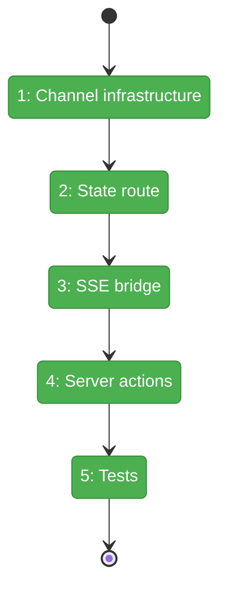
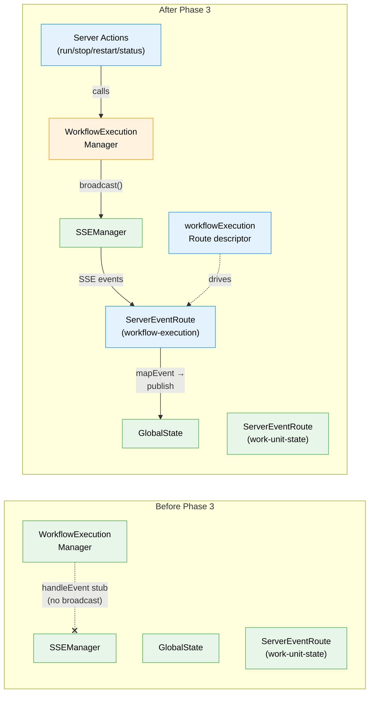

# Flight Plan: Phase 3 — SSE + GlobalState Plumbing

**Plan**: [workflow-execution-plan.md](../../workflow-execution-plan.md)
**Phase**: Phase 3: SSE + GlobalState Plumbing
**Generated**: 2026-03-15
**Status**: Landed

---

## Departure → Destination

**Where we are**: The WorkflowExecutionManager singleton exists and can start/stop/restart workflows via `drive()` with AbortSignal. It tracks execution state in-memory (handle status, iterations, lastEvent). But `handleEvent()` is a stub — it updates the local handle but never broadcasts anything. The browser has no way to observe execution status. There are no server actions to trigger run/stop/restart from the UI.

**Where we're going**: Any React component can call `useGlobalState('workflow-execution:{key}:status', 'idle')` and reactively observe workflow execution. Server actions let the UI trigger run/stop/restart. SSE carries every status change and iteration from the server manager to the browser. The entire plumbing path is proven: server broadcast → SSE → ServerEventRoute → GlobalState → useGlobalState → component re-render.

---

## Domain Context

### Domains We're Changing

| Domain | What Changes | Key Files |
|--------|-------------|-----------|
| `_platform/events` | Add `WorkflowExecution` channel constant + layout registration | `workspace-domain.ts`, `layout.tsx` |
| `_platform/state` | Add `workflowExecutionRoute` descriptor + register in connector | `workflow-execution-route.ts` (new), `state-connector.tsx` |
| `web-integration` | Wire handleEvent→broadcast, add broadcast dep, inject sseManager | `workflow-execution-manager.ts`, `.types.ts`, `create-execution-manager.ts` |
| `workflow-ui` | 4 server actions: run/stop/restart/getStatus | `workflow-execution-actions.ts` (new) |

### Domains We Depend On (no changes)

| Domain | What We Consume | Contract |
|--------|----------------|----------|
| `_platform/events` | SSEManager.broadcast() | `sseManager` globalThis singleton |
| `_platform/events` | MultiplexedSSEProvider | `useChannelEvents(channel)` |
| `_platform/state` | ServerEventRoute component | Subscribes to channel, calls mapEvent, publishes to state |
| `_platform/state` | useGlobalState hook | `useGlobalState<T>(path, default)` |
| `_platform/positional-graph` | OrchestrationService, GraphOrchestration | Already wired in Phase 2 |

---

## Flight Status

<!-- Updated by /plan-6-v2: pending → active → done. Use blocked for problems/input needed. -->

**Legend**: grey = pending | yellow = active | red = blocked/needs input | green = done

---

## Stages

<!-- Updated by /plan-6-v2 during implementation: [ ] → [~] → [x] -->

- [x] **Stage 1: Register channel infrastructure** — Add `WorkflowExecution` to WorkspaceDomain + WORKSPACE_SSE_CHANNELS (`workspace-domain.ts`, `layout.tsx`)
- [x] **Stage 2: Create state route** — Build workflowExecutionRoute descriptor + register in GlobalStateConnector (`workflow-execution-route.ts` — new, `state-connector.tsx`)
- [x] **Stage 3: Wire SSE bridge** — Add broadcast dep to manager, implement broadcastStatus + handleEvent broadcast, inject sseManager in factory (`workflow-execution-manager.ts`, `.types.ts`, `create-execution-manager.ts`)
- [x] **Stage 4: Build server actions** — 4 server actions: run, stop, restart, getStatus (`workflow-execution-actions.ts` — new)
- [x] **Stage 5: Verify with tests** — Route mapEvent unit tests + manager broadcast call tests (`workflow-execution-route.test.ts`, `workflow-execution-manager.test.ts`)

---

## Architecture: Before & After

**Legend**: existing (green, unchanged) | changed (orange, modified) | new (blue, created)

---

## Acceptance Criteria

- [ ] Calling runWorkflow server action starts the workflow and broadcasts to 'workflow-execution' SSE channel
- [ ] `useGlobalState('workflow-execution:{key}:status')` updates reactively as workflow progresses
- [ ] stopWorkflow server action halts execution within one iteration
- [ ] restartWorkflow clears state and starts fresh
- [ ] All existing tests pass (346+ baseline)

## Goals & Non-Goals

**Goals**:
- SSE broadcast on every status transition and iteration
- ServerEventRoute bridges events to GlobalState paths
- Server actions expose run/stop/restart/getStatus to UI
- Broadcast dep is injectable (testable via vi.fn())

**Non-Goals**:
- UI buttons (Phase 4)
- Node locking (Phase 4)
- Server restart recovery (Phase 5)
- Direct server-side GlobalState publishing

---

## Checklist

- [x] T001: Add `WorkflowExecution` to `WorkspaceDomain` constants
- [x] T002: Add `'workflow-execution'` to `WORKSPACE_SSE_CHANNELS`
- [x] T003: Create `workflowExecutionRoute` ServerEventRouteDescriptor
- [x] T004: Add workflowExecutionRoute to `SERVER_EVENT_ROUTES`
- [x] T005: Wire `handleEvent()` + `broadcastStatus()` with broadcast dep
- [x] T006: Inject sseManager.broadcast into create-execution-manager factory
- [x] T007: Add `runWorkflow` server action
- [x] T008: Add `stopWorkflow` server action
- [x] T009: Add `restartWorkflow` + `getWorkflowExecutionStatus` server actions
- [x] T010: Add tests for route descriptor mapEvent + manager broadcast
