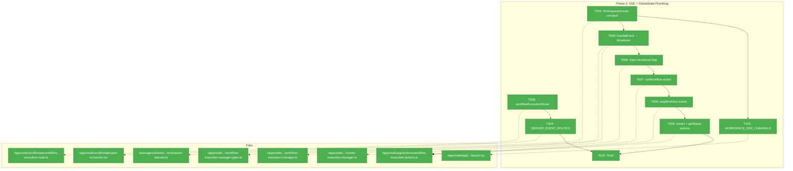
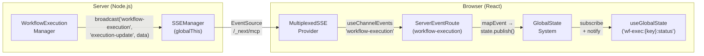
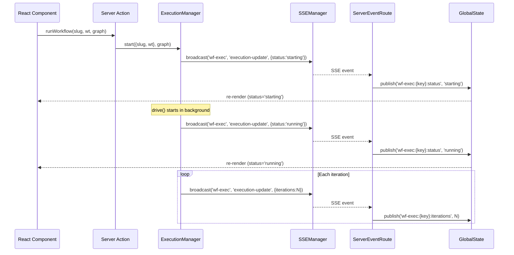

# Phase 3: SSE + GlobalState Plumbing — Tasks

**Plan**: [workflow-execution-plan.md](../../workflow-execution-plan.md)
**Phase**: Phase 3: SSE + GlobalState Plumbing
**Created**: 2026-03-15
**Status**: Ready

---

## Executive Briefing

**Purpose**: Connect the WorkflowExecutionManager's lifecycle events to the browser UI via SSE channels and GlobalState routes, then expose run/stop/restart/status as server actions. This is the integration seam — after this phase, any React component can subscribe to workflow execution status reactively.

**What We're Building**: A `workflow-execution` SSE channel that carries execution-level events (status changes, iteration progress) from the server-side manager to the browser, a `workflowExecutionRoute` that bridges those SSE events into GlobalState paths, and 4 server actions that the UI will call to control workflow execution.

**Goals**:
- ✅ SSE broadcast from WorkflowExecutionManager on every status change and iteration
- ✅ GlobalState integration via ServerEventRoute pattern (proven by work-unit-state)
- ✅ 4 server actions: runWorkflow, stopWorkflow, restartWorkflow, getWorkflowExecutionStatus
- ✅ Any component can read `useGlobalState('workflow-execution:{key}:status', 'idle')`

**Non-Goals**:
- ❌ UI buttons (Phase 4)
- ❌ Node locking logic (Phase 4)
- ❌ Server restart recovery / registry persistence (Phase 5)
- ❌ Direct server-side GlobalState publishing (ServerEventRoute handles SSE→State on client)

**Phase 4 Integration Constraints** (documented by DYK analysis):
- **DYK #3**: SSE broadcasts race ahead of server action responses. The `.then()` handler broadcasts `'stopped'`/`'completed'` via SSE while `stop()` is still running cleanup. Phase 4 MUST gate button enablement on server action response (not SSE status). SSE is for display; server action response is for action confirmation.
- **DYK #4**: Page load shows 'idle' even when workflow is running. `useGlobalState` returns default until first SSE event after mount. Phase 4 MUST call `getWorkflowExecutionStatus` server action on component mount to hydrate initial state, then subscribe to GlobalState for live updates.

---

## Prior Phase Context

### Phase 1: Orchestration Contracts (COMPLETE)

**A. Deliverables**:
- `abortable-sleep.ts` — abort-aware sleep utility
- AbortSignal support in `drive()` with `'stopped'` exit reason
- `'interrupted'` status in ExecutionStatus + ONBAS handling
- Compound cache key `${worktreePath}|${graphSlug}` in OrchestrationService
- Per-handle PodManager+ODS isolation

**B. Dependencies Exported**:
- `DriveExitReason: 'complete' | 'failed' | 'max-iterations' | 'stopped'`
- `DriveOptions: { signal?: AbortSignal; idleDelayMs?; actionDelayMs? }`
- `ExecutionStatus` includes `'interrupted'`
- `abortableSleep(delayMs, signal?)` exported utility
- Per-handle isolation via factory closure

**C. Gotchas**:
- Schema duplication: ExecutionStatus needs updates in 3 places (types, schema, state.schema)
- ONBAS interrupted + blocked-error edge case required explicit handling
- PodManager must be per-handle, not shared

**D. Incomplete Items**: None — all review fixes applied

**E. Patterns to Follow**:
- Compound key pattern: `${worktreePath}|${graphSlug}` (pipe delimiter in OrchestrationService)
- Abort-aware loop: check signal at iteration boundary, wrap sleep in try/catch
- Status union auditing: update type + Zod schema + format glyph

### Phase 2: Web DI + Execution Manager (COMPLETE)

**A. Deliverables**:
- `WorkflowExecutionManager` class (~260 lines) with full lifecycle
- `get-manager.ts` globalThis getter, `create-execution-manager.ts` factory
- Bootstrap in `instrumentation.ts` with HMR-safe flag pattern
- Web DI: Plan 034 AgentManager, ScriptRunner, EventHandlerService, registerOrchestrationServices()
- New contracts: `cleanup()`, `evict()`, `destroyAllPods()`, `markNodesInterrupted()`, `resetGraphState()`

**B. Dependencies Exported**:
- `getWorkflowExecutionManager()` — returns manager singleton from globalThis
- `WorkflowExecutionManager.start/stop/restart/getStatus/getHandle/listRunning/cleanup`
- `ExecutionHandle` type with key, status, iterations, etc.
- `ManagerExecutionStatus: 'idle'|'starting'|'running'|'stopping'|'stopped'|'completed'|'failed'`
- `ExecutionManagerDeps: { orchestrationService, graphService, workspaceService }`
- `makeExecutionKey(worktreePath, graphSlug): ExecutionKey`

**C. Gotchas**:
- handleEvent() is STUBBED — only updates local handle state, no SSE/GlobalState (Phase 3 wires it)
- drivePromise MUST have .catch() to prevent unhandled rejection crashes
- start() checks both 'running' AND 'starting' for idempotency (FT-001 fix)
- ExecutionKey uses colon delimiter (`:`), OrchestrationService uses pipe (`|`)

**D. Incomplete Items**: None — all 4 FT fixes applied

**E. Patterns to Follow**:
- globalThis singleton with flag-before-async, try/catch with flag reset
- FakeGraphOrchestration.blockDrive()/releaseDrive() for deterministic lifecycle tests
- DYK #3: .then() AND .catch() are MANDATORY on fire-and-forget drivePromise
- Domain-aware state manipulation via IPositionalGraphService methods

---

## Pre-Implementation Check

| File | Exists? | Domain Check | Notes |
|------|---------|-------------|-------|
| `packages/shared/.../workspace-domain.ts` | ✅ Exists | `_platform/events` ✓ | Add 1 line: `WorkflowExecution: 'workflow-execution'` |
| `apps/web/app/(dashboard)/.../layout.tsx` | ✅ Exists | `events` cross-domain ✓ | Add 1 entry to WORKSPACE_SSE_CHANNELS array |
| `apps/web/src/lib/state/workflow-execution-route.ts` | ❌ New | `_platform/state` ✓ | Follow work-unit-state-route.ts pattern |
| `apps/web/src/lib/state/state-connector.tsx` | ✅ Exists | `_platform/state` ✓ | Add import + array entry |
| `apps/web/.../workflow-execution-manager.ts` | ✅ Exists | `web-integration` ✓ | Wire handleEvent + broadcastStatus |
| `apps/web/.../workflow-execution-manager.types.ts` | ✅ Exists | `web-integration` ✓ | Add broadcast to ExecutionManagerDeps |
| `apps/web/.../create-execution-manager.ts` | ✅ Exists | `web-integration` ✓ | Inject sseManager.broadcast |
| `apps/web/app/actions/workflow-execution-actions.ts` | ❌ New | `workflow-ui` ✓ | 4 server actions |
| `test/unit/web/state/workflow-execution-route.test.ts` | ❌ New | test | mapEvent() unit tests |

**Harness context**: Harness available at L3 (Docker + CDP + CLI SDK). Pre-phase validation will be run by plan-6. SSE channels are client-side so harness browser automation can verify them if needed, but primary testing is unit-level mapEvent() + broadcast call verification.

---

## Architecture Map



---

## Tasks

| Status | ID | Task | Domain | Path(s) | Done When | Notes |
|--------|-----|------|--------|---------|-----------|-------|
| [x] | T001 | Add `WorkflowExecution` to `WorkspaceDomain` constants | events | `/packages/shared/src/features/027-central-notify-events/workspace-domain.ts` | `WorkspaceDomain.WorkflowExecution === 'workflow-execution'` | Finding 09: value IS the channel name. 1 line. |
| [x] | T002 | Add `'workflow-execution'` to `WORKSPACE_SSE_CHANNELS` in workspace layout | events | `/apps/web/app/(dashboard)/workspaces/[slug]/layout.tsx` | Channel appears in MultiplexedSSEProvider channels list | 1 line. After T001. |
| [x] | T003 | Create `workflowExecutionRoute` ServerEventRouteDescriptor | state | `/apps/web/src/lib/state/workflow-execution-route.ts` | mapEvent handles `execution-update` → 4 properties, `execution-removed` → remove. Unit tests pass. | Follow work-unit-state-route.ts exactly. Properties: status, iterations, lastEventType, lastMessage. instanceId = ExecutionKey. |
| [x] | T004 | Add workflowExecutionRoute to `SERVER_EVENT_ROUTES` in GlobalStateConnector | state | `/apps/web/src/lib/state/state-connector.tsx` | Route mounted as ServerEventRoute component | 1 import + 1 array entry. After T003. |
| [x] | T005 | Wire `handleEvent()` + `broadcastStatus()` + `broadcastRemoval()` in WorkflowExecutionManager | web-integration | `/apps/web/src/features/074-workflow-execution/workflow-execution-manager.ts`, `/apps/web/src/features/074-workflow-execution/workflow-execution-manager.types.ts` | handleEvent calls broadcast on every DriveEvent. broadcastStatus called on start/stop/completion/failure transitions. broadcastRemoval called when handle is deleted. Test verifies broadcast call count + payload shape. | Add `broadcast` function to ExecutionManagerDeps. Add broadcastStatus(key, handle) + broadcastRemoval(key) private methods. **DYK #2**: restart() and cleanup() must call broadcastRemoval(key) before deleting the handle. **DYK #5 — 6 broadcast call sites**: (1) start()→'starting', (2) start()→'running', (3) handleEvent()→iteration/idle/status/error, (4) .then()→'completed'/'stopped'/'failed', (5) .catch()→'failed', (6) stop()→'stopping'. Missing any creates UI blind spots. |
| [x] | T006 | Inject sseManager.broadcast into create-execution-manager factory | web-integration | `/apps/web/src/features/074-workflow-execution/create-execution-manager.ts` | Factory passes `sseManager.broadcast.bind(sseManager)` as broadcast dep | Import sseManager from `@/lib/sse-manager`. |
| [x] | T007 | Add `runWorkflow` server action | workflow-ui | `/apps/web/app/actions/workflow-execution-actions.ts` | Server action calls manager.start(), returns `{ok, error?, key?}` | New file. Follow workunit-actions.ts pattern: 'use server', requireAuth, getWorkflowExecutionManager(). |
| [x] | T008 | Add `stopWorkflow` server action | workflow-ui | `/apps/web/app/actions/workflow-execution-actions.ts` | Server action calls manager.stop(), returns `{ok}` | Same file as T007. |
| [x] | T009 | Add `restartWorkflow` + `getWorkflowExecutionStatus` server actions | workflow-ui | `/apps/web/app/actions/workflow-execution-actions.ts` | restart calls manager.restart(). getStatus returns `SerializableExecutionStatus` (DYK #1). Both return correct shapes. | Same file as T007. **DYK #1**: ExecutionHandle has non-serializable fields (AbortController, Promise, IGraphOrchestration). Server action MUST return a clean `SerializableExecutionStatus` type — strip internal refs before returning. Add type to workflow-execution-manager.types.ts. |
| [x] | T010 | Add tests for route descriptor mapEvent + manager broadcast | test | `test/unit/web/state/workflow-execution-route.test.ts`, `test/unit/web/features/074-workflow-execution/workflow-execution-manager.test.ts` | Route: mapEvent returns correct StateUpdate[] for each event type. Manager: broadcast called N times with correct payload. All tests pass. | Lightweight: pure function tests for mapEvent, vi.fn() for broadcast in manager tests. |

---

## Context Brief

### Key findings from plan

- **Finding 08 (HIGH)**: ServerEventRouteDescriptor pattern proven by work-unit-state — follow exact same pattern. Reference: `apps/web/src/lib/state/work-unit-state-route.ts`
- **Finding 09 (HIGH)**: ADR-0010 IMP-001: WorkspaceDomain value IS the SSE channel name — `'workflow-execution'` must match exactly in all 3 locations (constant, channels array, route descriptor)
- **ADR-0012 Deviation**: Execution-level status emits directly to SSE (management layer, not engine boundary). Node-level still disk→watcher→SSE.

### Domain dependencies (consumed)

- `_platform/events`: SSE broadcast (`SSEManager.broadcast(channel, eventType, data)`) — delivers events to browser
- `_platform/events`: Channel identity (`WorkspaceDomain` const) — canonical channel names
- `_platform/events`: Multiplexed SSE (`MultiplexedSSEProvider`, `useChannelEvents`) — client-side channel subscription
- `_platform/state`: State routing (`ServerEventRouteDescriptor`, `ServerEventRoute`) — SSE→GlobalState bridge
- `_platform/state`: State reading (`useGlobalState(path, default)`) — reactive per-value subscription (Phase 4 consumes this)
- `_platform/state`: Domain registration (`registerDomain` in GlobalStateConnector) — auto-registers on mount

### Domain constraints

- WorkspaceDomain value must exactly equal SSE channel name (ADR-0010 IMP-001)
- SSE event type must match `/^[a-zA-Z0-9_-]+$/` (SSEManager validates at runtime)
- ServerEventRoute uses index cursor (`lastProcessedIndexRef`) — mapEvent must be idempotent
- Server actions must call `await requireAuth()` before any business logic
- Server actions import from `../../src/` relative paths (Next.js app/ conventions)
- The server does NOT publish to GlobalState directly — ServerEventRoute handles SSE→State mapping on the client

### Critical architectural insight

The Workshop 002 design shows both `sseManager.broadcast()` AND `stateService.publish()` from the server. But the actual codebase pattern (proven by work-unit-state) is:

1. **Server**: `sseManager.broadcast('workflow-execution', eventType, data)` — sends SSE event
2. **Client**: `ServerEventRoute` component receives SSE via `useChannelEvents` → calls `mapEvent()` → publishes to GlobalState via `state.publish()`

There is no server-side GlobalState access. GlobalState is a client-side React context. The ServerEventRoute bridge component is the integration seam.

### SSE broadcast payload shape

```typescript
// Broadcast from handleEvent / broadcastStatus
sseManager.broadcast('workflow-execution', 'execution-update', {
  key: handle.key,           // ExecutionKey (instanceId for GlobalState)
  status: handle.status,     // ManagerExecutionStatus
  iterations: handle.iterations,
  lastEventType: handle.lastEventType,
  lastMessage: handle.lastMessage,
});
```

Client receives (SSEManager auto-adds type + channel):
```json
{
  "type": "execution-update",
  "channel": "workflow-execution",
  "key": "/path/to/worktree:my-pipeline",
  "status": "running",
  "iterations": 5,
  "lastEventType": "iteration",
  "lastMessage": "Completed iteration 5"
}
```

### Server action pattern (reference)

```typescript
'use server';
import { requireAuth } from '@/features/063-login/lib/require-auth';
import { getWorkflowExecutionManager } from '../../src/features/074-workflow-execution/get-manager';

export async function runWorkflow(slug: string, worktreePath: string, graphSlug: string) {
  await requireAuth();
  const manager = getWorkflowExecutionManager();
  return manager.start({ workspaceSlug: slug, worktreePath }, graphSlug);
}
```

### Harness context

- **Boot**: `just harness dev` — health: `just harness doctor`
- **Interact**: HTTP API (server actions), CLI (`just harness test-data`)
- **Observe**: JSON envelopes, screenshots via CDP
- **Maturity**: L3 — Boot + Browser + Evidence + CLI SDK
- **Pre-phase validation**: Agent will validate harness at start of implementation

### Reusable from prior phases

- `FakeGraphOrchestration` with `blockDrive()/releaseDrive()` for deterministic tests
- `FakeOrchestrationService` with evict tracker
- `FakePositionalGraphService` with markNodesInterrupted/resetGraphState
- Existing `workflow-execution-manager.test.ts` (17 tests) — extend with broadcast verification
- `vi.fn()` pattern for broadcast function injection

### System flow diagram



### Server action → UI flow



---

## Discoveries & Learnings

_Populated during implementation by plan-6._

| Date | Task | Type | Discovery | Resolution | References |
|------|------|------|-----------|------------|------------|

---

## Directory Layout

```
docs/plans/074-workflow-execution/
  ├── workflow-execution-plan.md
  ├── workflow-execution-spec.md
  └── tasks/
      ├── phase-1-orchestration-contracts/  (complete)
      ├── phase-2-web-di-execution-manager/ (complete)
      └── phase-3-sse-globalstate-plumbing/
          ├── tasks.md                      ← this file
          ├── tasks.fltplan.md              ← flight plan
          └── execution.log.md              # created by plan-6
```
