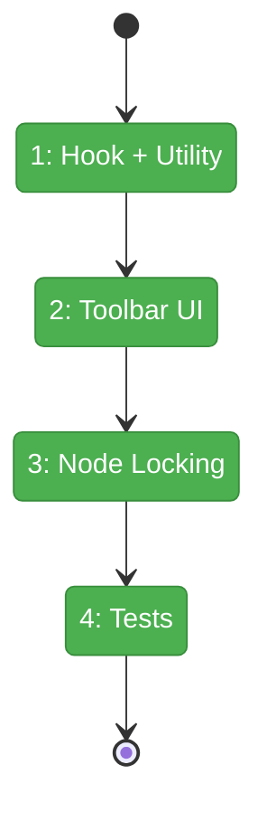
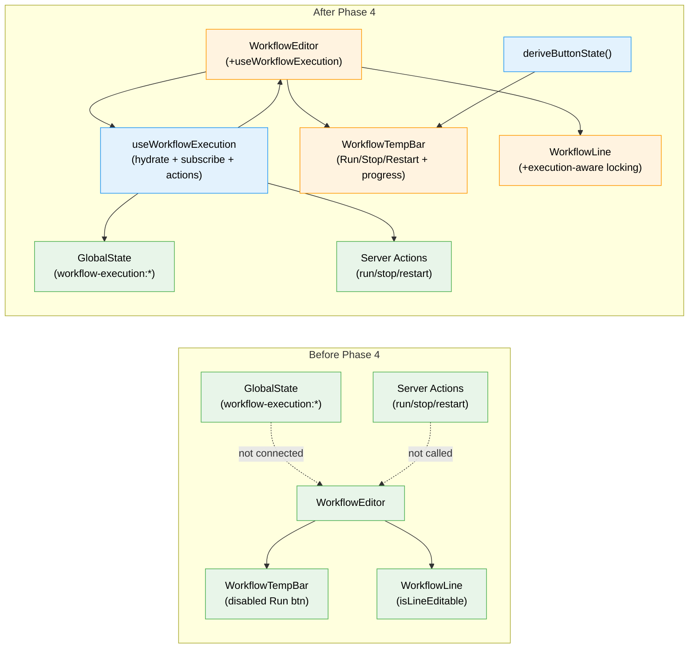

# Flight Plan: Phase 4 — UI Execution Controls

**Plan**: [workflow-execution-plan.md](../../workflow-execution-plan.md)
**Phase**: Phase 4: UI Execution Controls
**Generated**: 2026-03-15
**Status**: Landed

---

## Departure → Destination

**Where we are**: Phases 1-3 built the full backend stack: AbortSignal in drive(), WorkflowExecutionManager singleton, SSE broadcasting at 6 lifecycle points, GlobalState route mapping execution-update/removal events, and 4 server actions (run/stop/restart/getStatus). The workflow toolbar has a disabled placeholder Run button. `isLineEditable()` handles running nodes but has no execution-level awareness.

**Where we're going**: A developer opens a workflow page and sees a "Run" button. Clicking it starts the workflow — the button changes to "Stop", iteration count ticks up, and a status message updates in real-time. Running and completed nodes lock; future nodes remain editable. Clicking "Stop" halts execution immediately. "Resume" picks up where it left off. "Restart" clears everything and starts fresh. All transitions are smooth with loading indicators.

---

## Domain Context

### Domains We're Changing

| Domain | What Changes | Key Files |
|--------|-------------|-----------|
| `074-workflow-execution` | New hook (useWorkflowExecution), new utility (deriveButtonState) | `hooks/use-workflow-execution.ts`, `execution-button-state.ts` |
| `workflow-ui` | Execution buttons in toolbar, progress display, execution-aware node locking, undo/redo blocking | `workflow-temp-bar.tsx`, `workflow-line.tsx`, `workflow-editor.tsx` |

### Domains We Depend On (no changes)

| Domain | What We Consume | Contract |
|--------|----------------|----------|
| `_platform/state` | useGlobalState hook | `useGlobalState<T>(path, default)` |
| `_platform/events` | SSE delivery to GlobalState | Transparent (Phase 3 wired) |
| `074-workflow-execution` (Phase 3) | Server actions, types | runWorkflow, stopWorkflow, restartWorkflow, getWorkflowExecutionStatus, makeExecutionKey, ManagerExecutionStatus |

---

## Flight Status

<!-- Updated by /plan-6-v2: pending → active → done. Use blocked for problems/input needed. -->

**Legend**: grey = pending | yellow = active | red = blocked/needs input | green = done

---

## Stages

<!-- Updated by /plan-6-v2 during implementation: [ ] → [~] → [x] -->

- [x] **Stage 1: Hook + Utility** — Create useWorkflowExecution hook and deriveButtonState utility (`use-workflow-execution.ts`, `execution-button-state.ts` — new files)
- [x] **Stage 2: Toolbar UI** — Extend WorkflowTempBar with execution buttons, progress display, wire into WorkflowEditor (`workflow-temp-bar.tsx`, `workflow-editor.tsx`)
- [x] **Stage 3: Node Locking** — Extend isLineEditable with execution context, block undo/redo during execution (`workflow-line.tsx`, `workflow-editor.tsx`)
- [x] **Stage 4: Tests** — Button state machine tests, isLineEditable execution tests (`execution-button-state.test.ts`, `workflow-line-locking.test.ts`)

---

## Architecture: Before & After

**Legend**: existing (green, unchanged) | changed (orange, modified) | new (blue, created)

---

## Acceptance Criteria

- [ ] Run button visible when idle/stopped/failed, hidden when running (spec AC #14)
- [ ] Stop button visible when running, hidden otherwise (spec AC #14)
- [ ] Restart button visible when stopped/completed/failed (spec AC #14)
- [ ] Clicking Run starts the workflow, UI shows "Running" (spec AC #1)
- [ ] Completed and running nodes cannot be dragged or removed (spec AC #6)
- [ ] Future nodes CAN be edited while workflow is running (spec AC #6)
- [ ] Buttons disabled during transitional states (starting, stopping) (spec AC #14)
- [ ] Initial state hydrated on mount (DYK #4)
- [ ] Button enablement gated on action response, not SSE (DYK #3)

## Goals & Non-Goals

**Goals**: Run/Stop/Restart button group, live status display, node locking, transitional states, undo/redo blocking
**Non-Goals**: Pod log viewer, scheduling, per-node status badges (existing), server restart recovery UI (Phase 5)

---

## Checklist

- [x] T001: Create useWorkflowExecution hook
- [x] T002: Create deriveButtonState() utility
- [x] T003: Extend WorkflowTempBar with execution button group
- [x] T004: Add execution progress display to toolbar
- [x] T005: Wire useWorkflowExecution into WorkflowEditor
- [x] T006: Extend isLineEditable() with execution-aware locking
- [x] T007: Block undo/redo during active execution
- [x] T008: Write button state machine tests
- [x] T009: Write isLineEditable execution context tests
