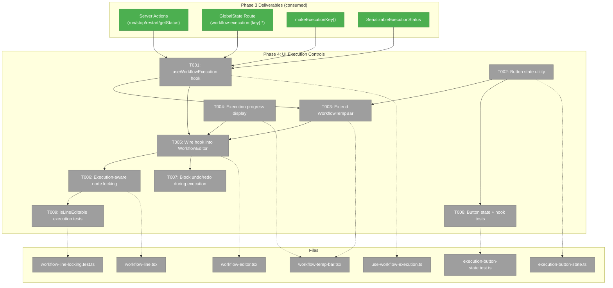
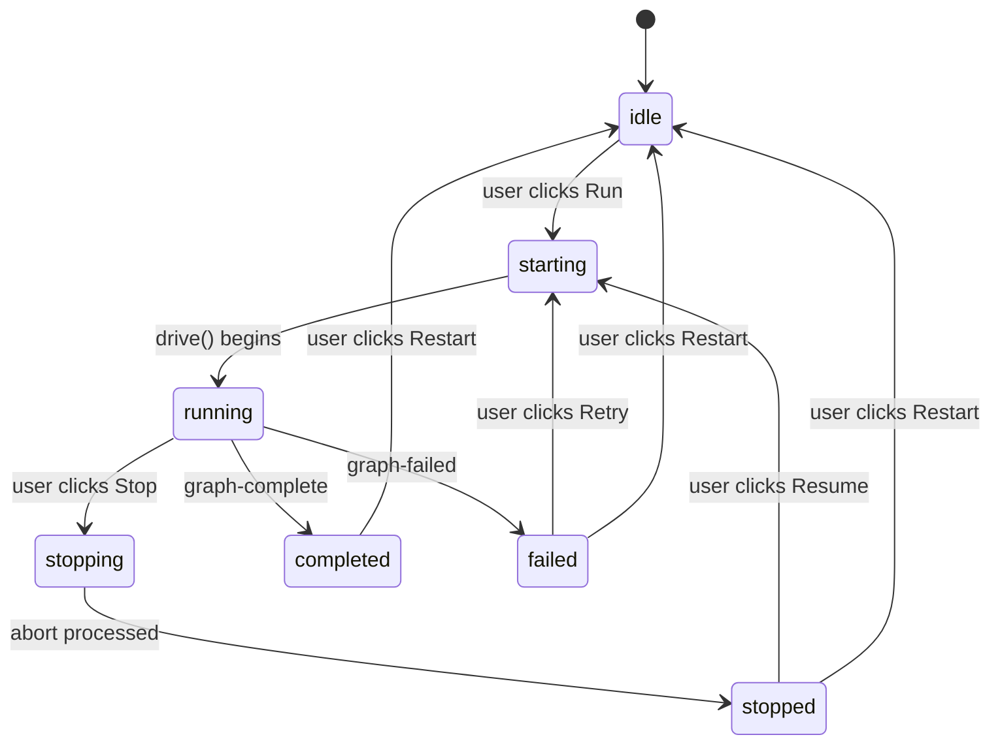
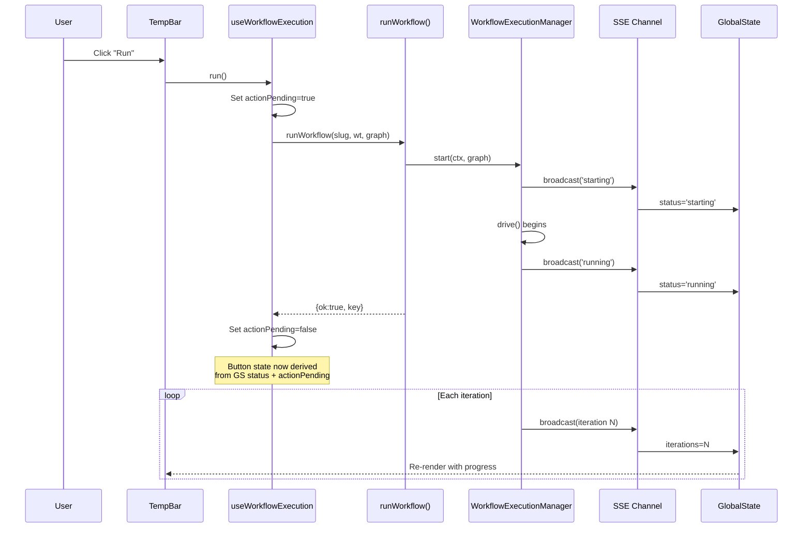

# Phase 4: UI Execution Controls — Tasks Dossier

**Plan**: [workflow-execution-plan.md](../../workflow-execution-plan.md)
**Phase**: Phase 4: UI Execution Controls
**Created**: 2026-03-15
**Domain**: `workflow-ui` (primary), `074-workflow-execution` (hook + utility)
**Testing**: Lightweight — button state derivation unit tests + isLineEditable execution tests

---

## Executive Briefing

**Purpose**: Build the user-facing execution controls that let users run, stop, and restart workflows directly from the browser. This phase wires the SSE + GlobalState plumbing (Phase 3) into visible, interactive UI — buttons, status display, progress indicators, and node locking.

**What We're Building**: A `useWorkflowExecution` hook that hydrates initial state on mount, subscribes to live GlobalState updates, and wraps server actions with response-gated button state. A button state utility that maps `ManagerExecutionStatus` → button visibility/enablement. Extended `WorkflowTempBar` with Run/Stop/Restart button group and progress display. Execution-aware node locking in `WorkflowLine`.

**Goals**:
- ✅ Run/Stop/Restart buttons with correct state machine (Workshop 001)
- ✅ Live execution status display (iterations, status message, elapsed time)
- ✅ Node locking: running+completed nodes locked, future nodes editable
- ✅ Transitional state handling (disabled buttons, loading indicators during starting/stopping)
- ✅ Initial state hydration on mount (DYK #4)
- ✅ Button gating on server action response, not SSE (DYK #3)
- ✅ Undo/redo blocked during active execution

**Non-Goals**:
- ❌ Pod terminal/log viewer in browser
- ❌ Per-node status badges (existing work-unit-state SSE handles this)
- ❌ Workflow scheduling or triggers
- ❌ Server restart recovery UI (Phase 5 concern)

---

## Prior Phase Context

### Phase 1: Orchestration Contracts ✅

**Deliverables**:
- `abortable-sleep.ts` — AbortSignal-aware sleep utility
- `DriveExitReason` extended with `'stopped'`, `DriveOptions` extended with `signal?: AbortSignal`
- `ExecutionStatus` extended with `'interrupted'`, ONBAS handles it (skip + diagnoseStuckLine blocks line)
- Compound cache key `${worktreePath}|${graphSlug}` in OrchestrationService
- Per-handle PodManager + ODS via factory pattern

**Dependencies Exported**: `DriveOptions.signal`, `DriveExitReason: 'stopped'`, `ExecutionStatus: 'interrupted'`, `PerHandleDeps`, `abortableSleep()`

**Gotchas**: Always update Zod schemas (reality.schema.ts, state.schema.ts) when adding to type unions. ONBAS `diagnoseStuckLine` treats 'interrupted' as `hasRunning=true` (blocks line progression).

**Patterns**: Type-first contract changes → Zod schema → format glyph. Per-handle factory pattern. AbortError catch in drive() loop.

### Phase 2: Web DI + Execution Manager ✅

**Deliverables**:
- `WorkflowExecutionManager` class with start/stop/restart/getStatus/cleanup lifecycle
- `ExecutionHandle` model (14 fields) with `ManagerExecutionStatus` (7 states)
- `get-manager.ts` globalThis getter, `create-execution-manager.ts` factory
- Bootstrap in `instrumentation.ts` (HMR-safe, SIGTERM handler)
- DI token de-aliasing (`ORCHESTRATION_DI_TOKENS.AGENT_MANAGER` → unique `'IOrchestrationAgentManagerService'`)

**Dependencies Exported**: `IWorkflowExecutionManager` (8 methods), `SerializableExecutionStatus` (14 fields), `ExecutionKey` (base64url), `ManagerExecutionStatus` union, `makeExecutionKey()`

**Gotchas**: FakePositionalGraphService uses `calls.get('methodName')` not `getCalls()`. IWorkUnitPod already has `terminate()`. EventHandlerService loadState/persistState are intentionally stubbed. ExecutionKey is base64url-encoded (FT-001 fix). Restart on running workflow requires stop() first.

**Patterns**: globalThis singleton + flag pattern. Factory closure for DI resolution. SerializableX types for JSON-safe API responses. Always `.catch()` on background promises.

### Phase 3: SSE + GlobalState Plumbing ✅

**Deliverables**:
- `WorkspaceDomain.WorkflowExecution = 'workflow-execution'` SSE channel
- `workflowExecutionRoute` ServerEventRouteDescriptor (maps execution-update → 4 properties, execution-removed → removal)
- 4 server actions: `runWorkflow`, `stopWorkflow`, `restartWorkflow`, `getWorkflowExecutionStatus`
- 6 broadcast call sites in WorkflowExecutionManager (start→starting, start→running, handleEvent, .then, .catch, stop→stopping)
- `broadcastRemoval()` for restart/cleanup (prevents ghost entries)

**Dependencies Exported**:
- Server actions: `runWorkflow(slug, worktreePath, graphSlug)`, `stopWorkflow(slug, worktreePath, graphSlug)`, `restartWorkflow(slug, worktreePath, graphSlug)`, `getWorkflowExecutionStatus(slug, worktreePath, graphSlug)`
- GlobalState paths: `workflow-execution:{key}:status`, `workflow-execution:{key}:iterations`, `workflow-execution:{key}:lastEventType`, `workflow-execution:{key}:lastMessage`
- `SerializableExecutionStatus` returned by getWorkflowExecutionStatus

**Gotchas**:
- **DYK #3**: SSE broadcasts race ahead of server action responses. Phase 4 MUST gate button enablement on server action response, not SSE status.
- **DYK #4**: Page load shows 'idle' even when workflow is running. Phase 4 MUST call `getWorkflowExecutionStatus` on component mount to hydrate initial state.
- `makeExecutionKey(worktreePath, graphSlug)` returns base64url string for GlobalState path construction.
- Server actions validate worktreePath against known workspace worktrees (FT-002).

**Patterns**: ServerEventRouteDescriptor follows work-unit-state pattern. SSE→GlobalState is client-side only (no server-side state publishing). `ISSEBroadcaster` contract for testing with `FakeSSEBroadcaster`.

---

## Pre-Implementation Check

| File | Exists? | Domain Check | Notes |
|------|---------|-------------|-------|
| `apps/web/src/features/074-workflow-execution/hooks/use-workflow-execution.ts` | ❌ create | 074-workflow-execution | New hook — encapsulates execution state + actions |
| `apps/web/src/features/074-workflow-execution/execution-button-state.ts` | ❌ create | 074-workflow-execution | Pure function: status → button visibility/enablement |
| `apps/web/src/features/050-workflow-page/components/workflow-temp-bar.tsx` | ✅ modify | workflow-ui | Add execution buttons + progress display |
| `apps/web/src/features/050-workflow-page/components/workflow-line.tsx` | ✅ modify | workflow-ui | Extend isLineEditable with execution context |
| `apps/web/src/features/050-workflow-page/components/workflow-editor.tsx` | ✅ modify | workflow-ui | Wire useWorkflowExecution hook, pass status to children |
| `test/unit/web/features/074-workflow-execution/execution-button-state.test.ts` | ❌ create | test | Button state machine unit tests |
| `test/unit/web/features/050-workflow-page/workflow-line-locking.test.ts` | ❌ create | test | isLineEditable execution context tests |

**Harness context**: Harness available at L3. Pre-phase validation deferred — harness is for end-to-end testing; Phase 4 is UI leaf work with lightweight unit tests.

---

## Architecture Map



---

## Tasks

| Status | ID | Task | Domain | Path(s) | Done When | Notes |
|--------|-----|------|--------|---------|-----------|-------|
| [x] | T001 | Create `useWorkflowExecution` hook | 074-workflow-execution | `apps/web/src/features/074-workflow-execution/hooks/use-workflow-execution.ts` | Hook returns executionStatus, actionPending, hydrating, disabled, run/stop/restart functions. Hydrates on mount via getWorkflowExecutionStatus (P4-DYK #2). Actions gate button state on response (DYK #3). | Consumes makeExecutionKey, useGlobalState, 4 server actions. **P4-DYK #1**: makeExecutionKey uses Buffer — must make browser-safe with btoa()+base64url replacement before importing in client component. **P4-DYK #2**: Add `hydrating` state — hide buttons until initial getStatus call completes (prevents "idle" flash/stale clicks). **P4-DYK #3**: If `worktreePath` is undefined, return `disabled: true` — all action calls prevented, UI hides execution controls. |
| [x] | T002 | Create `deriveButtonState()` utility | 074-workflow-execution | `apps/web/src/features/074-workflow-execution/execution-button-state.ts` | Pure function maps ManagerExecutionStatus + actionPending → button visibility/enablement per Workshop 001 table. All 7 states covered. | Workshop 001 state machine table is source of truth. |
| [x] | T003 | Extend WorkflowTempBar with execution button group | workflow-ui | `apps/web/src/features/050-workflow-page/components/workflow-temp-bar.tsx` | Run/Stop/Restart buttons render with correct visibility per state. Run visible when idle/stopped/failed. Stop visible when running. Restart visible when stopped/completed/failed. Transitional states show disabled + spinner. | Uses deriveButtonState(). Run label changes: "Run" (idle), "Resume" (stopped), "Retry" (failed). |
| [x] | T004 | Add execution progress display to toolbar | workflow-ui | `apps/web/src/features/050-workflow-page/components/workflow-temp-bar.tsx` | Shows: status badge (running/stopped/etc), iteration count, last status message. Hidden when idle. | Receives data from useWorkflowExecution via props. |
| [x] | T005 | Wire useWorkflowExecution into WorkflowEditor | workflow-ui | `apps/web/src/features/050-workflow-page/components/workflow-editor.tsx` | WorkflowEditor calls useWorkflowExecution, passes execution props to TempBar and execution status to WorkflowLine via Canvas. | Needs workspaceSlug, worktreePath, graphSlug (already in WorkflowEditor props). |
| [x] | T006 | Extend isLineEditable() with execution-aware locking | workflow-ui | `apps/web/src/features/050-workflow-page/components/workflow-line.tsx` | During 'stopping': all lines locked. During 'running'/'stopped': current logic (running+complete locked, future editable). During 'idle': all editable. Function accepts optional executionStatus param. | Backwards-compatible: no executionStatus = current behavior. **P4-DYK #5**: Export isLineEditable directly from workflow-line.tsx (currently unexported local function) so T009 can import it. |
| [x] | T007 | Block undo/redo during active execution | workflow-ui | `apps/web/src/features/050-workflow-page/components/workflow-editor.tsx` | Undo/redo buttons disabled when execution is active (starting/running/stopping). canUndo/canRedo overridden to false. | Simple boolean AND with existing canUndo/canRedo. **P4-DYK #4**: Don't clear undo stack on execution start — stale pre-execution snapshots self-correct via SSE within seconds. Clearing would remove useful undo history for future-line edits during execution. |
| [x] | T008 | Write button state machine + action gating tests | test | `test/unit/web/features/074-workflow-execution/execution-button-state.test.ts` | All 7 ManagerExecutionStatus values produce correct button visibility/enablement. Action-pending state disables active button. | Pure function tests — no React needed. |
| [x] | T009 | Write isLineEditable execution context tests | test | `test/unit/web/features/050-workflow-page/workflow-line-locking.test.ts` | Tests: 'stopping' locks all lines, 'running' uses current logic, 'idle'/undefined = current behavior, empty lines always editable. | Extract isLineEditable to testable export. |

---

## Context Brief

### Key findings from plan

- **Finding 08**: ServerEventRouteDescriptor pattern proven by work-unit-state — no new abstraction needed → Phase 3 followed this exactly. Phase 4 consumes the resulting GlobalState paths.
- **Finding 09**: ADR-0010 IMP-001: WorkspaceDomain value IS the SSE channel name → Phase 3 verified this. Phase 4 uses `'workflow-execution'` as the state domain prefix.
- **DYK #3 (Critical)**: SSE broadcasts race ahead of server action responses → Phase 4 MUST gate button enablement on the server action response, not on SSE status arriving. The hook tracks `actionPending` state separately from `executionStatus`.
- **DYK #4 (Critical)**: Page load shows 'idle' even when workflow is running → Phase 4 MUST call `getWorkflowExecutionStatus` on component mount to hydrate initial state before SSE events arrive.

### Domain dependencies

- `_platform/state`: Read single state value (`useGlobalState`) — subscribe to `workflow-execution:{key}:status`, `:iterations`, `:lastEventType`, `:lastMessage`
- `_platform/events`: SSE delivery (no direct consumption — state arrives via GlobalState after Phase 3 wiring)
- `074-workflow-execution`: `makeExecutionKey(worktreePath, graphSlug)` for GlobalState path construction, `ManagerExecutionStatus` type, `SerializableExecutionStatus` type
- Server actions: `runWorkflow`, `stopWorkflow`, `restartWorkflow`, `getWorkflowExecutionStatus` from `app/actions/workflow-execution-actions.ts`

### Domain constraints

- `workflow-ui` is a leaf business domain — no public contracts exported
- Cross-domain imports from `074-workflow-execution` use public types only (makeExecutionKey, ManagerExecutionStatus, SerializableExecutionStatus)
- Server actions imported from `app/actions/` (Next.js convention)
- `useGlobalState` imported from `@/lib/state/use-global-state`

### Harness context

- **Boot**: `just harness dev` — health check: `just harness health`
- **Interact**: Browser automation (Playwright/CDP) + CLI SDK
- **Observe**: JSON envelopes, screenshots, console logs
- **Maturity**: L3
- **Pre-phase validation**: Deferred — Phase 4 is UI leaf work. Harness useful for visual verification after all tasks complete, not per-task.

### Reusable from prior phases

- `makeExecutionKey(worktreePath, graphSlug)` — base64url key for GlobalState paths
- `SerializableExecutionStatus` — 14-field JSON-safe type for status snapshots
- `ManagerExecutionStatus` — 7-state union type (idle, starting, running, stopping, stopped, completed, failed)
- `FakeSSEBroadcaster` from @chainglass/shared — for any test that needs broadcast verification
- Workshop 001 button state machine table — definitive source for button visibility/enablement rules

### Data flow: worktreePath availability

WorkflowEditor receives `workspaceSlug` and `worktreePath` as props (from URL route param `[slug]` and query param `?worktree=`). These are passed to `useWorkflowMutations` today. Phase 4 passes them to `useWorkflowExecution` identically.

### Button state machine (Workshop 001)

| Status | Run | Stop | Restart | Nodes Locked? |
|--------|-----|------|---------|---------------|
| `idle` | ▶ Run (enabled) | hidden | hidden | No |
| `starting` | disabled + spinner | hidden | hidden | No |
| `running` | hidden | ⏹ Stop (enabled) | hidden | Running+completed: yes; Future: no |
| `stopping` | hidden | disabled + spinner | hidden | All locked |
| `stopped` | ▶ Resume (enabled) | hidden | ↺ Restart (enabled) | Running+completed: yes; Future: no |
| `completed` | hidden | hidden | ↺ Restart (enabled) | All complete |
| `failed` | ▶ Retry (enabled) | hidden | ↺ Restart (enabled) | Errored: yes; Others: no |

### Mermaid state diagram (execution lifecycle)



### Mermaid sequence diagram (run workflow interaction)



---

## Discoveries & Learnings

### Phase 4 DYK Session (2026-03-15)

| # | Insight | Impact | Resolution | Tasks Affected |
|---|---------|--------|------------|----------------|
| P4-DYK #1 | `makeExecutionKey` uses `Buffer.from().toString('base64url')` — Node.js API, not available in `'use client'` components | CRITICAL | Make browser-safe: replace with `btoa()` + base64url char replacement (`+/=` → `-_`). Works in both Node.js 20+ and all browsers. | T001 |
| P4-DYK #2 | Hydration race: `useGlobalState` returns 'idle' (default) until `getWorkflowExecutionStatus` response arrives. Run button flashes visible for ~200-500ms, user could click stale button. | HIGH | Add `hydrating: boolean` state to hook. While hydrating, hide all execution buttons (or show skeleton). Only derive button visibility after hydration completes. | T001, T002, T003 |
| P4-DYK #3 | `worktreePath` is optional in `WorkflowEditorProps` but all 4 server actions require it as non-optional string | MEDIUM | Hook checks `worktreePath` on init. If undefined, returns `disabled: true` — prevents all action calls, UI hides execution controls or shows "Select a worktree". | T001, T003, T005 |
| P4-DYK #4 | Undo stack contains pre-execution `GraphStatusResult` snapshots. After execution, undoing reverts visual state to pre-execution (pending nodes) while execution manager still says completed. | LOW | Don't clear undo stack — visual inconsistency self-corrects via next SSE event or page refresh. Clearing would lose useful undo history for future-line edits during execution. Document only. | T007 |
| P4-DYK #5 | `isLineEditable()` is an unexported local function in `workflow-line.tsx`. T009 needs to import it for testing. | LOW | Export directly from `workflow-line.tsx`. No separate utility file — keep it simple for experimentation. | T006, T009 |

_Additional discoveries populated during implementation by plan-6._

| Date | Task | Type | Discovery | Resolution | References |
|------|------|------|-----------|------------|------------|

---

## Directory Layout

```
docs/plans/074-workflow-execution/
  ├── workflow-execution-plan.md
  ├── workflow-execution-spec.md
  └── tasks/
      ├── phase-1-orchestration-contracts/  ✅
      ├── phase-2-web-di-execution-manager/ ✅
      ├── phase-3-sse-globalstate-plumbing/ ✅
      └── phase-4-ui-execution-controls/
          ├── tasks.md                      ← this file
          ├── tasks.fltplan.md              ← flight plan
          └── execution.log.md              ← created by plan-6
```
