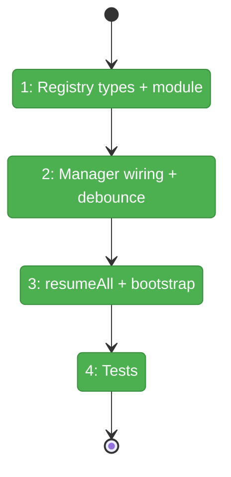
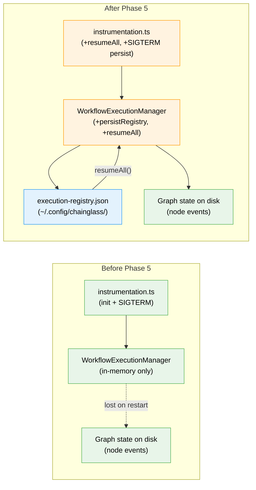

# Flight Plan: Phase 5 — Server Restart Recovery

**Plan**: [workflow-execution-plan.md](../../workflow-execution-plan.md)
**Phase**: Phase 5: Server Restart Recovery
**Generated**: 2026-03-15
**Status**: Landed

---

## Departure → Destination

**Where we are**: Phases 1-4 built the full execution stack: AbortSignal in drive(), WorkflowExecutionManager singleton, SSE broadcasting, GlobalState routing, server actions, and UI controls (Run/Stop/Restart buttons, progress display, node locking). But all execution state lives in-memory. If the dev server restarts (HMR, SIGTERM, crash), running workflows vanish silently.

**Where we're going**: A developer starts a workflow, then the dev server restarts (HMR or crash). After restart, the workflow automatically resumes from where it left off — completed nodes are not re-executed. The developer sees it pick up seamlessly. On graceful shutdown (SIGTERM), final state is persisted. Stale registry entries (deleted worktrees) are automatically cleaned up.

---

## Domain Context

### Domains We're Changing

| Domain | What Changes | Key Files |
|--------|-------------|-----------|
| `074-workflow-execution` | Registry types/module, manager gets persistRegistry()/resumeAll(), debounced persistence | `execution-registry.ts`, `execution-registry.types.ts`, `workflow-execution-manager.ts`, `.types.ts`, `create-execution-manager.ts` |
| web-integration | Bootstrap calls resumeAll(), SIGTERM persists registry | `instrumentation.ts` |

### Domains We Depend On (no changes)

| Domain | What We Consume | Contract |
|--------|----------------|----------|
| `_platform/positional-graph` | IPositionalGraphService | loadGraphState() — verify graph exists on resume |
| `_platform/positional-graph` | IOrchestrationService | get() — resolve orchestration handle for drive() |
| `@chainglass/shared` | getUserConfigDir() | Resolve `~/.config/chainglass/` cross-platform |
| `@chainglass/workflow` | IWorkspaceService | getInfo() — verify workspace/worktree exists |

---

## Flight Status

<!-- Updated by /plan-6-v2: pending → active → done. Use blocked for problems/input needed. -->

**Legend**: grey = pending | yellow = active | red = blocked/needs input | green = done

---

## Stages

<!-- Updated by /plan-6-v2 during implementation: [ ] → [~] → [x] -->

- [x] **Stage 1: Registry types + module** — Create registry types/schema and read/write module (`execution-registry.types.ts`, `execution-registry.ts` — new files)
- [x] **Stage 2: Manager wiring + debounce** — Wire registry into manager lifecycle transitions, add debounced iteration persistence (`workflow-execution-manager.ts`, `.types.ts`, `create-execution-manager.ts`)
- [x] **Stage 3: resumeAll + bootstrap** — Implement resumeAll() in manager, call from instrumentation.ts, persist in SIGTERM (`workflow-execution-manager.ts`, `instrumentation.ts`)
- [x] **Stage 4: Tests** — Registry CRUD tests + resumeAll logic tests (`execution-registry.test.ts`, `workflow-execution-manager.test.ts`)

---

## Architecture: Before & After

**Legend**: existing (green, unchanged) | changed (orange, modified) | new (blue, created)

---

## Acceptance Criteria

- [x] Starting a workflow creates a registry entry (spec AC #8)
- [x] Restarting the dev server resumes previously-running workflows (spec AC #8)
- [x] Completed nodes are not re-executed after resume (spec AC #8)
- [x] Registry entries for deleted worktrees are cleaned up (spec AC #8)
- [x] SIGTERM persists final state before exit
- [x] Iteration progress debounced (every 10 iterations or 30s)
- [x] Corrupt/missing registry file handled gracefully (empty registry)

## Goals & Non-Goals

**Goals**: Registry persistence, resumeAll(), debounced writes, stale cleanup, SIGTERM persistence
**Non-Goals**: Registry UI, cross-machine recovery, auto-retry of failed workflows, schema migration tooling

---

## Checklist

- [x] T001: Create registry types + Zod schema
- [x] T002: Create registry read/write module
- [x] T003: Wire registry into manager lifecycle
- [x] T004: Add debounced iteration persistence
- [x] T005: Implement resumeAll()
- [x] T006: Wire resumeAll + SIGTERM persist in bootstrap
- [x] T007: Write registry + resumeAll tests
