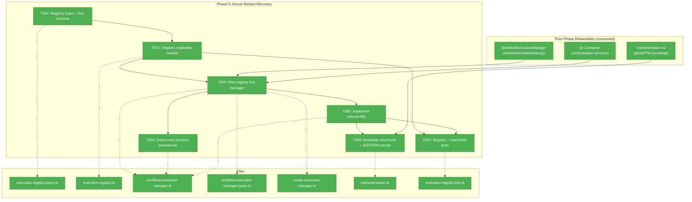
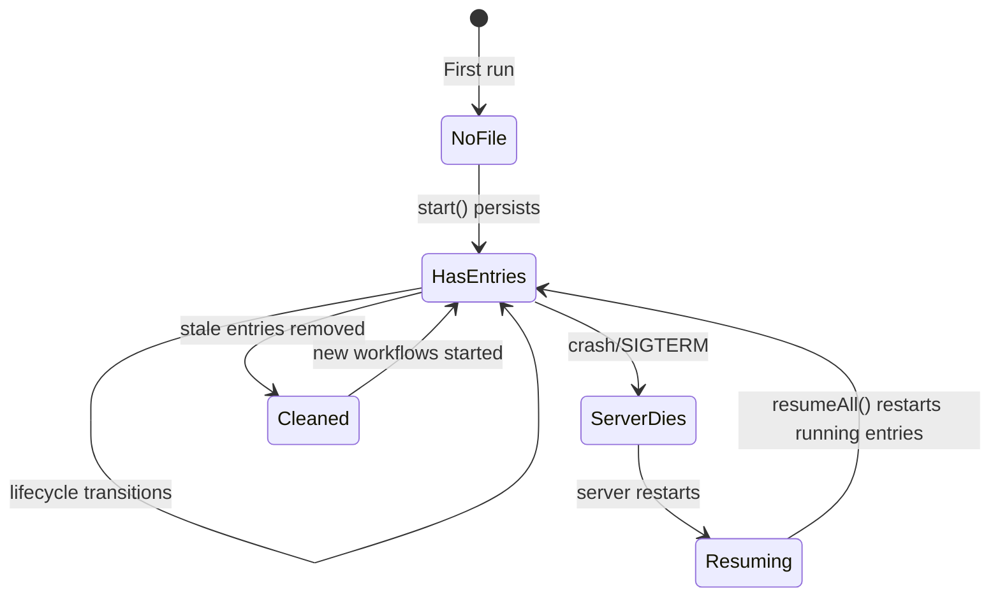
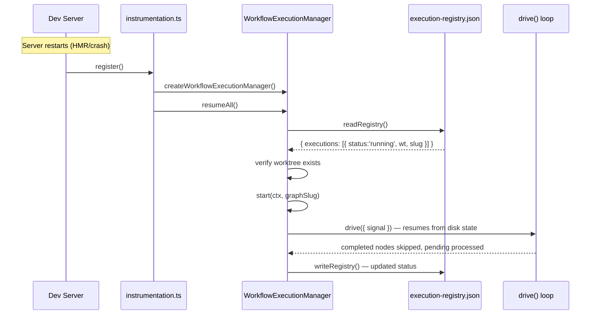

# Phase 5: Server Restart Recovery — Tasks Dossier

**Plan**: [workflow-execution-plan.md](../../workflow-execution-plan.md)
**Phase**: Phase 5: Server Restart Recovery
**Created**: 2026-03-15
**Domain**: `_platform/positional-graph` (execution manager extension), `074-workflow-execution`
**Testing**: Hybrid — TDD for registry read/write + resumeAll() logic, lightweight for wiring

---

## Executive Briefing

**Purpose**: Persist an execution registry so that workflows running when the dev server stops (HMR, SIGTERM, crash) resume automatically on restart. Without this, a server restart kills all in-progress workflows silently — users must manually re-run each one.

**What We're Building**: An `ExecutionRegistry` file at `~/.config/chainglass/execution-registry.json` that tracks all active/recent executions. The `WorkflowExecutionManager` updates the registry on every lifecycle transition (start, stop, complete, fail, restart). On bootstrap, `resumeAll()` reads the registry, filters for entries that were 'running' when the server died, verifies their worktrees still exist, and calls `start()` to resume each one. The SIGTERM handler persists final state before exit.

**Goals**:
- ✅ Registry persisted on every lifecycle transition (start/stop/complete/fail/restart)
- ✅ Iteration progress debounced (every 10 iterations or 30s, not every iteration)
- ✅ `resumeAll()` resumes previously-running workflows after server restart
- ✅ Stale entries cleaned up (worktree deleted, graph removed)
- ✅ SIGTERM handler persists final state
- ✅ Atomic writes prevent corruption on crash

**Non-Goals**:
- ❌ UI for viewing/managing the registry (registry is internal, not user-facing)
- ❌ Cross-machine recovery (registry is local to one dev machine)
- ❌ Automatic retry of failed workflows (failed = terminal, user must manually retry)
- ❌ Registry schema migration tooling (v1 only for now)

---

## Prior Phase Context

### Phase 2: Web DI + Execution Manager ✅ (primary dependency)

**Deliverables**: WorkflowExecutionManager class with start/stop/restart/getStatus/cleanup lifecycle. ExecutionHandle model (14 fields). globalThis singleton bootstrapped in instrumentation.ts. DI token de-aliasing for Plan 019/034 compatibility.

**Dependencies Exported**: `IWorkflowExecutionManager` (8 methods), `SerializableExecutionStatus`, `ExecutionKey` (base64url), `ManagerExecutionStatus` (7 states), `makeExecutionKey()`, `ExecutionManagerDeps` (with ISSEBroadcaster).

**Gotchas**: FakePositionalGraphService uses `calls.get('methodName')`. EventHandlerService loadState/persistState intentionally stubbed. Restart on running workflow requires stop() first. Always `.catch()` on background promises.

**Patterns**: globalThis singleton + flag pattern in instrumentation.ts. Factory closure for DI. SerializableX types for JSON-safe API responses.

### Phase 3: SSE + GlobalState Plumbing ✅

**Deliverables**: 4 server actions, workflowExecutionRoute, 6 broadcast call sites. SerializableExecutionStatus for server action responses.

**Gotchas**: SSE broadcasts race ahead of server action responses. Base64url ExecutionKey for GlobalState path safety. broadcastRemoval() before handle deletion.

### Phase 4: UI Execution Controls ✅

**Deliverables**: useWorkflowExecution hook with hydration + action gating. deriveButtonState() utility. Run/Stop/Restart buttons in toolbar. Execution-aware node locking. 28 tests.

**Gotchas**: makeExecutionKey uses Buffer (server-only) — client uses btoa() equivalent. worktreePath is optional in WorkflowEditorProps but required by actions.

---

## Pre-Implementation Check

| File | Exists? | Domain Check | Notes |
|------|---------|-------------|-------|
| `apps/web/src/features/074-workflow-execution/execution-registry.ts` | ❌ create | 074-workflow-execution | New file — registry CRUD |
| `apps/web/src/features/074-workflow-execution/execution-registry.types.ts` | ❌ create | 074-workflow-execution | New file — registry types + Zod schema |
| `apps/web/src/features/074-workflow-execution/workflow-execution-manager.ts` | ✅ modify | 074-workflow-execution | Add persistRegistry(), resumeAll(), debounced persistence |
| `apps/web/src/features/074-workflow-execution/workflow-execution-manager.types.ts` | ✅ modify | 074-workflow-execution | Add resumeAll() to IWorkflowExecutionManager, registry dep to ExecutionManagerDeps |
| `apps/web/src/features/074-workflow-execution/create-execution-manager.ts` | ✅ modify | 074-workflow-execution | Inject registry dep |
| `apps/web/instrumentation.ts` | ✅ modify | web-integration | Call resumeAll() after manager init, persist in SIGTERM |
| `test/unit/web/features/074-workflow-execution/execution-registry.test.ts` | ❌ create | test | TDD for registry read/write |
| `test/unit/web/features/074-workflow-execution/workflow-execution-manager.test.ts` | ✅ modify | test | Add resumeAll() tests |

**Harness context**: Harness available at L3. Pre-phase validation deferred — Phase 5 is backend plumbing with TDD, not UI.

---

## Architecture Map



---

## Tasks

| Status | ID | Task | Domain | Path(s) | Done When | Notes |
|--------|-----|------|--------|---------|-----------|-------|
| [x] | T001 | Create registry types + Zod schema | 074-workflow-execution | `apps/web/src/features/074-workflow-execution/execution-registry.types.ts` | `ExecutionRegistryEntry`, `ExecutionRegistry` types defined. Zod schema validates registry file. | Follow Workshop 002 format: `{ version: 1, updatedAt, executions: [...] }`. |
| [x] | T002 | Create registry read/write module | 074-workflow-execution | `apps/web/src/features/074-workflow-execution/execution-registry.ts` | `readRegistry()` loads + validates JSON (returns empty on missing/corrupt). `writeRegistry()` does synchronous atomic write via temp+renameSync. `ensureRegistryDir()` creates dir if missing. | Use `getUserConfigDir()` from `@chainglass/shared` for path → `~/.config/chainglass/execution-registry.json` (P5-DYK #4). **P5-DYK #2**: Use `writeFileSync` + `renameSync` (synchronous) to prevent interleaving. Use `node:fs` directly (not IFileSystem — process-level file). |
| [x] | T003 | Wire registry into manager lifecycle | 074-workflow-execution | `apps/web/src/features/074-workflow-execution/workflow-execution-manager.ts`, `.types.ts`, `create-execution-manager.ts` | Registry persisted on start(), stop(), restart(), completion, failure. Add `registry` dep to `ExecutionManagerDeps`. Manager calls `writeRegistry()` with current snapshot at each transition. | Insert persist calls at the 6 lifecycle transition points (same sites as SSE broadcasts). Add `IExecutionRegistry` to deps interface. |
| [x] | T004 | Add debounced iteration persistence | 074-workflow-execution | `apps/web/src/features/074-workflow-execution/workflow-execution-manager.ts` | Iteration progress persisted every 10 iterations or 30s, not every iteration. Uses counter + timestamp comparison. | Plan says "Debounce iteration progress (every 10 iterations or 30s)". Track `lastPersistIteration` and `lastPersistTime` per handle. |
| [x] | T005 | Implement `resumeAll()` | 074-workflow-execution | `apps/web/src/features/074-workflow-execution/workflow-execution-manager.ts`, `.types.ts` | TDD: reads registry, calls start() for entries with status 'running'/'starting'. Skips entries where worktree no longer exists. Cleans stale entries. Persists cleaned registry. | Workshop 002 algorithm: verify worktree exists (fs.access), verify graph exists (graphService.loadGraphState), call start(). Entries with 'stopped'/'completed'/'failed' are informational only (not resumed). **P5-DYK #3**: resumeAll() must never throw — on any error, log warning, DELETE the corrupt registry file, continue. Self-healing: corrupt→delete→next restart is clean. |
| [x] | T006 | Wire resumeAll + SIGTERM persist in bootstrap | web-integration | `apps/web/instrumentation.ts` | `resumeAll()` called after manager init. SIGTERM handler does best-effort persist then cleanup. | **P5-DYK #1**: Registry correctness doesn't depend on SIGTERM persist — lifecycle writes + debounced iterations keep it recent. SIGTERM is best-effort only. **P5-DYK #3**: Wrap resumeAll() in separate try/catch — failure must NOT prevent server startup. On failure: delete registry, log, continue. **P5-DYK #5**: HMR doesn't re-run register() — recovery only fires on process restart. |
| [x] | T007 | Write registry + resumeAll tests | test | `test/unit/web/features/074-workflow-execution/execution-registry.test.ts`, `workflow-execution-manager.test.ts` | Registry: read/write/validate/handle-missing/handle-corrupt. resumeAll: resumes running entries, skips stale, cleans registry. | Use temp directories for registry file tests. FakeOrchestrationService + FakePositionalGraphService for resumeAll. |

---

## Context Brief

### Key findings from plan

- **Finding 01 (Phase 5 risk)**: Race condition if resumeAll() triggers drive() before web app is fully ready. Mitigated: instrumentation.ts register() completes before requests are served (Next.js guarantees this).
- **Workshop 002 (Section: Registry)**: Defined registry format, location (`~/.config/chainglass/`), persistence timing, resumeAll() algorithm, and why "just call drive() again" works (ONBAS skips completed nodes, EHS settles idempotently).

### Domain dependencies

- `_platform/positional-graph`: IPositionalGraphService — verify graph exists on resume, load graph state
- `_platform/positional-graph`: IOrchestrationService — get() returns cached orchestration handle for drive()
- `@chainglass/shared`: getUserConfigDir() — resolve `~/.config/chainglass/` path cross-platform
- `@chainglass/workflow`: IWorkspaceService — verify workspace/worktree exists on resume

### Domain constraints

- Registry is a process-level file, NOT per-workspace — use `node:fs/promises` directly, not IFileSystem
- Registry path uses `getUserConfigDir()` (respects XDG_CONFIG_HOME)
- Atomic writes via write-to-temp + rename (follow positional-graph pattern)
- resumeAll() must verify worktree existence before calling start() — deleted worktrees should not crash bootstrap

### Harness context

- **Boot**: `just harness dev` — health check: `just harness health`
- **Maturity**: L3
- **Pre-phase validation**: Deferred — Phase 5 is backend plumbing with TDD

### Reusable from prior phases

- `FakeOrchestrationService` + `FakePositionalGraphService` — for resumeAll() tests
- `FakeSSEBroadcaster` — for verifying broadcasts during resume
- `FakeGraphOrchestration` with blockDrive/releaseDrive — for deterministic lifecycle testing
- `SerializableExecutionStatus` — registry entries are a subset of this type
- `makeExecutionKey()` — for registry entry key generation
- globalThis flag pattern in instrumentation.ts — follow exactly for resumeAll() call placement

### Why "just call start() again" works for resume

| Crash Scenario | What drive() Sees on Resume |
|---|---|
| Node 'complete' | ONBAS skips it (idempotent) |
| Node 'starting' | EHS settles pending events from disk |
| Node 'agent-accepted' | Pod may have written results; EHS processes them |
| Pod mid-execution when server died | Pod process died; node stays in-flight; ONBAS skips |

Event stamping is idempotent. Calling drive() twice on same graph = safe.

### Mermaid state diagram (registry lifecycle)



### Mermaid sequence diagram (restart recovery)



---

## Discoveries & Learnings

### Phase 5 DYK Session (2026-03-15)

| # | Insight | Impact | Resolution | Tasks Affected |
|---|---------|--------|------------|----------------|
| P5-DYK #1 | SIGTERM handler runs cleanup() which is slow (awaits drive + pod termination). Second SIGTERM or process timeout may kill before registry persists. | HIGH | Registry is already "recent enough" from lifecycle transitions + debounced iteration writes. SIGTERM persist is best-effort, not critical. Persist BEFORE cleanup as a nice-to-have. | T003, T004, T006 |
| P5-DYK #2 | Two async writeRegistry() calls can interleave — second write starts before first finishes, first completes last → stale state saved. | HIGH | Use `writeFileSync` + `renameSync` (synchronous). ~1ms blocking is negligible for a dev tool writing one small JSON file. Eliminates interleaving without needing a write queue. | T002 |
| P5-DYK #3 | If resumeAll() throws (corrupt file, permission error), it crashes instrumentation.ts register() → dev server won't start at all. | CRITICAL | Wrap resumeAll() in its own try/catch. On failure: log warning, DELETE the corrupt registry file, continue bootstrap normally. Self-healing loop: corrupt→delete→next restart is clean. | T005, T006 |
| P5-DYK #4 | Plan says `~/.chainglass/execution-registry.json` but `getUserConfigDir()` returns `~/.config/chainglass/`. All existing user-level files use the latter. | MEDIUM | Use `getUserConfigDir()` → `~/.config/chainglass/execution-registry.json`. Follow existing patterns, not plan text. | T002 |
| P5-DYK #5 | HMR restarts don't trigger register() — globalThis singleton persists through hot reload. Recovery only fires on actual process restart. | LOW (informational) | No work needed. Document that Phase 5 handles process restarts only, not HMR. | T006 |

_Additional discoveries populated during implementation by plan-6._

| Date | Task | Type | Discovery | Resolution | References |
|------|------|------|-----------|------------|------------|

---

## Directory Layout

```
docs/plans/074-workflow-execution/
  ├── workflow-execution-plan.md
  ├── workflow-execution-spec.md
  └── tasks/
      ├── phase-1-orchestration-contracts/  ✅
      ├── phase-2-web-di-execution-manager/ ✅
      ├── phase-3-sse-globalstate-plumbing/ ✅
      ├── phase-4-ui-execution-controls/    ✅
      └── phase-5-server-restart-recovery/
          ├── tasks.md                      ← this file
          ├── tasks.fltplan.md              ← flight plan
          └── execution.log.md              ← created by plan-6
```
