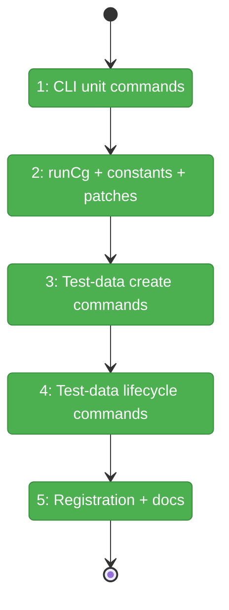
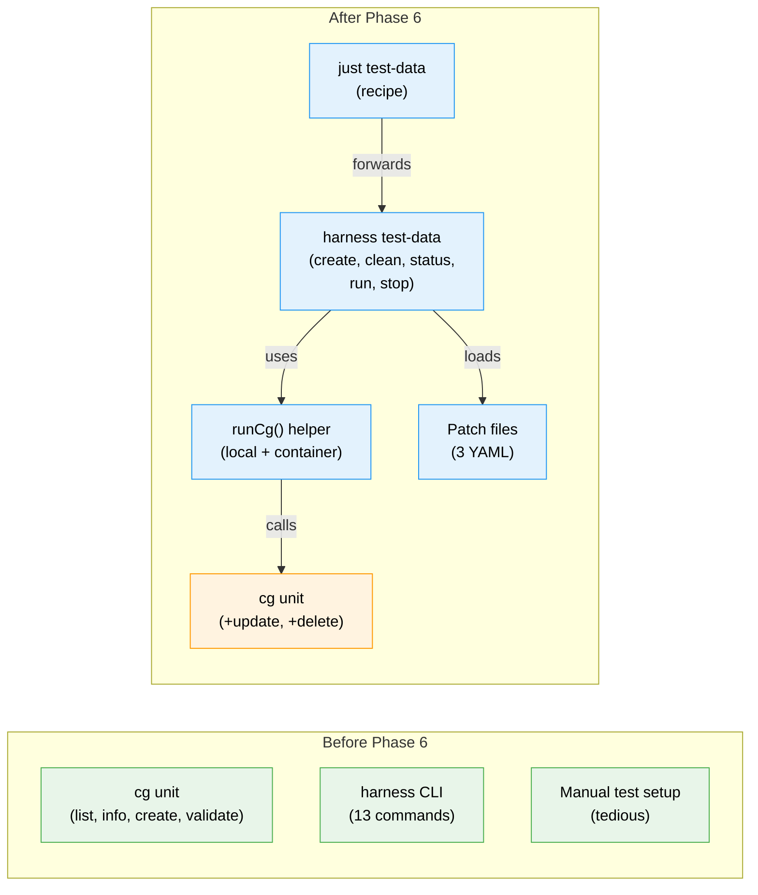

# Flight Plan: Phase 6 — Harness + CLI Tools

**Plan**: [workflow-execution-plan.md](../../workflow-execution-plan.md)
**Phase**: Phase 6: Harness + CLI Tools
**Generated**: 2026-03-16
**Status**: Landed

---

## Departure → Destination

**Where we are**: Phases 1-5 built the complete workflow execution stack: engine contracts, execution manager, SSE/GlobalState plumbing, UI controls (Run/Stop/Restart), and server restart recovery. But there's no automated way to set up a test workflow environment — every test requires manual creation of work units, templates, and workflow instances.

**Where we're going**: A developer (or harness agent) runs `just test-data create env` and gets a fully configured test workflow with 3 work units, a template, and an instantiated workflow — deterministic, idempotent, ready for execution testing. `cg unit update/delete` commands provide the CLI surface for unit management.

---

## Domain Context

### Domains We're Changing

| Domain | What Changes | Key Files |
|--------|-------------|-----------|
| CLI | Add `cg unit update` and `cg unit delete` commands | `apps/cli/src/commands/unit.command.ts` |
| Harness | Test-data command group, runCg helper, patch files | `harness/src/test-data/*.ts`, `harness/src/cli/commands/test-data.ts` |
| docs | Harness README, workflow how-to guide | `harness/README.md`, `docs/how/workflow-execution.md` |
| root | Justfile recipe | `justfile` |

### Domains We Depend On (no changes)

| Domain | What We Consume | Contract |
|--------|----------------|----------|
| `_platform/positional-graph` | WorkUnitService.update/delete | Update patches, idempotent delete |
| `@chainglass/workgraph` | Template engine | save-from, instantiate |
| `_platform/positional-graph` | Workflow commands | cg wf create/run/stop |

---

## Flight Status

<!-- Updated by /plan-6-v2: pending → active → done. Use blocked for problems/input needed. -->

**Legend**: grey = pending | yellow = active | red = blocked/needs input | green = done

---

## Stages

<!-- Updated by /plan-6-v2 during implementation: [ ] → [~] → [x] -->

- [x] **Stage 1: CLI unit commands** — `cg unit update` and `cg unit delete` in `unit.command.ts`
- [x] **Stage 2: runCg + constants + patches** — `cg-runner.ts`, `constants.ts`, 3 patch YAML files (new files)
- [x] **Stage 3: Test-data create commands** — `create units/template/workflow/env` commands
- [x] **Stage 4: Test-data lifecycle commands** — `clean/status/run/stop` commands
- [x] **Stage 5: Registration + docs** — CLI registration, justfile recipe, harness README, how-to guide

---

## Architecture: Before & After

**Legend**: existing (green, unchanged) | changed (orange, modified) | new (blue, created)

---

## Acceptance Criteria

- [ ] `cg unit update test-agent --patch patch.yaml` applies patch correctly
- [ ] `cg unit delete test-agent` removes unit idempotently
- [ ] `just test-data create env` creates 3 units + template + workflow instance
- [ ] Running `create env` again resets everything to clean state (idempotent)
- [ ] Every cg command printed with `▸` prefix to stderr
- [ ] `--target container` routes commands into Docker container
- [ ] `harness test-data status` shows what exists
- [ ] `harness test-data clean` removes all test data
- [ ] `docs/how/workflow-execution.md` exists with architecture + troubleshooting

## Goals & Non-Goals

**Goals**: CLI unit management, automated test environment, runCg helper, documentation
**Non-Goals**: Browser-based execution testing, CI/CD integration, cross-workspace test data

---

## Checklist

- [x] T001: Add `cg unit update <slug>` CLI command
- [x] T002: Add `cg unit delete <slug>` CLI command
- [x] T003: Create `runCg()` helper
- [x] T004: Create `constants.ts` with test data slugs
- [x] T005: Create test unit patch files
- [x] T006: Implement `create units` command
- [x] T007: Implement `create template` command
- [x] T008: Implement `create workflow` command
- [x] T009: Implement `create env` aggregate
- [x] T010: Implement `clean/status/run/stop` commands
- [x] T011: Register test-data command group
- [x] T012: Add `just test-data` recipe to justfile
- [x] T013: Update harness README
- [x] T014: Create `docs/how/workflow-execution.md`
