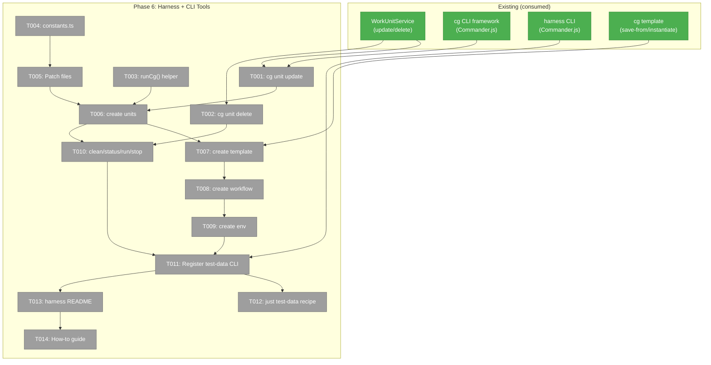
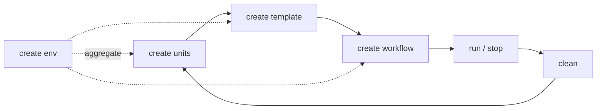
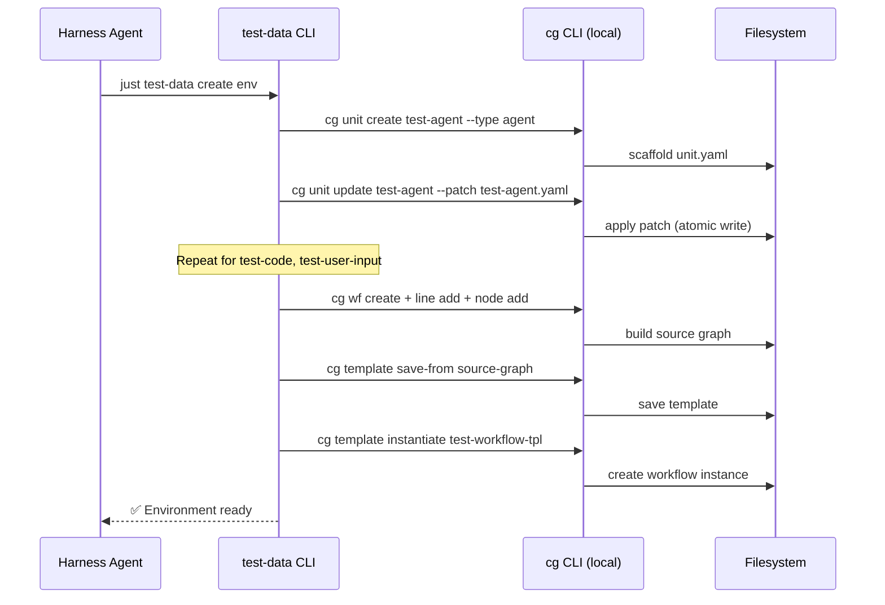

# Phase 6: Harness + CLI Tools — Tasks Dossier

**Plan**: [workflow-execution-plan.md](../../workflow-execution-plan.md)
**Phase**: Phase 6: Harness + CLI Tools
**Created**: 2026-03-16
**Domain**: `workflow-ui` (CLI extensions), Harness (test-data tooling)
**Testing**: Lightweight — CLI commands tested via integration, harness commands via manual validation

---

## Executive Briefing

**Purpose**: Build the test-data CLI tooling and `cg unit update/delete` commands so that developers and harness agents can create deterministic test workflow environments. Without this, every test requires manual setup of work units, templates, and workflow instances.

**What We're Building**: A `harness test-data` command group that automates test environment lifecycle (create units → build template → instantiate workflow → run/stop/clean), backed by a `runCg()` helper that routes commands to either local or container-based CLI. Also adding `cg unit update` and `cg unit delete` CLI commands (the service methods already exist; we're adding the CLI surface).

**Goals**:
- ✅ `cg unit update <slug>` with --patch, --set, --add-input/output, --description, --version
- ✅ `cg unit delete <slug>` (idempotent)
- ✅ `runCg()` helper with command visibility (▸ prefix) and local/container routing
- ✅ `harness test-data create units/template/workflow/env` commands (idempotent)
- ✅ `harness test-data clean/status/run/stop` commands
- ✅ Test unit patch files for deterministic hydration
- ✅ `just test-data` recipe in justfile
- ✅ `docs/how/workflow-execution.md` how-to guide

**Non-Goals**:
- ❌ Browser-based workflow execution testing (web WorkflowExecutionManager exercised via Phases 1-5)
- ❌ CI/CD pipeline integration for test-data
- ❌ Cross-workspace test-data management

---

## Prior Phase Context

### Phase 5: Server Restart Recovery ✅ (most recent)

**Deliverables**: ExecutionRegistry types/Zod schema, registry read/write module (sync atomic writes), persistRegistry() at 6 lifecycle points, debounced iteration persistence, resumeAll() with self-healing, bootstrap integration, SIGTERM best-effort persist. 54 tests.

**Dependencies Exported**: `IExecutionRegistry` interface (read/write/remove), `resumeAll()` on IWorkflowExecutionManager, `ExecutionRegistry` Zod schema, `worktreeExists` injected dependency, `createFileExecutionRegistry()` factory.

**Gotchas**: Can't vi.spyOn fs.existsSync in ESM modules — use real paths or injected deps. SIGTERM persist is best-effort (lifecycle writes keep registry recent). Corrupt registries self-heal via delete-and-continue.

**Patterns**: Atomic writes (writeFileSync + renameSync). Self-healing on corrupt files. Debounce with counter+timestamp. Bootstrap error isolation (separate try/catch). FakeRegistry pattern for tests.

### Phase 4: UI Execution Controls ✅

**Deliverables**: useWorkflowExecution hook, deriveButtonState(), Run/Stop/Restart buttons in toolbar, execution-aware node locking, undo/redo blocking. 28 tests.

### Phases 1-3 ✅

Phase 1: Orchestration contracts (AbortSignal in drive(), 'interrupted' status, ONBAS handling). Phase 2: WorkflowExecutionManager singleton, DI wiring, globalThis bootstrap. Phase 3: SSE broadcasting, GlobalState routing, server actions. All complete, all tested.

**Key for Phase 6**: Phase 1's `'stopped'` drive exit reason is what `test-data run/stop` will exercise via `cg wf run` / `cg wf stop` CLI commands.

---

## Pre-Implementation Check

| File | Exists? | Domain Check | Notes |
|------|---------|-------------|-------|
| `apps/cli/src/commands/unit.command.ts` | ✅ modify | CLI | Add update/delete handlers alongside existing create/list/info/validate |
| `harness/src/test-data/cg-runner.ts` | ❌ create | harness | runCg() helper — new file |
| `harness/src/test-data/constants.ts` | ❌ create | harness | Hardcoded test data slugs |
| `harness/src/test-data/unit-definitions.ts` | ❌ create | harness | Unit YAML definitions for test-agent/test-code/test-user-input |
| `harness/src/test-data/template-builder.ts` | ❌ create | harness | Build source graph + save as template |
| `harness/src/test-data/environment.ts` | ❌ create | harness | Aggregate create/clean/status commands |
| `harness/src/cli/commands/test-data.ts` | ❌ create | harness | Commander.js command registration |
| `harness/test-data/patches/test-agent.yaml` | ❌ create | harness | Patch file for test-agent unit |
| `harness/test-data/patches/test-code.yaml` | ❌ create | harness | Patch file for test-code unit |
| `harness/test-data/patches/test-user-input.yaml` | ❌ create | harness | Patch file for test-user-input unit |
| `docs/how/workflow-execution.md` | ❌ create | docs | How-to guide |
| `justfile` | ✅ modify | root | Add test-data recipe |
| `harness/src/cli/index.ts` | ✅ modify | harness | Register test-data command group |
| `harness/README.md` | ✅ modify | harness | Document test-data commands |

**Harness context**: Harness available at L3. Pre-phase validation: `just harness health` before implementation.

---

## Architecture Map



---

## Tasks

| Status | ID | Task | Domain | Path(s) | Done When | Notes |
|--------|-----|------|--------|---------|-----------|-------|
| [ ] | T001 | Add `cg unit update <slug>` CLI command | CLI | `apps/cli/src/commands/unit.command.ts` | `cg unit update test-agent --patch patch.yaml` applies patch. Supports --description, --version, --set, --add-input, --add-output, --patch, --inputs-json, --outputs-json. | Workshop 004. Fix create bug: `service.create(ctx, slug, options.type)` → correct args. Service `update()` exists at positional-graph line 267. |
| [ ] | T002 | Add `cg unit delete <slug>` CLI command | CLI | `apps/cli/src/commands/unit.command.ts` | `cg unit delete test-agent` removes unit. Idempotent (no error if absent). | Service `delete()` exists at positional-graph line 331. |
| [ ] | T003 | Create `runCg()` helper | harness | `harness/src/test-data/cg-runner.ts` | Prints `▸ cg ...` to stderr. Routes to `node apps/cli/dist/cli.cjs` (local) or `docker exec ... node /app/apps/cli/dist/cli.cjs` (container). Returns { stdout, stderr, exitCode }. | Workshop 003. NEVER use global `cg`. Use execFile() for local, computePorts() for container name. |
| [ ] | T004 | Create `constants.ts` with test data slugs | harness | `harness/src/test-data/constants.ts` | Exports TEST_DATA object: `{ units: {agent, code, userInput}, template, workflow, workspacePath }`. All hardcoded, deterministic. | Workshop 003. |
| [ ] | T005 | Create test unit patch files | harness | `harness/test-data/patches/{test-agent,test-code,test-user-input}.yaml` | 3 YAML patch files. Each defines inputs, outputs, type-config for its unit type. | Workshop 003+004 unit definitions. |
| [ ] | T006 | Implement `create units` command | harness | `harness/src/test-data/unit-definitions.ts` | Creates 3 test units via `runCg('unit create ...')` then `runCg('unit update ... --patch ...')`. Idempotent (delete + recreate). Validates after. | Uses T001 (cg unit update) and T003 (runCg). |
| [ ] | T007 | Implement `create template` command | harness | `harness/src/test-data/template-builder.ts` | Builds source graph via cg wf commands (create graph, add lines/nodes). Saves as template via `cg template save-from`. Deletes source graph. | Uses `cg wf create`, `cg wf line add`, `cg wf node add`, `cg template save-from`. |
| [ ] | T008 | Implement `create workflow` command | harness | `harness/src/test-data/environment.ts` | Instantiates workflow from template: `cg template instantiate`. | Uses `cg template instantiate`. |
| [ ] | T009 | Implement `create env` aggregate | harness | `harness/src/test-data/environment.ts` | Runs units → template → workflow in sequence. Single entry point for agents. Reports success/failure per step. | Orchestrates T006+T007+T008. |
| [ ] | T010 | Implement `clean/status/run/stop` | harness | `harness/src/test-data/environment.ts` | `clean` deletes test data (units + template + workflow). `status` shows what exists. `run`/`stop` execute/halt test workflow. | `run` = `cg wf run`, `stop` = `cg wf stop`. |
| [ ] | T011 | Register test-data command group | harness | `harness/src/cli/commands/test-data.ts`, `harness/src/cli/index.ts` | `just harness test-data --help` shows all subcommands. Commander.js with `create`, `clean`, `status`, `run`, `stop` subcommands. | Follow harness CLI registration pattern in index.ts. |
| [ ] | T012 | Add `just test-data` recipe to justfile | root | `justfile` | `just test-data create env` works end-to-end. Forwards to `harness test-data`. | Follow existing `harness *ARGS` recipe pattern. |
| [ ] | T013 | Update harness README | docs | `harness/README.md` | Test-data section with command reference, examples, agent usage guide. | Follow existing README structure. |
| [ ] | T014 | Create `docs/how/workflow-execution.md` | docs | `docs/how/workflow-execution.md` | How-to guide: running workflows from UI, architecture overview, test-data setup, troubleshooting. | Reference Phases 1-6 deliverables. |

---

## Context Brief

### Key findings from plan

- **Finding (Phase 6 risk)**: `test-data run` exercises CLI orchestration, not the web WorkflowExecutionManager. Accepted for Plan 074 scope — future: add harness HTTP-based workflow execution test.
- **Finding (CLI build freshness)**: Harness depends on built `apps/cli/dist/cli.cjs`. Must run `pnpm build` or `just build` before test-data commands work.
- **Workshop 003**: Defines runCg() helper, command signatures, test data topology (3 lines: user-input → agent → code+agent parallel).
- **Workshop 004**: Defines cg unit update patch methods (--patch, --set, --add-input/output). Service already exists; CLI is thin wrapper. Existing create bug to fix.

### Domain dependencies

- `_platform/positional-graph`: `WorkUnitService.update()` / `delete()` — apply patches, remove units
- `_platform/positional-graph`: `IWorkflowService` — create/modify workflows via `cg wf` commands
- `@chainglass/workgraph`: Template engine — `cg template save-from`, `cg template instantiate`
- Harness CLI framework: `HarnessEnvelope`, error codes, Commander.js registration pattern

### Domain constraints

- harness/ is a standalone codebase (own package.json, own node_modules) — NOT part of the monorepo build graph
- CLI commands must use `apps/cli/dist/cli.cjs` — NEVER global `cg`
- All test data slugs are hardcoded and deterministic — no randomness
- Patch files are checked into git (harness/test-data/patches/)

### Harness context

- **Boot**: `just harness dev` — health check: `just harness health`
- **Maturity**: L3
- **Pre-phase validation**: Verify harness healthy before test-data implementation

### Reusable from prior phases

- Workshop 003 defines complete command signatures and file layout
- Workshop 004 defines UpdateUnitPatch interface and CLI flag mappings
- Existing harness CLI patterns in `harness/src/cli/commands/*.ts`
- `computePorts()` from `harness/src/ports/allocator.js` for container routing
- `wrapAction()` pattern in CLI for error handling

### Mermaid flow diagram (test-data lifecycle)



### Mermaid sequence diagram (create env flow)



---

## Discoveries & Learnings

_Populated during implementation by plan-6._

| Date | Task | Type | Discovery | Resolution | References |
|------|------|------|-----------|------------|------------|

---

## Directory Layout

```
docs/plans/074-workflow-execution/
  ├── workflow-execution-plan.md
  ├── workflow-execution-spec.md
  ├── workshops/
  │   ├── 003-harness-test-data-cli.md
  │   └── 004-cg-unit-update-cli.md
  └── tasks/
      ├── phase-1-orchestration-contracts/    ✅
      ├── phase-2-web-di-execution-manager/   ✅
      ├── phase-3-sse-globalstate-plumbing/   ✅
      ├── phase-4-ui-execution-controls/      ✅
      ├── phase-5-server-restart-recovery/    ✅
      └── phase-6-harness-cli-tools/
          ├── tasks.md                        ← this file
          ├── tasks.fltplan.md                ← flight plan
          └── execution.log.md               ← created by plan-6
```
