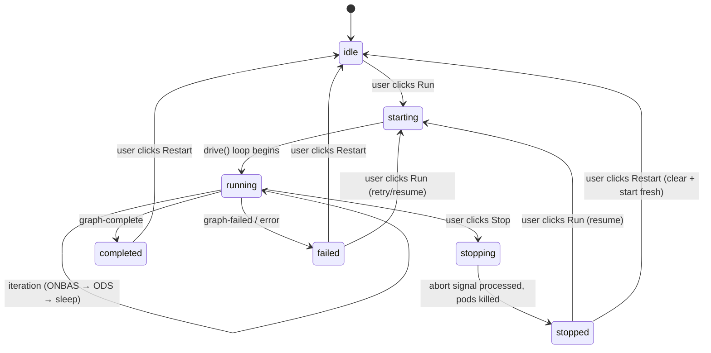

# Workshop: Execution Wiring — What Exists, What's Missing, How to Plug It

**Type**: Integration Pattern
**Plan**: 074-workflow-execution
**Spec**: (pre-spec — this workshop informs the spec)
**Created**: 2026-03-13
**Status**: Draft

**Related Documents**:
- [Research Dossier](../research-dossier.md)
- [Deep Research: Next.js Long-Running](../deep-research-nextjs-long-running.md)
- [Deep Research: AbortController](../deep-research-abort-controller.md)

**Domain Context**:
- **Primary Domain**: `_platform/positional-graph` — owns the orchestration engine
- **Related Domains**: `_platform/events` (SSE transport), `_platform/state` (runtime state), `workflow-ui` (consumer), `workflow-events` (node Q&A)

---

## Purpose

Clarify what's **already built** vs what's **missing** for workflow execution from the UI. The orchestration engine is mature and tested. This workshop maps the exact wiring needed to plug it into the web app — no engine rewrite, just integration plumbing.

## Key Questions Addressed

- What does each orchestration component do, exactly?
- What wiring exists in CLI but not in web?
- What new code is needed vs what's just DI registration?
- How do events flow from orchestration → SSE → UI today, and what's the gap?
- What's the minimal path to "Run button works"?

---

## The Engine Is Built — Here's What Each Piece Does

### Component Map (All in `packages/positional-graph/src/features/030-orchestration/`)

```
┌─────────────────────────────────────────────────────────────────┐
│                    OrchestrationService                         │
│  Singleton factory. get(ctx, slug) → cached GraphOrchestration  │
└─────────────┬───────────────────────────────────────────────────┘
              │ creates
              ▼
┌─────────────────────────────────────────────────────────────────┐
│                    GraphOrchestration                            │
│  Per-graph handle. run() = one loop pass. drive() = poll loop.  │
│                                                                 │
│  drive() loop:                                                  │
│    loadSessions → [run() → emit status → persistSessions        │
│    → check terminal → sleep → repeat] → return DriveResult      │
│                                                                 │
│  run() loop (Settle → Decide → Act):                            │
│    1. loadGraphState + EHS.processGraph + persistGraphState     │
│    2. buildReality (snapshot)                                   │
│    3. ONBAS.getNextAction(reality)                              │
│    4. if no-action → exit                                       │
│    5. ODS.execute(request) → fire-and-forget pod                │
│    6. record action → repeat                                    │
└────────┬──────────────┬──────────────┬──────────────────────────┘
         │              │              │
    ┌────▼────┐   ┌────▼────┐   ┌────▼────┐
    │  ONBAS  │   │   ODS   │   │   EHS   │
    │ Decide  │   │   Act   │   │ Settle  │
    └─────────┘   └────┬────┘   └─────────┘
                       │
                  ┌────▼────┐
                  │PodManager│
                  └────┬────┘
              ┌────────┼────────┐
         ┌────▼───┐        ┌───▼────┐
         │AgentPod│        │CodePod │
         └────┬───┘        └───┬────┘
              │                │
         SDK Adapter      ScriptRunner
         (Copilot)        (bash spawn)
```

### ONBAS — The Decision Engine

**What it is**: Pure, synchronous, stateless rules engine. Zero side effects.

**What it does**: Reads a `PositionalGraphReality` snapshot, walks lines/nodes in positional order, returns the first actionable request.

**Decision tree** (exact algorithm from `onbas.ts:22-160`):

```
1. reality.isComplete?     → no-action: 'graph-complete'
2. reality.isFailed?       → no-action: 'graph-failed'
3. For each LINE (positional order):
   a. !line.transitionOpen? → no-action: 'transition-blocked' + lineId
   b. For each NODE in line:
      - complete?           → skip
      - starting/accepted?  → skip (in-flight)
      - waiting-question?   → skip (needs human)
      - blocked-error?      → skip
      - ready + user-input? → skip (UI responsibility, not orchestration)
      - ready + agent/code? → ★ START-NODE (first win, exit)
      - pending?            → skip
   c. Line not complete?    → diagnose: 'all-waiting' or 'graph-failed'
4. All lines walked?        → no-action: 'graph-complete' (defensive)
```

**Key insight**: ONBAS never starts user-input nodes. Those are the UI's job via `submitUserInput()`. ONBAS only starts agent/code nodes.

**Key insight**: Parallel vs serial is NOT handled by ONBAS. It's pre-computed in the reality snapshot (`line.transitionOpen`, `line.isComplete`). ONBAS just reads the result.

### ODS — The Execution Dispatcher

**What it is**: Async execution service. The "Act" in Settle → Decide → Act.

**What it does**: Takes an `OrchestrationRequest` from ONBAS and executes it.

**StartNode dispatch sequence** (exact flow from `ods.ts:62-225`):

```
1. graphService.startNode(ctx, slug, nodeId, inputs)  ← reserves node
2. Resolve unit type: agent vs code
3. Build pod params:
   - Agent: resolve context (noContext/contextFrom/left-neighbor/global)
            → agentManager.getWithSessionId() or getNew()
   - Code:  resolve script path → create ScriptRunner instance
4. podManager.createPod(nodeId, params)  ← AgentPod or CodePod
5. pod.execute(podParams)                ← FIRE AND FORGET (not awaited!)
6. podManager.setSessionId(nodeId, sid)  ← track for context inheritance
7. return { ok: true, sessionId, ... }
```

**Fire-and-forget is intentional**: Pod execution is a long-running async operation (agent runs for minutes). ODS dispatches it and returns immediately. The pod completes independently and writes results to the filesystem. The next `run()` iteration sees the updated state.

**How does the graph know a pod finished?** The pod writes outputs + raises events to the filesystem. Next `run()` iteration: EHS settles those events → reality snapshot reflects completion → ONBAS sees the node as `complete`.

### PodManager — Pod Lifecycle + Session Tracking

**What it is**: Registry of running pods + persistent session ID map.

**What it does**:
- `createPod(nodeId, params)` → AgentPod or CodePod
- `getPod(nodeId)` → existing pod (for terminate/resume)
- `setSessionId(nodeId, sid)` / `getSessionId(nodeId)` → context inheritance
- `loadSessions(ctx, slug)` / `persistSessions(ctx, slug)` → `.chainglass/data/graphs/<slug>/pod-sessions.json`

**Key for stop/restart**: `destroyPod(nodeId)` exists. Each pod has `terminate()`. ScriptRunner has `kill(id)` which sends SIGTERM.

### EventHandlerService (EHS) — The Settle Phase

**What it is**: Event processor that reads pending events from graph state and applies state transitions.

**What it does**: `processGraph(state, caller, source)` — iterates pending events, applies handlers, mutates state in place. Called at the start of every `run()` iteration.

**Key insight**: Events are the **sole interface** between pods and the orchestration engine (ADR-0012). When an agent pod finishes, it writes events to disk. EHS reads them on the next run() pass and transitions node status accordingly.

---

## What's Wired in CLI but NOT in Web

### DI Registration Gap

| Service | CLI | Web | What To Do |
|---------|-----|-----|-----------|
| `IOrchestrationService` | ✅ `registerOrchestrationServices()` | ❌ Not called | Call the same function |
| `ScriptRunner` | ✅ `ORCHESTRATION_DI_TOKENS.SCRIPT_RUNNER` | ❌ Missing | Register: `new ScriptRunner()` |
| `EventHandlerService` | ✅ `ORCHESTRATION_DI_TOKENS.EVENT_HANDLER_SERVICE` | ❌ Missing | Register: same factory as CLI |
| `IAgentManagerService` | ✅ Plan 034 (`getNew`/`getWithSessionId`) | ⚠️ Plan 019 (`createAgent`) | **Interface mismatch** — see below |
| `IPositionalGraphService` | ✅ | ✅ | Already available |
| `IWorkUnitService` | ✅ | ✅ | Already available |
| `IFileSystem` | ✅ | ✅ | Already available |

### The AgentManager Mismatch

**CLI registers Plan 034** (`agent-manager-service.ts:33-75`):
```typescript
interface IAgentManagerService {
  getNew(params): IAgentInstance;              // fresh session
  getWithSessionId(sid, params): IAgentInstance; // resume session (same-instance guarantee)
}
```

**Web registers Plan 019** (`agent-manager.service.ts:76-169`):
```typescript
interface IAgentManagerService {
  createAgent(params): IAgentInstance;  // different method name
  // NO getNew() or getWithSessionId()
}
```

**ODS calls**: `agentManager.getNew()` and `agentManager.getWithSessionId()` — these don't exist on Plan 019.

**Fix**: Register the Plan 034 `AgentManagerService` for orchestration. It takes only `(adapterFactory)`. The existing Plan 019 can remain for the web agent management UI — just register both under different tokens, or replace for orchestration use.

### What `registerOrchestrationServices()` Actually Does

It's one function in `packages/positional-graph/src/container.ts:135-172`. It creates:
- `new ONBAS()` — no deps
- `new AgentContextService()` — no deps
- `new PodManager(fs)` — needs IFileSystem
- `new ODS({ graphService, podManager, contextService, agentManager, scriptRunner, workUnitService })` — needs 6 deps
- `new OrchestrationService({ graphService, onbas, ods, eventHandlerService, podManager })` — needs 5 deps

All deps are resolved from the container. The function just wires them together.

---

## Event Flow: How Orchestration Reaches the UI

### Current Path (filesystem-based, already working)

```
Orchestration mutates graph state → writes to disk
         │
         ▼ (50-200ms)
CentralWatcherService detects file change
         │
         ▼ (200ms debounce)
WorkflowWatcherAdapter processes event
         │
         ▼
WorkflowDomainEventAdapter.extractData()
  → { graphSlug, changeType: 'structure' | 'status' }
         │
         ▼
CentralEventNotifierService.emit('workflows', 'workflow-updated', data)
         │
         ▼
SSEManager.broadcast('workflows', { channel, type, data })
         │
         ▼
/api/events/mux endpoint → EventSource
         │
         ▼
MultiplexedSSEProvider demuxes by channel
         │
         ▼
useChannelEvents('workflows') accumulates messages
         │
         ▼
useWorkflowSSE filters by graphSlug, calls onStatusChange/onStructureChange
         │
         ▼
WorkflowEditor.refreshFromDisk() → server action loadWorkflow() → setState
```

**Latency**: ~600-2500ms from disk write to UI update (watcher delay + debounce + SSE + refetch).

**This path already works!** When orchestration runs nodes and they complete, the filesystem changes trigger this chain and the UI updates. The question is: can we do better?

### What's NOT Wired: GlobalState Routing

The `workflows` SSE channel goes **directly** to `useWorkflowSSE` → refetch. It does **not** enter the `GlobalStateSystem`.

Compare with `work-unit-state` which DOES route through GlobalState:
```
SSE 'work-unit-state' → ServerEventRoute → IStateService.publish('work-unit-state:{id}:status', value)
  → useGlobalState('work-unit-state:{id}:status') → re-render
```

**For execution status**, we want:
```
SSE 'workflow-execution' → ServerEventRoute → IStateService.publish('workflow-execution:{slug}:status', 'running')
  → useGlobalState('workflow-execution:{slug}:status') → Run button shows "Running"
```

### New SSE Channel Needed

| Channel | Purpose | Event Types |
|---------|---------|-------------|
| `'workflow-execution'` | Execution lifecycle (new) | `started`, `stopped`, `completed`, `failed`, `iteration`, `idle` |

This is separate from the existing `'workflows'` channel (which handles file-change notifications for the editor). Execution events are higher-frequency and carry different data.

---

## The Minimal Wiring Path

### What we need to BUILD (new code):

1. **`WorkflowExecutionManager`** — globalThis singleton
   - `start(ctx, graphSlug)` → creates AbortController, calls `handle.drive()` in background, returns runId
   - `stop(graphSlug)` → aborts the controller, awaits cleanup
   - `restart(graphSlug)` → stops + resets graph state + starts fresh
   - `getStatus(graphSlug)` → returns current execution state
   - Bridges `DriveEvent` callback → SSE broadcast

2. **AbortSignal support in `drive()`** — contract extension
   - Add `signal?: AbortSignal` to `DriveOptions`
   - Add `'stopped'` to `DriveExitReason`
   - Abortable sleep using `node:timers/promises`
   - Check signal at iteration boundary

3. **Server actions** — thin control surface
   - `runWorkflow(workspaceSlug, graphSlug)` → `executionManager.start()`
   - `stopWorkflow(workspaceSlug, graphSlug)` → `executionManager.stop()`
   - `restartWorkflow(workspaceSlug, graphSlug)` → `executionManager.restart()`
   - `getWorkflowExecutionStatus(workspaceSlug, graphSlug)` → `executionManager.getStatus()`

4. **UI controls** — in workflow-temp-bar.tsx (already has placeholder)
   - Run/Stop/Restart buttons with execution state
   - Node locking (running/completed nodes locked, future nodes editable)

### What we need to WIRE (registration/plumbing, not new logic):

1. **DI registrations in web** — ScriptRunner, EventHandlerService, Plan 034 AgentManager
2. **Call `registerOrchestrationServices()`** in web DI container
3. **Bootstrap `WorkflowExecutionManager`** in `instrumentation.ts` (globalThis singleton)
4. **Add `WorkspaceDomain.WorkflowExecution`** channel name
5. **Add channel to `WORKSPACE_SSE_CHANNELS`** in workspace layout
6. **Add `workflowExecutionRoute`** to GlobalStateConnector's `SERVER_EVENT_ROUTES`
7. **Bridge DriveEvent → SSE** in execution manager's `onEvent` callback

### What we DON'T need to change:

- ❌ ONBAS algorithm — decision logic is correct as-is
- ❌ ODS dispatch — fire-and-forget pattern works
- ❌ Pod execution — agent/code pods work
- ❌ EHS settlement — event processing works
- ❌ Reality building — snapshot construction works
- ❌ SSE infrastructure — multiplexing works
- ❌ GlobalStateSystem — pub/sub works
- ❌ File watcher chain — already delivers updates to UI
- ❌ Workflow editor — already responds to SSE events

---

## Execution State Machine



### States

| State | UI Shows | Nodes Locked? | Run Button | Stop Button | Restart Button |
|-------|----------|---------------|------------|-------------|----------------|
| `idle` | No execution | No | ▶ Run | hidden | hidden |
| `starting` | Initializing... | No | disabled | hidden | hidden |
| `running` | Live progress | Running+completed: yes; Future: no | hidden | ⏹ Stop | hidden |
| `stopping` | Stopping... | All locked | hidden | disabled | hidden |
| `stopped` | Paused at iteration N | Running+completed: yes; Future: no | ▶ Resume | hidden | ↺ Restart |
| `completed` | ✅ All nodes done | All complete | hidden | hidden | ↺ Restart |
| `failed` | ❌ Error on node X | Errored: yes; Others: no | ▶ Retry | hidden | ↺ Restart |

---

## Node Locking During Execution

### Rule: Running/completed nodes are locked. Future nodes are editable.

The workflow editor already has line-level editability logic in `workflow-line.tsx:39-43`:
```typescript
function isLineEditable(line: LineWithStatus): boolean {
  // Lines with any running or completed nodes are not editable
  return !line.nodes.some(n =>
    ['starting', 'agent-accepted', 'complete', 'waiting-question'].includes(n.status)
  );
}
```

**For execution**, extend this:
- Lines ahead of the current execution frontier: editable (users can rearrange while running)
- Lines at or behind the current line: locked
- When stopped: same rules — completed/running nodes locked, future nodes free

### What "locked" means:
- Cannot drag nodes in/out of the line
- Cannot remove nodes
- CAN view node properties, outputs, agent logs
- CAN answer questions on `waiting-question` nodes

---

## The DriveEvent → SSE Bridge

### How it works (the key integration point):

```typescript
// In WorkflowExecutionManager.start():
const controller = new AbortController();
const handle = await orchestrationService.get(ctx, graphSlug);

// Drive with onEvent callback that bridges to SSE
handle.drive({
  signal: controller.signal,
  onEvent: async (event: DriveEvent) => {
    // Bridge to SSE — this is the entire integration
    sseManager.broadcast('workflow-execution', {
      graphSlug,
      eventType: event.type,
      message: event.message,
      // Include iteration data for progress tracking
      ...(event.type === 'iteration' && event.data ? {
        iterations: event.data.iterations,
        actions: event.data.actions.length,
        stopReason: event.data.stopReason,
      } : {}),
    });

    // Also publish to GlobalState for reactive UI
    stateService.publish(
      `workflow-execution:${graphSlug}:lastEvent`,
      { type: event.type, message: event.message, timestamp: Date.now() },
      { origin: 'server', channel: 'workflow-execution' }
    );
  },
}).then(result => {
  // Drive completed — update final state
  this.executions.delete(graphSlug);
  sseManager.broadcast('workflow-execution', {
    graphSlug,
    eventType: result.exitReason, // 'complete' | 'failed' | 'stopped' | 'max-iterations'
  });
});
```

### What the UI sees:

```typescript
// In workflow editor — subscribe to execution events via GlobalState
const executionStatus = useGlobalState<string>(`workflow-execution:${graphSlug}:status`, 'idle');
const lastEvent = useGlobalState<DriveEvent>(`workflow-execution:${graphSlug}:lastEvent`);

// OR via direct channel subscription for richer data
const { messages } = useChannelEvents('workflow-execution', { maxMessages: 100 });
const myEvents = messages.filter(m => m.data.graphSlug === graphSlug);
```

---

## GlobalState Route Descriptor (Reference Pattern)

### Existing: work-unit-state (the pattern to follow)

From `apps/web/src/lib/state/work-unit-state-route.ts:20-56`:

```typescript
export const workUnitStateRoute: ServerEventRouteDescriptor = {
  channel: 'work-unit-state',
  stateDomain: 'work-unit-state',
  multiInstance: true,
  properties: [
    { name: 'status', description: 'Current execution status' },
    { name: 'intent', description: 'What the unit is doing' },
    { name: 'name', description: 'Display name' },
  ],
  mapEvent: (event) => {
    const { id, status, intent, name, eventType } = event;
    if (eventType === 'removed') return { instanceId: id, remove: true };
    return {
      instanceId: id,
      values: { status, intent, name },
    };
  },
};
```

### New: workflow-execution (what we'd add)

```typescript
export const workflowExecutionRoute: ServerEventRouteDescriptor = {
  channel: 'workflow-execution',
  stateDomain: 'workflow-execution',
  multiInstance: true,  // one instance per graphSlug
  properties: [
    { name: 'status', description: 'Execution state: idle|running|stopped|completed|failed' },
    { name: 'iterations', description: 'Number of drive iterations completed' },
    { name: 'lastEventType', description: 'Last DriveEvent type' },
    { name: 'lastMessage', description: 'Last status message' },
  ],
  mapEvent: (event) => {
    const { graphSlug, eventType, message, iterations } = event;
    return {
      instanceId: graphSlug,
      values: {
        status: mapEventTypeToStatus(eventType),
        iterations: iterations ?? 0,
        lastEventType: eventType,
        lastMessage: message ?? '',
      },
    };
  },
};
```

Then in `state-connector.tsx`:
```typescript
const SERVER_EVENT_ROUTES = [workUnitStateRoute, workflowExecutionRoute];
```

---

## Open Questions

### Q1: Should the execution manager live in the DI container or on globalThis directly?

**RESOLVED**: Both. Bootstrap on `globalThis` in `instrumentation.ts` (survives HMR), but also register in DI so server actions can resolve it. The DI registration points to the globalThis instance.

### Q2: What happens to running pods when the user stops execution?

**RESOLVED**: The execution manager calls `podManager.destroyPod()` for each running pod. AgentPod has `terminate()` which sends abort to the SDK adapter. CodePod's ScriptRunner has `kill()` which sends SIGTERM to the bash process. Wait up to 5 seconds for graceful shutdown, then force-kill.

### Q3: What node status should interrupted nodes get?

**OPEN**: Two options:
- **Option A**: `'blocked-error'` — reuse existing status, add error message "stopped by user"
- **Option B**: New `'interrupted'` status — clean semantic but requires schema extension
- **Leaning**: Option A for MVP, Option B later. `blocked-error` already means "can't proceed" and the UI handles it.

### Q4: How does "Restart" clear graph state?

**RESOLVED**: Use existing `IPositionalGraphService` methods:
1. Stop execution (abort + kill pods)
2. For each node: reset status to initial (`pending` or `ready`)
3. Clear all outputs, events, pod sessions
4. The `restoreSnapshot` server action already does something similar for undo/redo

### Q5: Should we create a new domain for workflow execution?

**RESOLVED**: No. Keep it in `_platform/positional-graph`. The execution manager is just the web-side consumer of the existing orchestration service, like the CLI driver is the CLI-side consumer. Add the server actions to `workflow-actions.ts`.

---

## Summary: What's Built vs What's New

| Layer | Status | Effort |
|-------|--------|--------|
| ONBAS (decide) | ✅ Built, tested | Zero |
| ODS (dispatch) | ✅ Built, tested | Zero |
| PodManager (pods) | ✅ Built, tested | Zero |
| EHS (settle) | ✅ Built, tested | Zero |
| GraphOrchestration.run() | ✅ Built, tested | Zero |
| GraphOrchestration.drive() | ✅ Built, needs signal | Small — add AbortSignal check + abortable sleep |
| File watcher → SSE chain | ✅ Built, working | Zero |
| SSE multiplexing | ✅ Built, working | Zero |
| GlobalStateSystem | ✅ Built, working | Zero |
| DI registrations (web) | ❌ Missing | Small — copy CLI pattern |
| WorkflowExecutionManager | ❌ New | Medium — singleton with start/stop/restart |
| Server actions | ❌ New | Small — 4 thin actions following existing pattern |
| SSE channel + state route | ❌ New | Small — follow work-unit-state pattern |
| UI controls | ❌ New | Medium — buttons + status display + node locking |

**Bottom line**: ~80% of the system is built. The remaining ~20% is integration plumbing, a singleton manager, and UI controls.
