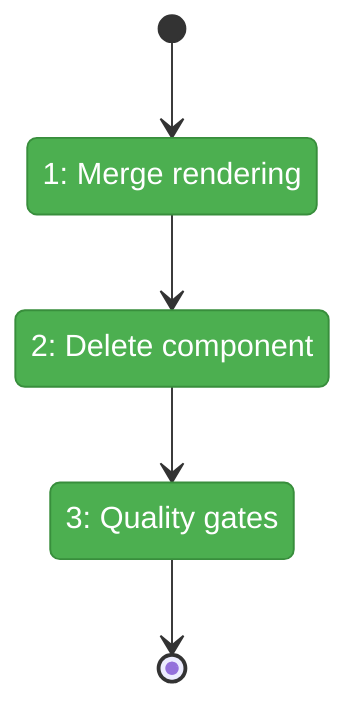

# Flight Plan: Fix FX001 — Combine window + copilot badges

**Fix**: [FX001-combine-badges.md](FX001-combine-badges.md)
**Status**: Landed

## What → Why

**Problem**: Window titles (row 1) and copilot details (row 2) are visually disconnected — users must mentally match window indices across rows.

**Fix**: Merge into unified per-window cards: title on line 1, copilot details on line 2 (when present).

## Domain Context

| Domain | Relationship | What Changes |
|--------|-------------|-------------|
| terminal | extend | Merge rendering in overlay panel, delete copilot-session-badges component |

## Flight Status

**Legend**: grey = pending | yellow = active | red = blocked | green = done

## Stages

- [x] **Stage 1: Merge badge rendering** — Left-join window + copilot data, render combined cards (`terminal-overlay-panel.tsx`)
- [x] **Stage 2: Delete component** — Remove `copilot-session-badges.tsx` and its import
- [x] **Stage 3: Quality gates** — `just fft`, visual verification

## Acceptance

- [ ] Unified per-window cards with title + copilot details
- [ ] `just fft` passes

## Checklist

- [x] FX001-1: Merge badge rendering into combined cards
- [x] FX001-2: Delete CopilotSessionBadges component
- [x] FX001-3: Verify and run quality gates
