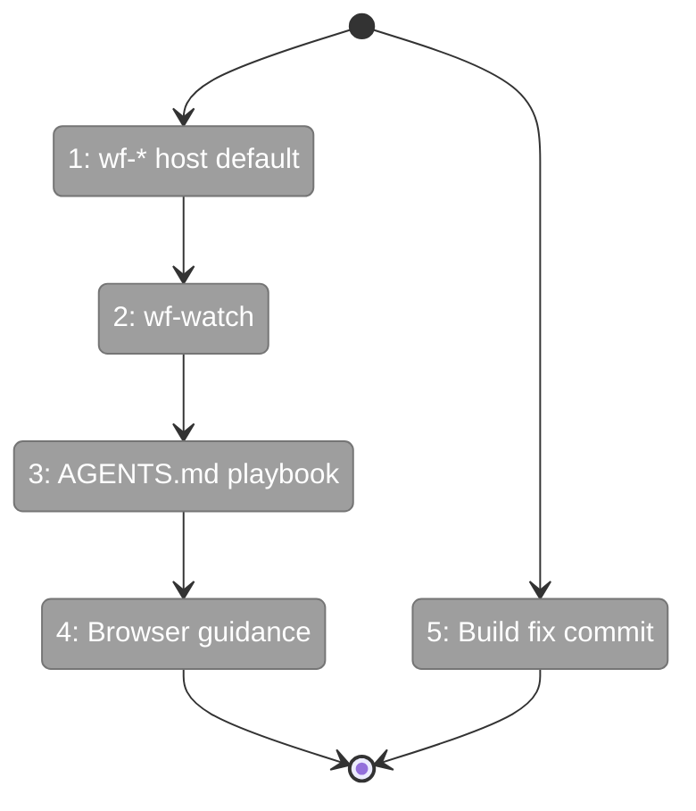

# Flight Plan: Fix FX001 — Close the Agent Development Loop

**Fix**: [FX001-close-dev-loop.md](FX001-close-dev-loop.md)
**Status**: Ready

## What → Why

**Problem**: Agents can't seamlessly edit→run→observe→fix workflows. `just wf-*` targets the container, not the host dev server. No live watching. No playbook in AGENTS.md.

**Fix**: Default wf-* to host, add wf-watch, rewrite AGENTS.md with narrative playbook + browser verification.

## Domain Context

| Domain | Relationship | What Changes |
|--------|-------------|-------------|
| _(harness)_ | Owner | justfile: wf-* default to host, wf-watch added |
| docs | Owner | AGENTS.md: playbook + browser verification sections |
| _platform/positional-graph | Touched | Build script for .md prompt copy (already done) |

## Flight Status

## Stages

- [ ] **Stage 1: wf-* host default** — Update justfile recipes to use local CLI, add `--container` flag
- [ ] **Stage 2: wf-watch** — Add live polling recipe with clear + formatted output
- [ ] **Stage 3: AGENTS.md playbook** — Rewrite workflow section as edit→run→observe→fix narrative
- [ ] **Stage 4: Browser verification** — Add guidance for when/how to check the browser
- [ ] **Stage 5: Build fix** — Commit positional-graph .md asset copy (already done, needs commit)

## Acceptance

- [ ] `just wf-run jordo-test` works against host dev server
- [ ] `just wf-watch jordo-test` polls and displays live status
- [ ] AGENTS.md teaches the full workflow development loop
- [ ] positional-graph build copies .md prompts
