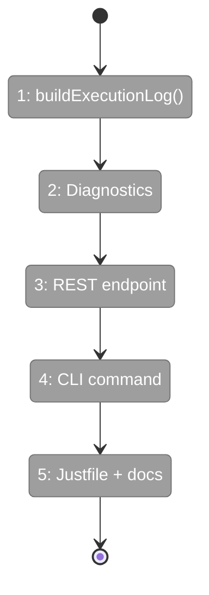

# Flight Plan: Fix FX002 — Unified Workflow Execution Logs

**Fix**: [FX002-unified-execution-logs.md](FX002-unified-execution-logs.md)
**Status**: Ready

## What → Why

**Problem**: No single place to see what happened in a workflow run. Data scattered across 6 locations. Agents spelunk manually or give up.

**Fix**: `buildExecutionLog()` assembles all existing data into one chronological response. Exposed via REST, CLI, and justfile shortcut. Includes automatic diagnostics.

## Domain Context

| Domain | Relationship | What Changes |
|--------|-------------|-------------|
| _platform/positional-graph | Owner | `buildExecutionLog()` + diagnostics in inspect module |
| workflow-ui | Owner | `GET /logs` REST endpoint |
| _(harness)_ | Consumer | `just wf-logs` shortcut |
| docs | Consumer | AGENTS.md playbook: wf-logs is primary debug tool |

## Flight Status

## Stages

- [ ] **Stage 1: buildExecutionLog()** — Assemble timeline + per-node detail from state.json, pod-sessions, outputs
- [ ] **Stage 2: Diagnostics** — STUCK_STARTING, UNWIRED_INPUT, MISSING_UNIT, STALE_LOCK auto-detection
- [ ] **Stage 3: REST endpoint** — GET /logs route, same auth as /detailed
- [ ] **Stage 4: CLI command** — `cg wf logs` with human-readable + JSON output, --node/--errors/--server flags
- [ ] **Stage 5: Justfile + docs** — `just wf-logs` shortcut, AGENTS.md playbook update

## Acceptance

- [ ] `just wf-logs jordo-test` shows full timeline with diagnostics
- [ ] Stuck nodes get automatic STUCK_STARTING diagnostic
- [ ] `--errors` flag filters to just problems
- [ ] `--node` flag drills into one node
- [ ] AGENTS.md teaches wf-logs as primary debug tool
