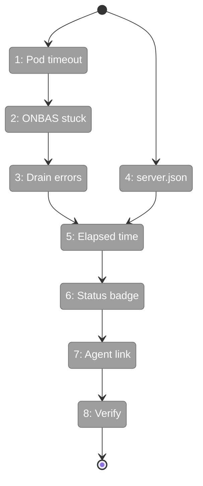

# Flight Plan: Fix FX003 — Pod Timeout, Stuck Detection, UI Diagnostics

**Fix**: [FX003-pod-timeout-ui-diagnostics.md](FX003-pod-timeout-ui-diagnostics.md)
**Status**: Ready

## What → Why

**Problem**: Agent pods hang forever (no timeout), ONBAS treats stuck nodes as running (no age check), UI shows no execution diagnostics, server.json bind-mount keeps breaking preflight.

**Fix**: 5min pod timeout, 60s stuck detection, drain errors on exit, skip server.json in container, status badge + elapsed time + agent link in UI.

## Domain Context

| Domain | Relationship | What Changes |
|--------|-------------|-------------|
| _platform/positional-graph | Owner | Pod timeout, ONBAS stuck detection, drain errors |
| shared | Owner | AgentInstance threads timeout |
| workflow-ui | Owner | Status badge, elapsed time, agent link, server.json skip |

## Flight Status

## Stages

- [ ] **Stage 1: Pod timeout** — Thread 5min timeout through AgentPod → AgentInstance → adapter
- [ ] **Stage 2: ONBAS stuck** — Detect `starting` >60s, return `error-node` action
- [ ] **Stage 3: Drain errors** — Write pendingErrors to state.json before drive() returns
- [ ] **Stage 4: server.json** — Skip write when CHAINGLASS_CONTAINER=true
- [ ] **Stage 5: Elapsed time** — Show "Starting — Xs elapsed" in properties panel
- [ ] **Stage 6: Status badge** — Color-coded execution badge in toolbar
- [ ] **Stage 7: Agent link** — "View Agent Chat" button for agent nodes
- [ ] **Stage 8: Verify** — Playwright screenshots against running dev server

## Acceptance

- [ ] Pod can't hang forever (5min timeout)
- [ ] Stuck nodes auto-fail at 60s
- [ ] Errors always persisted on drive exit
- [ ] Preflight passes after container run
- [ ] UI shows elapsed time, status badge, agent link
- [ ] Verified via Playwright
