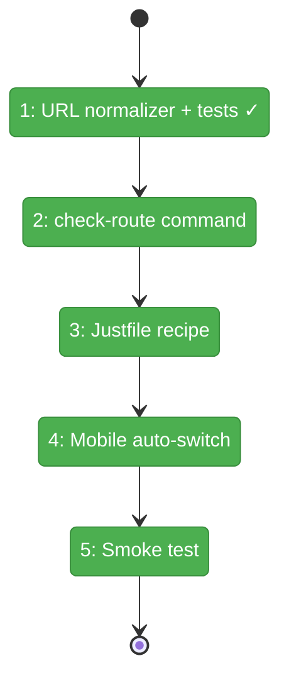

# Flight Plan: Fix FX004 — Harness check-route + mobile viewer auto-switch

**Fix**: [FX004-check-route-mobile-fix.md](FX004-check-route-mobile-fix.md)
**Status**: Landed

## What → Why

**Problem**: Agents need 3 separate commands to validate a route, with inconsistent URL handling. Mobile viewport hides the viewer panel on URL-driven navigation.

**Fix**: Unified `check-route` CLI command with workspace-aware URL normalization, multi-viewport support, and pass/fail HarnessEnvelope verdict. Mobile auto-switch to Content tab when `file` param present (with `mobileView` precedence guard).

## Domain Context

| Domain | Relationship | What Changes |
|--------|-------------|-------------|
| `_(harness)_` | primary | New `check-route` command, URL normalizer, error codes E135-E137, justfile recipe |
| `file-browser` | secondary | `browser-client.tsx` mobile tab auto-switch with `mobileView` precedence |

## Flight Status

## Stages

- [x] **Stage 1 → FX004-1**: URL normalizer — pure function + 5 URL cases + workspace auto-detect test (`harness/src/cdp/url-normalizer.ts`)
- [ ] **Stage 2 → FX004-2**: check-route command — full option set, HarnessEnvelope output, multi-viewport (`harness/src/cli/commands/check-route.ts`, `output.ts` E135-E137)
- [ ] **Stage 3 → FX004-3**: Justfile recipe — `just harness check-route` via existing pattern
- [ ] **Stage 4 → FX004-4**: Mobile auto-switch — `mobileActiveIndex=1` when `file` present + `mobileView` absent (`browser-client.tsx`)
- [ ] **Stage 5 → FX004-5**: Smoke test — desktop single + multi-viewport + mobile Playwright

## Acceptance

- [ ] `just harness check-route "/" --screenshot smoke` returns HarnessEnvelope
- [ ] URL normalization: 5 input formats + workspace auto-detect (unit tests)
- [ ] Multi-viewport: `--viewports` returns `results[]` + `overallVerdict`
- [ ] Mobile: `?file=x.md` auto-shows Content; `?mobileView=2&file=x.md` stays Terminal
- [ ] Error codes E135-E137 (no collision)
- [ ] Existing commands unchanged
